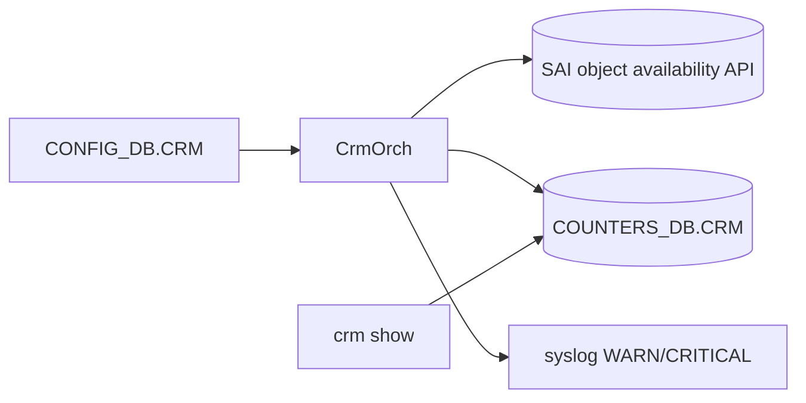

!!! success "裏取りステータス: code-verified"
    `sonic-swss/orchagent/crmorch.h` / `crmorch.cpp` に CrmOrch 実装、`sonic-yang-models/yang-models/sonic-crm.yang` に CONFIG_DB CRM スキーマ。`fdborch.cpp` / `routeorch.cpp` / `srv6orch.cpp` 等から CRM カウンタ更新が呼ばれることを grep で確認（verified at: 2026-05-10）。

# Critical Resource Monitoring（CRM・SAI 表枯渇のしきい値監視）

## なぜ必要なのか

[ASIC](../reference/glossary.md#term-asic) 側の各種リソース（route 表、neighbor、[ACL](../reference/glossary.md#term-acl) counter、[FDB](../reference/glossary.md#term-fdb)、[NAT](../reference/glossary.md#term-nat) 等）は **ハードウェアサイズで上限がある**。上限到達で**運用中に突然パケットドロップやプログラム失敗**が起きるため、[CRM](../reference/glossary.md#term-crm) は使用量をポーリングして **しきい値超えで WARN / CRITICAL を syslog に出す** ことで障害前検知を狙う[^1]。

ねらい:

- 表枯渇を **障害発生前に** 通知
- `crm show` で使用量・上限値を常時可視化
- しきい値の `percentage` / `used` / `free` モード、`high` / `low` の双方を扱う

## 監視対象の resource

主要種別（[HLD](../reference/glossary.md#term-hld) ベース、後発追加あり）[^1]:

- L3: `IPV4_ROUTE` / `IPV6_ROUTE` / `IPV4_NEIGHBOR` / `IPV6_NEIGHBOR` / `IPV4_NEXTHOP` / `IPV6_NEXTHOP`
- L3 group: `NEXTHOP_GROUP` / `NEXTHOP_GROUP_MEMBER`
- L2: `FDB_ENTRY`
- ACL: `ACL_TABLE` / `ACL_GROUP` / `ACL_ENTRY` / `ACL_COUNTER`
- NAT / multicast: `DNAT_ENTRY` / `SNAT_ENTRY` / `IPMC_ENTRY`
- Tunnel / [SRv6](../reference/glossary.md#term-srv6) 等は後発で追加

## どう動くのか



しきい値モード[^1]:

- **percentage**: 上限の % で `high_threshold` / `low_threshold`
- **used**: 絶対使用量
- **free**: 残量

`high` 超えで WARN/CRIT、`low` を下回ると clear（`free` モードはその逆）。周期は `polling_interval`。

## CONFIG_DB / CLI

| Key | 説明 |
|-----|------|
| `CRM\|Config` | `polling_interval`、各 resource ごとに `<r>_threshold_type` / `<r>_high_threshold` / `<r>_low_threshold` |

| Command | 用途 |
|---------|------|
| `crm config polling interval <n>` | 周期 |
| `crm config thresholds <r> type <p\|u\|f>` | mode |
| `crm config thresholds <r> high <n>` / `low <n>` | しきい値 |
| `crm show resources [all\|ipv4 route\|...]` | 残量 / 使用量 |
| `crm show thresholds` | 現行しきい値 |

## 制限事項

- **[SAI](../reference/glossary.md#term-sai) 側 availability API が必要**。vendor 未対応 resource は値が出ない
- WARN/CRIT は syslog のみで **自動 recovery アクションは無い**
- 多 resource を高頻度ポーリングすると **[ASIC SDK](../reference/glossary.md#term-asic-sdk) 負荷増**
- `ACL_COUNTER` / `FDB_ENTRY` は SDK query が高コストになることがあり、長めの polling 推奨

## 干渉する機能

generic SAI extension CRM（新 resource 追加枠組み） / system health monitor（critical 集約） / NAT / mux / SRv6 / multi-asic（resource 種別を増やす側）。

## トラブルシューティング

- `crm show` が `N/A` → SAI vendor の object_availability 実装の有無
- 通知が来ない → `polling_interval`、syslog rate-limit、threshold mode 確認
- counter が振動する → 周期と使用量変動の解像度差を再検討


### コマンド例

CRM カウンタの現在値と閾値を確認する。

```bash
crm show summary
crm show thresholds all
crm show resources all
redis-cli -n 2 keys 'CRM:*'
```

## 関連 Topics

- [07-acl-copp-mirror](../topics/07-acl-copp-mirror/index.md): ACL リソース消費
- [20-swss-sai-redis](../topics/20-swss-sai-redis/index.md): [orchagent](../reference/glossary.md#term-orchagent) と SAI の関係

## 既知の問題

### monit サービスが設定した閾値を超えるとプロセスを強制終了するため、回帰テストで失敗が多発する問題（sonic-buildimage#4019）

monit サービスが設定した閾値を超えるとプロセスを強制終了するため、回帰テストで失敗が多発する問題。テスト環境では monit の閾値設定を緩和するか、テスト中は monit を一時停止することを推奨

- 参照: [sonic-net/sonic-buildimage#4019](https://github.com/sonic-net/sonic-buildimage/issues/4019)


### SNMP subagent の MIBUpdater が `loc_chassis_data not subscript（sonic-buildimage#4230）

[SNMP](../reference/glossary.md#term-snmp) subagent の MIBUpdater が `loc_chassis_data not subscriptable` 例外でクラッシュする問題。[LLDP](../reference/glossary.md#term-lldp) データが未取得の状態で MIB アップデートが実行されると発生

- 参照: [sonic-net/sonic-buildimage#4230](https://github.com/sonic-net/sonic-buildimage/issues/4230)


### monit/snmp テストが master イメージで失敗する問題（sonic-buildimage#5502）

monit/snmp テストが master イメージで失敗する問題。monit が snmp_subagent を監視対象として設定しており、起動タイムアウトで kill している場合がある

- 参照: [sonic-net/sonic-buildimage#5502](https://github.com/sonic-net/sonic-buildimage/issues/5502)


### lldpmgrd が `test_iface_namingmode` テスト中にクラッシュする問題（sonic-buildimage#5697）

lldpmgrd が `test_iface_namingmode` テスト中にクラッシュする問題。インターフェース名前空間の切り替え中に lldpmgrd が不正なインターフェース名を受け取る

- 参照: [sonic-net/sonic-buildimage#5697](https://github.com/sonic-net/sonic-buildimage/issues/5697)


### monit が bgpcfgd/bgpmon/lldpmgrd のステータスエラーを報告する問題（sonic-buildimage#5864）

monit が [bgpcfgd](../reference/glossary.md#term-bgpcfgd)/bgpmon/lldpmgrd のステータスエラーを報告する問題。サービスが動作していても monit の監視設定と実際の状態が一致しないことがある

- 参照: [sonic-net/sonic-buildimage#5864](https://github.com/sonic-net/sonic-buildimage/issues/5864)


### teamd 再起動後に orchagent がエラーログを大量出力する問題（sonic-buildimage#5971）

[teamd](../reference/glossary.md#term-teamd-teamsyncd-teammgrd) 再起動後に orchagent がエラーログを大量出力する問題。teamd が再起動されると [PortChannel](../reference/glossary.md#term-portchannel) メンバーの状態が一時的に不定になる

- 参照: [sonic-net/sonic-buildimage#5971](https://github.com/sonic-net/sonic-buildimage/issues/5971)


### `supervisorctl status` コマンドが exit code 3 を返す問題（sonic-buildimage#6028）

`supervisorctl status` コマンドが exit code 3 を返す問題。すべてのサービスが RUNNING 状態であっても exit code 3 を返すことがある。スクリプトでは出力テキストを解析すること

- 参照: [sonic-net/sonic-buildimage#6028](https://github.com/sonic-net/sonic-buildimage/issues/6028)


### Platform system health において ASIC キーが適切に処理されない問題（sonic-buildimage#6343）

Platform system health において ASIC キーが適切に処理されない問題。`show system-health detail` の ASIC エントリを確認すること

- 参照: [sonic-net/sonic-buildimage#6343](https://github.com/sonic-net/sonic-buildimage/issues/6343)


### BRCM Th3 Z9332 で SER (Single Error Recovery) が注入されたメモリの修正システ（sonic-buildimage#6392）

BRCM Th3 Z9332 で SER (Single Error Recovery) が注入されたメモリの修正システムが正しく動作しない問題。ECC エラー監視の設定を確認すること

- 参照: [sonic-net/sonic-buildimage#6392](https://github.com/sonic-net/sonic-buildimage/issues/6392)


### `show system-health detail` コマンドが動作しない問題（sonic-buildimage#6463）

`show system-health detail` コマンドが動作しない問題。`sudo systemctl status system-health` で状態確認すること

- 参照: [sonic-net/sonic-buildimage#6463](https://github.com/sonic-net/sonic-buildimage/issues/6463)


### `show system-health` コマンドが動作しない問題（sonic-buildimage#6641）

`show system-health` コマンドが動作しない問題。`sudo systemctl status system-health` で確認し、必要に応じて再起動すること

- 参照: [sonic-net/sonic-buildimage#6641](https://github.com/sonic-net/sonic-buildimage/issues/6641)


## 引用元

[^1]: `sonic-net/SONiC` `doc/crm/Critical-Resource-Monitoring-High-Level-Design.md` @ `49bab5b5ff0e924f1ea52b3d9db0dfa4191a7c06`

<!-- topics-back-ref -->
## 関連 Topics (索引)

- [Topics: Telemetry / SNMP / Observability](../topics/09-telemetry-snmp/index.md)

<!-- /topics-back-ref -->

<!-- glossary-links-injected: 989b6ea1d7a6 -->
