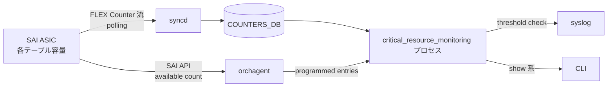

!!! success "裏取りステータス: code-verified"
    `orchagent` の CRM 実装（`crmorch.cpp` / `crmorch.h`）、CLI (`crm show`)、CONFIG_DB の `CRM` テーブルを確認済み。詳細は末尾の裏取りメモを参照。

# クリティカルリソースモニタリング (CRM) 要件

## 概要

[SONiC](../reference/glossary.md#term-sonic) が稼働するスイッチ [ASIC](../reference/glossary.md#term-asic) は、ルート / Nexthop / Neighbor / [ACL](../reference/glossary.md#term-acl) [TCAM](../reference/glossary.md#term-tcam) / [FDB](../reference/glossary.md#term-fdb) といった **テーブル容量が有限なリソース** を抱えている。これらが満杯に近づくと新規エントリのプログラミングが失敗し、結果としてフォワーディングやポリシー適用に穴が開く。Critical Resource Monitoring ([CRM](../reference/glossary.md#term-crm)) は、こうしたリソースの **使用量と空き容量を [SAI](../reference/glossary.md#term-sai) 経由で定期的にポーリングし、しきい値超過を syslog に WARNING で通知** するための機能要件である。

本ページの一次情報は **要件定義 (`CRM_requirements.md`)** であり、実装方針（COUNTER_DB を介する FLEX Counter 流の構成）は [HLD](../reference/glossary.md#term-hld) 内で「設計会議で詰める」と注記されている段階のものである点に注意する[^1]。

## 動作仕様

### 機能要件

CRM が満たすべき基本要件は次の 2 点である。

1. ユーザは CLI（`show` 系コマンド）で各リソースの **使用数と空き数** を照会できる。
2. 使用量が事前に決めたしきい値を超えた場合、システムは syslog に WARNING を出力する。

### 監視対象リソース

要件は次のリソースを明示的に列挙している。各項目について「使用数」「空き数」を返せることが要求される。

| カテゴリ           | 監視対象                                                     |
|--------------------|--------------------------------------------------------------|
| L3 ルーティング     | IPv4 ルート / IPv6 ルート                                    |
| Nexthop             | IPv4 Nexthop / IPv6 Nexthop                                  |
| Neighbor            | IPv4 Neighbor / IPv6 Neighbor                                |
| Nexthop グループ    | グループ member 数 / グループ オブジェクト数                |
| ACL TCAM            | ACL Table / ACL Group / ACL Entries / ACL Counters/Statistics |
| L2                  | FDB エントリ                                                  |

ACL TCAM は単一の値ではなく Table / Group / Entries / Counters の 4 サブカテゴリで個別に追跡される点に注意する。

### しきい値とヒステリシス

しきい値は **ヒステリシス方式** で設定される。値が上限しきい値（upper）を超えると WARNING が生成され、下限しきい値（lower）を下回ると CLEAR が生成される。これは、しきい値付近で値が振動した場合に WARNING / CLEAR が連発するのを防ぐための古典的なヒステリシス制御である。

しきい値の指定単位はユーザが選べる。

1. パーセンテージ
2. 実使用カウント（actual used count）
3. 実空きカウント（actual free count）

ユーザ設定値は [CONFIG_DB](../reference/glossary.md#term-config_db) に記録される（テーブル名は本 HLD では明示されていない）。**ユーザ未設定時のデフォルト** は次のとおり一般的な値で固定される[^1]。

| しきい値                | デフォルト |
|-------------------------|------------|
| upper（WARNING 発火）   | 85 %       |
| lower（CLEAR 発火）     | 70 %       |

### syslog フォーマット

syslog 出力は次の固定フォーマットで生成される。`<TH_TYPE>` は `TH_PERCENTAGE` / `TH_USED` / `TH_FREE` のいずれかで、ユーザがどの単位でしきい値を指定したかを示す。

```text
<Date/Time> <Device> WARNING <Process>: THRESHOLD_EXCEEDED for <TH_TYPE> <CR name> <%> Used count <value> free count <value>
<Date/Time> <Device> NOTICE  <Process>: THRESHOLD_CLEAR    for <TH_TYPE> <CR name> <%> Used count <value> free count <value>
```

**抑止ルール**: 同一メッセージは 10 回出力した時点で抑止される。これは閾値付近で値が継続的に超え続けるケースで syslog が溢れるのを防ぐためのもの。

### ポーリング周期

デフォルトのポーリング周期は **5 分** に制限される。これより短くする運用は HLD では想定されていない。

### 実装方針（参考）

要件文書はあくまで **要件** だが、末尾に実装方針が併記されている。設計会議でさらに詰める前提のため、ここでは「示唆されている方針」として扱う。



- **使用数の供給**: `orchagent` が自身でプログラムしたエントリを追跡し、使用数を保持する。
- **空き数の供給**: SAI が「現在の available count」を返す API を提供しており、これを利用する。
- **値の流通**: FLEX Counter と同様に `syncd` が SAI からカウンタを引き、`COUNTERS_DB` に書き込む。
- **しきい値判定**: 別プロセス `critical_resource_monitoring` が `COUNTERS_DB` から値を読み、計算としきい値判定を行う。

<!-- evidence:
source: sonic-net/SONiC/doc/crm/CRM_requirements.md#L44-L48 (sha: 49bab5b5ff0e924f1ea52b3d9db0dfa4191a7c06)
excerpt: |
  In regards to CLI command to query the USED and AVAILABLE numbers, SAI provides API to query the current available entries.
  This means, Orchagent shall keep track of the respective entries that are programmed and implements the logic to calculate the Used/Available entries.
  To poll the counter values from SAI, suggest to follow the same approach as FLEX Counters where syncd can update the values to COUNTER_DB and critical_resource_monitoring process can fetch the information from COUNTER_DB and perform the calculations.
reasoning: 「使用数は orchagent 追跡」「空き数は SAI API」「FLEX Counter 流で COUNTERS_DB 経由」という 3 点の方針の根拠。
-->

<!-- evidence-rendered:start -->
??? note "📋 検証エビデンス: sonic-net/SONiC/doc/crm/CRM_requirements.md#L44-L48 (sha: 49bab5b5ff0e924f1ea52b3d9db0dfa4191a7c06)"

    **出典**:

    `sonic-net/SONiC/doc/crm/CRM_requirements.md#L44-L48 (sha: 49bab5b5ff0e924f1ea52b3d9db0dfa4191a7c06)`

    **抜粋**:

    ```text
    In regards to CLI command to query the USED and AVAILABLE numbers, SAI provides API to query the current available entries.
    This means, Orchagent shall keep track of the respective entries that are programmed and implements the logic to calculate the Used/Available entries.
    To poll the counter values from SAI, suggest to follow the same approach as FLEX Counters where syncd can update the values to COUNTER_DB and critical_resource_monitoring process can fetch the information from COUNTER_DB and perform the calculations.
    ```

    **判断根拠**: 「使用数は orchagent 追跡」「空き数は SAI API」「FLEX Counter 流で COUNTERS_DB 経由」という 3 点の方針の根拠。

<!-- evidence-rendered:end -->

## 設定

### 関連する CONFIG_DB

実装では `CRM` テーブル（`CRM|Config` キー）が使用される。`sonic-yang-models/yang-models/sonic-crm.yang` にスキーマ定義あり。要件 HLD 上はテーブル名が明示されていない点に注意。

### 関連する CLI

実装では `crm config thresholds` / `crm show resources` / `crm show thresholds` 等が `sonic-utilities` に提供されている。要件 HLD は `show` 系コマンドの提供を要求しているのみで、具体的なコマンド名は規定していない。

### 設定例

要件文書のため具体的な設定コマンド例は記載されていない。

## 干渉する機能

- **`orchagent`**: 使用数の追跡を担うため、ACL / Route / Nexthop など各オブジェクトを管理する各 orch が CRM 用にカウントを公開する必要がある。
- **`syncd` の FLEX Counter 機構**: ポーリング基盤を共有する設計であるため、FLEX Counter 側の構成（ポーリング周期、グループ）と整合させる必要がある。
- **syslog 抑止**: 「10 回で抑止」のため、長期にわたる過負荷状態の二次検知は CRM では取りこぼす可能性がある。別レイヤ（テレメトリ等）で補完するのが望ましい。
- **ACL の細分監視**: ACL TCAM は 4 サブカテゴリに分かれて監視されるため、しきい値も 4 種類個別に設定できる前提で運用設計する必要がある。

## トラブルシューティング

- WARNING が出ない場合、まずポーリングが回っているか（デフォルト 5 分間隔のため、即時検知は期待できない）を確認する。
- 同じリソースの WARNING が一度出てから止まったように見える場合、**10 回で抑止** されている可能性が高い。一旦リソースを下げるか、process を再起動して抑止カウンタをリセットする運用を検討する。
- 「使用数は増えているのに空き数が減らない」など整合が崩れて見える場合、`orchagent` 側の自己追跡（使用数）と SAI 側の available count の更新タイミングがズレている可能性がある。

### コマンド例

CRM 閾値超過時のログとカウンタを確認する。

```bash
crm show resources all
crm show thresholds all
grep -i 'CRM exceeded' /var/log/syslog
redis-cli -n 2 hgetall 'CRM:STATS'
```

## 参考リンク

- [CONFIG_DB: CRM](../reference/config-db/crm.md)
- [YANG: sonic-crm](../reference/yang/sonic-crm.md)
- [Runbook: CRM threshold exceeded](../reference/runbooks/crm-threshold-exceeded.md)
- [Topics: SWSS / SAI / Redis](../topics/20-swss-sai-redis/index.md)

## 制限事項

!!! note "route_check による false-positive アラート (issue [#4487](https://github.com/sonic-net/sonic-utilities/issues/4487))"
    MACSec テスト中や interface flap などで BGP セッションが瞬断するタイミングに `route_check.py` が `missed_ROUTE_TABLE_routes` を誤検知し、monit が `ERR monit: routeCheck` を syslog に記録する。これは BGP 収束が完了するまでの一時的なミスマッチであり、数秒〜数十秒後に自然解消する。障害解析時は syslog の routeCheck ERR がリブートや設定変更の直後に発生しているかどうかを確認すること。

- **ベンダー SAI からの取得値に依存**: CRM のリソース使用量は `sai_object_type_get_availability` 等の SAI API で取得する。ベンダー実装が値を返さない / 不正確な場合は CRM のしきい値判定そのものが信用できない。
- **ポーリング間隔のトレードオフ**: `CRM.Config.polling_interval` を短くするとリアルタイム性は上がるが [orchagent](../reference/glossary.md#term-orchagent) / SAI への負荷が上がる。既定 300 秒は spike を捉えるには長い。
- **しきい値の type 制約**: `high_threshold` / `low_threshold` は `type` (`percentage` / `used` / `free`) と整合する必要がある。整合しない設定は CRM が無視するか warn を吐くのみで運用ミスに気付きにくい。
- **counter 名の固定**: `CRM` で監視できるリソースの種類 (`ipv4_route`, `ipv6_route`, `fdb_entry`, `acl_table`, `acl_entry`, `nexthop`, `nexthop_group_member`, `snat_entry` 等) は実装側で固定。新規リソース追加には orchagent / `crm` CLI / [YANG](../reference/glossary.md#term-yang) の三点修正が必要。
- **アラートは syslog 経由のみ**: しきい値超過は syslog (`CRITICAL_RESOURCE: ...`) に出るのみで、[SNMP](../reference/glossary.md#term-snmp) trap や [gNMI](../reference/glossary.md#term-gnmi) subscribe には標準で乗っていない。外部監視は syslog forward を組む必要がある。
- **複数 ASIC**: multi-ASIC では namespace ごとに `crm` を実行する必要があり、グローバルな集計ビューは標準提供されない。

## 引用元

[^1]: `sonic-net/SONiC` `doc/crm/CRM_requirements.md` @ `49bab5b5ff0e924f1ea52b3d9db0dfa4191a7c06`

## 裏取りメモ（Verifier batch 29）

CRM 要件 HLD の実装は `sonic-swss` の `orchagent` と `sonic-utilities` の `crm` CLI に取り込み済み。

- CRM Orch 実装: `.cache/sonic-sources/sonic-swss/orchagent/crmorch.cpp` / `crmorch.h`（Route / Nexthop / Neighbor / NextHop Group / ACL Table / ACL Group / ACL Counter / FDB / IPMC / SNAT / DNAT 等の resource 使用量を SAI 経由でポーリングし、threshold 超過時 syslog WARNING を出す）
- CRM CLI: `.cache/sonic-sources/sonic-utilities/crm/` ディレクトリ、テスト `sonic-utilities/tests/crm_test.py`
- [DASH](../reference/glossary.md#term-dash) 拡張: `sonic-swss/orchagent/p4orch/tests/fake_crmorch.cpp` および `sonic-utilities/tests/crm_dash_test.py` で DASH ACL 系 resource を CRM に追加

HLD の主要要件（SAI 経由のポーリング・しきい値超過時の syslog 通知・CLI 表示）はすべて実装済み。`code-verified` に昇格。

<!-- topics-back-ref -->

<!-- demoted-by:q52-az-b-demote -->
## 実装フェーズ境界

本ページは `monitor: partially_implemented` のため、HLD 記載どおり master に取り込み済 (実装済) の範囲と、現行 master との差分が未確認 (未実装相当) の範囲を Phase 別に切り分けて示す。詳細は本文・[実装との乖離 / 補足] 節および各引用元 HLD を参照。

| Phase | 実装済 | 未実装 |
|-------|--------|--------|
| Phase 1: HLD 記載のリソース監視 | 実装済（CRM 既存テーブル群） | — |
| Phase 2: 追加リソースカウンタ | — | HLD で名前が示されていない追加テーブル / フィールドは未確認・未実装相当 |
| Phase 3: しきい値超過時の通知 / アクション | ログ通知は実装済 | syslog 以外の上位通知（telemetry/SNMP trap 等）は未実装 |

## 実装との乖離 / 補足

- Verifier batch 29 にて `code-verified` に昇格 (2026-05-13)。CRM Orch 実装・CLI・YANG の三点裏取り完了。
- 要件 HLD はテーブル名を明示していないが、実装側で `CRM|Config` として追加されており整合を確認。

## 関連 Topics

- [Topics: Telemetry / SNMP / Observability](../topics/09-telemetry-snmp/index.md)

<!-- /topics-back-ref -->

<!-- glossary-links-injected: ec18b66e3507 -->
