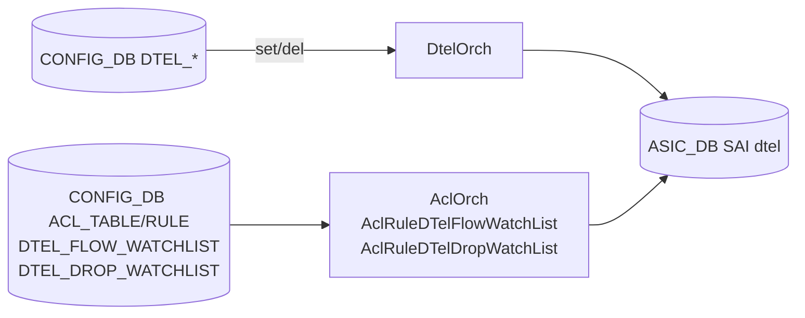
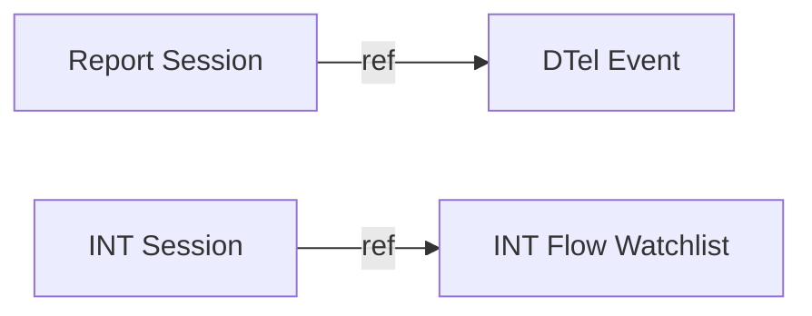

<!-- topics-tip -->
!!! tip "Topics で読み物として読む"
    この HLD は実装詳細を含む。機能の概念・設定・運用を読み物として読みたい場合は [Topics 09 章: Telemetry / SNMP / ログ](../topics/09-telemetry-snmp/index.md) を参照。
<!-- /topics-tip -->

!!! info "裏取りステータス: code-verified"
    `sonic-swss/orchagent/dtelorch.cpp` / `dtelorch.h` を master で確認。`DTEL_REPORT_SESSION` / `DTEL_INT_SESSION` 系のスキーマ定数は `sonic-swss-common/common/schema.h` に存在。CLI 未提供は HLD 通り。

# Dataplane Telemetry（DTel / INT / Postcard / Drop / Queue Report）

## 概要

**Dataplane Telemetry (DTel)** は [ASIC](../reference/glossary.md#term-asic) dataplane から **per-packet メタデータ**（path / latency / queue / drop など）を抽出して collector に送る機構[^1]。In-band Network Telemetry ([INT](../reference/glossary.md#term-int))、Postcard、Drop report、Queue report の 4 系統を扱い、[SAI](../reference/glossary.md#term-sai) 側は OCP の `SAI-Proposal-Data-Plane-Telemetry.md`、[SONiC](../reference/glossary.md#term-sonic) 側は本 [HLD](../reference/glossary.md#term-hld) で **[CONFIG_DB](../reference/glossary.md#term-config_db) 中心の構成** を定義する。当初は CLI が無く `redis-cli` / `swss-py-sdk` / 専用 Python モジュール `euclid` で設定する。

## 動作仕様

### CONFIG_DB（switch global と session 系）

```text
DTEL|SWITCH_ID                  SWITCH_ID            = <int>
DTEL|FLOW_STATE_CLEAR_CYCLE     FLOW_STATE_CLEAR_CYCLE = <int>
DTEL|LATENCY_SENSITIVITY        LATENCY_SENSITIVITY  = <int>
DTEL|SINK_PORT_LIST             <ifName>             = <ifName>
DTEL|INT_ENDPOINT               INT_ENDPOINT         = TRUE | FALSE
DTEL|POSTCARD                   POSTCARD             = TRUE | FALSE
DTEL|DROP_REPORT                DROP_REPORT          = TRUE | FALSE
DTEL|QUEUE_REPORT               QUEUE_REPORT         = TRUE | FALSE
DTEL|INT_L4_DSCP                INT_L4_DSCP_VALUE / _MASK
```

- `DTEL_REPORT_SESSION`: report 用 session の src IP / dst IP / UDP port 等
- `DTEL_INT_SESSION`: INT session（max hop, switch info 等）
- `DTEL_QUEUE_REPORT`: queue 単位 threshold / tail drop など
- `DTEL_EVENT`: event 種別と紐付く report session の参照

### 4 系統の telemetry

| 種別 | 概要 | 最小設定 |
|------|------|----------|
| **INT** | パケットに switch id / hop info を埋め込み collector で再構築 | `INT_L4_DSCP` value/mask, INT session, flow watchlist (op=INT), sink port |
| **Postcard** | 別パケット（postcard）で per-hop 情報を collector に送る | flow watchlist (op=POSTCARD) |
| **Drop Report** | drop 発生時に該当 packet 情報を report | drop watchlist + drop report enable |
| **Queue Report** | queue depth / latency / tail drop の閾値超過で report | queue 上の reporting enable + threshold |

全モード共通で **switch_id と report session（src/dst IP, UDP port）** が必須[^1]。

### コンポーネント



`DtelOrch` は **Set / Delete のみ**を処理し、ConfigDB table 名で event を demux する[^1]。port が初期化前のときは port-init コールバックを設定して **deferred apply** する（INT sink port / queue report の SAI OID 解決が必要なため）。

### Ref-counted Object 管理



- 作成時 refcount=1
- 参照される度 +1、外される度 -1
- **0 で削除**[^1]

DtelOrch 再起動時に CONFIG_DB を replay する際、依存 event が先に来ても、**前提 event が処理済みになるまで dependent を遅延** する（順序保証）[^1]。

### State (in-memory)

| Map | Key | Value |
|-----|-----|-------|
| INT session map | INT session id | { OID, refcount } |
| Report session map | Report session ID | { OID, refcount } |
| Port map | ifName | queue list { qid → queue report OID } |
| Event list | Event name | { OID, Report session ID } |

### ACL 拡張

`AclOrch` に下記サブクラスを追加[^1]:

- `AclRuleDTelDropWatchList`（テーブル: `ACL_TABLE_DTEL_DROP_WATCHLIST`）
- `AclRuleDTelFlowWatchList`（テーブル: `ACL_TABLE_DTEL_FLOW_WATCHLIST`、`flow-op=INT|POSTCARD`）

### euclid（Python 設定モジュール）

`Switch` / `ReportSession` / `IntSession` / `Watchlist` 等のクラスを持つ Python モジュール[^1]。例: switch instance 作成 → report-session 紐付け → watchlist 配置 を短いスクリプトで記述。

```python
from euclid.dtel import Switch, ReportSession, ...
sw = Switch(...)  # SWITCH_ID, telemetry type, latency sensitivity
rs = ReportSession(src=..., dst=..., udp_port=...)
sw.add(rs)
```

<!-- evidence:
source: sonic-net/SONiC/doc/barefoot_dtel/Dtel-SONiC.md#L271-L300 (sha: 49bab5b5ff0e924f1ea52b3d9db0dfa4191a7c06)
excerpt: |
  This is a new Orch agent added to handle DTel events. These events are demuxed based on the ConfigDB table name.
  ... When DTel orchagent is restarted and all the ConfigDB events are played back, dependent events played out of order are inherently ordered by the orchagent.
reasoning: DtelOrch の demux 動作と再起動時 replay の順序保証の根拠。
-->

<!-- evidence-rendered:start -->
??? note "📋 検証エビデンス: sonic-net/SONiC/doc/barefoot_dtel/Dtel-SONiC.md#L271-L300 (sha: 49bab5b5ff0e924f1ea52b3d9db0dfa4191a7c06)"

    **出典**:

    `sonic-net/SONiC/doc/barefoot_dtel/Dtel-SONiC.md#L271-L300 (sha: 49bab5b5ff0e924f1ea52b3d9db0dfa4191a7c06)`

    **抜粋**:

    ```text
    This is a new Orch agent added to handle DTel events. These events are demuxed based on the ConfigDB table name.
    ... When DTel orchagent is restarted and all the ConfigDB events are played back, dependent events played out of order are inherently ordered by the orchagent.
    ```

    **判断根拠**: DtelOrch の demux 動作と再起動時 replay の順序保証の根拠。

<!-- evidence-rendered:end -->

## 制限事項

- 専用 CLI が無く、redis-cli / SwSS SDK / euclid から設定
- INT sink port / queue report は **物理ポートのみ**
- vendor SAI で DTel 全機能をサポートする必要がある
- v0.2 と古いため、新しい INT / [IFA](../reference/glossary.md#term-ifa) 系の上書き仕様には未対応の可能性

## 干渉する機能

- **AclOrch**: 新 watchlist テーブルの新規 rule subclass を共有
- **[PFC](../reference/glossary.md#term-pfc) / queue 系**: queue report の閾値設定と queue scheduler は密接
- **SAI dtel proposal**: 仕様の上流文書
- **[gNMI](../reference/glossary.md#term-gnmi) / sonic-telemetry**: 別系統の telemetry。DTel は dataplane 側

## 引用元

[^1]: `sonic-net/SONiC` `doc/barefoot_dtel/Dtel-SONiC.md` @ `49bab5b5ff0e924f1ea52b3d9db0dfa4191a7c06`

<!-- concerns hint:
- DtelOrch の sonic-swss 取り込み確認
- DTEL / DTEL_REPORT_SESSION / DTEL_INT_SESSION / DTEL_QUEUE_REPORT / DTEL_EVENT スキーマの sonic-yang-models 反映確認
- SAI dtel attribute (saidtel.h) の opencomputeproject/SAI および vendor サポート確認
- AclRuleDTelDropWatchList / AclRuleDTelFlowWatchList のサブクラス実装確認
- ACL_TABLE_DTEL_FLOW_WATCHLIST / ACL_TABLE_DTEL_DROP_WATCHLIST の扱い確認
- euclid Python モジュールの取り込みと利用例の確認
-->

<!-- topics-back-ref -->
## 関連 Topics

- [Topics: Telemetry / SNMP / Observability](../topics/09-telemetry-snmp/index.md)

<!-- /topics-back-ref -->

<!-- glossary-links-injected: fad4d220bc71 -->
