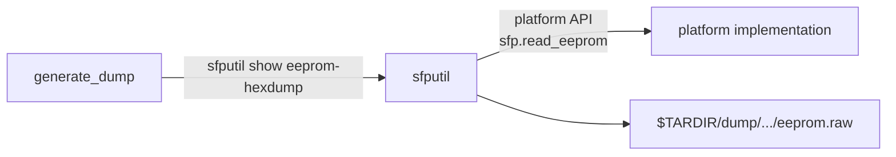

<!-- topics-tip -->
!!! tip "Topics で読み物として読む"
    この HLD は実装詳細を含む。機能の概念・設定・運用を読み物として読みたい場合は [Topics 09 章: Telemetry / SNMP / ログ](../topics/09-telemetry-snmp/index.md) を参照。
<!-- /topics-tip -->

!!! info "裏取りステータス: code-verified"
    `sonic-utilities/sfputil/main.py` の `eeprom-hexdump` (L731-) で `-p/--port` と `-n/--page` を確認、内部で `eeprom_hexdump_single_port` → `eeprom_hexdump_pages_general` / `_pages_sff8472` 経路を実装。`sonic-utilities/scripts/generate_dump` L2603 で `save_cmd "sfputil show eeprom-hexdump" "interface.xcvrs.eeprom.raw" &` を確認、show techsupport の dump tarball に SFP EEPROM ページが自動的に含まれる。

# show techsupport での SFP EEPROM ページダンプ取り込み

## 概要

光モジュール起因の物理層トラブル解析向けに、`show techsupport` の出力に **モジュール EEPROM の生ダンプ** を含めるための拡張[^1]。既存の `sfputil show eeprom-hexdump` を拡張し、`generate_dump` から呼び出して `$TARDIR/dump/` に保存する。

## 動作仕様

### sfputil show eeprom-hexdump の拡張

オプション組み合わせと挙動：

| 呼び出し | 挙動 |
|----------|------|
| `--port <p> --page <h>` | 指定ポートの指定 page をダンプ |
| `--port <p>`            | 指定ポートの page 0 をダンプ（後方互換） |
| `--page <h>`            | 全ポートに対し指定 page をダンプ。`page` は 0–255。存在確認は呼び出し側責任 |
| 引数なし                | 全ポートに対し **ケーブル種別ごとの代表 page** をダンプ |

引数なしのときの page セット（[HLD](../reference/glossary.md#term-hld) 表より）[^1]：

| Cable type | Pages |
|------------|-------|
| CMIS copper  | 0h (0–255) |
| CMIS optical | 0h (0–255), 1h, 2h, 10h, 11h (128–255), CDB 0x9f if available, 400G ZR 30h–35h, 38h–3bh if available |
| sff8436 copper  | 0h |
| sff8436 optical | 0h, 1h, 2h, 3h |
| sff8472 passive | 0h（flat なら 0–127、そうでなければ 0–255） |
| sff8472 active  | 0h, 1h, 2h |
| sff8636 copper  | 0h |
| sff8636 optical | 0h, 1h, 2h, 3h |

「全ページの dump は複雑すぎるので基本ページのみ」と HLD で明示している[^1]。

### generate_dump への組み込み

```text
save_cmd "sfputil show eeprom-hexdump" "interface.xcvrs.eeprom.raw" &
```

を tech-support の収集スクリプトに追加し、結果を `$TARDIR/dump/` に保存する[^1]。



### 出力形式

```text
EEPROM hexdump for module 1
        Lower page 0h
        00000000 11 08 06 00 00 00 00 00  00 00 00 00 00 00 00 00 |................|
        ...
        Upper page 0h
        00000000 ...
        Page 1h
        00000000 ...

EEPROM hexdump for module 2
        ...
```

## 設定

### 関連する CONFIG_DB

HLD には [CONFIG_DB](../reference/glossary.md#term-config_db) エントリの記述は無い。

### 関連する CLI

| Command | 用途 |
|---------|------|
| `sfputil show eeprom-hexdump` | 全ポート全 page ダンプ（拡張版） |
| `sfputil show eeprom-hexdump --port <p> --page <h>` | 個別 page |
| `show techsupport` | EEPROM hexdump を含む |

### 関連する YANG

HLD に [YANG](../reference/glossary.md#term-yang) モデルの記述は無い。

### 設定例

```bash
# テクサポ取得（自動的に EEPROM ダンプも含まれる）
sudo show techsupport

# 個別確認
sfputil show eeprom-hexdump --port Ethernet0 --page 1
```

## 制限事項

- **RJ45 ケーブルは対象外** と HLD で明記[^1]。
- ベンダーが platform API `sfp.read_eeprom` を実装していない場合は機能しない[^1]。
- ダンプはメモリを消費するため、コマンド完了後に解放する必要があると HLD に注記がある。
- 全ページ完全網羅ではない（基本ページのみ）。

## 干渉する機能

- **xcvrd / pmon**: 既存の transceiver daemon が EEPROM を読んでいるが、本機能は CLI 経由で別途読む形。
- **CMIS / 400G ZR コヒーレント**: 上記表に従い CDB/ZR 関連 page も対象になるが、可用性チェックを含めての実装は platform API 任せ。
- **`show techsupport` の出力サイズ**: 多数モジュール × 多数 page で生成物が肥大化する点に注意。

## トラブルシューティング

- techsupport に EEPROM が含まれない → `sfputil show eeprom-hexdump` を手動実行してエラーメッセージを確認。platform API 未実装の可能性。
- 一部ポートだけ抜ける → ケーブル種別判定が失敗している可能性。`sfputil show presence` 等で接続確認。


### コマンド例

show techsupport で SFP EEPROM dump が含まれるか確認する。

```bash
show techsupport --since '1 hour ago'
ls /var/dump/ | tail
sfputil show eeprom -d -p Ethernet0
tar tzf /var/dump/sonic_dump_*.tar.gz | grep -i sfp
```

## 引用元

[^1]: `sonic-net/SONiC` `doc/sfputil/dump_sfp_eeprom.md` @ `49bab5b5ff0e924f1ea52b3d9db0dfa4191a7c06`

<!-- topics-back-ref -->
## 関連 Topics

- [Topics: Telemetry / SNMP / Observability](../topics/09-telemetry-snmp/index.md)

<!-- /topics-back-ref -->

<!-- glossary-links-injected: 20dbc11976b6 -->
