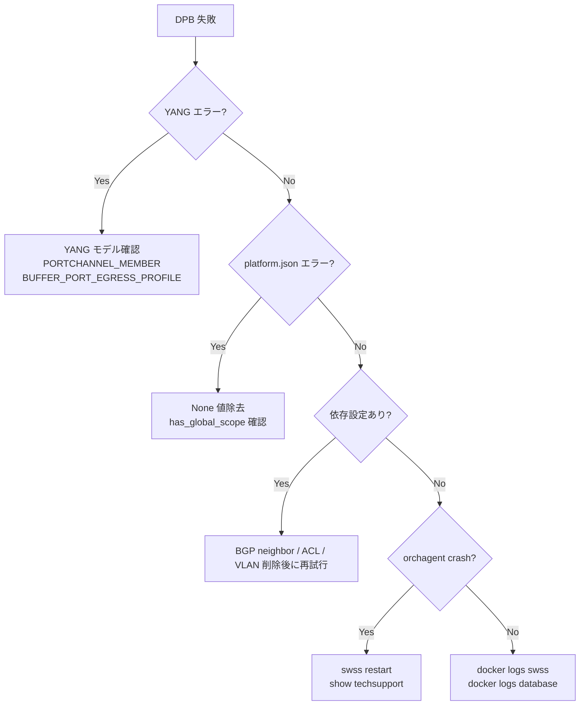

!!! success "裏取りステータス: code-verified"
    sonic-buildimage issue tracker の実環境報告から抽出。master ブランチ対象。

# 動的ポートブレイクアウト（DPB）既知問題と YANG モデル

## 概要

動的ポートブレイクアウト（[DPB](../reference/glossary.md#term-dpb)）は
reload 不要でポート分割モードを変更する機能だが、
[YANG](../reference/glossary.md#term-yang) モデルの不整合・[orchagent](../reference/glossary.md#term-orchagent) との競合・[LLDP](../reference/glossary.md#term-lldp) や [ACL](../reference/glossary.md#term-acl) との非整合など
実装上のエッジケースが多い。本ページは issue tracker の報告を整理する。

---

## 1. YANG モデル不整合による DPB 失敗

### 1-1. `PORTCHANNEL_MEMBER` YANG モデル欠落 (#6722)[^6722]

DPB の依存チェック時に以下のメッセージが出る。

```
Note: Below table(s) have no YANG models:
FEATURE, SNMP_COMMUNITY, SNMP, PORTCHANNEL_MEMBER, TELEMETRY,
Below Config can not be verified, It may cause harm to the system
```

**原因**: `PORTCHANNEL_MEMBER` テーブルに YANG モデルが存在しない。
DPB の依存解決ロジックが YANG 検証を経由するため、
モデルがないテーブルは「未検証」として警告扱いになる。

**対処**: `sonic-portchannel.yang` に `PORTCHANNEL_MEMBER` コンテナが追加されたため、
master の最新版では本警告は解消している[^6722]。

<!-- evidence:
source: sonic-net/sonic-buildimage/src/sonic-yang-models/yang-models/sonic-portchannel.yang#L130-L154 (sha: 9ea932ec2e18f35e58268ec2e4456b1d4afd65cd)
excerpt: |
  container PORTCHANNEL_MEMBER {
      list PORTCHANNEL_MEMBER_LIST {
      } /* end of list PORTCHANNEL_MEMBER_LIST */
reasoning: >
  現行 master の sonic-portchannel.yang に PORTCHANNEL_MEMBER コンテナが存在することを確認。
  issue #6722 が報告した「YANG モデル欠落」警告は master では解消済みであることの裏取り。
-->

<!-- evidence-rendered:start -->
??? note "📋 検証エビデンス: sonic-net/sonic-buildimage/src/sonic-yang-models/yang-models/sonic-portchannel.yang#L130-L154 (sha: 9ea932ec2e18f35e58268ec2e4456b1d4afd65cd)"

    **出典**:

    `sonic-net/sonic-buildimage/src/sonic-yang-models/yang-models/sonic-portchannel.yang#L130-L154 (sha: 9ea932ec2e18f35e58268ec2e4456b1d4afd65cd)`

    **抜粋**:

    ```text
    container PORTCHANNEL_MEMBER {
        list PORTCHANNEL_MEMBER_LIST {
        } /* end of list PORTCHANNEL_MEMBER_LIST */
    ```

    **判断根拠**: >

<!-- evidence-rendered:end -->

---

### 1-2. `BGP_NEIGHBOR` YANG モデルが DPB エラーを引き起こす (#7959)[^7959]

```
Error: asn key is not matched (uses/grouping keywords not working)
```

**原因**: YANG の `uses` / `grouping` キーワードが
libyang の特定バージョンで期待通りに動作しない。
`BGP_NEIGHBOR` テーブルの ASN フィールドが検証エラーになる。

**影響**: [BGP](../reference/glossary.md#term-bgp) neighbor が設定されている port を breakout しようとすると失敗する。

**回避策**: Breakout 前に BGP neighbor 設定を一時削除する。

---

### 1-3. `BUFFER_PORT_EGRESS_PROFILE` 設定時の DPB 失敗 (#9801)[^9801]

```
DPB fails when BUFFER_PORT_EGRESS_PROFILE is configured
```

**原因**: `BUFFER_PORT_EGRESS_PROFILE` テーブルに YANG モデルが存在しないか、
DPB の依存解決ロジックがこのテーブルを認識しない。

**対処**: Breakout 前に `BUFFER_PORT_EGRESS_PROFILE` エントリを削除する。

```bash
redis-cli -n 4 DEL "BUFFER_PORT_EGRESS_PROFILE|Ethernet0"
```

---

### 1-4. libyang バックリンク問題 (#9312)[^9312]

```
[yang-models] Importing other modules sometimes break libyang backlinks
```

**背景**: libyang のバックリンクコードのバグにより、
YANG モジュール間の `import` が特定の組み合わせでビルドを壊す。
過去のワークアラウンドとしていくつかの YANG フィールドがコメントアウトされた経緯がある。

**現状**: libyang のバージョンアップとパッチで概ね解消。

---

## 2. `platform.json` 関連

### 2-1. `has_global_scope` 要素の invalid value (#9326)[^9326]

```
DPB falls due to invalid value in "has_global_scope" element
```

**原因**: `sonic-feature.yang` の `has_global_scope` リーフの型定義が
`boolean` ではなく `string` になっているなど不整合。

**確認**:

```bash
python3 -c "
import json
with open('/etc/sonic/platform.json') as f:
    data = json.load(f)
print(json.dumps(data.get('interfaces', {}).get('Ethernet0', {}), indent=2))
"
```

---

### 2-2. `None` フィールドの非対応 (#9663)[^9663]

`platform.json` で `None` 値が記載されている場合に CLI が動作しない。

```
breakout CLI doesn't work when None is included in platform.json
```

**対処**: `platform.json` の breakout モードリストに `null` ではなく
有効なモード文字列のみを記載する。

---

## 3. Orchagent / syncd 相互作用

### 3-1. PORT HOST IF 削除失敗 (#7403)[^7403]

[VS](../reference/glossary.md#term-vs)（Virtual Switch）環境での DPB 中に `sai_remove_hostif` が失敗する。

```
swss#orchagent: Failed to remove host interface for port
```

**原因**: VS [SAI](../reference/glossary.md#term-sai) が HIF 削除シーケンスの順序を正しく処理しない。

---

### 3-2. Orchagent クラッシュ（400G → 4x100G）(#9653)[^9653]

```
Orchagent crash after performing port breakout of 400G into 4x100G[50G]
```

**影響プラットフォーム**: 一部の Broadcom ベース 400G NIC。

**確認**:

```bash
docker logs swss | grep -E 'crash|SIGSEGV|abort' | tail -20
show techsupport
```

---

### 3-3. DPB 中の CONFIG_DB DELETE 欠落 (#10005)[^10005]

```
Orchagent missing DELETE update from CONFIG_DB during DPB
```

**現象**: DPB 時に一部の [CONFIG_DB](../reference/glossary.md#term-config_db) エントリが orchagent に伝達されず、
ポートが部分的な状態のまま残る。

**対処**: `swss` サービスを再起動して状態を再同期する。

```bash
sudo systemctl restart swss
```

---

## 4. LLDP との相互作用 (#9802)[^9802]

```
LLDP does not have logic to gracefully handle port deletion during DPB
```

**現象**: DPB でポートを削除する際に `lldpd` がエラーを記録し、
LLDP neighbor テーブルに古いエントリが残る。

**確認**:

```bash
show lldp neighbors
docker logs lldp | grep -E 'error|warn' | tail -20
```

**対処**: DPB 完了後に `lldpd` を再起動する。

```bash
docker exec lldp supervisorctl restart lldpd
```

---

## 5. カウンター関連 (#11190, #11418)[^11190][^11418]

### 5-1. DPB 時のカウンターエラーログ (#11190)[^11190]

```
Error logs related to Counters seen when a port is broken out
```

Breakout 操作中に counters docker が古いポート OID を参照してエラーになる。
プラットフォーム依存ではなく、master 全体で発生しうる。

### 5-2. Breakout ポートのカウンターレート不表示 (#11418)[^11418]

10G モードにブレイクアウトした後、`show interfaces counters rates` が
正しく表示されない場合がある。

**条件**: プラットフォームが該当速度をサポートしていない場合は表示異常が出ることがある。

---

## 6. CONFIG_DB の `BREAKOUT_CFG` 更新 (#7402)[^7402]

イメージアップグレード時に `config_db.json` の `BREAKOUT_CFG` が
新しいフォーマットに自動移行されない場合がある。

**確認**:

```bash
redis-cli -n 4 HGETALL "BREAKOUT_CFG|Ethernet0"
```

**対処**: 必要に応じて手動で `BREAKOUT_CFG` を更新するか、
`config migrate` コマンドを実行する。

---

## 7. Redis I/O エラー (#6935)[^6935]

**現象**: DPB 操作中に [Redis](../reference/glossary.md#term-redis) の I/O エラーが発生する。

```
[DPB] redis (database) input/output errors
```

**原因**: 大規模な CONFIG_DB 変更（多数のポート削除・追加）が
Redis のパイプライン処理を圧迫する場合がある。

**対処**: `database` サービスのログを確認し、Redis の状態を診断する。

```bash
docker logs database | tail -50
redis-cli -n 4 INFO | grep -E 'used_memory|rdb_|aof_'
```

---

## DPB トラブルシューティングフロー



---

## 参照

- [動的ポートブレイクアウト HLD](sonic-dynamic-port-breakout-feature-high-level-design.md)
- [YANG モデルリファレンス](../reference/yang/index.md)

## 引用元

本ページの各項目は [sonic-buildimage](../reference/glossary.md#term-sonic-buildimage) の issue tracker に記録された実環境報告を一次情報とする。YANG モデルの現況は `sonic-net/sonic-buildimage` (sha `9ea932ec2e18f35e58268ec2e4456b1d4afd65cd`) で裏取りした。

[^6722]: [sonic-buildimage #6722](https://github.com/sonic-net/sonic-buildimage/issues/6722) — `PORTCHANNEL_MEMBER` 等のテーブルに YANG モデルが無く DPB 依存チェックで警告になる件。
[^6935]: [sonic-buildimage #6935](https://github.com/sonic-net/sonic-buildimage/issues/6935) — DPB 操作中の Redis (database) I/O エラー。
[^7402]: [sonic-buildimage #7402](https://github.com/sonic-net/sonic-buildimage/issues/7402) — イメージアップグレード時の `BREAKOUT_CFG` フォーマット移行漏れ。
[^7403]: [sonic-buildimage #7403](https://github.com/sonic-net/sonic-buildimage/issues/7403) — VS 環境の DPB で `sai_remove_hostif` が失敗する件。
[^7959]: [sonic-buildimage #7959](https://github.com/sonic-net/sonic-buildimage/issues/7959) — `BGP_NEIGHBOR` の YANG `uses`/`grouping` が ASN 検証エラーを引き起こす件。
[^9312]: [sonic-buildimage #9312](https://github.com/sonic-net/sonic-buildimage/issues/9312) — libyang バックリンクのバグで `import` 組み合わせがビルドを壊す件。
[^9326]: [sonic-buildimage #9326](https://github.com/sonic-net/sonic-buildimage/issues/9326) — `has_global_scope` 要素の invalid value による DPB 失敗。
[^9653]: [sonic-buildimage #9653](https://github.com/sonic-net/sonic-buildimage/issues/9653) — 400G → 4x100G[50G] breakout 後の orchagent クラッシュ。
[^9663]: [sonic-buildimage #9663](https://github.com/sonic-net/sonic-buildimage/issues/9663) — `platform.json` に `None` が含まれると breakout CLI が動作しない件。
[^9801]: [sonic-buildimage #9801](https://github.com/sonic-net/sonic-buildimage/issues/9801) — `BUFFER_PORT_EGRESS_PROFILE` 設定時の DPB 失敗。
[^9802]: [sonic-buildimage #9802](https://github.com/sonic-net/sonic-buildimage/issues/9802) — DPB 中のポート削除を LLDP が graceful に扱えない件。
[^10005]: [sonic-buildimage #10005](https://github.com/sonic-net/sonic-buildimage/issues/10005) — DPB 中に orchagent が CONFIG_DB の DELETE 更新を取りこぼす件。
[^11190]: [sonic-buildimage #11190](https://github.com/sonic-net/sonic-buildimage/issues/11190) — breakout 時に counters 関連のエラーログが出る件。
[^11418]: [sonic-buildimage #11418](https://github.com/sonic-net/sonic-buildimage/issues/11418) — breakout ポートでカウンターレートが表示されない件。

<!-- glossary-links-injected: 75921d013977 -->
