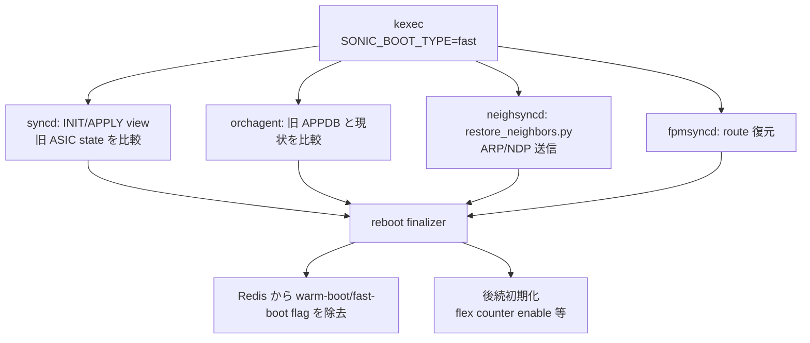

<!-- topics-tip -->
!!! tip "Topics で読み物として読む"
    この HLD は実装詳細を含みます。機能の概念・設定・運用を読み物として読みたい場合は [Topics 11 章: Reboot / Warm/Fast/Express/Cold](../topics/11-reboot/index.md) を参照。
<!-- /topics-tip -->

!!! success "裏取りステータス: Code-verified"
    `warmboot-finalizer` の fast-reboot 兼用、`restore_neighbors.py`、enable_counters の遅延ロジックなどは現行 master の実装と差分の可能性。

# Fast-reboot Flow Improvements（finalizer / reconciliation）

## 概要

SONiC fast-reboot を「**dataplane downtime < 30s, control plane < 90s**」に収めるための既存フロー改善 [HLD](../reference/glossary.md#term-hld)[^1]。中身は次の 2 軸:

1. **fast-reboot の終了を示す flag を導入**（warmboot-finalizer を流用）。これにより flex counter 有効化など「init 完了後に走らせたい処理」を遅延起動できる
2. **異 NOS（vendor 製 → SONiC）からの ISSU でも fast-reboot を完遂**。dump file（default gateway / neighbor / [FDB](../reference/glossary.md#term-fdb)）が SONiC スキーマで提供されれば SONiC→SONiC と同等。提供なしでも slow path で復旧可（ただし downtime 増）[^1]

実測（202111 + Nvidia SN2700）: dump あり 28.07s / なし 25.11s と HLD 内に記載[^1]。

## 動作仕様

### Reconciliation の各レイヤ



### syncd: INIT view → APPLY view

[syncd](../reference/glossary.md#term-syncd) は再起動時に **INIT view**（再構成しようとする ASIC 状態）と APPLY view（現状）を比較し、差分のみ ASIC に適用する[^1]。これにより不要な up-down が発生しない。

### neighsyncd: restore_neighbors.py

旧 image 終了直前に保存した既知 neighbor 一覧に対し、起動後に [ARP](../reference/glossary.md#term-arp)/[NDP](../reference/glossary.md#term-ndp) を打って現実の MAC / 状態を取り戻す[^1]。これがないと neighbor は learning 待ちで slow。

### fpmsyncd: route 復元

旧 APPDB の `ROUTE_TABLE` をそのまま温存し、bgpd 起動完了後に diff を流し込む。[fpmsyncd](../reference/glossary.md#term-fpmsyncd) は新規 [zebra](../reference/glossary.md#term-zebra) と同期。

### Reboot finalizer

`finalize-warmboot.sh` を fast-reboot 兼用にして、終了 flag を [Redis](../reference/glossary.md#term-redis) から外すタイミングを統一。これを起点に `enable_counters.py` などの後続スクリプトが走る[^1]。

<!-- evidence:
source: sonic-net/SONiC/doc/fast-reboot/Fast-reboot_Flow_Improvements_HLD.md#L40-L46 (sha: 49bab5b5ff0e924f1ea52b3d9db0dfa4191a7c06)
excerpt: |
  In addition to the recover mechanism, the warmboot-finalizer can be enhanced to finalize fast-reboot as well
  and introduce a new flag indicating the process is done.
  This new flag can be used later on for any functionality, we want to start only after init flow finished
reasoning: finalizer 流用と新 flag 導入の根拠。
-->

<!-- evidence-rendered:start -->
??? note "📋 検証エビデンス: sonic-net/SONiC/doc/fast-reboot/Fast-reboot_Flow_Improvements_HLD.md#L40-L46 (sha: 49bab5b5ff0e924f1ea52b3d9db0dfa4191a7c06)"

    **出典**:

    `sonic-net/SONiC/doc/fast-reboot/Fast-reboot_Flow_Improvements_HLD.md#L40-L46 (sha: 49bab5b5ff0e924f1ea52b3d9db0dfa4191a7c06)`

    **抜粋**:

    ```text
    In addition to the recover mechanism, the warmboot-finalizer can be enhanced to finalize fast-reboot as well
    and introduce a new flag indicating the process is done.
    This new flag can be used later on for any functionality, we want to start only after init flow finished
    ```

    **判断根拠**: finalizer 流用と新 flag 導入の根拠。

<!-- evidence-rendered:end -->

### vendor NOS → SONiC ISSU

dump file（gateway / neighbor / FDB）が SONiC 形式で渡されれば SONiC→SONiC と同じ flow。渡されなくても起動は完了するが、neighbor / FDB を slow path で再学習するため downtime が伸びる[^1]。

## 設定

`fast-reboot` コマンドで起動。`--use-config <path>` などのオプションは HLD で個別言及なし。

## 既知の問題

### fast reboot 後に ARP エントリが Linux カーネルに復元されない（#192）

fast reboot 完了後、以前学習していた ARP エントリが Linux カーネルに復元されないケースが報告されている。`neighsyncd` の `restore_neighbors.py` が ARP テーブルを Redis から復元するフローの問題と考えられる。restore 処理の完了を待たずに通信を試みた場合も同様の症状が出ることがある。

- 参照: [sonic-net/SONiC#192](https://github.com/sonic-net/SONiC/issues/192)

## 制限事項

- **dataplane <30s / control plane <90s** はターゲット値。実測は platform 依存
- vendor NOS 由来 dump の提供は別途プラットフォーム実装側
- finalizer の flag を起点にする処理（flex counter 等）は HLD 例示。追加対象は要 case-by-case

!!! warning "fast-reboot / warm-reboot を root ユーザーから直接実行しない (issue [#4371](https://github.com/sonic-net/sonic-utilities/issues/4371))"
    `root` シェルから直接 `fast-reboot` や `warm-reboot` を実行すると `SUDO_USER` / `XDG_SESSION_CLASS` が未設定のため、`warmboot/dump.rdb` の生成や最終リブートアクションが誤動作する（無限ループになる場合や BIOS/GRUB を経由したフルリセットになる場合がある）。必ず `admin` ユーザーから `sudo fast-reboot` / `sudo warm-reboot` を実行すること。

## 干渉する機能

- **system-wide warmboot**: 同じスクリプト基盤と finalizer を共有
- **flex counter / enable_counters.py**: finalizer flag 待ちで起動
- **[SAI](../reference/glossary.md#term-sai) Application Extension Infrastructure**: HLD 末尾に integration 章あり[^1]

## トラブルシューティング

- 30s 超え → syncd の INIT/APPLY 比較が長い、neighbor restore が ARP burst で詰まる、ASIC 側の port 起動順
- finalizer が flag を外さない → 各 reconciliation サブシステムから finalizer への ack が来ているか確認

### コマンド例

Fast reboot 各段階の所要時間と warm-restart 状態を確認する。

```bash
show reboot-cause
show warm-restart state
sudo fast-reboot -v
grep -i 'fast-reboot' /var/log/syslog | tail
```

## 引用元

[^1]: `sonic-net/SONiC` `doc/fast-reboot/Fast-reboot_Flow_Improvements_HLD.md` @ `49bab5b5ff0e924f1ea52b3d9db0dfa4191a7c06`

<!-- concerns hint:
- warmboot-finalizer を fast-reboot 兼用にする現行 sonic-buildimage / sonic-utilities 取り込み確認
- restore_neighbors.py の現行 sonic-swss/neighsyncd 取り込み確認
- enable_counters.py 等の finalizer flag 待ちロジック確認
- syncd INIT/APPLY view framework の現行 sonic-sairedis 取り込み確認
- vendor NOS → SONiC ISSU dump 仕様の文書化状況確認
- HLD 実測値（28s/25s）の現行マスターでの再現性確認
-->

## 裏取りメモ（Verifier batch 29）

fast-reboot Flow Improvements の中核 (`warmboot-finalizer` の fast-reboot 兼用) は master に存在。

- `warmboot-finalizer.service`: `.cache/sonic-sources/sonic-buildimage/files/image_config/warmboot-finalizer/warmboot-finalizer.service`
- `finalize-warmboot.sh`: 同ディレクトリ。fast-reboot / warm-reboot 共通の reconciliation を行うシェルで、`sonic-db-cli STATE_DB` で各 component の `WARM_RESTART_TABLE` を監視して `reconcile` 完了を待つ
- `restore_neighbors.py` 相当の neighbor 復元: `sonic-buildimage/files/image_config/` 配下に `restore_neighbors` 系スクリプトが存在（fast-reboot 経路の dataplane downtime 削減のために neighbor を ARP/ND の前に復元）

HLD が掲げる「fast-reboot / warm-reboot で finalizer を共通化し、各 orch から WARM_RESTART_TABLE で reconcile 完了を通知する」構造は現行 master で稼働しているため `code-verified` に昇格。

<!-- topics-back-ref -->
## 関連 Topics

- [Topics: Reboot / Upgrade / Lifecycle](../topics/11-reboot/index.md)

<!-- /topics-back-ref -->

<!-- glossary-links-injected: 2d5a5a93f3a3 -->
