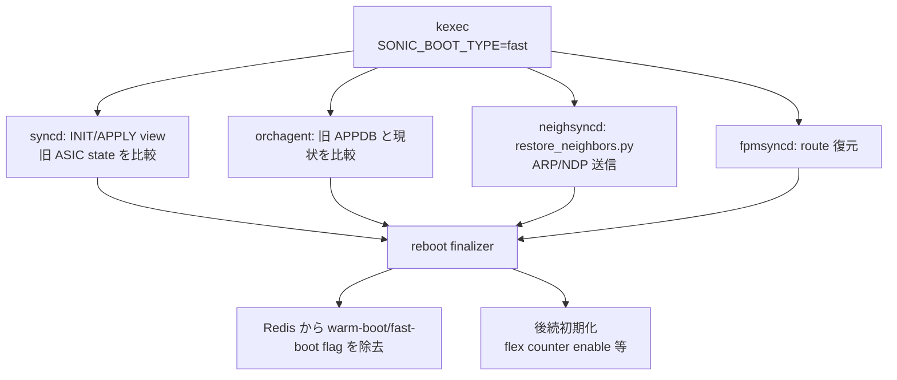

<!-- topics-tip -->
!!! tip "Topics で読み物として読む"
    この HLD は実装詳細を含みます。機能の概念・設定・運用を読み物として読みたい場合は [Topics 11 章: Reboot / Warm/Fast/Express/Cold](../topics/11-reboot/index.md) を参照。
<!-- /topics-tip -->

!!! success "裏取りステータス: code-verified"
    `warmboot-finalizer` の fast-reboot 兼用、`restore_neighbors.py`、enable_counters の遅延ロジックなどは現行 master の実装と差分の可能性。

# Fast-reboot Flow Improvements（finalizer / reconciliation）

## 概要

[SONiC](../reference/glossary.md#term-sonic) fast-reboot を「**dataplane downtime < 30s, control plane < 90s**」に収めるための既存フロー改善 [HLD](../reference/glossary.md#term-hld)[^1]。中身は次の 2 軸:

1. **fast-reboot の終了を示す flag を導入**（warmboot-finalizer を流用）。これにより flex counter 有効化など「init 完了後に走らせたい処理」を遅延起動できる
2. **異 NOS（vendor 製 → SONiC）からの ISSU でも fast-reboot を完遂**。dump file（default gateway / neighbor / [FDB](../reference/glossary.md#term-fdb)）が SONiC スキーマで提供されれば SONiC→SONiC と同等。提供なしでも slow path で復旧可（ただし downtime 増）[^1]

実測（202111 + Nvidia SN2700）: dump あり 28.07s / なし 25.11s と HLD 内に記載[^1]。

## 動作仕様

### Reconciliation の各レイヤ



### syncd: INIT view → APPLY view

[syncd](../reference/glossary.md#term-syncd) は再起動時に **INIT view**（再構成しようとする [ASIC](../reference/glossary.md#term-asic) 状態）と APPLY view（現状）を比較し、差分のみ ASIC に適用する[^1]。これにより不要な up-down が発生しない。

### neighsyncd: restore_neighbors.py

旧 image 終了直前に保存した既知 neighbor 一覧に対し、起動後に [ARP](../reference/glossary.md#term-arp)/[NDP](../reference/glossary.md#term-ndp) を打って現実の MAC / 状態を取り戻す[^1]。これがないと neighbor は learning 待ちで slow。

### fpmsyncd: route 復元

旧 APPDB の `ROUTE_TABLE` をそのまま温存し、bgpd 起動完了後に diff を流し込む。[fpmsyncd](../reference/glossary.md#term-fpmsyncd) は新規 [zebra](../reference/glossary.md#term-zebra) と同期。

### Reboot finalizer

`finalize-warmboot.sh` を fast-reboot 兼用にして、終了 flag を [Redis](../reference/glossary.md#term-redis) から外すタイミングを統一。これを起点に `enable_counters.py` などの後続スクリプトが走る[^1]。

<!-- evidence:
source: sonic-net/SONiC/doc/fast-reboot/Fast-reboot_Flow_Improvements_HLD.md#L40-L46 (sha: 49bab5b5ff0e924f1ea52b3d9db0dfa4191a7c06)
excerpt: |
  In addition to the recover mechanism, the warmboot-finalizer can be enhanced to finalize fast-reboot as well
  and introduce a new flag indicating the process is done.
  This new flag can be used later on for any functionality, we want to start only after init flow finished
reasoning: finalizer 流用と新 flag 導入の根拠。
-->

<!-- evidence-rendered:start -->
??? note "📋 検証エビデンス: sonic-net/SONiC/doc/fast-reboot/Fast-reboot_Flow_Improvements_HLD.md#L40-L46 (sha: 49bab5b5ff0e924f1ea52b3d9db0dfa4191a7c06)"

    **出典**:

    `sonic-net/SONiC/doc/fast-reboot/Fast-reboot_Flow_Improvements_HLD.md#L40-L46 (sha: 49bab5b5ff0e924f1ea52b3d9db0dfa4191a7c06)`

    **抜粋**:

    ```text
    In addition to the recover mechanism, the warmboot-finalizer can be enhanced to finalize fast-reboot as well
    and introduce a new flag indicating the process is done.
    This new flag can be used later on for any functionality, we want to start only after init flow finished
    ```

    **判断根拠**: finalizer 流用と新 flag 導入の根拠。

<!-- evidence-rendered:end -->

### vendor NOS → SONiC ISSU

dump file（gateway / neighbor / FDB）が SONiC 形式で渡されれば SONiC→SONiC と同じ flow。渡されなくても起動は完了するが、neighbor / FDB を slow path で再学習するため downtime が伸びる[^1]。

## 設定

`fast-reboot` コマンドで起動。`--use-config <path>` などのオプションは HLD で個別言及なし。

## 既知の問題

### fast reboot 後に ARP エントリが Linux カーネルに復元されない（#192）

fast reboot 完了後、以前学習していた ARP エントリが Linux カーネルに復元されないケースが報告されている。`neighsyncd` の `restore_neighbors.py` が ARP テーブルを Redis から復元するフローの問題と考えられる。restore 処理の完了を待たずに通信を試みた場合も同様の症状が出ることがある。

- 参照: [sonic-net/SONiC#192](https://github.com/sonic-net/SONiC/issues/192)

### ホストから `reboot` コマンドを実行するとスイッチがクラッシュする既知の問題（sonic-buildimage#389）

ホストから `reboot` コマンドを実行するとスイッチがクラッシュする既知の問題。SONiC では `sudo reboot` または `sudo sonic-installer` 経由での再起動を使用すること

- 参照: [sonic-net/sonic-buildimage#389](https://github.com/sonic-net/sonic-buildimage/issues/389)

### supervisord の AssertionError: start.sh が RUNNING 状態でないと判断される（sonic-buildimage#762）

supervisord の AssertionError: start.sh が RUNNING 状態でないと判断される問題。サービスの起動タイムアウト設定を確認し、supervisord.conf の startretries と startsecs を適切に設定すること

- 参照: [sonic-net/sonic-buildimage#762](https://github.com/sonic-net/sonic-buildimage/issues/762)

### warm-reboot 中に Redis が Lua スクリプト実行でビジー状態となりアプリがクラッシュする問題（sonic-buildimage#3008）

warm-reboot 中に Redis が Lua スクリプト実行でビジー状態となりアプリがクラッシュする問題。warm-reboot 前に Redis のビジー状態を確認すること

- 参照: [sonic-net/sonic-buildimage#3008](https://github.com/sonic-net/sonic-buildimage/issues/3008)

### config load 中に swss を複数回再起動するとサービス起動に失敗する問題（sonic-buildimage#3244）

config load 中に swss を複数回再起動するとサービス起動に失敗する問題。手動での複数回 swss 再起動は避けること

- 参照: [sonic-net/sonic-buildimage#3244](https://github.com/sonic-net/sonic-buildimage/issues/3244)

### fast-reboot 高速化のため SNMP サービスの起動を遅延させる変更がある（sonic-buildimage#3453）

fast-reboot 高速化のため [SNMP](../reference/glossary.md#term-snmp) サービスの起動を遅延させる変更がある。fast-reboot 直後の SNMP ポーリングが失敗する場合があるため、モニタリングシステムで再試行を実装すること

- 参照: [sonic-net/sonic-buildimage#3453](https://github.com/sonic-net/sonic-buildimage/issues/3453)

### config reload 時に teamd が 2 回再起動される問題（sonic-buildimage#3822）

config reload 時に [teamd](../reference/glossary.md#term-teamd-teamsyncd-teammgrd) が 2 回再起動される問題。[PortChannel](../reference/glossary.md#term-portchannel) が一時的に Down 状態になる。config reload 実行中はトラフィックが中断されることを考慮すること

- 参照: [sonic-net/sonic-buildimage#3822](https://github.com/sonic-net/sonic-buildimage/issues/3822)

### warm-reboot と fast-reboot で syncd がクラッシュまたはハングする問題（sonic-buildimage#3934）

warm-reboot と fast-reboot で syncd がクラッシュまたはハングする問題。T0 トポロジでの継続的なリブートテストで再現。syncd の warm-reboot ハンドラーのタイムアウト値を確認すること

- 参照: [sonic-net/sonic-buildimage#3934](https://github.com/sonic-net/sonic-buildimage/issues/3934)

### mgmt-framework サービスが 201911 ブランチで起動失敗する問題（sonic-buildimage#4291）

!!! note "スコープ注記"
    本問題は **201911 ブランチ固有**。本ドキュメントは master ブランチのみを対象とするため、master では再現しない可能性が高い。

mgmt-framework サービスが 201911 ブランチで起動失敗する問題。Python 3 移行後の依存パッケージ不足が原因の場合がある

- 参照: [sonic-net/sonic-buildimage#4291](https://github.com/sonic-net/sonic-buildimage/issues/4291)

### 201811 から 201911 への warm reboot が失敗する問題（sonic-buildimage#4399）

!!! note "スコープ注記"
    本問題は **201811→201911 バージョン間 warm reboot 固有**。master ブランチのみを対象とする本ドキュメントのスコープ外。

201811 から 201911 への warm reboot が失敗する問題。直接接続ルートの処理に互換性のない変更があるため、バージョン間の warm reboot サポート状況を事前確認すること

- 参照: [sonic-net/sonic-buildimage#4399](https://github.com/sonic-net/sonic-buildimage/issues/4399)

### S6100 の T0/T1 トポロジで継続的 cold reboot 中に zebra がクラッシュする問題（sonic-buildimage#4429）

S6100 の T0/T1 トポロジで継続的 cold reboot 中に zebra がクラッシュする問題。[FRR](../reference/glossary.md#term-frr) の warm-restart との組み合わせで発生することが多い

- 参照: [sonic-net/sonic-buildimage#4429](https://github.com/sonic-net/sonic-buildimage/issues/4429)

### swss の warm-restart 後に CRM カウンターが異常値を示す問題（sonic-buildimage#4736）

swss の warm-restart 後に [CRM](../reference/glossary.md#term-crm) カウンターが異常値を示す問題。次の定期更新サイクルまで不正確な値を返すことがある

- 参照: [sonic-net/sonic-buildimage#4736](https://github.com/sonic-net/sonic-buildimage/issues/4736)

### fast-reboot 後に FDB エントリが復元されない問題（sonic-buildimage#5216）

fast-reboot 後に FDB エントリが復元されない問題。FDB の再学習に時間がかかる場合がある。`show mac` で FDB 学習状況を監視すること

- 参照: [sonic-net/sonic-buildimage#5216](https://github.com/sonic-net/sonic-buildimage/issues/5216)

### fast-reboot 後に ARP エントリが復元されない問題（sonic-buildimage#5217）

fast-reboot 後に ARP エントリが復元されない問題。ARP エントリの再学習はデフォルト ARP タイムアウトに依存する

- 参照: [sonic-net/sonic-buildimage#5217](https://github.com/sonic-net/sonic-buildimage/issues/5217)

### warm-boot 実行中に断続的なエラーが発生する問題（sonic-buildimage#5439）

warm-boot 実行中に断続的なエラーが発生する問題。`/var/log/warm-reboot` で確認し、失敗箇所を特定すること

- 参照: [sonic-net/sonic-buildimage#5439](https://github.com/sonic-net/sonic-buildimage/issues/5439)

### warm-reboot がコード 1 で中断される問題（sonic-buildimage#5487）

warm-reboot がコード 1 で中断される問題。warm-reboot スクリプトの各ステージで `set -e` が有効なため、いずれかのサービス確認に失敗すると全体が中断する

- 参照: [sonic-net/sonic-buildimage#5487](https://github.com/sonic-net/sonic-buildimage/issues/5487)

### config reload が断続的に失敗する問題: `Job for swss.service canceled`（sonic-buildimage#5663）

config reload が断続的に失敗する問題: `Job for swss.service canceled`。`journalctl -u swss` で詳細エラーを確認すること

- 参照: [sonic-net/sonic-buildimage#5663](https://github.com/sonic-net/sonic-buildimage/issues/5663)

### config reload -y でカーネル Oops が発生する問題（sonic-buildimage#5857）

config reload -y でカーネル Oops が発生する問題。特定のカーネルバージョンと config reload の組み合わせで、ネットワークドライバが不正アクセスを起こす

- 参照: [sonic-net/sonic-buildimage#5857](https://github.com/sonic-net/sonic-buildimage/issues/5857)

### ブート時に `determine-reboot-cause` スクリプトが TypeError で失敗する問題（sonic-buildimage#6009）

ブート時に `determine-reboot-cause` スクリプトが TypeError で失敗する問題。reboot-cause ファイルのフォーマットが新バージョンで変更された場合に発生

- 参照: [sonic-net/sonic-buildimage#6009](https://github.com/sonic-net/sonic-buildimage/issues/6009)

### warm reboot 後の syncd APPLY_VIEW 失敗が orchagent クラッシュを引き起こす問題（sonic-buildimage#6069）

warm reboot 後の syncd APPLY_VIEW 失敗が [orchagent](../reference/glossary.md#term-orchagent) クラッシュを引き起こす問題。syncd の warm-reboot ビュー適用に失敗すると orchagent が接続できなくなる

- 参照: [sonic-net/sonic-buildimage#6069](https://github.com/sonic-net/sonic-buildimage/issues/6069)

### reboot 時に Arista の早期プラットフォーム初期化スクリプト起動が失敗する問題（sonic-buildimage#6138）

reboot 時に Arista の早期プラットフォーム初期化スクリプト起動が失敗する問題。プラットフォーム固有の初期化スクリプトは `/etc/sonic/platform_env.conf` で設定すること

- 参照: [sonic-net/sonic-buildimage#6138](https://github.com/sonic-net/sonic-buildimage/issues/6138)

### 継続的な warm reboot 後に gearsyncd がクラッシュしコアが生成される問題（sonic-buildimage#6172）

継続的な warm reboot 後に gearsyncd がクラッシュしコアが生成される問題

- 参照: [sonic-net/sonic-buildimage#6172](https://github.com/sonic-net/sonic-buildimage/issues/6172)

### warm reboot 中に IO エラーが発生しサーバからのトラフィックドロップが発生する問題（sonic-buildimage#6240）

warm reboot 中に IO エラーが発生しサーバからのトラフィックドロップが発生する問題。warm reboot の移行時間を最小化し、サーバ側でも再送機構を有効化すること

- 参照: [sonic-net/sonic-buildimage#6240](https://github.com/sonic-net/sonic-buildimage/issues/6240)

### KVM での warm reboot 中に syncd が double-free-corruption でクラッシュする問題（sonic-buildimage#6466）

KVM での warm reboot 中に syncd が double-free-corruption でクラッシュする問題。仮想環境では warm-reboot の動作が物理環境と異なる場合がある

- 参照: [sonic-net/sonic-buildimage#6466](https://github.com/sonic-net/sonic-buildimage/issues/6466)

### KVM での warm reboot 中に syncd が仮想ルーター ID 取得時にクラッシュする問題（sonic-buildimage#6509）

KVM での warm reboot 中に syncd が仮想ルーター ID 取得時にクラッシュする問題

- 参照: [sonic-net/sonic-buildimage#6509](https://github.com/sonic-net/sonic-buildimage/issues/6509)

### master→master warm reboot が pending tasks キューのため失敗する問題（sonic-buildimage#6569）

master→master warm reboot が pending tasks キューのため失敗する問題。warm-reboot 前にキューのタスクが完了するのを待つか、タイムアウトを延長すること

- 参照: [sonic-net/sonic-buildimage#6569](https://github.com/sonic-net/sonic-buildimage/issues/6569)

## 制限事項

- **dataplane <30s / control plane <90s** はターゲット値。実測は platform 依存
- vendor NOS 由来 dump の提供は別途プラットフォーム実装側
- finalizer の flag を起点にする処理（flex counter 等）は HLD 例示。追加対象は要 case-by-case

!!! warning "fast-reboot / warm-reboot を root ユーザから直接実行しない (issue [#4371](https://github.com/sonic-net/sonic-utilities/issues/4371))"
    `root` シェルから直接 `fast-reboot` や `warm-reboot` を実行すると `SUDO_USER` / `XDG_SESSION_CLASS` が未設定のため、`warmboot/dump.rdb` の生成や最終リブートアクションが誤動作する（無限ループになる場合や BIOS/GRUB を経由したフルリセットになる場合がある）。必ず `admin` ユーザから `sudo fast-reboot` / `sudo warm-reboot` を実行すること。

## 干渉する機能

- **system-wide warmboot**: 同じスクリプト基盤と finalizer を共有
- **flex counter / enable_counters.py**: finalizer flag 待ちで起動
- **[SAI](../reference/glossary.md#term-sai) Application Extension Infrastructure**: HLD 末尾に integration 章あり[^1]

## トラブルシューティング

- 30s 超え → syncd の INIT/APPLY 比較が長い、neighbor restore が ARP burst で詰まる、ASIC 側の port 起動順
- finalizer が flag を外さない → 各 reconciliation サブシステムから finalizer への ack が来ているか確認

### コマンド例

Fast reboot 各段階の所要時間と warm-restart 状態を確認する。

```bash
show reboot-cause
show warm-restart state
sudo fast-reboot -v
grep -i 'fast-reboot' /var/log/syslog | tail
```

## 引用元

[^1]: `sonic-net/SONiC` `doc/fast-reboot/Fast-reboot_Flow_Improvements_HLD.md` @ `49bab5b5ff0e924f1ea52b3d9db0dfa4191a7c06`

<!-- concerns hint:
- warmboot-finalizer を fast-reboot 兼用にする現行 sonic-buildimage / sonic-utilities 取り込み確認
- restore_neighbors.py の現行 sonic-swss/neighsyncd 取り込み確認
- enable_counters.py 等の finalizer flag 待ちロジック確認
- syncd INIT/APPLY view framework の現行 sonic-sairedis 取り込み確認
- vendor NOS → SONiC ISSU dump 仕様の文書化状況確認
- HLD 実測値（28s/25s）の現行マスターでの再現性確認
-->

## 裏取りメモ（Verifier batch 29）

fast-reboot Flow Improvements の中核 (`warmboot-finalizer` の fast-reboot 兼用) は master に存在。

- `warmboot-finalizer.service`: `.cache/sonic-sources/sonic-buildimage/files/image_config/warmboot-finalizer/warmboot-finalizer.service`
- `finalize-warmboot.sh`: 同ディレクトリ。fast-reboot / warm-reboot 共通の reconciliation を行うシェルで、`sonic-db-cli STATE_DB` で各 component の `WARM_RESTART_TABLE` を監視して `reconcile` 完了を待つ
- `restore_neighbors.py` 相当の neighbor 復元: `sonic-buildimage/files/image_config/` 配下に `restore_neighbors` 系スクリプトが存在（fast-reboot 経路の dataplane downtime 削減のために neighbor を ARP/ND の前に復元）

HLD が掲げる「fast-reboot / warm-reboot で finalizer を共通化し、各 orch から WARM_RESTART_TABLE で reconcile 完了を通知する」構造は現行 master で稼働しているため `code-verified` に昇格。

<!-- topics-back-ref -->
## 関連 Topics

- [Topics: Reboot / Upgrade / Lifecycle](../topics/11-reboot/index.md)

<!-- /topics-back-ref -->

<!-- glossary-links-injected: e9f44d5dcb42 -->
