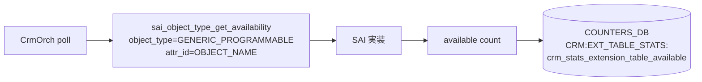
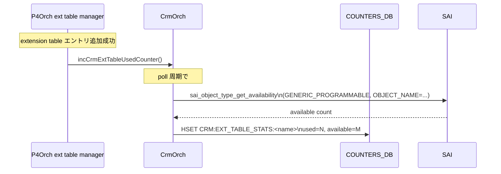

<!-- topics-tip -->
!!! tip "Topics で読み物として読む"
    この HLD は実装詳細を含む。機能の概念・設定・運用を読み物として読みたい場合は [Topics 20 章: SWSS / SAI / Redis](../topics/20-swss-sai-redis/index.md) を参照。
<!-- /topics-tip -->

!!! warning "裏取りステータス: discrepancy-found (evolved_beyond_hld)"
    本 HLD は「**新たなユーザ向け設定パラメータは追加しない** / **extension table 専用の追加設定（個別の閾値など）は提供しない**」と明記している。しかし master 実装の `sonic-swss/orchagent/crmorch.cpp` は **`extension_table_threshold_type` (l.184) / `extension_table_low_threshold` (l.230) / `extension_table_high_threshold` (l.276)** を CRM テーブルのフィールド名として登録しており、他リソース同様の個別閾値設定が実装上は可能になっている。本ページは下記「実装との乖離」節で詳細を記述する。

    enum / API 側は HLD と一致:
    `sonic-swss/orchagent/crmorch.h` で `CRM_EXT_TABLE` enum (l.37)、`incCrmExtTableUsedCounter(...)` (l.88)、`decCrmExtTableUsedCounter(...)` (l.90) を確認。`crmorch.cpp` (l.51) `{ CrmResourceType::CRM_EXT_TABLE, "EXTENSION_TABLE" }` の resource name 登録。`tests/p4rt/test_viplb.py` で `EXT_TABLE_STATS:<TBL_NAME>` の `crm_stats_extension_table_used` / `crm_stats_extension_table_available` を P4Orch test が参照しており命名規則も整合。

# Generic SAI Extension テーブルの CRM（CRM_EXT_TABLE）

## 概要

[CRM](../reference/glossary.md#term-crm)（Critical Resource Monitoring）は [SONiC](../reference/glossary.md#term-sonic) で **[ASIC](../reference/glossary.md#term-asic) リソースの利用状況** を [COUNTERS_DB](../reference/glossary.md#term-counters_db) に publish する仕組みで、[ACL](../reference/glossary.md#term-acl) / [FDB](../reference/glossary.md#term-fdb) / IP route / nexthop など主要リソースに対しては既に実装されている。

本 [HLD](../reference/glossary.md#term-hld) は **Generic [SAI](../reference/glossary.md#term-sai) Extension（汎用拡張）テーブル** に対しても CRM をサポートするための設計を定義する[^1]。Generic SAI Extension は **`SAI_OBJECT_TYPE_GENERIC_PROGRAMMABLE`** という抽象を介して、P4 由来の追加テーブル（例: `EXT_VIPV4_TABLE` など）を SAI 経由でハードに降ろすための機構。これらは標準 SAI オブジェクトの列に載っていないため、CRM の resource type も新しく作る必要がある[^1]。

スコープは「**used / available の COUNTERS_DB への publish と既存 CRM の watermark チェックの活用**」のみ。新たなユーザ向け設定パラメータは追加しない[^1]。

## 動作仕様

### 新しい resource type

CRM の内部に新規 enum `CrmResourceType::CRM_EXT_TABLE` を追加し、各 extension table の統計を **テーブル名キーで分けて** 持つ[^1]:

```text
m_resourcesMap.at(CrmResourceType::CRM_EXT_TABLE)
              .countersMap[EXT_TABLE_STATS:"<table-name>"]
```

これにより `EXT_VIPV4_TABLE` / `EXT_VIPV6_TABLE` / その他 P4 追加テーブルそれぞれが、独立した used / available 統計を持つ。

### 既存 CRM 設定の継承

ポーリング間隔など既存 CRM の **設定パラメータはそのまま流用** する[^1]。つまり既存の `crm config polling interval <sec>` 等は本 resource type にも効く。

watermark チェック（high / low の閾値超過アラート）も **他リソースで既に提供されている既定挙動** がそのまま適用される[^1]。

### available の取得

available（残り使用可能数）は **既存 SAI API `sai_object_type_get_availability()`** を再利用する[^1]:

| パラメータ | 値 |
|------------|----|
| object-type | `SAI_OBJECT_TYPE_GENERIC_PROGRAMMABLE` |
| attribute-id | `SAI_GENERIC_PROGRAMMABLE_ATTR_OBJECT_NAME` |

データプレーンの SAI 実装側は、この API 呼び出しに対して **対応する extension テーブル名にマッチするリソースの利用可能数** を返す責務を負う[^1]。



### used の book-keeping

used（使用中の数）は **CrmOrch の API を P4Orch から呼んで増減** させる[^1]:

| API | 呼び出すタイミング |
|-----|-------------------|
| `CrmOrch::incCrmExtTableUsedCounter()` | extension テーブルにエントリが正常に追加された |
| `CrmOrch::decCrmExtTableUsedCounter()` | エントリが削除された |

呼び出し責任は **P4Orch の extension table manager**[^1]。SAI 失敗時は呼ばれない（add/del が成功した場合のみ反映する）。

### COUNTERS_DB の出力例

`EXT_VIPV4_TABLE`（max 1024）に 1 エントリ入っている状態の例[^1]:

```text
127.0.0.1:6379[2]> KEYS *EXT_TABLE_STATS*
 1) "CRM:EXT_TABLE_STATS:EXT_VIPV4_TABLE"

127.0.0.1:6379[2]> HGETALL "CRM:EXT_TABLE_STATS:EXT_VIPV4_TABLE"
1) "crm_stats_extension_table_used"
2) "1"
3) "crm_stats_extension_table_available"
4) "1023"
```

キー名は **`CRM:EXT_TABLE_STATS:<extension-table-name>`** が固定パターン。`used` + `available` の和が当該テーブルの max 容量[^1]。



<!-- evidence:
source: sonic-net/SONiC/doc/crm/Generic_SAI_Extensions_CRM.md#L36-L48 (sha: 49bab5b5ff0e924f1ea52b3d9db0dfa4191a7c06)
excerpt: |
  sai_object_type_get_availability() ...
  - object-type    : SAI_OBJECT_TYPE_GENERIC_PROGRAMMABLE
  - attribute-id   : SAI_GENERIC_PROGRAMMABLE_ATTR_OBJECT_NAME
  CrmOrch::incCrmExtTableUsedCounter()
  CrmOrch::decCrmExtTableUsedCounter()
  P4Orch extension table manager is responsible to call APIs ...
reasoning: available 取得経路と used 反映の責務分担の根拠。
-->

<!-- evidence-rendered:start -->
??? note "📋 検証エビデンス: sonic-net/SONiC/doc/crm/Generic_SAI_Extensions_CRM.md#L36-L48 (sha: 49bab5b5ff0e924f1ea52b3d9db0dfa4191a7c06)"

    **出典**:

    `sonic-net/SONiC/doc/crm/Generic_SAI_Extensions_CRM.md#L36-L48 (sha: 49bab5b5ff0e924f1ea52b3d9db0dfa4191a7c06)`

    **抜粋**:

    ```text
    sai_object_type_get_availability() ...
    - object-type    : SAI_OBJECT_TYPE_GENERIC_PROGRAMMABLE
    - attribute-id   : SAI_GENERIC_PROGRAMMABLE_ATTR_OBJECT_NAME
    CrmOrch::incCrmExtTableUsedCounter()
    CrmOrch::decCrmExtTableUsedCounter()
    P4Orch extension table manager is responsible to call APIs ...
    ```

    **判断根拠**: available 取得経路と used 反映の責務分担の根拠。

<!-- evidence-rendered:end -->

## 設定

### 関連する CONFIG_DB

HLD 上は **専用の [CONFIG_DB](../reference/glossary.md#term-config_db) エントリを追加しない** 方針[^1]。一方で master 実装の `crmorch.cpp` には `extension_table_threshold_type` / `extension_table_low_threshold` / `extension_table_high_threshold` という **extension table 専用の閾値フィールドが既に登録されている**[^2]。`CRM\|Config` テーブルにこれらのフィールドを書けば、他リソースと同じ仕組みで extension table の watermark 閾値を変更できる（下記「実装との乖離」参照）。

ポーリング間隔など他の既存設定（`CRM` テーブルの `polling_interval`）はそのまま継承される[^1]。

### 関連する CLI

`crm config polling interval`, `crm config thresholds *`, `crm show resources` 等の既存 CRM CLI が再利用される[^1]。HLD では新規 CLI は追加されない方針だが、CONFIG_DB 側に extension table 専用フィールドが存在するため、CLI 側で対応サブコマンドが追加されているか・直接 redis 書き込みでしか触れないかは [sonic-utilities](../reference/glossary.md#term-sonic-utilities) 側の実装次第。

### 確認方法

```bash
# 該当 extension table の CRM 値を redis 直叩きで見る
redis-cli -n 2 KEYS '*EXT_TABLE_STATS*'
redis-cli -n 2 HGETALL CRM:EXT_TABLE_STATS:EXT_VIPV4_TABLE
```

`crm show resources` 系のサブコマンドが extension table を扱えるかどうかは [sonic-utilities](../reference/glossary.md#term-sonic-utilities) の実装に依存する（裏取り課題）。

## 実装との乖離

| 項目 | HLD の主張 | master 実装 (`sonic-swss` SHA は最新 master) | 影響 |
|------|-----------|----------------------------------------------|-----|
| extension table 専用 CONFIG_DB フィールド | 「**新たなユーザ向け設定パラメータは追加しない**」[^1] | `crmorch.cpp` l.184 `extension_table_threshold_type` / l.230 `extension_table_low_threshold` / l.276 `extension_table_high_threshold` を `CRM\|Config` の対応マップに登録[^2] | extension table も他リソース同様に **個別の high/low/percentage|used threshold** を設定できる |
| 「個別の閾値などは提供しない」[^1] | HLD 記述 | 上記 3 フィールドにより個別閾値が **実装上は構造的に有効** | HLD の言葉と矛盾。実装側が evolved。 |

つまり HLD が `「used/available の publish のみ・閾値は他リソースで提供されている既定挙動を流用」` と書いた当初設計から、master では **CrmResourceType ごとの閾値マップを揃える形** に拡張されており、extension table も他の `*_threshold_type` / `*_low_threshold` / `*_high_threshold` パターンに乗っている。

挙動としては HLD 設計を破壊しない（個別閾値を明示しなければ他リソースと同じ既定が効く）が、ドキュメント文言は実装と乖離している。<!-- evidence:
source: sonic-net/sonic-swss/orchagent/crmorch.cpp#L184,L230,L276
excerpt: |
  L184: { "extension_table_threshold_type", CrmResourceType::CRM_EXT_TABLE },
  L230: {"extension_table_low_threshold",  CrmResourceType::CRM_EXT_TABLE },
  L276: {"extension_table_high_threshold", CrmResourceType::CRM_EXT_TABLE },
reasoning: HLD が「extension table 専用の追加設定は提供しない」と明記しているが、実装には extension table の threshold type / low / high が登録されており、CONFIG_DB から個別設定可能なため lookup 経路が存在する。
-->

<!-- evidence-rendered:start -->
??? note "📋 検証エビデンス: sonic-net/sonic-swss/orchagent/crmorch.cpp#L184,L230,L276"

    **出典**:

    `sonic-net/sonic-swss/orchagent/crmorch.cpp#L184,L230,L276`

    **抜粋**:

    ```text
    L184: { "extension_table_threshold_type", CrmResourceType::CRM_EXT_TABLE },
    L230: {"extension_table_low_threshold",  CrmResourceType::CRM_EXT_TABLE },
    L276: {"extension_table_high_threshold", CrmResourceType::CRM_EXT_TABLE },
    ```

    **判断根拠**: HLD が「extension table 専用の追加設定は提供しない」と明記しているが、実装には extension table の threshold type / low / high が登録されており、CONFIG_DB から個別設定可能なため lookup 経路が存在する。

<!-- evidence-rendered:end -->

## 制限事項

- スコープが **used / available の publish** に限定される。**HLD は extension table 専用の追加設定（個別の閾値など）は提供しない** と書いている[^1] が、実装は上記の通り個別閾値フィールドを持つ[^2]（前節参照）。
- `sai_object_type_get_availability` を **データプレーン SAI が `GENERIC_PROGRAMMABLE` + `OBJECT_NAME` の組で実装している** ことが前提。実装が無いベンダ SAI では available が取れない[^1]。
- used カウンタの増減は **P4Orch の extension table manager に依存**。他の経路で extension テーブルを操作する実装が出てきた場合、used が実体とずれる可能性がある[^1]。
- 本 HLD は **CRM スレッド側のロジック**。SAI レイヤから直接通知される訳ではないので、reset / warm boot 等の特殊状態での used 値の整合性は HLD 内では言及されていない。

## 干渉する機能

- **CrmOrch（既存）**: 新 resource type の登録だけが追加の変更。polling / watermark check の枠組みはそのまま使える[^1]。
- **P4Orch (extension table manager)**: used カウンタの増減を呼ぶ責任を負う。新規 extension table を追加した際にも本機構に追従する必要がある[^1]。
- **`SAI_OBJECT_TYPE_GENERIC_PROGRAMMABLE`**: SAI 拡張の根幹オブジェクト。available 取得経路として `OBJECT_NAME` 属性が利用される[^1]。
- **テレメトリ / dial-out**: COUNTERS_DB の `CRM:EXT_TABLE_STATS:*` がそのままテレメトリ系の購読対象になりうる。命名規則 `EXT_TABLE_STATS` を前提にした [gNMI](../reference/glossary.md#term-gnmi) path 等の設計とリンクしうる。
- **ACL / FDB 等の既存 CRM**: 同じ enum 機構の延長線上にある。新規追加が他リソースに副作用を与えない構造（`m_resourcesMap` の独立エントリ）[^1]。

## トラブルシューティング

- `CRM:EXT_TABLE_STATS:*` キーが redis に出ない: P4Orch 側で extension table エントリが 1 件も登録されていない、または CrmOrch のポーリングがまだ走っていない可能性。`crm config polling interval` の値を確認[^1]。
- `available` が 0 のまま: SAI 実装が `sai_object_type_get_availability(GENERIC_PROGRAMMABLE, OBJECT_NAME)` を実装していない可能性[^1]。`syncd` のログに該当エラーが出ているか確認。
- `used` の値が実体とずれる: P4Orch の `inc/dec` 呼び出しが add/del の成功パスから外れている可能性。[orchagent](../reference/glossary.md#term-orchagent) ログで該当 entry の操作結果を追う[^1]。
- watermark アラートが上がらない: 既存 CRM の閾値設定（`crm config thresholds`）を本テーブル用にも適用しているか確認。HLD は **既存設定の継承** を前提にしている[^1]。

### コマンド例

SAI 拡張 CRM 属性が取得できるか確認する。

```bash
crm show resources all
docker exec syncd saictl -c 'show crm'
redis-cli -n 2 hgetall 'CRM:STATS'
grep -i CRM /var/log/syslog | tail
```

## 引用元

[^1]: `sonic-net/SONiC` `doc/crm/Generic_SAI_Extensions_CRM.md` @ `49bab5b5ff0e924f1ea52b3d9db0dfa4191a7c06`
[^2]: `sonic-net/sonic-swss` `orchagent/crmorch.cpp` l.184 / l.230 / l.276 @ `4305596156d70e9797e8a881b3d19b46de0bce0d`

<!-- evidence (verifier-batch-19):
- sonic-swss `orchagent/crmorch.h` l.37 `CRM_EXT_TABLE,` enum, l.88 `void incCrmExtTableUsedCounter(CrmResourceType resource, std::string table_name);`, l.90 `decCrmExtTableUsedCounter(...)`
- sonic-swss `orchagent/crmorch.cpp` l.51 `{ CrmResourceType::CRM_EXT_TABLE, "EXTENSION_TABLE" }` resource name registration
- sonic-swss `tests/p4rt/test_viplb.py` で `EXT_TABLE_STATS:<TBL_NAME>` の `crm_stats_extension_table_used` / `crm_stats_extension_table_available` を assertion 対象としている（命名規則一致）
-->

<!-- topics-back-ref -->
## 関連 Topics

- [Topics: Telemetry / SNMP / Observability](../topics/09-telemetry-snmp/index.md)

<!-- /topics-back-ref -->

<!-- glossary-links-injected: 896d391185a9 -->
