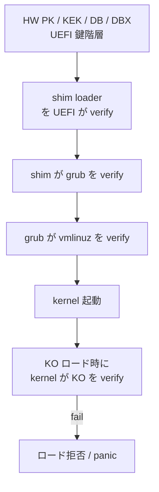

!!! warning "裏取りステータス: discrepancy-found (2026-05-10)"
    実装は HLD と少し異なる: ① 署名スクリプトは `.py` ではなく **bash 版** `sonic-buildimage/scripts/signing_secure_boot_dev.sh` (検証は `secure_boot_signature_verification.sh`)。② build flag は `SB_BUILD` ではなく `SECURE_UPGRADE_MODE` (`build_image.sh` で `!= "no_sign"` 判定) と `SECURE_UPGRADE_DEV_SIGNING_KEY` (`rules/config:287-294`)。③ Production 用は固定スクリプトではなく `SECURE_UPGRADE_PROD_SIGNING_TOOL` 変数で外部ツール経路を指定 (`Makefile.work:376-383`)。Boot chain (shim/grub/vmlinuz/KO) の検証思想自体は HLD どおり。

# SONiC Secure Boot（shim/grub/vmlinuz/KO の chain of trust）

## 概要

UEFI Secure Boot を SONiC のブートチェーンに適用する。**HW → shim → GRUB → Linux kernel (vmlinuz) → kernel modules (KO)** の各段で **前の段が次を署名検証** する chain of trust を構築し、改竄された不正コードの実行を防ぐ[^1]。

実装は次の 2 つに分かれる[^1]:

1. **署名フロー**（build 時 / sign server 経由で署名）
2. **検証フロー**（boot 時 / runtime KO ロード時に kernel が verify）

## 動作仕様

### 署名対象

`Boot components` の定義[^1]:

- `shim` loader
- `grub` loader
- Linux kernel `vmlinuz`
- Kernel modules（KO）

### Build flow: dev vs production

build 時に `SB_BUILD` フラグで切替[^1]:

| `SB_BUILD` | スクリプト | 鍵の扱い |
|------------|-----------|---------|
| `dev` | `signing_secure_boot_dev.py` | ユーザがコンパイル時に鍵を供給 |
| `production` | `signing_secure_boot_production.py` | 鍵は使わない / 外部 sign server へ送って署名済 component を受領 |

production スクリプトは **ベンダ各社が自分のフローに合わせて実装** する想定。HLD は dev 用スクリプトのみ供給する[^1]。

```mermaid
flowchart LR
  subgraph BUILD[Build Process]
    SRC[shim / grub / vmlinuz / KO]
    SCRIPT{SB_BUILD?}
    SRC --> SCRIPT
  end
  SCRIPT -- dev --> DEV[signing_secure_boot_dev.py<br/>local keys]
  SCRIPT -- production --> PROD[signing_secure_boot_production.py<br/>send to vendor sign server]
  PROD <--> SRV[Vendor Sign Server]
  DEV --> BIN[sonic-os.bin<br/>(署名済 boot components 同梱)]
  PROD --> BIN
```

### Runtime 検証フロー



要点[^1]:

- chain の **どこか 1 段でも検証失敗** → 起動中断（または KO ロード拒否）
- 鍵管理は UEFI の DB（許可鍵）/ DBX（拒否鍵）に依存
- vendor / system owner が鍵を Platform Key (PK) として保持

### Phase 1 の制限

HLD は明示的に **"Phase 1 Design"** とラベル付け[^1]. 即ち:

- 第 1 段階は shim → grub → vmlinuz → KO までの基本 chain
- ユーザ空間バイナリの署名・検証 / IMA / 後段強化は Phase 2 以降
- production スクリプトは標準提供せず、ベンダ実装が前提

### CLI / CONFIG_DB

HLD では具体的な CONFIG_DB / CLI 拡張は **明示されていない**[^1]。Secure Boot の有効化は build 時の `SB_BUILD` と UEFI 側の Setup Mode / User Mode 切替で決まり、ランタイム設定は基本ない。署名済イメージを書き込んで boot するだけ。

## 設定

### 関連する CONFIG_DB

該当なし。

### 関連する CLI

該当なし（HLD で言及なし）。`mokutil` 等の Linux 標準ツールが使える可能性はあるが、HLD の scope 外。

### 設定例

```bash
# ビルド時 (production)
make SB_BUILD=production all

# ビルド時 (dev)
make SB_BUILD=dev SB_DEV_KEY=/path/to/db.key SB_DEV_CERT=/path/to/db.crt all

# UEFI Secure Boot 状態確認 (boot 後)
mokutil --sb-state
```

## 制限事項

- **Phase 1 のみ**[^1]。userland バイナリ・コンテナイメージ・configuration の署名は対象外
- production 用署名スクリプトはベンダ提供（標準では未提供）
- warm-boot / fast-boot 影響は HLD で明示なし。再起動扱いの fast-boot では再 verify が発生
- HLD は 2022-06 で Phase 1 Design のままアップデート無し → Phase 2 が議論されているか未確認
- UEFI 鍵 (PK / KEK / DB / DBX) の登録は工場 / 運用者の責務

## 干渉する機能

- **bootloader（shim / GRUB / Aboot）**: Aboot プラットフォーム（Arista 系）は GRUB と異なる経路で、HLD の主対象は GRUB ベース機
- **OpenSSL FIPS 140-3**: FIPS とは独立。Secure Boot は実行コードの改竄防止、FIPS は暗号モジュール認定
- **install / sonic-installer**: 署名済 image の write 後、UEFI が起動時に検証
- **kernel module の動的ロード**: 自前 driver (mlnx kernel module 等) も署名されている必要
- **secure upgrade（`SECURE_UPGRADE_*` build flags）**: イメージ全体の署名（別機構）と組合せ運用される

## トラブルシューティング

```bash
# Secure Boot が enable か
mokutil --sb-state

# kernel が「verified boot」モードか
dmesg | grep -i "secure boot"
cat /sys/kernel/security/lockdown   # 'integrity' / 'confidentiality' なら有効

# KO 検証エラー
dmesg | grep -i "module verification failed"
cat /sys/module/<mod>/sections/.note.* 2>/dev/null
```

## 引用元

[^1]: `sonic-net/SONiC` `doc/secure_boot/hld_secure_boot.md` @ `49bab5b5ff0e924f1ea52b3d9db0dfa4191a7c06`
