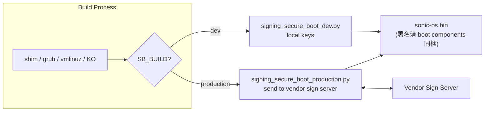
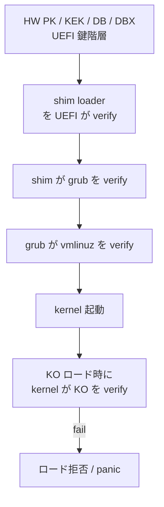

<!-- topics-tip -->
!!! tip "Topics で読み物として読む"
    この HLD は実装詳細を含みます。機能の概念・設定・運用を読み物として読みたい場合は [Topics 11 章: Reboot / Warm/Fast/Express/Cold](../topics/11-reboot/index.md) を参照。
<!-- /topics-tip -->

!!! warning "裏取りステータス: discrepancy-found (2026-05-10)"
    実装は HLD と少し異なる: ① 署名スクリプトは `.py` ではなく **bash 版** `sonic-buildimage/scripts/signing_secure_boot_dev.sh` (検証は `secure_boot_signature_verification.sh`)。② build flag は `SB_BUILD` ではなく `SECURE_UPGRADE_MODE` (`build_image.sh` で `!= "no_sign"` 判定) と `SECURE_UPGRADE_DEV_SIGNING_KEY` (`rules/config:287-294`)。③ Production 用は固定スクリプトではなく `SECURE_UPGRADE_PROD_SIGNING_TOOL` 変数で外部ツール経路を指定 (`Makefile.work:376-383`)。Boot chain (shim/grub/vmlinuz/KO) の検証思想自体は HLD どおり。

# SONiC Secure Boot（shim/grub/vmlinuz/KO の chain of trust）

## 概要

UEFI Secure Boot を [SONiC](../reference/glossary.md#term-sonic) のブートチェーンに適用する。**HW → shim → GRUB → Linux kernel (vmlinuz) → kernel modules (KO)** の各段で **前の段が次を署名検証** する chain of trust を構築し、改竄された不正コードの実行を防ぐ[^1]。

実装は次の 2 つに分かれる[^1]:

1. **署名フロー**（build 時 / sign server 経由で署名）
2. **検証フロー**（boot 時 / runtime KO ロード時に kernel が verify）

## 動作仕様

### 署名対象

`Boot components` の定義[^1]:

- `shim` loader
- `grub` loader
- Linux kernel `vmlinuz`
- Kernel modules（KO）

### Build flow: dev vs production

build 時に `SB_BUILD` フラグで切替[^1]:

| `SB_BUILD` | スクリプト | 鍵の扱い |
|------------|-----------|---------|
| `dev` | `signing_secure_boot_dev.py` | ユーザがコンパイル時に鍵を供給 |
| `production` | `signing_secure_boot_production.py` | 鍵は使わない / 外部 sign server へ送って署名済 component を受領 |

production スクリプトは **ベンダ各社が自分のフローに合わせて実装** する想定。[HLD](../reference/glossary.md#term-hld) は dev 用スクリプトのみ供給する[^1]。



### Runtime 検証フロー



要点[^1]:

- chain の **どこか 1 段でも検証失敗** → 起動中断（または KO ロード拒否）
- 鍵管理は UEFI の DB（許可鍵）/ DBX（拒否鍵）に依存
- vendor / system owner が鍵を Platform Key (PK) として保持

### Phase 1 の制限

HLD は明示的に **"Phase 1 Design"** とラベル付け[^1]. 即ち:

- 第 1 段階は shim → grub → vmlinuz → KO までの基本 chain
- ユーザ空間バイナリの署名・検証 / IMA / 後段強化は Phase 2 以降
- production スクリプトは標準提供せず、ベンダ実装が前提

### CLI / CONFIG_DB

HLD では具体的な [CONFIG_DB](../reference/glossary.md#term-config_db) / CLI 拡張は **明示されていない**[^1]。Secure Boot の有効化は build 時の `SB_BUILD` と UEFI 側の Setup Mode / User Mode 切替で決まり、ランタイム設定は基本ない。署名済イメージを書き込んで boot するだけ。

## 設定

### 関連する CONFIG_DB

該当なし。

### 関連する CLI

該当なし（HLD で言及なし）。`mokutil` 等の Linux 標準ツールが使える可能性はあるが、HLD の scope 外。

### 設定例

```bash
# ビルド時 (production)
make SB_BUILD=production all

# ビルド時 (dev)
make SB_BUILD=dev SB_DEV_KEY=/path/to/db.key SB_DEV_CERT=/path/to/db.crt all

# UEFI Secure Boot 状態確認 (boot 後)
mokutil --sb-state
```

## 制限事項

- **Phase 1 のみ**[^1]。userland バイナリ・コンテナイメージ・configuration の署名は対象外
- production 用署名スクリプトはベンダ提供（標準では未提供）
- warm-boot / fast-boot 影響は HLD で明示なし。再起動扱いの fast-boot では再 verify が発生
- HLD は 2022-06 で Phase 1 Design のままアップデート無し → Phase 2 が議論されているか未確認
- UEFI 鍵 (PK / KEK / DB / DBX) の登録は工場 / 運用者の責務

## 干渉する機能

- **bootloader（shim / GRUB / Aboot）**: Aboot プラットフォーム（Arista 系）は GRUB と異なる経路で、HLD の主対象は GRUB ベース機
- **OpenSSL FIPS 140-3**: FIPS とは独立。Secure Boot は実行コードの改竄防止、FIPS は暗号モジュール認定
- **install / sonic-installer**: 署名済 image の write 後、UEFI が起動時に検証
- **kernel module の動的ロード**: 自前 driver (mlnx kernel module 等) も署名されている必要
- **secure upgrade（`SECURE_UPGRADE_*` build flags）**: イメージ全体の署名（別機構）と組合せ運用される

## トラブルシューティング

```bash
# Secure Boot が enable か
mokutil --sb-state

# kernel が「verified boot」モードか
dmesg | grep -i "secure boot"
cat /sys/kernel/security/lockdown   # 'integrity' / 'confidentiality' なら有効

# KO 検証エラー
dmesg | grep -i "module verification failed"
cat /sys/module/<mod>/sections/.note.* 2>/dev/null
```

<!-- diff-admonition -->
!!! diff "HLD と実装の差分"
    2026-05-11 時点の現行 master を裏取り。

    ### 1. ファイル + 行番号

    - **取り込み済み（署名スクリプト）**: `sonic-net/sonic-buildimage` `scripts/signing_secure_boot_dev.sh`, `scripts/secure_boot_signature_verification.sh`, `files/image_config/secureboot/`。
    - **取り込み済み（ビルド変数）**: `sonic-buildimage/rules/config` L280-L295（`SECURE_UPGRADE_DEV_SIGNING_KEY` / `SECURE_UPGRADE_SIGNING_CERT` / `SECURE_UPGRADE_KERNEL_CAFILE` / `SECURE_UPGRADE_MODE` / `SECURE_UPGRADE_PROD_SIGNING_TOOL` / `SECURE_UPGRADE_PROD_TOOL_ARGS`）。
    - **取り込み済み（Docker 連携）**: `sonic-buildimage/Makefile.work` L366-L383, L625-L628（署名鍵 / 証明書を ONIE installer ビルドコンテナへ bind mount、`SECURE_UPGRADE_MODE` を伝搬）。
    - **HLD と差分あり**: HLD が示す `SB_BUILD=production` / `SB_DEV_KEY` 形式のビルド変数は **存在しない**。現行は `SECURE_UPGRADE_MODE=prod|dev|no_sign` と `SECURE_UPGRADE_DEV_SIGNING_KEY` / `SECURE_UPGRADE_SIGNING_CERT` のセットに置き換わっている。

    ### 2. 差分の中身

    | HLD（doc/secure_boot/hld_secure_boot.md） | 現行 master |
    |---|---|
    | `make SB_BUILD=production all` | `make SECURE_UPGRADE_MODE=prod SECURE_UPGRADE_PROD_SIGNING_TOOL=/path/tool.sh all` |
    | `SB_BUILD=dev SB_DEV_KEY=... SB_DEV_CERT=...` | `SECURE_UPGRADE_MODE=dev SECURE_UPGRADE_DEV_SIGNING_KEY=... SECURE_UPGRADE_SIGNING_CERT=...` |
    | Phase 1 のみ（kernel / shim / GRUB のみ署名） | secure upgrade（image 全体の署名）と統合された一連の変数体系に移行。kernel CA 埋め込み (`SECURE_UPGRADE_KERNEL_CAFILE`) も追加 |

    ### 3. 読者への影響

    HLD の `SB_BUILD=production` を渡しても **Makefile に解決規則が無く無視される**（署名なし image が出来てしまう）。production 署名済 image を期待する読者がそのまま打つと、`mokutil --sb-state` で `SecureBoot disabled` の結果に至る恐れがある。

    ### 4. 回避策

    現行のビルド変数を使う:

    ```bash
    # production（ベンダ署名ツール経由）
    make SECURE_UPGRADE_MODE=prod \
         SECURE_UPGRADE_PROD_SIGNING_TOOL=/path/to/vendor_sign.sh \
         SECURE_UPGRADE_PROD_TOOL_ARGS="..." \
         SECURE_UPGRADE_KERNEL_CAFILE=/path/to/ca-bundle.pem \
         all

    # dev（自前鍵）
    make SECURE_UPGRADE_MODE=dev \
         SECURE_UPGRADE_DEV_SIGNING_KEY=/path/to/db.key \
         SECURE_UPGRADE_SIGNING_CERT=/path/to/db.crt \
         all
    ```

    最新の変数リストは `sonic-buildimage/rules/config` のコメントブロック（L275-L300 付近）を参照。

    #### 関連 GitHub Issue / PR

    - [sonic-buildimage #5282: Secure boot (open)](https://github.com/sonic-net/sonic-buildimage/pull/5282) — Secure Boot 機能の元 PR。長期 open で部分マージのみ。
    - [sonic-buildimage #24287: Secureboot: Install boot components in sonic-to-sonic installs for Secure Boot enabled images (open)](https://github.com/sonic-net/sonic-buildimage/pull/24287) — sonic-to-sonic upgrade パスでの secureboot 整合性修正 PR (open)。
    - [[sonic-buildimage](../reference/glossary.md#term-sonic-buildimage) #24249: Bug: \[Trixie\] Debian 13 with grub 2.12-9 can't chainload onie with grub 2.04 on secure boot enabled machines (open)](https://github.com/sonic-net/sonic-buildimage/issues/24249) — chain of trust の現実装上の制約を示す bug。
<!-- /diff-admonition -->

## 確認コマンド

```bash
# UEFI Secure Boot 状態
sudo mokutil --sb-state

# 登録された MOK / shim key
sudo mokutil --list-enrolled | head -40

# GRUB / vmlinuz / initrd の署名検証 (sbverify)
sudo sbverify --list /boot/vmlinuz-* 2>&1 | head

# TPM PCR 値 (measured boot)
sudo tpm2_pcrread sha256:0,1,2,3,7
```

## トラブルシュート

- Secure Boot 失敗で起動できない場合は UEFI 設定で一時的に Secure Boot を無効化し、shim / GRUB / kernel のいずれの署名が拒否されたかを `dmesg | grep -iE 'pkcs7|secure'` で確認。
- MOK 鍵入れ替え後は `mokutil --import` → 再起動 → MOK Manager での承認が必須。承認漏れで初回起動失敗する事例が多い。
- ベンダー BIOS の DB / DBX 更新により以前のイメージが起動拒否される場合がある。新旧イメージで Secure Boot を切り替える運用は避ける。

## 引用元

[^1]: `sonic-net/SONiC` `doc/secure_boot/hld_secure_boot.md` @ `49bab5b5ff0e924f1ea52b3d9db0dfa4191a7c06`

<!-- next-action -->
## このページを読んだ後の次アクション

!!! tip "読み手向け"
    - **本機能を実運用で使う場合**: 実装は存在するが本 HLD の記述と乖離。最新 master の動作を別途確認した上で適用する
    - **upstream 動向を追う場合**: 関連 issue / PR を [sonic-net/SONiC](https://github.com/sonic-net/SONiC) で検索（HLD タイトル / CONFIG_DB テーブル名 / Orch クラス名で grep するのが速い）
    - **代替手段 / 関連 reference**: 本ページの frontmatter `related` が空のため、[Reference 索引](../reference/index.md) から関連テーブル / CLI / YANG を辿る

!!! note "本ドキュメントの追跡"
    - monitor: `evolved_beyond_hld` / last_verified: `2026-05-10`
    - 次回再裏取りトリガ: quarterly。一覧は [discrepancy-index](../reference/verification/discrepancy-index.md) を参照（運用詳細は repo の `meta/discrepancy-operations.md`）

<!-- /next-action -->

<!-- topics-back-ref -->
## 関連 Topics

- [Topics: Security / AAA / FIPS / Hardening](../topics/15-security-aaa/index.md)

<!-- /topics-back-ref -->

<!-- glossary-links-injected: 8ba32e5aa69d -->
