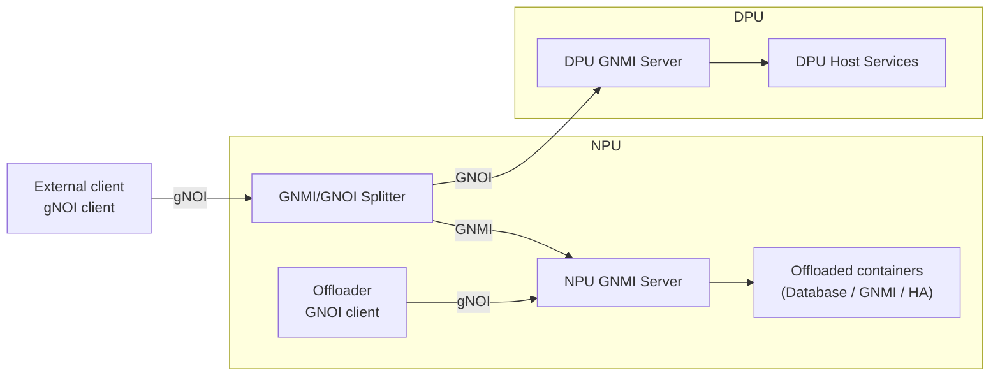
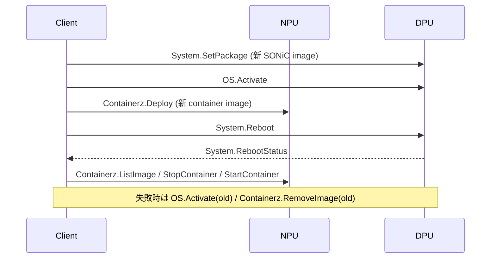

<!-- topics-tip -->
!!! tip "Topics で読み物として読む"
    この HLD は実装詳細を含む。機能の概念・設定・運用を読み物として読みたい場合は [Topics 11 章: Reboot / Warm/Fast/Express/Cold](../topics/11-reboot/index.md) を参照。
<!-- /topics-tip -->

!!! info "裏取りステータス: code-verified"
    sonic-gnmi master で DPU Proxy（GNMI/GNOI Splitter）が `pkg/interceptors/dpuproxy/proxy.go` に実装済み（`ForwardToDPU` / `HandleLocally`）。Containerz gNOI は `gnmi_server/gnoi_containerz.go` および `gnoi_client/containerz/` に、`System.SetPackage` 等は `pkg/gnoi/system/system.go` / `gnmi_server/gnoi_system.go` に実装。HLD で言及されている主要ハンドラ群は master に取り込み済み。

# Smart Switch: DPU 独立アップグレード（gNOI 経路）

## 概要

[SmartSwitch](../reference/glossary.md#term-smartswitch) では [NPU](../reference/glossary.md#term-npu) 1 台に複数 [DPU](../reference/glossary.md#term-dpu) が接続され、各 DPU は独立した [SONiC](../reference/glossary.md#term-sonic) instance だが Database / GNMI / HA など一部 service を **NPU に offload** している[^1]。本 [HLD](../reference/glossary.md#term-hld) は **[gNOI](../reference/glossary.md#term-gnoi) API 駆動で 1 台ずつ DPU を独立アップグレード** する手順を定義し、ネットワーク・他 DPU・NPU への影響を最小化する。前提として **DPU と NPU の SONiC Host Services / GNMI が健全** であること（不応答 DPU の復旧用途ではない）。

## 動作仕様

### コンポーネント



NPU 側の **GNMI/GNOI Splitter** は GNMI 要求を NPU GNMI Server へ、GNOI 要求を DPU GNMI Server へ振り分ける[^1]。NPU 上の **Offloader** が DPU の代理で offloaded container 群を `Containerz` 経由で操作する。

### Upgrade Sequence



主要 step とロールバック[^1]:

| Phase | gNOI API | 説明 |
|-------|----------|------|
| 1. Image 準備 | `System.SetPackage`, `OS.Activate`, `Containerz.Deploy` | DPU に新 SONiC image を deploy / activate、NPU に offloaded 新 container image を deploy |
| 2. DPU upgrade | `System.Reboot`, `System.RebootStatus` | DPU を再起動し新 image で立ち上げ |
| 2b. Container 切替 | `Containerz.ListImage`, `Containerz.StopContainer`, `Containerz.StartContainer` | offloaded container を新版で起動 |
| Rollback | `OS.Activate`(old) / `Containerz.RemoveImage`(old) | 失敗時の復旧 |

### 影響範囲

- **他 DPU**: 影響なし（前提）
- **NPU**: 該当 DPU 用 offloaded container の停止・起動はあるが NPU 自身は再起動しない
- **front panel network**: 該当 DPU が処理していたフロー以外には影響しない（前提）

### Non-goals

- DPU fatal error / 不応答 DPU の復旧（BIOS から image 投入する経路は別 process）
- GNMI 自体の bootstrap
- DPU/NPU image **互換性**（client 責任）
- 完全自動化: upgrade と rollback の両方が失敗した場合は **手動介入**[^1]

<!-- evidence:
source: sonic-net/SONiC/doc/smart-switch/upgrade/dpu-upgrade-hld.md#L74-L100 (sha: 49bab5b5ff0e924f1ea52b3d9db0dfa4191a7c06)
excerpt: |
  Prepare Relevant Images: ... GNOI API: 'System.SetPackage', 'OS.Activate', 'Containerz.Deploy'
  Upgrade DPU: ... 'System.Reboot', 'System.RebootStatus', 'Containerz.ListImage', 'Containerz.StopContainer', 'Containerz.StartContainer'
reasoning: gNOI API 系列と各 phase の根拠。
-->

<!-- evidence-rendered:start -->
??? note "📋 検証エビデンス: sonic-net/SONiC/doc/smart-switch/upgrade/dpu-upgrade-hld.md#L74-L100 (sha: 49bab5b5ff0e924f1ea52b3d9db0dfa4191a7c06)"

    **出典**:

    `sonic-net/SONiC/doc/smart-switch/upgrade/dpu-upgrade-hld.md#L74-L100 (sha: 49bab5b5ff0e924f1ea52b3d9db0dfa4191a7c06)`

    **抜粋**:

    ```text
    Prepare Relevant Images: ... GNOI API: 'System.SetPackage', 'OS.Activate', 'Containerz.Deploy'
    Upgrade DPU: ... 'System.Reboot', 'System.RebootStatus', 'Containerz.ListImage', 'Containerz.StopContainer', 'Containerz.StartContainer'
    ```

    **判断根拠**: gNOI API 系列と各 phase の根拠。

<!-- evidence-rendered:end -->

## 制限事項

- DPU / NPU の SONiC Host Services / GNMI が **健全な状態** が前提
- 提案段階（v0.1 Initial）。`Containerz` 系 gNOI 拡張は upstream で進行中
- 互換性チェックは client 責任
- DPU graceful shutdown HLD（同 SmartSwitch 系）と [STATE_DB](../reference/glossary.md#term-state_db) の race を考慮する必要

## 干渉する機能

- **DPU graceful shutdown**: 同 STATE_DB `CHASSIS_MODULE_INFO_TABLE` に書き込む可能性
- **smartswitch HA / hamgrd**: HA scope の状態は upgrade 中も維持されるべき
- **[gNMI](../reference/glossary.md#term-gnmi) / sonic-telemetry**: GNMI/GNOI Splitter 経由のため依存
- **Offloader / Containerz**: NPU 側 container 制御の標準 API

## 確認コマンド

- `show chassis modules status` — DPU/NPU の admin/oper 状態
- `sonic-db-cli STATE_DB hgetall "CHASSIS_MODULE_INFO_TABLE|DPU0"` — DPU の運用情報
- `gnoi_client -target <dpu> -rpc System.RebootStatus` — gNOI Reboot ステータス
- `gnoi_client -target <dpu> -rpc Containerz.ListImage` — DPU 内 container image を列挙

### コマンド例

DPU 単独アップグレードの進捗を確認する。

```bash
show chassis modules status
sudo config chassis modules startup DPU0
show platform inventory
docker exec database redis-cli -n 6 keys 'CHASSIS_MODULE_TABLE|*'
```

## 引用元

[^1]: `sonic-net/SONiC` `doc/smart-switch/upgrade/dpu-upgrade-hld.md` @ `49bab5b5ff0e924f1ea52b3d9db0dfa4191a7c06`

<!-- concerns hint:
- DPU Host Services / NPU Offloader バイナリの sonic-host-services 取り込み確認
- GNMI/GNOI Splitter 実装と path-based 振分けの sonic-gnmi 取り込み確認
- Containerz gNOI service の openconfig/gnoi 取り込みと SONiC 側ハンドラ確認
- System.SetPackage / OS.Activate / System.Reboot の DPU 側 gNOI ハンドラ確認
- v0.1 (2025-01) Initial Proposal、master への取り込み・採否未確認
- DPU graceful shutdown / HA との race condition の整合確認
-->

<!-- topics-back-ref -->
## 関連 Topics

- [Topics: DASH と SmartSwitch](../topics/13-dash-smartswitch/index.md)

<!-- /topics-back-ref -->

<!-- glossary-links-injected: 8ba32e5aa69d -->
