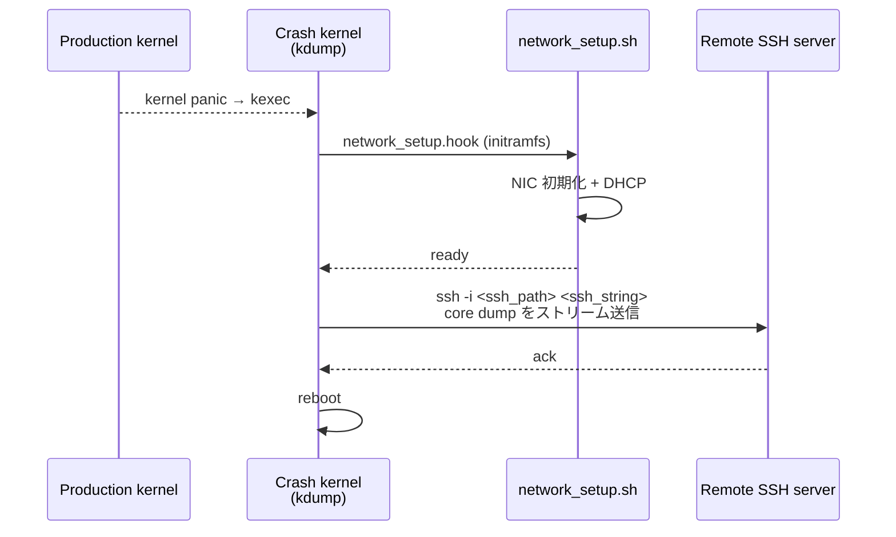

!!! success "裏取りステータス: Code-verified"
    `sonic-buildimage/src/sonic-yang-models/yang-models/sonic-kdump.yang` L57-71 で `remote / ssh_string / ssh_path` の YANG leaf を確認。`sonic-utilities/scripts/sonic-kdump-config` L261/283-294/346-357/429-444 で同 3 フィールドの読み書きと kdump-tools 設定反映、`sonic-utilities/show/kdump.py` L88-95 で `show kdump config` 拡張を確認。`sonic-host-services/scripts/hostcfgd` L1166-1270 で `kdump_defaults` に新 3 フィールドが入り `sonic-kdump-config --remote / --ssh_string / --ssh_path` を呼ぶハンドラを確認。`sonic-buildimage/build_debian.sh` L426-433 で `network_setup.sh` / `network_setup` フックを `/etc/initramfs-tools/scripts/init-premount/` および `/etc/initramfs-tools/hooks/` に配置することを確認 (verified at: 2026-05-09)。

# kdump リモート転送（SSH）

## 概要

SONiC のカーネルクラッシュダンプは従来 **ローカル** にしか保存できなかった。本 HLD は **SSH 経由でリモートサーバへ core dump を転送** する機能を追加する。狙いはスイッチ側ストレージの逼迫回避と、オフライン解析用に専用サーバへ集約することにある[^1]。

機能要件[^1]:

- core dump を **リモート SSH サーバ** に保存
- CLI: enable / disable、`username@server_address`、SSH 秘密鍵パスの設定
- CLI: 設定状態 / 有効状態を表示

## 動作仕様

### 認証方式

`ssh-keygen` でローカル鍵対を生成し（既定 `~/.ssh/id_rsa` と `~/.ssh/id_rsa.pub`）、`ssh-copy-id` で公開鍵をリモートサーバに登録する[^1]:

```bash
admin@sonic:~$ ssh-keygen
admin@sonic:~$ ssh-copy-id username@server_address
```

これでパスワードレス SSH を確立し、kdump 時の自動転送に使う。

### crash 時のネットワーク準備

kdump はクラッシュ後の **secondary kernel** 上で動く。通常運用の SONiC のネットワーク設定はそのまま使えないため、**専用の network 初期化スクリプト** を crash kernel 内で実行する[^1]。

#### 変更ファイル

| ファイル | 変更 | 役割 |
|----------|------|------|
| `build_debian.sh` | 既存への追加 | crash 時に必要な `network_setup.sh` / `network_setup.hook` を image に同梱 |
| `files/scripts/network_setup.sh` | 新規 | crash kernel で NIC を初期化し DHCP を取得 |
| `files/scripts/network_setup.hook` | 新規 | initramfs hook。`network_setup.sh` を crash kernel boot 時に呼ぶ |
| `script/hostcfgd` | 既存への変更 | `KDUMP` table の新規 attribute (`remote / ssh_string / ssh_path`) を `kdump-tools` 設定に反映 |

### 動作フロー



### `KDUMP` table 拡張

`CONFIG_DB.KDUMP` に新たに **`remote` / `ssh_string` / `ssh_path`** を追加する[^1]:

```text
KDUMP|config
    enabled    : "true" | "false"
    memory     : <string>           # crash kernel に確保するメモリ
    num_dumps  : <number>           # 保持する core file 数
    remote     : "true" | "false"   # 新規: remote 転送 on/off
    ssh_string : "username@serverip"
    ssh_path   : "/path/to/ssh_private_key"
```

`hostcfgd` がこのテーブルを購読し、kdump-tools の設定ファイル（一般には `/etc/default/kdump-tools` ないし `/etc/kdump.conf`）に反映する。

### YANG

`sonic-kdump` に以下の leaf を追加[^1]:

```yang
leaf remote {
    type boolean;
    description "Enable or Disable the Kdump remote ssh mechanism";
}
leaf ssh_string {
    type string;
    description "Remote ssh connection string";
}
leaf ssh_path {
    type string;
    description "Remote ssh private key path";
}
```

## 設定

### 関連する CONFIG_DB

| Table | Key | フィールド | 説明 |
|-------|-----|-----------|------|
| `KDUMP` | `config` | `remote` / `ssh_string` / `ssh_path`（ほか既存） | kdump remote 設定 |

### 関連する CLI

| Command | 用途 |
|---------|------|
| `sudo config kdump remote enable` | remote kdump 有効化 |
| `sudo config kdump remote disable` | 無効化 |
| `sudo config kdump remote add ssh_string <username@serverip>` | SSH 接続先設定 |
| `sudo config kdump remote add ssh_path <path>` | 秘密鍵パス設定 |
| `sudo config kdump remove ssh_string` | SSH 接続先削除 |
| `sudo config kdump remove ssh_path` | 秘密鍵パス削除 |
| `show kdump config` | 設定一覧表示 |

### 設定例

```bash
# 鍵対作成 + remote サーバへ公開鍵配布
ssh-keygen
ssh-copy-id dumper@10.0.0.50

# kdump remote 設定
sudo config kdump remote add ssh_string dumper@10.0.0.50
sudo config kdump remote add ssh_path /home/admin/.ssh/id_rsa
sudo config kdump remote enable

# 確認
show kdump config
```

`show kdump config` 出力例[^1]:

```text
admin@sonic:~$ show kdump config
Kdump administrative mode: Enabled
Kdump operational mode:    Ready
Kdump memory reservation:  512
Maximum number of Kdump files: 3
remote:     true
ssh_string: username@serverip
ssh_path:   /path/to/ssh_private_key
```

## 制限事項

- kdump 関連の設定変更は **常に cold reboot が必要** (warm reboot 中の core 生成は未サポート)[^1]
- crash kernel 内で **DHCP 取得が前提**。静的 IP の本番系では `network_setup.sh` の改造が必要
- 認証は **SSH 公開鍵のみ**。パスワード認証は範囲外
- HLD は **SAI API 変更なし**[^1]
- 鍵が expire / rotate された場合の自動更新は範囲外。`ssh_path` を更新する手動運用が必要
- HLD は `KDUMP_TABLE` という表記と `KDUMP|config` のキーを示すが、**現行 SONiC の table 名と一致するかは要確認**

## 干渉する機能

- **`hostcfgd`**: CONFIG_DB から `kdump.conf` 等への反映
- **`kdump-tools` (Debian)**: 実際の crash 動作担当
- **`kexec`**: crash kernel への切替
- **initramfs / network_setup hook**: crash 時のネットワーク初期化
- **既存 `KDUMP` table の `enabled` / `memory` / `num_dumps`**: 既存属性と整合した `hostcfgd` 反映が必要
- **TACACS / RADIUS 等の認証**: 本機能は使用しない（SSH 鍵のみ）

## トラブルシューティング

- crash 後にリモートに core が届かない → crash kernel の syslog（次回起動時に `/var/crash/` にダンプされていないか）と、`kdump-tools` の status を確認
- ネットワーク初期化失敗 → `network_setup.sh` のログ、DHCP の応答状況、初期化対象 NIC が production と一致しているか
- SSH 認証エラー → `ssh -i <ssh_path> <ssh_string>` を手動で疎通確認、リモート側 `~/.ssh/authorized_keys` に公開鍵が入っているか
- `show kdump config` で値が正しいのに反映されない → cold reboot を実施したか確認

## 引用元

[^1]: `sonic-net/SONiC` `doc/kdump/kdump_Remote_SSH_HLD.md` @ `49bab5b5ff0e924f1ea52b3d9db0dfa4191a7c06`

<!-- concerns hint:
- KDUMP table への remote / ssh_string / ssh_path 追加が現行 master の sonic-yang-models / sonic-utilities にあるか未確認
- hostcfgd の KDUMP handler が新 attribute を kdump-tools 設定に反映する実装確認
- build_debian.sh に network_setup.sh / network_setup.hook が同梱されているか未確認
- config kdump remote add/remove ssh_string / ssh_path CLI の sonic-utilities 取り込み確認
- crash kernel 内で DHCP を取得する network_setup.sh の取り込み確認
-->
