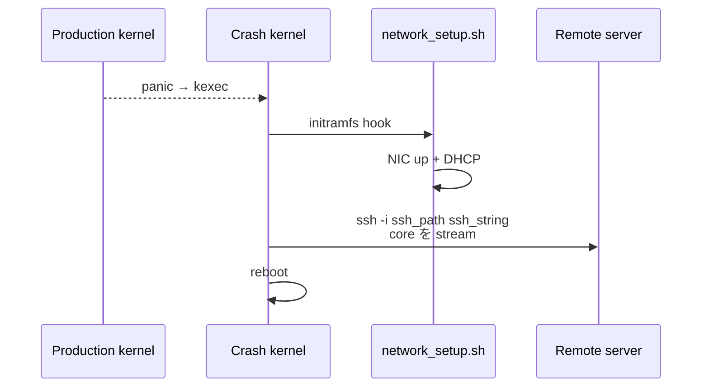

<!-- topics-tip -->
!!! tip "Topics で読み物として読む"
    この HLD は実装詳細を含む。機能の概念・設定・運用を読み物として読みたい場合は [Topics 09 章: Telemetry / SNMP / ログ](../topics/09-telemetry-snmp/index.md) を参照。
<!-- /topics-tip -->

!!! success "裏取りステータス: code-verified"
    `sonic-yang-models/yang-models/sonic-kdump.yang` L57-71 で `remote / ssh_string / ssh_path` の leaf を確認。`sonic-utilities/scripts/sonic-kdump-config` L261/283-294/346-357/429-444 で同フィールドの読み書きと kdump-tools への反映、`sonic-utilities/show/kdump.py` L88-95 で `show kdump config` 拡張、`sonic-host-services/scripts/hostcfgd` L1166-1270 でハンドラ、`sonic-buildimage/build_debian.sh` L426-433 で `network_setup.sh` / hook の initramfs 配置を確認 (verified at: 2026-05-09)。

# kdump リモート転送（SSH）

## なぜリモート転送が必要なのか

[SONiC](../reference/glossary.md#term-sonic) のカーネルクラッシュダンプは従来 **ローカル `/var/crash/` にしか保存できなかった**。スイッチ側ストレージが小さい / 圧迫されると core を取り逃す。本機能は **SSH 経由でリモートサーバへ core dump を転送** し、専用サーバへ集約するためのもの[^1]。

## どう動くのか

kdump は kernel panic 後の **secondary kernel (crash kernel)** で動作する。通常運用のネットワーク設定はその上で使えないため、専用の network 初期化スクリプトを crash kernel に同梱する[^1]。



認証は **SSH 公開鍵のみ**。`ssh-keygen` で鍵対を作り `ssh-copy-id` でリモートに登録するパスワードレス前提[^1]。

## 何が追加・変更されるのか

| ファイル | 内容 |
|----------|------|
| `build_debian.sh` | `network_setup.sh` / hook を image に同梱 |
| `files/scripts/network_setup.sh` | crash kernel で NIC up + DHCP |
| `files/scripts/network_setup.hook` | initramfs hook |
| `hostcfgd` の KDUMP handler | 新 attribute を kdump-tools 設定に反映 |
| `sonic-kdump.yang` | `remote` / `ssh_string` / `ssh_path` leaf 追加 |

## CONFIG_DB / CLI

`KDUMP|config` に既存 `enabled / memory / num_dumps` に加え以下を追加[^1]:

```text
remote     : "true" | "false"
ssh_string : "username@serverip"
ssh_path   : "/path/to/ssh_private_key"
```

| Command | 用途 |
|---------|------|
| `config kdump remote enable` / `disable` | on/off |
| `config kdump add ssh_string <user@host>` | 接続先 |
| `config kdump add ssh_path <path>` | 秘密鍵 |
| `config kdump remove ssh_string` / `ssh_path` | 削除 |
| `show kdump config` | 設定確認 |

設定例:

```bash
ssh-keygen
ssh-copy-id dumper@10.0.0.50
sudo config kdump add ssh_string dumper@10.0.0.50
sudo config kdump add ssh_path /home/admin/.ssh/id_rsa
sudo config kdump remote enable
show kdump config
```

## 制限事項

- kdump 関連の設定変更は **常に cold reboot が必要**[^1]
- crash kernel 内で **DHCP 取得が前提**。静的 IP 環境は `network_setup.sh` の改造必須
- パスワード認証は **範囲外**（鍵のみ）
- 鍵 rotate の自動更新は範囲外（`ssh_path` を手動更新）
- **[SAI](../reference/glossary.md#term-sai) API 変更なし**[^1]

## 干渉する機能

`hostcfgd`（[CONFIG_DB](../reference/glossary.md#term-config_db) → kdump-tools 反映）/ `kdump-tools` (Debian) / `kexec` / initramfs `network_setup` / 既存 `KDUMP.enabled / memory / num_dumps`。

## トラブルシューティング

- core が届かない → 再起動後の `/var/crash/`、`kdump-tools` status、crash kernel の syslog
- 認証エラー → `ssh -i <ssh_path> <ssh_string>` を手動で疎通、リモート `~/.ssh/authorized_keys` 確認
- `show kdump config` 反映されない → cold reboot 実施有無


### コマンド例

kdump の remote SSH 設定と動作を確認する。

```bash
show kdump status
show kdump config
config kdump remote enable
cat /etc/default/kdump-tools
```

## 引用元

[^1]: `sonic-net/SONiC` `doc/kdump/kdump_Remote_SSH_HLD.md` @ `49bab5b5ff0e924f1ea52b3d9db0dfa4191a7c06`

<!-- topics-back-ref -->
## 関連 Topics

- [Topics: Reboot / Warm/Fast/Express/Cold](../topics/11-reboot/index.md): リブート / クラッシュ周辺
- [Topics: Telemetry / SNMP / Observability](../topics/09-telemetry-snmp/index.md)
- [Topics: Security / AAA](../topics/15-security-aaa/index.md): SSH 鍵管理の運用

<!-- /topics-back-ref -->

<!-- glossary-links-injected: 8ba32e5aa69d -->
