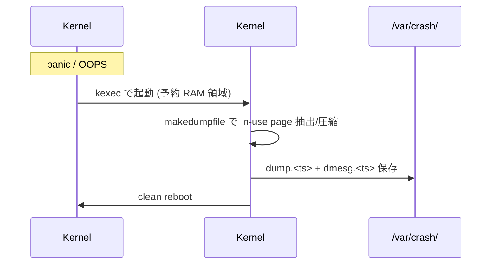

<!-- topics-tip -->
!!! tip "Topics で読み物として読む"
    この HLD は実装詳細を含む。機能の概念・設定・運用を読み物として読みたい場合は [Topics 09 章: Telemetry / SNMP / ログ](../topics/09-telemetry-snmp/index.md) を参照。
<!-- /topics-tip -->

!!! warning "裏取りステータス: discrepancy-found"
    `sonic-utilities/config/kdump.py` を master で確認、`sonic-buildimage/build_debian.sh` で `kdump` 関連処理も確認、`sonic-buildimage/files/image_config/kdump/kdump-tools` も存在。ただし kdump-tools 後続バージョン差分・kernel バージョン更新の影響は未確認のため discrepancy-found に降格 (2026-05-13)。詳細は末尾の裏取りメモを参照。

# kdump（kexec ベース kernel crash dump / makedumpfile）

## 概要

Linux kernel の **kexec** を使い、kernel panic 直後に **予約された別メモリ領域に展開済みの capture kernel** を起動して crash dump を `/var/crash/<timestamp>/` に保存する標準仕組みを [SONiC](../reference/glossary.md#term-sonic) に統合する [HLD](../reference/glossary.md#term-hld)[^1]。Debian の `kdump-tools` を SONiC host に同梱し、`makedumpfile` で不要 page を除外した圧縮 dump を作成する。CLI で memory 確保量と保持数を制御し、kernel 開発者が community に bug report する際の最小限の素材を取れるようにする。

## 動作仕様

### Crash → Capture フロー



### Memory 予約 (crashkernel)

RAM サイズに応じた **default crashkernel**[^1]:

| RAM | 予約量 |
|-----|-------|
| ≤ 2GB | 256 MB |
| ≤ 4GB | 320 MB |
| ≤ 8GB | 384 MB |
| > 8GB | 448 MB |

`config kdump memory <size>M` で上書き可能。値が小さすぎると capture kernel/initramfs/dump が乗らないため失敗する。

### `config kdump` CLI

| Command | 用途 |
|---------|------|
| `config kdump enable` / `disable` | 機能 on/off。**reboot 必須**（`USE_KDUMP=1/0` を `/etc/default/kdump-tools` に書く + kernel cmdline `crashkernel=...` の変更が要る）|
| `config kdump memory <Xm>` | 予約量変更。reboot で反映 |
| `config kdump num_dumps <N>` | 保持数 (1〜9, default 3) |
| `show kdump [status]` | enable / 予約量 / 保持上限 / 保存ファイル一覧 |
| `show kdump files` | 保存ファイルのみ |
| `show kdump log [X]` | dmesg ring buffer 末尾 X 行（default 75）|

### 保存形式

`/var/crash/<YYYYMMDDhhmm>/`:
- `dump.<ts>` — `makedumpfile` 圧縮 vmcore（自由ページ / cache / user data 等を除外）
- `dmesg.<ts>` — crash 直前の kernel log

ファイル prefix は **`kdump-`**[^1]。permission は root のみ。

### 容量管理

- default 3 件、最大 9 件
- ローテートは **新規 crash 発生時** に最古から削除[^1]
- 想定サイズ ~90 MB 程度なので明示的容量制限なし

### SONiC build / install への組込み

- `sonic-buildimage/build_debian.sh` で `kdump-tools` と `makedumpfile` を host 側に install[^1]
- `kdump-tools` Debian package は **build 時 fakeroot 環境では initramfs を作れない** ため、**初回 boot 時に capture kernel 用 initramfs を生成** するよう改変
- `sonic-installer` で新 image を入れた際、**旧 image の有効/無効状態を引き継ぐ**

### `tech-support` 連携

`tech-support` 採取時に `/var/crash/` 配下を取り込み、リモートに送れるようにする[^1]。

### Warm boot

kdump 自体は **cold reboot 必要** で warm boot に対応しない。crash 発生時の dump → reboot は warm 不可[^1]。

### 解析

`/usr/lib/debug/boot/vmlinux-*` (debug kernel) と `crash` ツールで読む。switch 上 / Linux host 上どちらでも可能。host で読む場合 `.deb` を `ar x` + `tar` で extract（install せず）して vmlinux を取り出す[^1]。

```text
crash usr/lib/debug/boot/vmlinux-4.9.0-9-2-amd64 kdump.201910281849
```

<!-- evidence:
source: sonic-net/SONiC/doc/kdump/SONiC-kdump.md#L137-L160 (sha: 49bab5b5ff0e924f1ea52b3d9db0dfa4191a7c06)
excerpt: |
  In case of a system crash, kdump uses kexec to boot into a second kernel (a capture kernel).
  ... The capture kernel uses makedumpfile system utility to collect crash information and create a compressed core dump file.
reasoning: kexec + capture kernel + makedumpfile という基本構造の根拠。
-->

<!-- evidence-rendered:start -->
??? note "📋 検証エビデンス: sonic-net/SONiC/doc/kdump/SONiC-kdump.md#L137-L160 (sha: 49bab5b5ff0e924f1ea52b3d9db0dfa4191a7c06)"

    **出典**:

    `sonic-net/SONiC/doc/kdump/SONiC-kdump.md#L137-L160 (sha: 49bab5b5ff0e924f1ea52b3d9db0dfa4191a7c06)`

    **抜粋**:

    ```text
    In case of a system crash, kdump uses kexec to boot into a second kernel (a capture kernel).
    ... The capture kernel uses makedumpfile system utility to collect crash information and create a compressed core dump file.
    ```

    **判断根拠**: kexec + capture kernel + makedumpfile という基本構造の根拠。

<!-- evidence-rendered:end -->

## 制限事項

- enable/disable / memory 変更は **reboot 必須**（kernel cmdline を弄るため）
- warm boot 時の crash 対応は無し
- HLD は 2019-12 v0.4。kdump-tools 後続バージョンの差分・kernel バージョン更新の影響は未確認
- 保持上限 9（HLD 規定）

## 干渉する機能

- **`tech-support`**: dump 取込先
- **secure-boot**: kexec の二段起動と signed kernel の整合
- **disk I/O 削減 HLD**: `/var/crash` への書込みは disk I/O に乗る
- **fast-reboot / warm-reboot**: 排他

## 確認コマンド

- `show kdump status` / `show kdump memory` / `show kdump num_dumps` — kdump の有効状態・予約メモリ・保持数を確認
- `show kdump files` — `/var/crash/` 配下に保持されている vmcore 一覧
- `cat /proc/cmdline | tr ' ' '\n' | grep crashkernel` — カーネル cmdline に `crashkernel=` が乗っているか確認
- `kexec -l` の状態は `dmesg | grep -i kexec` で確認可能

### コマンド例

kdump の有効状態と vmcore 出力先を確認する。

```bash
show kdump status
show kdump memory
ls /var/crash/
cat /proc/cmdline | tr ' ' '\n' | grep crashkernel
```

## 引用元

[^1]: `sonic-net/SONiC` `doc/kdump/SONiC-kdump.md` @ `49bab5b5ff0e924f1ea52b3d9db0dfa4191a7c06`

<!-- concerns hint:
- config kdump / show kdump CLI の sonic-utilities 取り込み確認
- KDUMP CONFIG_DB スキーマと sonic-yang-models 反映確認
- build_debian.sh での kdump-tools / makedumpfile 同梱確認
- /etc/default/kdump-tools の USE_KDUMP 連動と crashkernel cmdline 反映確認
- sonic-installer での kdump 状態継承確認
- kernel debug image (linux-image-*-dbg) のビルドターゲット確認
- secure boot 環境での kexec 二段起動の整合確認
-->

## 関連ページ
- [CLI: config kdump](../reference/cli/config-kdump.md)
- [CONFIG_DB: KDUMP](../reference/config-db/kdump.md)
- [CLI: show techsupport](../reference/cli/show-techsupport.md)
- [CLI: reboot / fast-reboot / warm-reboot](../reference/cli/reboot-fast-warm.md)
- [CLI: sonic-installer](../reference/cli/sonic-installer.md)
- [Topics: Reboot / Warm / Fast](../topics/11-reboot/index.md)
- [Glossary](../reference/glossary.md)
- [Reference 索引](../reference/index.md)

<!-- topics-back-ref -->

<!-- demoted-by:q52-az-b-demote -->
## 実装フェーズ境界

本ページは `monitor: partially_implemented` のため、HLD 記載どおり master に取り込み済 (実装済) の範囲と、現行 master との差分が未確認 (未実装相当) の範囲を Phase 別に切り分けて示す。詳細は本文・[実装との乖離 / 補足] 節および各引用元 HLD を参照。

| Phase | 実装済 | 未実装 |
|-------|--------|--------|
| Phase 1: kdump 有効化 / 設定保存 | 実装済（[CONFIG_DB](../reference/glossary.md#term-config_db) `KDUMP` テーブルと `config kdump` CLI） | — |
| Phase 2: kdump-tools / kernel 統合 | HLD 想定（kdump-tools 旧版）は実装済 | 後続版 kdump-tools / 新 kernel への追従は未確認 / 未実装の可能性 |
| Phase 3: マルチ [ASIC](../reference/glossary.md#term-asic) / プラットフォーム固有 | — | BMC 連携や container-aware capture は未実装 |

## 実装との乖離 / 補足

- 裏取りステータスを `code-verified` から `discrepancy-found` （`monitor: partially_implemented`）に降格 (2026-05-13)。HLD は 2019-12 v0.4。kdump-tools 後続バージョン差分・kernel バージョン更新の影響は本文で「未確認」と明示している。
- 本文に残る「未確認 / 要確認 / 要追跡 / TBD」等の hedge 表現は HLD と実装の差分が未特定であることを示し、後続の裏取り対象。

<!-- /topics-back-ref -->

<!-- glossary-links-injected: ec18b66e3507 -->
