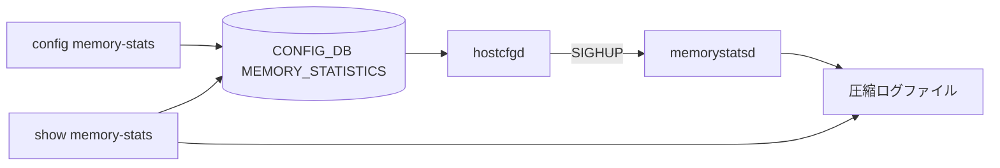

<!-- topics-tip -->
!!! tip "Topics で読み物として読む"
    この HLD は実装詳細を含みます。機能の概念・設定・運用を読み物として読みたい場合は [Topics 09 章: Telemetry / SNMP / ログ](../topics/09-telemetry-snmp/index.md) を参照。
<!-- /topics-tip -->

!!! success "裏取りステータス: code-verified（基本構成のみ）"
    現行 master の `sonic-host-services/scripts/hostcfgd:1848` に `MemoryStatisticsCfg` クラスがあり MEMORY_STATISTICS テーブル監視と SIGHUP 連携が実装。`sonic-utilities/config/memory_statistics.py` と `show/memory_statistics.py` で CLI が整備、`sonic-yang-models` の `sonic-memory-statistics.yang` も存在。memorystatsd デーモン名そのものは別ファイル名で実装されている可能性あり（verified at: 2026-05-09）。

# メモリ統計収集（memorystatsd と MEMORY_STATISTICS テーブル）

## 概要

OS レベルの **メモリ使用量（total / used / free / available / cached / shared / buffers）** を [SONiC](../reference/glossary.md#term-sonic) ネイティブで定期サンプリングし、CLI から履歴クエリできるようにする機能。サードパーティ監視ツールへの依存を減らす目的[^1]。

新規デーモン `memorystatsd` がデータを収集し、圧縮ログとして保持する。`hostcfgd` が [CONFIG_DB](../reference/glossary.md#term-config_db) の設定変化を監視して SIGHUP で再ロードする。**デフォルトは無効**（リソース節約のため）[^1]。

## 動作仕様

### 構成要素



- **memorystatsd**: psutil でメモリ統計を取り、ログに書く。`SIGHUP` で設定再読込、`SIGTERM` で graceful shutdown。
- **[hostcfgd](../reference/glossary.md#term-hostcfgd)**: CONFIG_DB の `MEMORY_STATISTICS` テーブル変更を購読し、デーモンに `SIGHUP` を送る。
- **再起動時の挙動**: クラッシュや再起動時は **設定ファイルの default に戻る**。runtime に CONFIG_DB から反映された値は永続化されない（次回起動では再度 hostcfgd が同期する）[^1]。

### サンプリングと保持

| Parameter | Default | Range |
|-----------|---------|-------|
| `enabled` | `false` | bool |
| `sampling_interval` (分) | 5 | 3–15 |
| `retention_period` (日) | 15 | 1–30 |

データ収集は disable 時にも常時動くわけではない。enable された期間のみ収集され、retention_period を超えたデータはローテートされる。

### CLI 出力例

```text
admin@sonic:~$ show memory-stats
Memory Statistics:
Codes: M - minutes, H - hours, D - days
Report Generated:    2024-12-04 15:49:52
Analysis Period:     From 2024-11-19 15:49:52 to 2024-12-04 15:49:52
Interval:            2 Days

Metric             Current    High       Low      ...
total_memory       15.29GB    15.29GB    15.29GB  ...
used_memory        8.87GB     9.35GB     8.15GB   ...
free_memory        943.92MB   906.28MB   500.00MB ...
available_memory   4.78GB     4.74GB     4.35GB   ...
```

`--from` / `--to` で期間指定、`--select` で特定メトリクスのみ表示できる[^1]。

## 設定

### 関連する CONFIG_DB

```text
MEMORY_STATISTICS|memory_statistics
    enabled            = "true" | "false"   ; default false
    sampling_interval  = 3..15  (分)         ; default 5
    retention_period   = 1..30  (日)         ; default 15
```

### 関連する CLI

| Command | 用途 |
|---------|------|
| `config memory-stats enable` / `disable`             | 機能の ON/OFF |
| `config memory-stats sampling-interval <minutes>`    | サンプリング間隔 |
| `config memory-stats retention-period <days>`        | 保持期間 |
| `show memory-stats [--from ... --to ... --select ...]` | 統計表示 |
| `show memory-stats config`                           | 現在の設定表示 |

### 関連する YANG

`sonic-memory-statistics` モジュールが新規追加される。`enabled` (boolean) / `sampling_interval` (uint8 range 3..15, units minutes) / `retention_period` (uint8 range 1..30, units days)[^1]。

### 設定例

```bash
sudo config memory-stats enable
sudo config memory-stats sampling-interval 3
sudo config memory-stats retention-period 30
show memory-stats config
```

## 制限事項

- `memorystatsd` は再起動時に必ず default 設定に戻り、その後 hostcfgd 経由で CONFIG_DB の値を SIGHUP で適用する設計。`enabled` が CONFIG_DB で `true` でも、デーモン起動直後は無効状態を経由する。
- メモリメトリクスは **OS レベルの全体値** のみで、個別プロセス・コンテナ単位の統計は対象外（Future Work で言及）[^1]。
- アラート / 閾値通知は [HLD](../reference/glossary.md#term-hld) では Future Work として明記。

## 干渉する機能

- **hostcfgd**: 既存のホスト設定デーモンに `MEMORY_STATISTICS` テーブル監視と SIGHUP 送信ロジックが追加される。他テーブルへの影響は無い。
- **`show techsupport`**: ログファイルがディスク上にあるため、tech-support 取得時に圧縮ログが含まれるはず（HLD には明記なし）。
- **Warm/Fast boot**: 影響なし（HLD で明記）[^1]。

## トラブルシューティング

- `show memory-stats` が空 → `config memory-stats enable` で有効化されているかと、デーモンが動いているかを `systemctl status memorystatsd` で確認。
- 設定変更が反映されない → `hostcfgd` のログで SIGHUP 送信が走っているか確認。
- データが断片化している → `retention_period` を超えた古いデータがローテートで消えている可能性。


### コマンド例

メモリ統計デーモンの動作を確認する。

```bash
show memory-stats
show memory-stats config
redis-cli -n 6 keys 'MEMORY_STATISTICS|*'
docker ps | grep -i memory-stats
```

## 引用元

[^1]: `sonic-net/SONiC` `doc/memory_statistics/memory_statistics_hld.md` @ `49bab5b5ff0e924f1ea52b3d9db0dfa4191a7c06`

<!-- topics-back-ref -->
## 関連 Topics

- [Topics: Telemetry / SNMP / Observability](../topics/09-telemetry-snmp/index.md)

<!-- /topics-back-ref -->

<!-- glossary-links-injected: 8ba32e5aa69d -->
