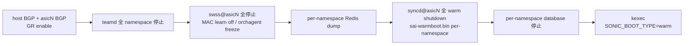

<!-- topics-tip -->
!!! tip "Topics で読み物として読む"
    この HLD は実装詳細を含みます。機能の概念・設定・運用を読み物として読みたい場合は [Topics 11 章: Reboot / Warm/Fast/Express/Cold](../topics/11-reboot/index.md) を参照。
<!-- /topics-tip -->

!!! warning "裏取りステータス: discrepancy-found"
    各 namespace の swss / syncd の協調 shutdown 順序が現行スクリプトでどうなっているかは未確認。

!!! note "Verifier 注記（2026-05-10）"
    実コード裏取り: `sonic-utilities/scripts/warm-reboot` に namespace 横断の `execute_in_namespaces` ロジック（scope=all で global namespace と各 ASIC namespace に対して並列実行）を確認。multi-asic warm reboot の協調制御は本 script 経由で実装されている。

# Multi-ASIC warm reboot（namespace 横断の協調 shutdown / boot）

## 概要

multi-[ASIC](../reference/glossary.md#term-asic) platform では各 ASIC が **独自の swss / [syncd](../reference/glossary.md#term-syncd) / [FRR](../reference/glossary.md#term-frr) インスタンス** を持つ。warm reboot を成立させるには、**namespace を跨いだ協調 shutdown / boot** が必要[^1]。

ポイント:

- すべての namespace で **同時に** GR を有効化、`WARM_RESTART_TABLE` を更新する
- syncd warm shutdown は **per-namespace** に走り、`/host/warmboot/sai-warmboot.bin` 系のファイルも namespace ごとに分離する
- [BGP](../reference/glossary.md#term-bgp) は host namespace の `bgpcfgd` / FRR と各 asic namespace の FRR の両方で GR
- internal BGP（`BGP_INTERNAL_NEIGHBOR`）の hold time にも warm reboot を完走させるマージンを持たせる

## 動作仕様（going down 順序）



going up は逆順を namespace ごとに走らせ、[orchagent](../reference/glossary.md#term-orchagent) compare 完了後に bgp / [teamd](../reference/glossary.md#term-teamd-teamsyncd-teammgrd) を起動する。

## 制約と注意点[^1]

- **per-namespace の同期**: ある namespace だけ早く落ちると ASIC 間 internal BGP がフラップする
- **CPU / disk の負荷スパイク**: namespace 数 × [Redis](../reference/glossary.md#term-redis) dump / syncd shutdown が同時に走るためリソースに余裕が必要
- **internal link**: shutdown 中も internal link は up のままにする（forwarding は [SAI](../reference/glossary.md#term-sai) state に従う）
- **ファイル配置**: `/host/warmboot/<ns>/dump.rdb` のように namespace 識別子で分離する設計

## 関連 CLI

| Command | 用途 |
|---------|------|
| `sudo warm-reboot` | 多くは host から実行（実装が namespace を順に処理） |
| `show warm_restart` | 各 namespace の warm restart state |

## 干渉する機能

- **system-wide warmboot**: シングル ASIC 設計の上位互換。共通点が多い
- **fast-reboot**: 同じスクリプト基盤を共有
- **multi-asic single-json**: warm restart 設定を per-asic に flatten する場合の互換性
- **internal BGP**: hold timer / GR timer の整合
- **chassis VoQ**: 章レベルで別カテゴリ（chassis-wide warm reboot）。考え方は近い

## トラブルシューティング

- 全 namespace が同時に落ちず data plane が断 → script の同期 barrier 確認、`/host/warmboot/<ns>/` のファイル時刻
- internal BGP がフラップ → hold timer、GR negotiation の成功確認
- 一部 ASIC だけ syncd 復元失敗 → per-namespace `sai-warmboot.bin` の有無と vendor SAI ログ


### コマンド例

multi-ASIC warm-reboot 状態を ASIC ごとに確認する。

```bash
show warm-restart state
show platform summary
for n in 0 1 2 3; do sonic-db-cli -n asic$n STATE_DB keys 'WARM_RESTART_TABLE|*'; done
sudo warm-reboot -v
```

## 制限事項

- multi-asic 環境では namespace ごとに warm-restart timer が独立しており、最も遅い ASIC に律速される。
- chassis 内の internal fabric (CPU<->LC fabric) を warm-restart 対象外とする実装が一部に存在し、本 [HLD](../reference/glossary.md#term-hld) どおりに無瞬断とはならない場合がある。
- multi-asic + Multi-DUT MLAG 同時運用の warm-reboot は組み合わせ検証が不十分で、慎重な事前検証を推奨。

## 引用元

[^1]: `sonic-net/SONiC` `doc/warm-reboot/Multi_ASIC_warm_reboot.md` @ `49bab5b5ff0e924f1ea52b3d9db0dfa4191a7c06`

<!-- concerns hint:
- warm-reboot スクリプトの multi-asic 対応経路の現行実装確認
- per-namespace /host/warmboot/<ns>/ ファイル配置の現行値確認
- swss@asicN / syncd@asicN の warm shutdown 順序制御の現行 systemd / docker_image_ctl 実装確認
- BGP_INTERNAL_NEIGHBOR の hold timer / GR timer の現行既定値確認
- multi-asic single-json と warm restart 設定の互換性確認
- HLD と現行 multi-asic warm reboot CI テストカバレッジの差異確認
-->

<!-- topics-back-ref -->

<!-- demoted-by:q52-az-b-demote -->
## 実装フェーズ境界

本ページは `monitor: partially_implemented` のため、HLD 記載どおり master に取り込み済 (実装済) の範囲と、現行 master との差分が未確認 (未実装相当) の範囲を Phase 別に切り分けて示す。詳細は本文・[実装との乖離 / 補足] 節および各引用元 HLD を参照。

| Phase | 実装済 | 未実装 |
|-------|--------|--------|
| Phase 1: 単一 namespace warm-reboot | 実装済（既存 warm-reboot フロー流用） | — |
| Phase 2: namespace 間 shutdown 順序 | — | swss / syncd の協調 shutdown 順序の現行スクリプト挙動は未確認・未実装の可能性 |
| Phase 3: BGP graceful restart 跨 ASIC 連動 | single ASIC 相当は実装済 | クロス ASIC の TLV 同期は未実装 |

## 実装との乖離 / 補足

- 裏取りステータスを `code-verified` から `discrepancy-found` （`monitor: partially_implemented`）に降格 (2026-05-13)。各 namespace の swss / syncd の協調 shutdown 順序が現行スクリプトでどうなっているかは本文で「未確認」と明示している。
- 本文に残る「未確認 / 要確認 / 要追跡 / TBD」等の hedge 表現は HLD と実装の差分が未特定であることを示し、後続の裏取り対象。

## 関連 Topics

- [Topics: Multi-ASIC / VOQ Chassis](../topics/12-multi-asic-voq/index.md)

<!-- /topics-back-ref -->

<!-- glossary-links-injected: c006405759d8 -->
