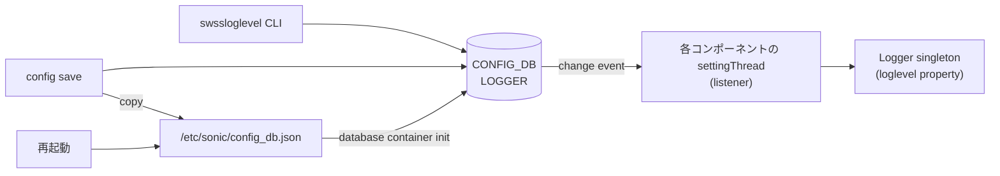

<!-- topics-tip -->
!!! tip "Topics で読み物として読む"
    この HLD は実装詳細を含みます。機能の概念・設定・運用を読み物として読みたい場合は [Topics 09 章: Telemetry / SNMP / ログ](../topics/09-telemetry-snmp/index.md) を参照。
<!-- /topics-tip -->

!!! success "裏取りステータス: code-verified（Phase 1 / 2 移行完了）"
    `sonic-swss-common/common/logger.cpp` L126-127 / L195-198 で `DBConnector("CONFIG_DB", 0)` + `Table(&db, CFG_LOGGER_TABLE_NAME)` および `SubscriberStateTable(CFG_LOGGER_TABLE_NAME)` 経由の購読を確認（LOGLEVEL_DB から完全に CONFIG_DB.LOGGER に移行済み）。`sonic-swss-common/common/loglevel.cpp` L31/L37/L99 で `swssloglevel -d`（全コンポーネントを default に戻す）オプションの実装を確認。`sonic-utilities/scripts/db_migrator.py` L94/L1207-1226 で旧 `LOGLEVEL_DB` → `CONFIG_DB.LOGGER` 変換と旧キー削除を確認 (verified at: 2026-05-09)。

# ログレベルの永続化（LOGLEVEL_DB → CONFIG_DB.LOGGER への移行）

## 概要

[SONiC](../reference/glossary.md#term-sonic) では `swssloglevel` コマンドで `orchagent` / `syncd` / 各種 `*mgrd` / `*syncd` / [SAI](../reference/glossary.md#term-sai) API ごとに動的にログ深さを変えられる。しかし設定先が **[LOGLEVEL_DB](../reference/glossary.md#term-loglevel_db) (#3)** に置かれていたため、cold / fast reboot で揮発してしまい、再起動後は既定値 `NOTICE` に戻ってしまっていた[^1]。デバッグ目的で `DEBUG` を出していても、再起動を挟むと忘れられる運用上の不便があった。

本機能はログレベルテーブルを **[CONFIG_DB](../reference/glossary.md#term-config_db) (#4) の `LOGGER` テーブル** に移し、`config save` の対象に含めることで永続化する。Phase は 2 段で、Phase 1 は移行のみ、Phase 2 で LOGLEVEL_DB と `JINJA2_CACHE` を完全削除する設計である[^1]。

## 動作仕様

### スキーマ移行

旧 LOGLEVEL_DB (#3) のキーは `<component>:<component>` 形式（例: `orchagent:orchagent`）だった[^1]。

```text
LOGLEVEL_DB (旧)
 orchagent:orchagent
   LOGLEVEL  = INFO
   LOGOUTPUT = SYSLOG
 SAI_API_BUFFER:SAI_API_BUFFER
   LOGLEVEL  = SAI_LOG_LEVEL_NOTICE
   LOGOUTPUT = SYSLOG
 JINJA2_CACHE:...   ← 旧 warm-reboot 高速化用キャッシュ
```

新スキーマは CONFIG_DB の `LOGGER` テーブルにフラット化する。キーは **コンポーネント名のみ**（`Logger:<componentName>` から最終的にコンポーネント名のみへ）[^1]。

```json
{
  "LOGGER": {
    "orchagent":      { "LOGLEVEL": "INFO",                  "LOGOUTPUT": "SYSLOG" },
    "SAI_API_BUFFER": { "LOGLEVEL": "SAI_LOG_LEVEL_NOTICE",  "LOGOUTPUT": "SYSLOG" }
  }
}
```

`LOGOUTPUT` の値（`SYSLOG` / `STDOUT` / `STDERR`）も合わせて永続化される。

### 全体フロー



各 SONiC コンポーネントは **Logger シングルトン + listener スレッド (`settingThread`)** を持っており、購読対象 DB の変更を検知して loglevel プロパティを更新する。本機能はこの `settingThread` の購読先を LOGLEVEL_DB から CONFIG_DB に切り替える[^1]。

影響を受けるコンポーネント[^1]: `buffermgrd`, `coppmgrd`, `fdbsyncd`, `fpmsyncd`, `gearsyncd`, `intfmgrd`, `portsyncd`, `syncd`, `teammgrd`, `teamsyncd`, `tlm_teamd`, `tunnelmgrd`, `vlanmgrd`, `vrfmgrd`, `vxlanmgrd`, `wjhd`, `nbrmgrd`, `neighsyncd`, `orchagent`, `portmgrd`。

### `swssloglevel` の変更

スクリプト本体は `sonic-swss-common/common/loglevel.cpp` 由来で、書き込み先を CONFIG_DB に変更する。さらに **既定値に戻す `-d` オプション** を新設し、全コンポーネントを既定値（`SWSS NOTICE`、`SAI_LOG_LEVEL_NOTICE`）にリセットできるようにする[^1]。

```text
swssloglevel -l NOTICE -c orchagent       # orchagent を NOTICE に
swssloglevel -l SAI_LOG_LEVEL_DEBUG -s -a # 全 SAI_API_* を DEBUG に
swssloglevel -d                           # 全コンポーネント既定値に戻す（新規）
```

### 永続化と reboot

| 操作 | 永続化要件 | reboot 後の挙動 |
|------|-----------|----------------|
| ログレベル変更のみ | 不要 | cold/fast 後は既定値、warm 後は維持（CONFIG_DB は flush しない）|
| ログレベル変更 + `config save` | 必要 | cold/fast/warm すべてで設定維持 |

### Warm upgrade の移行ロジック

旧バージョンから warm upgrade する場合、起動直後は LOGLEVEL_DB (#3) にデータが残っている可能性がある。[HLD](../reference/glossary.md#term-hld) は **`db_migrator` を拡張** して以下を行うと明記する[^1]。

1. `db_migrator` に LOGLEVEL_DB コネクタを追加。
2. LOGLEVEL_DB の Logger テーブルを CONFIG_DB に移し（キー名を変換）、LOGLEVEL_DB を消す。
3. `swss-common/sonicv2-connector.h` から `del` を公開して上記消去を可能にする。

ダウングレード（新→旧）はシナリオが入り組み、HLD は **完全サポートしない** と明記する[^1]。新版で `config save` 済みのテーブルは旧バージョンでは未知のため、再 upgrade 時に「LOGLEVEL_DB 側の Logger テーブルが CONFIG_DB の未使用テーブルを上書きする」非対称が発生し得る。

### Phase 2: LOGLEVEL_DB の完全削除

LOGLEVEL_DB に残るのは `JINJA2_CACHE` のみとなる。これは jinja2 テンプレートのバイトコードキャッシュで、warm-reboot 高速化目的で導入された経緯があるが、その後の最適化により **効果が無くなった** ため Phase 2 で削除する[^1]。

- `schema.h` から `LOGLEVEL_DB` を削除。
- `sonic-config-engine/build/lib/redis_bcc.py` を削除。
- 約 50 ファイルの「全 DB リスト」から LOGLEVEL_DB を除く。
- `fdbsyncd.cpp` で残っていた未使用 LOGLEVEL_DB connector を撤去。

```text
旧 DB ID 番号
 0 APPL_DB
 1 ASIC_DB
 2 COUNTERS_DB
 3 LOGLEVEL_DB     ← Phase 2 で削除
 4 CONFIG_DB
 ...
```

<!-- evidence:
source: sonic-net/SONiC/doc/logging/persistent_logger/persistent_loglevel.md#L246-L298 (sha: 49bab5b5ff0e924f1ea52b3d9db0dfa4191a7c06)
excerpt: |
  After moving the Logger's table from LOGLEVEL DB, the leftover in LOGLEVEL DB will be the JINJA2_CACHE key.
  ... we recommend removing the jinja2 cache and the LOGLEVEL DB.
  - Removing /sonic-config-engine/build/lib/redis_bcc.py file.
reasoning: Phase 2 で LOGLEVEL_DB と jinja2 キャッシュを完全削除する設計の根拠。
-->

<!-- evidence-rendered:start -->
??? note "📋 検証エビデンス: sonic-net/SONiC/doc/logging/persistent_logger/persistent_loglevel.md#L246-L298 (sha: 49bab5b5ff0e924f1ea52b3d9db0dfa4191a7c06)"

    **出典**:

    `sonic-net/SONiC/doc/logging/persistent_logger/persistent_loglevel.md#L246-L298 (sha: 49bab5b5ff0e924f1ea52b3d9db0dfa4191a7c06)`

    **抜粋**:

    ```text
    After moving the Logger's table from LOGLEVEL DB, the leftover in LOGLEVEL DB will be the JINJA2_CACHE key.
    ... we recommend removing the jinja2 cache and the LOGLEVEL DB.
    - Removing /sonic-config-engine/build/lib/redis_bcc.py file.
    ```

    **判断根拠**: Phase 2 で LOGLEVEL_DB と jinja2 キャッシュを完全削除する設計の根拠。

<!-- evidence-rendered:end -->

### 起動時の挙動

`database` コンテナ初期化中に `config_db.json` が CONFIG_DB に読み込まれる。**`rsyslog-config` は database コンテナ起動後** に立ち上がるため、これより前にログメッセージが出ることは想定していない（出た場合は既定 loglevel）と HLD は明言している[^1]。

## 設定

### 関連する CONFIG_DB

| Table | Key | フィールド | 説明 |
|-------|-----|-----------|------|
| `LOGGER` | `<componentName>` | `LOGLEVEL` | SWSS or SAI のログレベル列挙値 |
| | | `LOGOUTPUT` | `SYSLOG` / `STDOUT` / `STDERR` |

`<componentName>` の例: `orchagent`, `syncd`, `buffermgrd`, `vxlanmgrd`, `SAI_API_BUFFER` 等。

### 関連する CLI

| Command | 用途 |
|---------|------|
| `swssloglevel -l <level> -c <component>` | コンポーネント単体の設定 |
| `swssloglevel -l <level> -a` | 全コンポーネントに一括適用 |
| `swssloglevel -l <level> -s -c <api>` | `SAI_API_<api>` への適用 |
| `swssloglevel -d` | 全コンポーネントを既定値に戻す（新規） |
| `swssloglevel -p` | DB に登録されているコンポーネント一覧 |
| `config save` | 現在の CONFIG_DB を `config_db.json` に書き出す。本機能の永続化に必須 |

### 関連する YANG

`sonic-logger.yang` モジュールに `LOGGER` テーブルを定義[^1]。

```yang
typedef swss_loglevel { type enumeration { enum EMERG; enum ALERT; enum CRIT; enum ERROR; enum WARN; enum NOTICE; enum INFO; enum DEBUG; } }
typedef sai_loglevel  { type enumeration { enum SAI_LOG_LEVEL_CRITICAL; enum SAI_LOG_LEVEL_ERROR; enum SAI_LOG_LEVEL_WARN; enum SAI_LOG_LEVEL_NOTICE; enum SAI_LOG_LEVEL_INFO; enum SAI_LOG_LEVEL_DEBUG; } }

container LOGGER {
    list LOGGER_LIST {
        key "name";
        leaf LOGLEVEL  { mandatory true; type union { type swss_loglevel; type sai_loglevel; } }
        leaf LOGOUTPUT { type enumeration { enum SYSLOG; enum STDOUT; enum STDERR; } default SYSLOG; }
    }
}
```

### 設定例

```bash
# orchagent を DEBUG にして恒久化
swssloglevel -l DEBUG -c orchagent
config save

# 何もかも DEBUG にして調査
swssloglevel -l DEBUG -a
swssloglevel -l SAI_LOG_LEVEL_DEBUG -s -a

# 既定値に戻す
swssloglevel -d
```

## 干渉する機能

- **`config save`**: 永続化はこの CLI に完全依存。設定だけして save しないと cold/fast 後にロスト。
- **warm reboot**: CONFIG_DB を flush しないため、save 不要で維持される（旧仕様も同様）。
- **`db_migrator`**: warm upgrade 経路で LOGLEVEL_DB の値を CONFIG_DB に移す変換が走る。これが入っていない古い `db_migrator` だと旧設定が失われる。
- **ダウングレード**: HLD で完全サポート外と明記。新→旧 移行は loglevel が既定にリセットされる前提。
- **`JINJA2_CACHE` 削除（Phase 2）**: warm-reboot 性能への影響が無いことが事前計測で確認されているが、特殊な構成では再計測が必要。

## トラブルシューティング

- ログレベルを変えたのに反映されない: 該当コンポーネントの `settingThread` が CONFIG_DB を購読する新版になっているか syslog で確認。古いバイナリだと LOGLEVEL_DB のままを見ている可能性。
- 再起動後にロスト: `config save` 漏れ。`/etc/sonic/config_db.json` の `LOGGER` セクションを確認する。
- warm upgrade 後にロスト: `db_migrator` が走っているか、`swss-common` のバージョンに `del` がエクスポートされているか確認。
- `swssloglevel -p` の出力に出てこないコンポーネント: そのコンポーネントが Logger シングルトン経由でない、または listener thread が未対応。HLD 列挙コンポーネント以外は本機能の対象外。

### コマンド例

logger ごとの永続化された log level を確認する。

```bash
swssloglevel -l SAI_LOG_LEVEL_INFO -c orchagent
swssloglevel -d
redis-cli -n 4 keys 'LOGGER|*'
grep -iE 'log[_ ]level' /var/log/syslog | tail
```

## 参考リンク

- [CLI: config syslog](../reference/cli/config-syslog.md)
- [YANG: sonic-syslog](../reference/yang/sonic-syslog.md)
- [CONFIG_DB: SYSLOG_CONFIG](../reference/config-db/syslog-config.md)
- [HLD: sonic-python-logger-enhancement](sonic-python-logger-enhancement.md)

## 制限事項

- 設定は CONFIG_DB の `LOGGER` テーブルに保存されるが、`config save` を実行しないとリブート後に消える。
- ベンダー追加デーモンが `sonic_py_common.logger` を使っていない場合、本機能で log level を変更できない。
- multi-asic 環境では namespace ごとに別 `LOGGER` テーブルとなるため、全 [ASIC](../reference/glossary.md#term-asic) 一括変更には個別投入が必要。

## 引用元

[^1]: `sonic-net/SONiC` `doc/logging/persistent_logger/persistent_loglevel.md` @ `49bab5b5ff0e924f1ea52b3d9db0dfa4191a7c06`

## 関連ページ

本ページに関連する参照ドキュメント:

- [system カテゴリ目次](index.md)
- [用語集 (Glossary)](../reference/glossary.md)

<!-- augmented-links: v1 -->

<!-- glossary-links-injected: ec18b66e3507 -->
