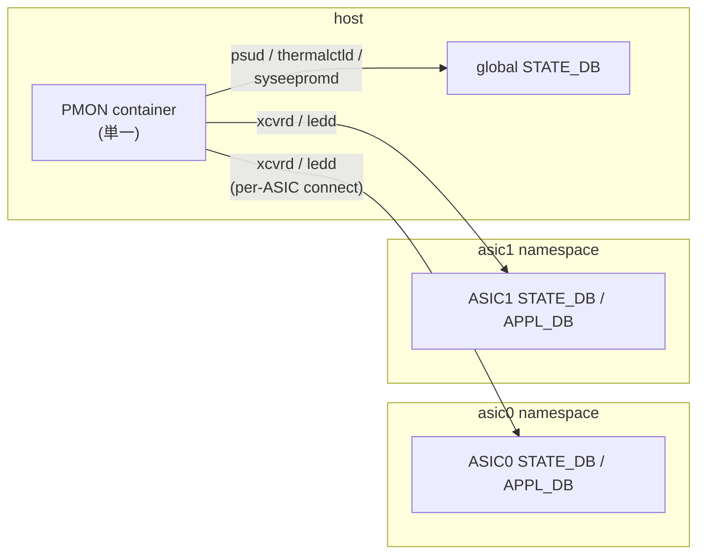

<!-- topics-tip -->
!!! tip "Topics で読み物として読む"
    この HLD は実装詳細を含みます。機能の概念・設定・運用を読み物として読みたい場合は [Topics 12 章: Multi-ASIC / VoQ / Chassis](../topics/12-multi-asic-voq/index.md) を参照。
<!-- /topics-tip -->

!!! success "裏取りステータス: code-verified"
    実装裏取り済み（下記コード位置）。namespace 引数: sonic-platform-daemons/sonic-thermalctld/scripts/thermalctld:1285 (DaemonBase) + sonic-xcvrd/xcvrd/xcvrd_utilities/port_event_helper.py:52-86 (namespaces 引数 + daemon_base.db_connect(namespace=ns)) で確認。

# PMON の Multi-ASIC 対応（global DB と per-ASIC namespace の役割分担）

## 概要

[Multi-ASIC](../reference/glossary.md#term-multi-asic) [SONiC](../reference/glossary.md#term-sonic) では、システム共通の DB が **host 上の "global database" container** に居て、[ASIC](../reference/glossary.md#term-asic) 毎の DB は **各 ASIC namespace 内の database container** に居る。PMON の各 daemon は元々シングル ASIC 想定で書かれているため、**どの table をどちらの DB に書くか** を切り分ける必要がある。本 [HLD](../reference/glossary.md#term-hld) はその切り分け方針を定める[^1]。

PMON 自体は **host 上に 1 個** のまま。daemon を namespace 別に複製するのではなく、**daemon 内部で namespace を選び分ける** 設計を取る[^1]。

## 動作仕様

### Table の置き場（global vs ASIC namespace）

| Table | 置き場 | 担当 daemon | 根拠 |
|-------|--------|-------------|------|
| `PSU_INFO`, `CHASSIS_INFO` | **global [STATE_DB](../reference/glossary.md#term-state_db)**（host）| psud | system-wide HW で ASIC 非依存 |
| `EEPROM_INFO` | **global STATE_DB** | syseepromd | 同上 |
| `FAN_INFO`, `TEMPERATURE_INFO` | **global STATE_DB** | thermalctld | 同上 |
| `TRANSCEIVER_INFO`, `TRANSCEIVER_DOM_SENSOR`, `TRANSCEIVER_STATUS` | **per-ASIC STATE_DB**（各 namespace）| xcvrd | port は ASIC 配下 |
| [APPL_DB](../reference/glossary.md#term-appl_db) の `PORT_TABLE`（LED 連動用） | **per-ASIC APPL_DB** | ledd, xcvrd | 同上 |

判定基準[^1]:

- **system-wide** な platform 情報 → host の global DB
- **port / interface** に紐づく情報 → ASIC namespace の DB

### Front-end / back-end ASIC の扱い

Multi-ASIC chassis（[VOQ](../reference/glossary.md#term-voq) や fixed multi-[NPU](../reference/glossary.md#term-npu)）では[^1]:

- **front-end ASIC**: front panel port を持つ
- **back-end ASIC**: ASIC 同士をつなぐ backplane

PMON は **front panel port にしか興味が無い** ので、namespace のうち **front-end ASIC のものだけ** を対象とする。`get_namespaces_for_front_end_asics()` 相当の API が要る。

### `port_config.ini` と `interface → asic_id` マップ

multi-ASIC では `port_config.ini` が **ASIC 単位** で別ディレクトリに置かれる[^1]:

```text
device/<platform>/<hwsku>/<asic_index>/port_config.ini
```

PMON はすべての ASIC の `port_config.ini` を **マージして 1 つの port list** を作りつつ、副産物として `interface_name → asic_id` の mapping を作る。これにより `Ethernet32` のような名前から、対応する DB instance を引ける。

### `DaemonBase` の拡張

各 PMON daemon の基底クラスに以下を追加[^1]:

- `db_connect(db_name, namespace=None)`: namespace 指定で per-ASIC DB に繋ぐ
- `is_multi_asic_platform()`
- `get_num_asics()`
- `get_namespaces_for_frontend_asics()`

### Daemon 別の影響



要点[^1]:

- **psud / syseepromd / thermalctld** は **変更不要**（global DB のまま）
- **ledd** は per-ASIC APPL_DB の `PORT_TABLE` を subscribe するため namespace 横断のサブスクライブ機構が必要
- **xcvrd** は per-ASIC STATE_DB と APPL_DB を更新

<!-- evidence:
source: sonic-net/SONiC/doc/pmon/pmon_multiasic_design.md#L19-L29 (sha: 49bab5b5ff0e924f1ea52b3d9db0dfa4191a7c06)
excerpt: |
  - The interface related platform tables like TRANSCEIVER_INFO, TRANSCEIVER_STATUS etc. will be stored in the STATE_DB instance of Asic database (the database docker running in asic network namespace)
  - The system wide platform tables like PSU_INFO, FAN_INFO, EEPROM_INFO etc. will be kept in the STATE_DB instance of Global database
  - In multi-asic platform there are port_config.ini files per ASIC. They will be present in the directories named with the asic_index under the device/platform/hwsku directory.
reasoning: table の global / per-ASIC 振り分けと port_config.ini の ASIC ごとディレクトリ構成の根拠。
-->

<!-- evidence-rendered:start -->
??? note "📋 検証エビデンス: sonic-net/SONiC/doc/pmon/pmon_multiasic_design.md#L19-L29 (sha: 49bab5b5ff0e924f1ea52b3d9db0dfa4191a7c06)"

    **出典**:

    `sonic-net/SONiC/doc/pmon/pmon_multiasic_design.md#L19-L29 (sha: 49bab5b5ff0e924f1ea52b3d9db0dfa4191a7c06)`

    **抜粋**:

    ```text
    - The interface related platform tables like TRANSCEIVER_INFO, TRANSCEIVER_STATUS etc. will be stored in the STATE_DB instance of Asic database (the database docker running in asic network namespace)
    - The system wide platform tables like PSU_INFO, FAN_INFO, EEPROM_INFO etc. will be kept in the STATE_DB instance of Global database
    - In multi-asic platform there are port_config.ini files per ASIC. They will be present in the directories named with the asic_index under the device/platform/hwsku directory.
    ```

    **判断根拠**: table の global / per-ASIC 振り分けと port_config.ini の ASIC ごとディレクトリ構成の根拠。

<!-- evidence-rendered:end -->

### Mellanox 例外

Mellanox プラットフォームでは transceiver plug in/out イベントが **mlnx SDK 経由 [syncd](../reference/glossary.md#term-syncd) 内** で出る。multi-ASIC では **syncd は per-namespace** になるので、xcvrd の plugin が namespace 別に SDK と通信する形に変える必要がある[^1]。

## 設定

### 関連する CONFIG_DB

該当なし。本 HLD は SONiC 内部の DB アクセス整理であり、ユーザ設定はない。

### 関連する CLI

該当なし。

### 設定例

```bash
# global STATE_DB は host から
redis-cli -n 6 KEYS "PSU_INFO|*"

# per-ASIC STATE_DB
sudo ip netns exec asic0 redis-cli -n 6 KEYS "TRANSCEIVER_INFO|*"
sudo ip netns exec asic1 redis-cli -n 6 KEYS "TRANSCEIVER_INFO|*"
```

## 制限事項

- **PMON は host に 1 個のみ**[^1]。daemon ごとのスケーリングを期待してはいけない
- back-end ASIC の port は **PMON の対象外**[^1]
- ベンダ（特に Mellanox）の plugin が syncd-per-namespace 構成に追従していないと transceiver イベントが落ちる
- HLD は revision 情報なし。改訂履歴は不明

## 干渉する機能

- **multi-ASIC HLD**: container 配置の前提
- **[port_config.ini](../reference/glossary.md#term-port-config-ini) / hwsku ディレクトリ構成**: per-ASIC 配置に従って解釈する必要
- **Entity MIB**: psud / thermalctld / xcvrd 由来データを [SNMP](../reference/glossary.md#term-snmp) に出す側。データソース DB が分散することを意識する
- **`thermalctld` / `psud`**: グローバル DB のままで動くが、後発の SensorMon 等の同居設計では再考の余地あり
- **`xcvrd` の SDK 連携**: Mellanox を典型に、syncd 配置と紐づく

## トラブルシューティング

```bash
# 期待する DB instance に書かれているか
redis-cli -n 6 KEYS "PSU_INFO|*"                                # global
sudo ip netns exec asic0 redis-cli -n 6 KEYS "TRANSCEIVER_*"    # per-ASIC

# port → asic_id マップ
ls /usr/share/sonic/device/<platform>/<hwsku>/
# 各 asic_index 配下の port_config.ini が並ぶ

# PMON daemon 状態
docker exec pmon supervisorctl status
```

## 引用元

[^1]: `sonic-net/SONiC` `doc/pmon/pmon_multiasic_design.md` @ `49bab5b5ff0e924f1ea52b3d9db0dfa4191a7c06`

<!-- topics-back-ref -->
## 関連 Topics

- [Topics: Multi-ASIC / VOQ Chassis](../topics/12-multi-asic-voq/index.md)

<!-- /topics-back-ref -->

<!-- glossary-links-injected: 5c9b3765d470 -->
