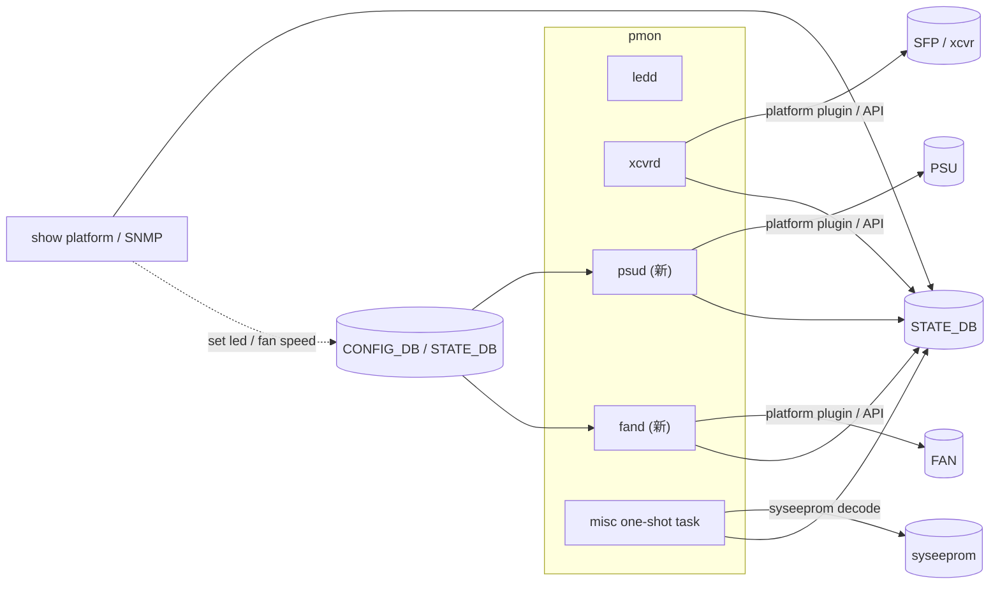

<!-- topics-tip -->
!!! tip "Topics で読み物として読む"
    この HLD は実装詳細を含みます。機能の概念・設定・運用を読み物として読みたい場合は [Topics 14 章: Platform / Port / Optics](../topics/14-platform-port-optics/index.md) を参照。
<!-- /topics-tip -->

!!! info "裏取りステータス: code-verified"
    `sonic-platform-daemons` master に `sonic-psud`、`sonic-syseepromd`、`sonic-xcvrd`、`sonic-thermalctld` が存在し、HLD で「fand」と呼ばれていた FAN 周期収集は `sonic-thermalctld` (= thermalctld) として実装されている。`scripts/psushow` / `fanshow` (`sonic-utilities`) が `STATE_DB` の `CHASSIS_INFO` / `PSU_INFO` / `FAN_INFO` を直接 read することを確認。HLD の中心方針（CLI/SNMP は STATE_DB のみ参照、daemon 側で plugin 直叩きを集約）は master 取り込み済み。`fand` 単独 daemon は無いという用語差のみ。

# pmon 強化（PSU/FAN/syseeprom 周辺データ STATE_DB 集約）

## 概要

`pmon` container には既に `ledd`（LED）/ `xcvrd`（SFP）の daemon があるが、**PSU / FAN / chassis / syseeprom データへの CLI / [SNMP](../reference/glossary.md#term-snmp) アクセスは platform plugin を直接叩く** ため遅く、container 跨ぎでデータ重複も発生していた[^1]。本 [HLD](../reference/glossary.md#term-hld) は **PSU / FAN 用 daemon を新設して周期収集 → [STATE_DB](../reference/glossary.md#term-state_db)**、misc syseeprom 系は **boot 時 1 回 dump → STATE_DB** とし、CLI / SNMP は **DB のみを read** する集約方針への移行を提案する。直接アクセスは pmon container 内に閉じ込める。

## 動作仕様

### Daemon 構成



### Daemon 共通フロー

- 起動時に **constant data**（serial, manufacturer, model 等）を 1 回読み込み STATE_DB に書く
- 以降は **periodic loop**（PSU/FAN/xcvr の variable 値）で温度・電圧・回転数・status を更新
- **set 操作**（status LED 色, fan speed 等）は [CONFIG_DB](../reference/glossary.md#term-config_db) 変更を subscribe してハンドラから platform API 呼出[^1]

### Misc one-shot task

boot up 時に platform hwsku / [ASIC](../reference/glossary.md#term-asic) 名 / reboot cause / syseeprom decode（model / serial / base MAC / manufacture date / vendor ext 等）をまとめて取得し STATE_DB に書く。**1 回限りで exit**[^1]。

### STATE_DB Schema

```text
PLATFORM_INFO|<platform_name>:
  chassis_list = <STRING>

CHASSIS_INFO|<chassis_name>:
  presence, model, serial, status, change_event,
  base_mac_addr, reboot_cause,
  module_num, fan_num, psu_num,
  product_name, mac_addr_num, manufacture_date, manufacture,
  platform_name, onie_version, crc32_checksum,
  vendor_ext1, ...
```

PSU 系は `PSU_INFO|<name>`（`presence`, `status`, ...）に格納（`docs/platform/sonic-psu-daemon-design.md` の psud HLD と整合）[^1]。FAN 系は `FAN_INFO|<name>`、xcvr は既存 PORT_TABLE / TRANSCEIVER_INFO 拡張で eeprom 詳細を追加。

### Business logic の境界

- **共通 logic** のみ daemon に置く（例: status enum 変換、抜去/挿入 event の generic 化）
- **platform 固有 logic** は platform plugin に閉じ込める[^1]（fan speed curve, sensor 個別の温度計算等）

### CLI / SNMP の置換え

- 旧: `show platform <psu|fan|sfp>` が platform plugin を直叩き
- 新: STATE_DB を読むだけ → 高速化、container 跨ぎで一貫
- SNMP も同じ STATE_DB が source

<!-- evidence:
source: sonic-net/SONiC/doc/pmon/pmon-enhancement-design.md#L13-L42 (sha: 49bab5b5ff0e924f1ea52b3d9db0dfa4191a7c06)
excerpt: |
  In current implementation when user try to fetch switch peripheral devices related data with CLI,
  underneath it will directly access hardware via platform plugins, in some case it could be very slow
  ... CLI/SNMP will access cached data(DB) instead, which will be much faster.
reasoning: 直接 plugin アクセス → STATE_DB 集約への移行根拠。
-->

<!-- evidence-rendered:start -->
??? note "📋 検証エビデンス: sonic-net/SONiC/doc/pmon/pmon-enhancement-design.md#L13-L42 (sha: 49bab5b5ff0e924f1ea52b3d9db0dfa4191a7c06)"

    **出典**:

    `sonic-net/SONiC/doc/pmon/pmon-enhancement-design.md#L13-L42 (sha: 49bab5b5ff0e924f1ea52b3d9db0dfa4191a7c06)`

    **抜粋**:

    ```text
    In current implementation when user try to fetch switch peripheral devices related data with CLI,
    underneath it will directly access hardware via platform plugins, in some case it could be very slow
    ... CLI/SNMP will access cached data(DB) instead, which will be much faster.
    ```

    **判断根拠**: 直接 plugin アクセス → STATE_DB 集約への移行根拠。

<!-- evidence-rendered:end -->

## 制限事項

- 共通 daemon への移行期は platform plugin 互換のため両系統が並存する可能性
- 周期 (~3 秒) 内のリアルタイム性は犠牲。緊急 event は別経路で trap 化する必要
- syseeprom 一発 dump は **再投入時の差分**（base_mac_addr 等が変わる）を想定していない
- PSU の業務ロジック（power threshold ヒステリシス）は別 HLD（psud HLD v0.4）で発展している

## 干渉する機能

- **psud HLD**（power threshold ヒステリシス）: 本 HLD の延長で実装
- **thermal-control / pmon thermal**: FAN/PSU データを利用する policy
- **xcvrd / sfp-refactor**: xcvr 側の eeprom 拡張と接続
- **s3ip-sysfs spec / framework**: kernel 側 sysfs の代替として将来的に重なる
- **`show platform` 系 CLI**: STATE_DB ベースに切替

## 参考リンク

- [CLI: show platform](../reference/cli/show-platform.md)
- [CLI: show environment](../reference/cli/show-environment.md)
- [CLI: show system-health](../reference/cli/show-system-health.md)
- [Topics: Platform / Port / Optics](../topics/14-platform-port-optics/index.md)
- [Topics: Telemetry / SNMP / Observability](../topics/09-telemetry-snmp/index.md)
- [Glossary](../reference/glossary.md)
- [Reference 索引](../reference/index.md)

## 既知の問題

### BMC (Baseboard Management Controller) 経由でファン・センサー制御が可能なプラットフ（sonic-buildimage#633）

BMC (Baseboard Management Controller) 経由でファン・センサー制御が可能なプラットフォームでは、platform API で BMC インターフェースを使う設計が必要

- 参照: [sonic-net/sonic-buildimage#633](https://github.com/sonic-net/sonic-buildimage/issues/633)

### LLDP の portidsubtype が "locally assigned" ではなく "mac address"（sonic-buildimage#1457）

[LLDP](../reference/glossary.md#term-lldp) の portidsubtype が "locally assigned" ではなく "mac address" にセットされる問題。lldpd の設定で `configure lldp portidsubtype local` を明示指定することで回避可能

- 参照: [sonic-net/sonic-buildimage#1457](https://github.com/sonic-net/sonic-buildimage/issues/1457)

### ポートのステータス変更が SONiC に反映されない問題（sonic-buildimage#4646）

ポートのステータス変更が [SONiC](../reference/glossary.md#term-sonic) に反映されない問題。xcvrd または [portsyncd](../reference/glossary.md#term-portsyncd) がポートの物理状態変更を正しく検知できていない場合に発生。`sudo systemctl restart pmon` で回復できることがある

- 参照: [sonic-net/sonic-buildimage#4646](https://github.com/sonic-net/sonic-buildimage/issues/4646)

### 最新ビルドで `show interface transceiver` コマンドが壊れている問題（sonic-buildimage#5001）

最新ビルドで `show interface transceiver` コマンドが壊れている問題。xcvrd の Python 3 移行後にインターフェース取得ロジックが変更されたため、パッケージのバージョン整合性を確認すること

- 参照: [sonic-net/sonic-buildimage#5001](https://github.com/sonic-net/sonic-buildimage/issues/5001)

### SNMP の ifMIB ifName が間違った値を返す問題（sonic-buildimage#5592）

SNMP の ifMIB ifName が間違った値を返す問題。`show interfaces status` の表示名と SNMP の ifName が一致しない場合、インターフェース名のマッピングを確認すること

- 参照: [sonic-net/sonic-buildimage#5592](https://github.com/sonic-net/sonic-buildimage/issues/5592)

### 最新 master イメージで pmon (Platform Monitor) が即座にクラッシュする問題（sonic-buildimage#5759）

最新 master イメージで pmon (Platform Monitor) が即座にクラッシュする問題。プラットフォーム固有のドライバーと pmon の Python 3 互換性を確認すること

- 参照: [sonic-net/sonic-buildimage#5759](https://github.com/sonic-net/sonic-buildimage/issues/5759)

### 最新 SONiC イメージで PMON コンテナがクラッシュする問題（sonic-buildimage#5986）

最新 SONiC イメージで PMON コンテナがクラッシュする問題。プラットフォーム固有の Python プラグインが Python 3 に対応していない場合に発生

- 参照: [sonic-net/sonic-buildimage#5986](https://github.com/sonic-net/sonic-buildimage/issues/5986)

### multi-ASIC chassis で全 ASIC が BackEnd の場合に pmon xcvrd がクラッシュす（sonic-buildimage#6097）

multi-ASIC chassis で全 ASIC が BackEnd の場合に pmon xcvrd がクラッシュする問題。xcvrd は FrontEnd ASIC の存在を前提としており、全 BackEnd 構成では初期化に失敗する

- 参照: [sonic-net/sonic-buildimage#6097](https://github.com/sonic-net/sonic-buildimage/issues/6097)

### hwsku.json から FEC パラメータがデフォルト設定できない問題（sonic-buildimage#6495）

hwsku.json から FEC パラメータがデフォルト設定できない問題。FEC の設定は `config interface fec` コマンドで明示的に行う必要がある

- 参照: [sonic-net/sonic-buildimage#6495](https://github.com/sonic-net/sonic-buildimage/issues/6495)

### DPB 実行後に xcvrd が新しいポートの SFP 情報を取得できない問題（sonic-buildimage#6499）

[DPB](../reference/glossary.md#term-dpb) 実行後に xcvrd が新しいポートの SFP 情報を取得できない問題。DPB 実行後に xcvrd の再起動が必要な場合がある

- 参照: [sonic-net/sonic-buildimage#6499](https://github.com/sonic-net/sonic-buildimage/issues/6499)

### CMIS 4.0 QSFP-DD の EEPROM デコードが失敗する問題（sonic-buildimage#6516）

CMIS 4.0 QSFP-DD の EEPROM デコードが失敗する問題。CMIS 4.0 対応の xcvrd バージョンが必要

- 参照: [sonic-net/sonic-buildimage#6516](https://github.com/sonic-net/sonic-buildimage/issues/6516)

## 引用元

[^1]: `sonic-net/SONiC` `doc/pmon/pmon-enhancement-design.md` @ `49bab5b5ff0e924f1ea52b3d9db0dfa4191a7c06`

<!-- concerns hint:
- psud / fand 新設 daemon の sonic-platform-daemons 取り込み確認
- PLATFORM_INFO / CHASSIS_INFO / PSU_INFO / FAN_INFO スキーマの sonic-yang-models 反映確認
- syseeprom 周辺一括収集 task (one-shot) の実装場所と起動経路確認
- xcvrd 拡張 (eeprom 詳細) と現行 sonic_xcvr 階層の整合確認
- show platform fanstatus / psustatus / temperature が STATE_DB 直読みになっているか確認
- ledd / xcvrd と新 daemon の責務境界の更新版 HLD 有無確認
-->

<!-- glossary-links-injected: ec18b66e3507 -->
