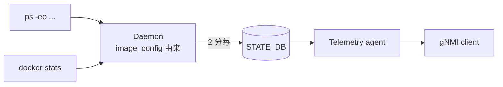

<!-- topics-tip -->
!!! tip "Topics で読み物として読む"
    この HLD は実装詳細を含みます。機能の概念・設定・運用を読み物として読みたい場合は [Topics 09 章: Telemetry / SNMP / ログ](../topics/09-telemetry-snmp/index.md) を参照。
<!-- /topics-tip -->

!!! success "裏取りステータス: Code-verified（一部位置に乖離）"
    現行 master で実装済みを確認。デーモンは `sonic-host-services/scripts/procdockerstatsd`（HLD では `sonic-buildimage/files/image_config` 配下と記載されていたが、実際は sonic-host-services リポジトリに移管）。`procdockerstatsd:138` で `top_processes = sorted_processes[:1024]`、`procdockerstatsd:174` で `STATE_DB` の `PROCESS_STATS|*` 全削除、`procdockerstatsd:234-236` で `DOCKER_STATS|LastUpdateTime` / `PROCESS_STATS|LastUpdateTime` 更新、`procdockerstatsd:240-241` で `time.sleep(120)`（2 分周期）を確認（verified at: 2026-05-09）。

# Process / Docker stats のテレメトリ公開（PROCESS_STATS / DOCKER_STATS）

## 概要

[SONiC](../reference/glossary.md#term-sonic) のテレメトリエージェント（[gNMI](../reference/glossary.md#term-gnmi) / [gNOI](../reference/glossary.md#term-gnoi) ストリーミング）から **プロセス毎の CPU/メモリ使用量** および **docker コンテナ毎のリソース消費** を購読できるようにする提案。新規デーモンが OS 上の `ps -eo` 出力と `docker stats --no-stream -a` の値を 2 分間隔で [STATE_DB](../reference/glossary.md#term-state_db) に書き、テレメトリエージェント側はそれを既存の購読チャネルで読み出す[^1]。

## 動作仕様

### 構成



毎周期で次の手順が走る[^1]：

1. `PROCESS_STATS` / `DOCKER_STATS` の既存エントリを STATE_DB から **全削除**。
2. 最新値を STATE_DB に書く。
3. `LastUpdateTime` キーを更新する。

### PROCESS_STATS

`ps -eo uid,pid,ppid,%mem,%cpu,stime,tty,time,cmd` の出力から **CPU 消費上位 1024 プロセス** を抽出して書き込む[^1]。キーは `PID`。

```text
PROCESS_STATS|<pid>
    UID    = <uid>
    PID    = <pid>
    PPID   = <ppid>
    CPU%   = <float>
    MEM%   = <float>
    TTY    = <tty>
    STIME  = <stime>
    TIME   = <time>
    CMD    = <cmd>

PROCESS_STATS|LastUpdateTime
```

### DOCKER_STATS

`docker stats --no-stream -a` の出力からコンテナ全件を書き込む。キーは container ID。

```text
DOCKER_STATS|<container_id>
    NAME             = <name>
    CPU%             = <float>
    MEM_BYTES        = <int>
    MEM_LIMIT_BYTES  = <int>
    MEM%             = <float>
    NET_IN_BYTES     = <int>
    NET_OUT_BYTES    = <int>
    BLOCK_IN_BYTES   = <int>
    BLOCK_OUT_BYTES  = <int>
    PIDS             = <int>

DOCKER_STATS|LastUpdateTime
```

## 設定

### 関連する CONFIG_DB

[HLD](../reference/glossary.md#term-hld) には [CONFIG_DB](../reference/glossary.md#term-config_db) エントリの記述は無い。デーモン自体の有効化スイッチや間隔の調整も明記されていない（2 分固定）[^1]。

### 関連する CLI

HLD には新規 CLI の記述は無い。データはテレメトリエージェント経由でのみ消費される想定。

### 関連する YANG

HLD には [YANG](../reference/glossary.md#term-yang) モデルの記述は無い。

### 設定例

テレメトリエージェントから購読する側のサンプル（gnmic 等）:

```bash
gnmic -a <switch>:8080 subscribe \
    --path '/state/PROCESS_STATS/...' \
    --mode stream --stream-mode sample --sample-interval 2m
```

具体的な path 表現は実装依存（HLD 未規定）。

## 制限事項

- 取得対象プロセスは **CPU 消費 top 1024** に絞られる。実装上の理由（STATE_DB サイズ抑制）と思われるが、しきい値の根拠は HLD には明記なし。
- 周期 2 分は固定で、外部から調整するインタフェースは HLD に無い。
- デーモン実装の場所が `sonic-buildimage/files/image_config` 配下と指定されているのみで、プロセス名・サービス名は HLD で確定していない。
- HLD は 2019 年で実装が現行 master にどこまで残っているかは未確認（高優先で裏取り対象） → 2026-05-09 裏取り済み。実装は `sonic-host-services` リポジトリ側 (`scripts/procdockerstatsd`) に移管されているが、テーブル名・フィールド・top-1024・2 分周期は HLD 記載通り。

## 実装との乖離

- HLD では「デーモン実装は `sonic-buildimage/files/image_config` 配下」と記載されているが、現行 master の実装は `sonic-net/sonic-host-services` リポジトリの `scripts/procdockerstatsd`（Python daemon）として独立配置されている。これは HLD 起草時 (2019-09) 以降に sonic-host-services が分離・スクリプトが移管された経緯による。動作仕様（top-1024、2 分間隔、PROCESS_STATS / DOCKER_STATS / LastUpdateTime キー）は HLD 通り。

## 干渉する機能

- **memory-statistics（`memorystatsd`）**: 後発の HLD で全体メモリ統計を別経路で収集する。本機能はプロセス・コンテナ粒度で別レイヤ。
- **`show techsupport`**: STATE_DB のダンプとして同情報がスナップショット保存される可能性あり。
- **gNMI Telemetry Agent**: 本機能が書く STATE_DB エントリの subscribe path は、テレメトリエージェントの STATE_DB 公開仕様に従う。

## トラブルシューティング

- 値が更新されない → デーモンプロセスが動いているか確認、`PROCESS_STATS|LastUpdateTime` のタイムスタンプを `redis-cli -n 6 hgetall PROCESS_STATS|LastUpdateTime` で見る。
- 一部プロセスが見えない → CPU% 上位 1024 の絞り込みで漏れている可能性。
- `DOCKER_STATS` のメモリ値がコンテナ内 cgroup 値と合わない → `docker stats` の集計対象に依存（HLD では特に注意書き無し）。


### コマンド例

gNMI 経由でプロセス/docker 統計を取得できるか確認する。

```bash
gnmi_get -target_addr localhost:8080 -xpath '/process-stats'
gnmi_get -target_addr localhost:8080 -xpath '/docker-stats'
show services
docker stats --no-stream
```

## 引用元

[^1]: `sonic-net/SONiC` `doc/system-telemetry/process-docker-stats.md` @ `49bab5b5ff0e924f1ea52b3d9db0dfa4191a7c06`

<!-- topics-back-ref -->
## 関連 Topics

- [Topics: Telemetry / SNMP / Observability](../topics/09-telemetry-snmp/index.md)

<!-- /topics-back-ref -->

<!-- glossary-links-injected: 8ba32e5aa69d -->
