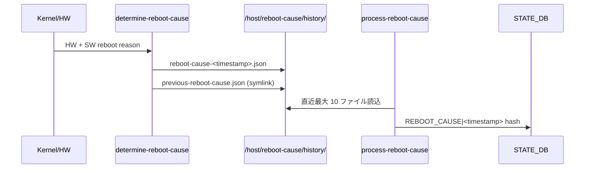

<!-- topics-tip -->
!!! tip "Topics で読み物として読む"
    この HLD は実装詳細を含む。機能の概念・設定・運用を読み物として読みたい場合は [Topics 09 章: Telemetry / SNMP / ログ](../topics/09-telemetry-snmp/index.md) を参照。
<!-- /topics-tip -->

!!! success "裏取りステータス: code-verified"
    現行 master で実装存在を確認。`sonic-host-services/scripts/determine-reboot-cause` および `scripts/process-reboot-cause` が systemd unit (`sonic-host-services-data.{determine,process}-reboot-cause.service`) として配置されている。`process-reboot-cause:27-34` で `REBOOT_CAUSE_DIR=/host/reboot-cause/`、`REBOOT_CAUSE_HISTORY_DIR=/host/reboot-cause/history/`、`PREVIOUS_REBOOT_CAUSE_FILE=previous-reboot-cause.json`、`REBOOT_CAUSE_TABLE_NAME="REBOOT_CAUSE"`、`MAX_HISTORY_FILES=10` を確認。`process-reboot-cause:62` で `min(MAX_HISTORY_FILES, ...)` の 10 件 cap も確認。CLI は `sonic-utilities/show/reboot_cause.py` の `fetch_reboot_cause_history_from_db` で `REBOOT_CAUSE|*` 走査を確認（verified at: 2026-05-09）。

# Reboot-cause 履歴の STATE_DB / テレメトリ公開

## 概要

[SONiC](../reference/glossary.md#term-sonic) の起動時に「直前の再起動原因」を判定し、JSON ファイルとして履歴保存し、最新分は [STATE_DB](../reference/glossary.md#term-state_db) にも反映する仕組み。`show reboot-cause` の最新表示に加えて `show reboot-cause history` で過去最大 10 エントリを表示できるようにする。テレメトリエージェント経由でも履歴を購読可能にする[^1]。

## 動作仕様

### 起動時シーケンス



#### Part 1: determine-reboot-cause

旧来 `process-reboot-cause` と呼ばれていたサービスを `determine-reboot-cause` にリネーム。HW/SW の reboot 原因を判定し、JSON 形式で次の場所に保存する[^1]：

- `/host/reboot-cause/history/reboot-cause-<YYYY_MM_DD_HH_MM_SS>.json`
- `/host/reboot-cause/previous-reboot-cause.json`（直近ファイルへの symlink）

JSON 例：

```json
{
  "comment": "",
  "gen_time": "2020_10_09_04_53_58",
  "cause": "warm-reboot",
  "user": "admin",
  "time": "Fri Oct  9 04:51:47 UTC 2020"
}
```

#### Part 2: process-reboot-cause

新サービス `process-reboot-cause.service` が history ディレクトリを読み、最大 10 件を STATE_DB に書き込む[^1]。

```text
REBOOT_CAUSE|<timestamp>
    cause   = STRING   ; warm-reboot / fast-reboot / reboot / ...
    time    = STRING   ; full date string
    user    = STRING   ; admin など
    comment = STRING   ; unstructured json
```

### CLI

```text
admin@sonic:~$ show reboot-cause
User issued 'warm-reboot' command [User: admin, Time: Fri Oct  9 04:51:47 UTC 2020]

admin@sonic:~$ show reboot-cause history
name                 cause        time                          user    comment
-------------------  -----------  ----------------------------  ------  ---------
2020_10_09_04_53_58  warm-reboot  Fri Oct  9 04:51:47 UTC 2020  admin
2020_10_09_02_33_06  reboot       Fri Oct  9 02:29:44 UTC 2020  admin
2020_10_09_02_00_53  fast-reboot  Fri Oct  9 01:58:04 UTC 2020  admin
2020_10_09_01_56_59  reboot       Fri Oct  9 01:53:49 UTC 2020  admin
```

`show reboot-cause` は従来どおり `previous-reboot-cause.json`（symlink）から最新分を表示する。`history` は STATE_DB から複数件を取る。

### Telemetry 公開

STATE_DB の `REBOOT_CAUSE|*` キーをテレメトリエージェントが標準の STATE_DB 公開経路で公開する。新規 path 設計や proto 定義は [HLD](../reference/glossary.md#term-hld) には記述なし。

## 設定

### 関連する CONFIG_DB

HLD には [CONFIG_DB](../reference/glossary.md#term-config_db) エントリの記述は無い。

### 関連する CLI

| Command | 用途 |
|---------|------|
| `show reboot-cause` | 直前 reboot の原因（symlink JSON 由来） |
| `show reboot-cause history` | STATE_DB の直近 10 エントリ |

### 関連する YANG

HLD に [YANG](../reference/glossary.md#term-yang) モデルの記述は無い。

### 設定例

確認のみ：

```bash
ls /host/reboot-cause/history/
cat /host/reboot-cause/previous-reboot-cause.json
redis-cli -n 6 keys "REBOOT_CAUSE|*"
show reboot-cause history
```

## 制限事項

- STATE_DB に保持されるのは **最大 10 件**（`history/` ディレクトリ自体は古い分も残る可能性あり、HLD ではローテーション仕様未明記）。
- `comment` は unstructured JSON 文字列で、構造化スキーマは規定されていない。
- HLD は 5 年以上前の v0.1 のままで、現行 master と差異が大きい可能性が高い → 2026-05-09 裏取り済み。テーブル名・キー・10 件 cap・JSON ファイル配置は HLD 通り。実装は `sonic-host-services` の `scripts/{determine,process}-reboot-cause`、CLI は `sonic-utilities/show/reboot_cause.py`。

## 干渉する機能

- **fast-reboot / warm-reboot / express-reboot**: `cause` 値はこれら reboot タイプを反映する。express-reboot HLD では `show reboot-reason` を `express` に拡張する記述がある（別 HLD）。
- **show techsupport**: history JSON ファイルが tech-support に含まれる可能性が高い（HLD 未明記）。
- **Telemetry agent**: STATE_DB 公開ポリシーに従う。

## トラブルシューティング

- `show reboot-cause history` が空 → `process-reboot-cause.service` の起動ログを確認、history ディレクトリに JSON ファイルがあるかを確認。
- 直前の reboot 原因が `unknown` のまま → `determine-reboot-cause` が HW/SW 双方の情報を取れているかをログで確認。


### コマンド例

reboot-cause を [gNMI](../reference/glossary.md#term-gnmi) 経由で取得できるか確認する。

```bash
show reboot-cause
show reboot-cause history
gnmi_get -target_addr localhost:8080 -xpath '/reboot-cause'
cat /host/reboot-cause/previous-reboot-cause.json
```

## 引用元

[^1]: `sonic-net/SONiC` `doc/system-telemetry/reboot-cause.md` @ `49bab5b5ff0e924f1ea52b3d9db0dfa4191a7c06`

<!-- topics-back-ref -->
## 関連 Topics

- [Topics: Telemetry / SNMP / Observability](../topics/09-telemetry-snmp/index.md)

<!-- /topics-back-ref -->

<!-- glossary-links-injected: 8ba32e5aa69d -->
