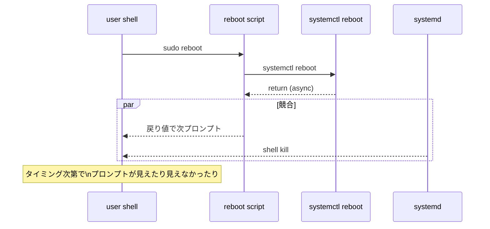
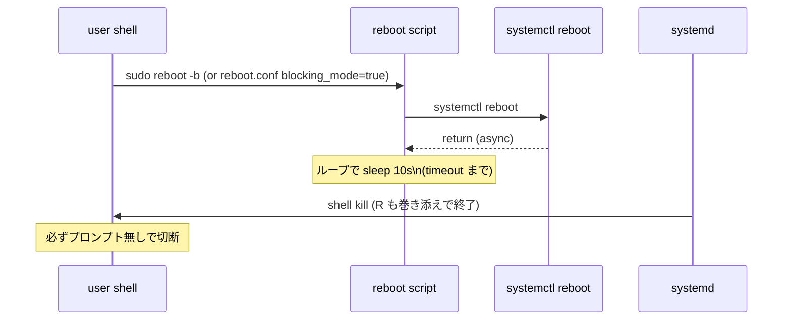

<!-- topics-tip -->
!!! tip "Topics で読み物として読む"
    この HLD は実装詳細を含みます。機能の概念・設定・運用を読み物として読みたい場合は [Topics 11 章: Reboot / Warm/Fast/Express/Cold](../topics/11-reboot/index.md) を参照。
<!-- /topics-tip -->

!!! success "裏取りステータス: Code-verified"
    `sonic-utilities/scripts/reboot` で実装を確認: `REBOOT_CONFIG_FILE="/etc/sonic/reboot.conf"` (L17)、デフォルト `BLOCKING_MODE="no"` / `BLOCKING_MODE_TIMEOUT_IN_SECOND=180` (L58-59)、`-b` で blocking mode、`-v` で verbose dot 出力 (L155-156, L230)、reboot.conf パーサで `blocking_mode` / `blocking_mode_timeout` キー処理 (L257-275)、blocking mode 時の deadloop と timeout 検出 (L390-408) を確認 (verified at: 2026-05-09)。

# `reboot` コマンドの blocking mode（`reboot.conf` / `-b` / `-v`）

## 概要

[SONiC](../reference/glossary.md#term-sonic) の `reboot` スクリプトは内部で `systemctl reboot` を呼ぶが、これは **非同期** であり、戻り値が返るタイミングと systemd によるユーザセッション kill のタイミングがレースする[^1]。結果、コンソール出力は次の 2 パターンがランダムに発生する:

- A: `systemctl reboot` 戻り後にユーザシェルがプロンプトを 1 行表示してから切断
- B: シェルが先に kill されてプロンプト無しで切断

自動化システムから見ると **`reboot` 完了の判定が安定しない**。本 [HLD](../reference/glossary.md#term-hld) はこれを **B 動作（プロンプトを出さずブロックして切断まで待つ）** に統一する **blocking mode** を導入する[^1]。

破壊的変更を避けるため、blocking mode は **明示的にオプトイン**（`-b` または `reboot.conf`）。

## 動作仕様

### 旧挙動（非 blocking）



### 新挙動（blocking mode）



要点:

- `systemctl reboot` 戻り後、`reboot` スクリプトは **dead loop** で待機。これによりシェルが kill されるまでプロンプトが出ない
- 何らかの理由で systemd が reboot しない場合、loop が永久に続くと困るので **timeout** を導入

### 有効化方法（オプトイン、両立可能）

| 方式 | 設定 |
|------|------|
| パラメータ | `reboot -b` |
| 設定ファイル | `/etc/sonic/reboot.conf` で `blocking_mode=true` |

どちらか有効なら blocking mode になる[^1]。

### Verbose（dot 出力）

blocking mode 中、生存表示として **10 秒ごとに `.` を出力、50 個ごとに改行** する[^1]。出力例:

```text
Fri 20 Oct 2023 06:03:33 AM UTC Issuing OS-level reboot ...
..................................................
..................................................
..............................Connection to 10.150.22.134 closed by remote host.
Connection to 10.150.22.134 closed.
```

dot 出力の有効化には **blocking mode が前提**。その上で次のいずれか[^1]:

| 方式 | 設定 |
|------|------|
| パラメータ | `reboot -v -b` |
| 設定ファイル | `reboot.conf` で `show_timer=true` |

### `/etc/sonic/reboot.conf`

ファイル不在なら全部デフォルト[^1]。

| Config | 型 | デフォルト | 説明 |
|--------|----|----------|------|
| `blocking_mode` | bool | `false` | blocking mode を有効化 |
| `blocking_mode_timeout` | int (秒) | `180` | blocking ループの上限。超えると script 終了（reboot がハングしている兆候） |
| `show_timer` | bool | `false` | 10 秒ごとの dot 出力。`blocking_mode=true` が前提 |

例:

```text
blocking_mode=true
blocking_mode_timeout=10
show_timer=true
```

CLI 経由の `Ctrl+C` で抜けたい場合は手動でも止められるため、CLI パラメータ側にはタイムアウトオプションを置かない（reboot.conf のみ）[^1]。

<!-- evidence:
source: sonic-net/SONiC/doc/reboot/Reboot_BlockingMode_HLD.md#L60-L75 (sha: 49bab5b5ff0e924f1ea52b3d9db0dfa4191a7c06)
excerpt: |
  We don't want to make a break change to SONIC reboot command, so we introduce 2 options ...
  - Parameter: Use command optional parameter `-b` to enable blocking mode for reboot script.
  - Config file: ... `blocking_mode` is enabled in `reboot.conf` config file.
  ... If the systemctl reboot failed, the deadloop might block the console thread.
  So we introduce the timeout config to exit when reboot takes too long.
reasoning: 「-b と reboot.conf のいずれか」「timeout で deadloop からの脱出を保証」という設計の根拠。
-->

<!-- evidence-rendered:start -->
??? note "📋 検証エビデンス: sonic-net/SONiC/doc/reboot/Reboot_BlockingMode_HLD.md#L60-L75 (sha: 49bab5b5ff0e924f1ea52b3d9db0dfa4191a7c06)"

    **出典**:

    `sonic-net/SONiC/doc/reboot/Reboot_BlockingMode_HLD.md#L60-L75 (sha: 49bab5b5ff0e924f1ea52b3d9db0dfa4191a7c06)`

    **抜粋**:

    ```text
    We don't want to make a break change to SONIC reboot command, so we introduce 2 options ...
    - Parameter: Use command optional parameter `-b` to enable blocking mode for reboot script.
    - Config file: ... `blocking_mode` is enabled in `reboot.conf` config file.
    ... If the systemctl reboot failed, the deadloop might block the console thread.
    So we introduce the timeout config to exit when reboot takes too long.
    ```

    **判断根拠**: 「-b と reboot.conf のいずれか」「timeout で deadloop からの脱出を保証」という設計の根拠。

<!-- evidence-rendered:end -->

### Platform reboot との関係

**Platform reboot が有効なときは blocking mode が効かない**[^1]。プラットフォーム固有のフローに従う。

## 設定

### 関連する CLI

| Command | 用途 |
|---------|------|
| `reboot` | デフォルト（非 blocking） |
| `reboot -b` | blocking mode |
| `reboot -v -b` | blocking + dot 出力 |

### 関連する CONFIG_DB

[CONFIG_DB](../reference/glossary.md#term-config_db) スキーマには変更なし。設定は **`/etc/sonic/reboot.conf`**（ファイル）で行う。

### 関連する YANG

該当 [YANG](../reference/glossary.md#term-yang) モジュールは HLD で言及されていない。

### 設定例

```bash
# 自動化向け: 全 reboot を blocking 化
cat > /etc/sonic/reboot.conf <<EOF
blocking_mode=true
blocking_mode_timeout=300
show_timer=true
EOF

# 手動でその場限りで blocking
sudo reboot -b -v
```

## 制限事項

- **後方互換オプトイン**。指定しない限り従来どおりの非 blocking 動作[^1]
- **Platform reboot 有効時は無効**[^1]
- timeout を超えると blocking ループは抜ける。その時点で systemd reboot が来ていない場合、運用者は別途確認する必要がある
- `reboot.conf` のフォーマットは単純な `key=value` ファイル。INI / TOML 等ではない

## 干渉する機能

- **`systemctl reboot`**: 内部で呼ぶコマンド。挙動は変えず、後段の wait の有無を変える
- **Platform reboot**: 有効時は本機能を上書き
- **コンソールセッション管理 / 自動化（Ansible 等）**: 「shell が必ず prompt 無しで切れる」を期待できるようになる
- **fast-reboot / warm-reboot**: 本 HLD は通常 reboot を対象とする。fast/warm への適用は HLD 未言及

## トラブルシューティング

- `reboot -b` でも extra prompt が出る場合、`reboot.conf` でも有効化されているか・タイミングの再現条件を確認
- `blocking_mode_timeout` 超過で抜けた場合、`systemctl reboot` 自体が失敗している可能性。`journalctl` で reboot ターゲットの遷移を確認
- dot が出ない場合、`-v` または `show_timer=true` が同時に有効か確認

### コマンド例

blocking-mode reboot の進捗とエラーを確認する。

```bash
sudo reboot -b
show reboot-cause
grep -iE 'reboot|blocking' /var/log/syslog | tail
show system-health summary
```

## 関連 reference

- [Topics: Reboot](../topics/11-reboot/index.md)
- [CLI: reboot / fast / warm](../reference/cli/reboot-fast-warm.md)
- [Runbook: warm-reboot-failure](../reference/runbooks/warm-reboot-failure.md)

## 引用元

[^1]: `sonic-net/SONiC` `doc/reboot/Reboot_BlockingMode_HLD.md` @ `49bab5b5ff0e924f1ea52b3d9db0dfa4191a7c06`

<!-- concerns hint:
- reboot スクリプト (sonic-buildimage) の -b / -v 引数実装
- /etc/sonic/reboot.conf パーサ実装
- blocking_mode_timeout の最終デフォルト値 (180 vs 他)
- platform reboot 検出ロジック
- fast-reboot / warm-reboot への blocking mode 適用可否
-->

<!-- glossary-links-injected: 8ba32e5aa69d -->
