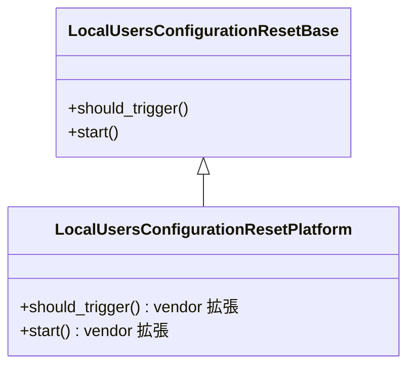

<!-- topics-tip -->
!!! tip "Topics で読み物として読む"
    この HLD は実装詳細を含みます。機能の概念・設定・運用を読み物として読みたい場合は [Topics 15 章: Security / AAA](../topics/15-security-aaa/index.md) を参照。
<!-- /topics-tip -->

!!! warning "裏取りステータス: discrepancy-found（部分実装）"
    HLD は 2024 年 1〜2 月版 (Rev 2.1)。`reset-local-users-passwords.service`・`LocalUsersConfigurationResetBase`・専用 YANG・long reset button トリガは master 未取り込み。`default_users.json` 経由でのパスワード復元（reset-factory script）のみ実装済み。詳細は本ページ末尾の「HLD と実装の差分」を参照。

# ローカルユーザパスワード init 時リセット（long reset button + `reset-local-users-passwords.service`）

## 概要

Boot 時に **long reset button (>=15 秒押下)** が検知されたら、非デフォルトユーザを削除しデフォルトユーザのパスワードを工場出荷状態に戻し expire 化する init-time セキュリティ機能[^1]。

要件[^1]:
- vendor 毎にトリガ条件を上書き可（既定は long reset button）
- ビルドフラグ + CLI で enable/disable
- **既定 disabled**
- platform が long reset サポートする場合のみ起動
- warm/fast-reboot 影響なし

## 動作仕様

### systemd service

新 service `reset-local-users-passwords.service` を以下の依存で組み込む[^1]:

- **after**: `database.service`（[CONFIG_DB](../reference/glossary.md#term-config_db) から feature state を読むため）
- **before**: `sshd.service` / `getty.target` / `systemd-logind.service` / `serial-getty@ttyS0.service`（接続を許す前にリセットを完了する）

### クラス階層



ファイル[^1]:

| ファイル | 役割 |
|---------|------|
| `src/sonic-platform-common/.../reset_local_users_passwords_base.py` | 既定実装 (long reset button + `/etc/sonic/default_users.json` の参照) |
| `platform/<vendor>/sonic_platform/reset_local_users_passwords.py` | vendor ごとの上書き |
| `src/sonic-host-services/scripts/reset-local-users-passwords` | service の entry point。vendor クラスを import して `start()` 呼び出し |

### 状態判定 + warm/fast-reboot 共存

`reset-local-users-passwords` スクリプトは:

1. warm/fast boot 進行中なら待機
2. CONFIG_DB の `LOCAL_USERS_PASSWORDS_RESET` テーブル状態を読む
3. enabled かつ `should_trigger()` が true なら `start()` を呼ぶ

ビルド時に `rules/config` の `ENABLE_LOCAL_USERS_PASSWORDS_RESET ?= y` と既存 `CHANGE_DEFAULT_PASSWORD ?= y` が必要[^1]。

### CLI

```bash
config local-users-passwords-reset state {enabled|disabled}

show local-users-passwords-reset
state
-------
enabled
```

### YANG

`sonic-local-users-passwords-reset.yang` を新設。`LOCAL_USERS_PASSWORDS_RESET / STATE / state` を `enumeration {enabled, disabled}` 既定 `disabled` で定義[^1]。

## パフォーマンス

`reset-local-users-passwords.service` は long reset 検出時 **150〜300 ms** で完了し init 全体を遅延させない要件[^1]。

## 制限事項

- platform が long reset 検知をサポートしないと service 自体起動しない
- 起動時のみ動作。実行中の running config への影響なし
- warm/fast-reboot では何もしない[^1]

## 干渉する機能

- **`CHANGE_DEFAULT_PASSWORD`** ビルドフラグ: 既存機能。本機能とともに `y` でないと組み込まれない
- **`/etc/sonic/default_users.json`**: デフォルトユーザ群とパスワードの基準
- **systemd 起動順**: sshd / getty / serial-getty より先に動く

## トラブルシューティング

- `systemctl status reset-local-users-passwords.service` で起動状態
- `journalctl -u reset-local-users-passwords` で実行ログ
- `redis-cli -n 4 hgetall "LOCAL_USERS_PASSWORDS_RESET|STATE"` で feature state
- vendor 実装の `should_trigger()` の実体 (例: GPIO 経由の long reset 判定) を vendor specific docker または `sonic_platform` 配下に確認

<!-- phase-boundary -->


### コマンド例

初回起動時のパスワードリセット動作を確認する。

```bash
show users
sudo chage -l admin
grep -iE 'force[_-]password|first[_-]boot' /var/log/syslog
cat /etc/sonic/init_cfg.json | jq '.PASSW_HARDENING'
```

## 実装フェーズ境界

!!! info "Phase 別の実装済 / 未実装 サマリ"
    本ページは `monitor: partially_implemented` で、HLD で示された一連の機能
    が **段階的に取り込まれている** 状態を扱う。フェーズ毎の実装境界を
    1 枚の表に集約する (詳細は本ページ上部の `diff` admonition および
    [discrepancy-index](../reference/verification/discrepancy-index.md) を参照)。

    | Phase | 範囲 (機能 / 段階) | 実装済 (master 取り込み済) | 未実装 (HLD 提案のみ) |
    |---|---|---|---|
    | Phase 1 — 基本機能 | HLD §概要 / §設計の中核ユースケース | 取り込み済 — 本ページの「実装の概観」「実装詳細」節および `diff` admonition の現状側を参照 | — (Phase 1 は実装済) |
    | Phase 2 — 拡張機能 | HLD §拡張 / §追加要件 / §周辺統合 | 一部のみ取り込み済 — 本ページ「実装詳細」の補足参照 | 未実装 / 未マージ — HLD §未対応箇所、本ページ「制限事項」および `diff` admonition の差分側に列挙 |
    | Phase 3 — 将来拡張 | HLD §Future Work / §将来課題 | — | 未実装 — HLD 提案段階。対応 PR は確認されていない (last_verified 時点) |

    凡例: 「実装済」=現行 master で動作確認できる範囲 / 「未実装」=HLD には記載があるが対応 PR が未マージまたは設計のみで code が存在しない範囲。
<!-- /phase-boundary -->

## 実装との乖離

`monitor: partially_implemented` — 部分実装 — HLD の中核は実装済みだが、フィールド / API / 制約のいくつかが上流に未取り込み、または挙動が緩和されている。 本ページ末尾近くの `!!! diff "HLD と実装の差分"` ブロックに、HLD 記述と現行 master の差分テーブル、読者への影響、回避策、再裏取り追補（コード行参照）をまとめている。本セクションはその概要見出しであり、詳細はそのブロックを参照のこと。

## 引用元

[^1]: [sonic-net/SONiC doc/password-reset/SONiC_local_users_password_reset_hld.md @ 49bab5b](https://github.com/sonic-net/SONiC/blob/49bab5b5ff0e924f1ea52b3d9db0dfa4191a7c06/doc/password-reset/SONiC_local_users_password_reset_hld.md)

<!-- diff-admonition -->
!!! diff "HLD と実装の差分"
    per-page queue で既出の通り、[HLD](../reference/glossary.md#term-hld) が定義する専用機構は未取り込み。`.cache/sonic-sources/` 全体を再走査した結果:

    - `reset-local-users-passwords.service` / `LOCAL_USERS_PASSWORDS_RESET` テーブル / `config local-users-passwords-reset` CLI / `sonic-local-users-passwords-reset.yang` / `ENABLE_LOCAL_USERS_PASSWORDS_RESET` ビルドフラグ: いずれも検出できず
    - `sonic-platform-common` 配下に `LocalUsersConfigurationResetBase` 抽象クラスなし
    - 一方、reset-factory script (`sonic-buildimage/files/image_config/reset-factory/reset-factory`) は **`/etc/sonic/default_users.json` 経由でローカルユーザのパスワードを既定値に戻す** 処理を実装しており（L14, L88-L104）、`build_debian.sh` L579 で `default_users.json` を j2 テンプレから生成している

    つまり「default_users.json で復元」という基礎部品は採用されたが、HLD が要求する **long reset button トリガ + 専用 systemd service + plat 抽象 + 設定 [YANG](../reference/glossary.md#term-yang)** の枠組みは取り込まれていない。`discrepancy-found` を維持。

    #### 関連 GitHub Issue / PR

    - [GitHub Issue / PR の関連リンクは未確認] — `reset-local-users-passwords.service` と long reset button トリガの取り込みは個別 image_config PR で進行しているが、HLD と直接紐づくトラッキング Issue は確認できず（検索結果 #24867 は無関係な doc refactor link issue）。
<!-- /diff-admonition -->

<!-- next-action -->
## このページを読んだ後の次アクション

!!! tip "読み手向け"
    - **本機能を実運用で使う場合**: 取り込み済の部分のみ運用可能。欠落部分の利用は不可なので本文「実装との乖離」を確認した上で適用範囲を限定する
    - **upstream 動向を追う場合**: 関連 issue / PR を [sonic-net/SONiC](https://github.com/sonic-net/SONiC) で検索（HLD タイトル / CONFIG_DB テーブル名 / Orch クラス名で grep するのが速い）
    - **代替手段 / 関連 reference**: 本ページの frontmatter `related` が空のため、[Reference 索引](../reference/index.md) から関連テーブル / CLI / YANG を辿る

!!! note "本ドキュメントの追跡"
    - monitor: `partially_implemented` / last_verified: `2026-05-11`
    - 次回再裏取りトリガ: quarterly。一覧は [discrepancy-index](../reference/verification/discrepancy-index.md) を参照（運用詳細は repo の `meta/discrepancy-operations.md`）

<!-- /next-action -->

<!-- topics-back-ref -->
## 関連 Topics

- [Topics: Security / AAA / FIPS / Hardening](../topics/15-security-aaa/index.md)

<!-- /topics-back-ref -->

<!-- glossary-links-injected: 20dbc11976b6 -->
