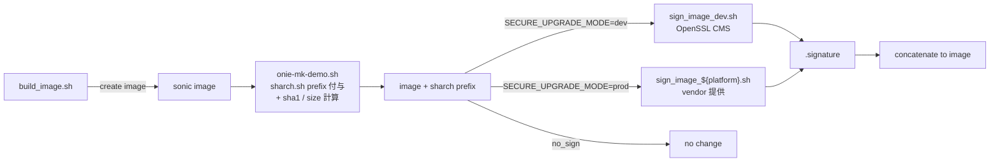
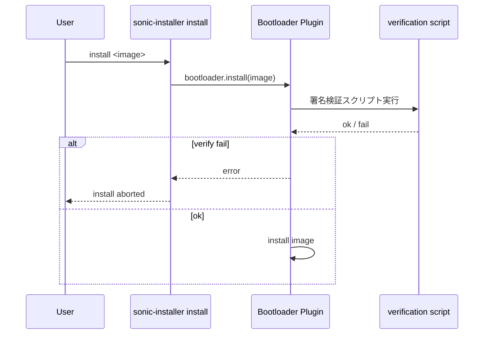

<!-- topics-tip -->
!!! tip "Topics で読み物として読む"
    この HLD は実装詳細を含む。機能の概念・設定・運用を読み物として読みたい場合は [Topics 15 章: Security / AAA / FIPS / Hardening](../topics/15-security-aaa/index.md) を参照。
<!-- /topics-tip -->

!!! success "裏取りステータス: code-verified"
    `sonic-buildimage` master の `slave.mk` / `rules/config` / `onie-mk-demo.sh` / `files/build_templates/sonic_version.yml.j2` で `SECURE_UPGRADE_MODE` 分岐を確認。`sign_image_dev` 系の参照も `onie-mk-demo.sh` に存在。`sonic-utilities/sonic_installer/main.py` には `verify_secureboot_image` / `is_secure_upgrade_image_verification_supported` の検証経路が実装されている。secure boot HLD（hld_secure_boot.md）と対をなす。

# Secure Upgrade（image 署名検証 / SECURE_UPGRADE_MODE）

## 概要

Secure Upgrade (SU) は **[SONiC](../reference/glossary.md#term-sonic) image が build から install まで改竄されていないこと** を CMS (Cryptographic Message Syntax) 署名で保証する仕組み[^1]。Build 時に署名を行い、`sonic-installer install` または **ONIE 経由インストール** で署名検証を実施する。Phase 1 では **dev / prod** 2 種の署名スクリプトを切替可能にし、prod では vendor が `sign_image_${platform}.sh` を提供する形を採る。Secure Boot (UEFI) を併用することで OS 起動経路全体を信頼チェーンで結ぶ。

## 動作仕様

### Build 側 (Signing)



`SECURE_UPGRADE_MODE` のモード[^1]:

| Value | 動作 |
|-------|------|
| `no_sign` | 既存 build と同じ（署名なし）|
| `dev` | `sign_image_dev.sh` で OpenSSL CMS 署名。鍵は `SECURE_UPGRADE_DEV_SIGNING_KEY`, `SECURE_UPGRADE_DEV_SIGNING_CERT` で指定 |
| `prod` | `sign_image_${platform}.sh` を vendor が提供。`sign_image_prod()` メソッドが `$output_image` / `$out_signature` を引数に受け、署名を `$out_signature` に出力 |

`onie-mk-demo.sh` で prefix `sharch.sh` を付け、image の sha1 と size を prefix 内に書き込む（install 時 verification の参照に使う）。

### Install 側 (Verification)



- 主な変更点は **`sonic-installer/main.py`** の bootloader 呼出し経路で、`sonic-installer install` 専用に署名検証ステップを追加する設計[^1]
- platform 個別の `install.sh` は触らず、Python 側で集約（platform 毎の保守を避ける）
- ONIE からの secure install には別 PR ([sonic-buildimage #11862](https://github.com/sonic-net/sonic-buildimage/pull/11862), [sonic-utilities #2337](https://github.com/sonic-net/sonic-utilities/pull/2337)) が必要[^1]

### Upgrade / Downgrade マトリクス

| From → To | 動作 |
|-----------|------|
| **non-secure SONiC/ONIE → secure SONiC** | 旧 image / ONIE には verification 機構が無いので、新 image を入れた後の **次回起動から secure** になる |
| **secure → secure** | install 時に検証実施。失敗で abort |
| **secure → non-secure** | downgrade 経路。secure boot が enable のままだと UEFI 段で弾かれる可能性[^1] |
| **secure-upgrade enabled ONIE → secure SONiC** | ONIE 側で署名検証してから image を書く |

### Configuration / CLI

[CONFIG_DB](../reference/glossary.md#term-config_db) / [YANG](../reference/glossary.md#term-yang) への新規追加は無し[^1]。`sonic-installer install` の挙動が変わるのみ。

### Build フラグまとめ

```text
SECURE_UPGRADE_MODE          = no_sign | dev | prod
SECURE_UPGRADE_DEV_SIGNING_KEY  = <path>
SECURE_UPGRADE_DEV_SIGNING_CERT = <path>
```

<!-- evidence:
source: sonic-net/SONiC/doc/secure_upgrade/secure_upgrade.md#L83-L97 (sha: 49bab5b5ff0e924f1ea52b3d9db0dfa4191a7c06)
excerpt: |
  Sign sonic image during build process in build_image.sh script ...
  When SECURE_UPGRADE_MODE == 'no_sign' no change will be made to the current build process.
  In case of SECURE_UPGRADE_MODE == 'dev', image will be signed by development script and when SECURE_UPGRADE_MODE == 'prod' - image will be signed by production script.
reasoning: build 時 dev/prod/no_sign の 3 モード切替の根拠。
-->

<!-- evidence-rendered:start -->
??? note "📋 検証エビデンス: sonic-net/SONiC/doc/secure_upgrade/secure_upgrade.md#L83-L97 (sha: 49bab5b5ff0e924f1ea52b3d9db0dfa4191a7c06)"

    **出典**:

    `sonic-net/SONiC/doc/secure_upgrade/secure_upgrade.md#L83-L97 (sha: 49bab5b5ff0e924f1ea52b3d9db0dfa4191a7c06)`

    **抜粋**:

    ```text
    Sign sonic image during build process in build_image.sh script ...
    When SECURE_UPGRADE_MODE == 'no_sign' no change will be made to the current build process.
    In case of SECURE_UPGRADE_MODE == 'dev', image will be signed by development script and when SECURE_UPGRADE_MODE == 'prod' - image will be signed by production script.
    ```

    **判断根拠**: build 時 dev/prod/no_sign の 3 モード切替の根拠。

<!-- evidence-rendered:end -->

## 制限事項

- UEFI / Secure Boot を含む arch サポートが必要
- ONIE 側 secure verification コードの組込み (PR #11862 / #2337) が前提
- prod 署名は vendor が `sign_image_${platform}.sh` を実装する必要
- secure → non-secure downgrade は secure boot 含めた整合確認が必要

## 干渉する機能

- **Secure Boot [HLD](../reference/glossary.md#term-hld) (`hld_secure_boot.md`)**: UEFI 段 chain of trust と接続
- **ONIE secure boot/upgrade**: 別 PR で組込
- **`sonic-installer`**: install path に検証ステップを挿入
- **`build_image.sh` / `onie-mk-demo.sh`**: build フラグ駆動

## 確認コマンド

Secure Upgrade 自体には独立した「検証専用」CLI は無い。署名検証は `sonic-installer install` 実行時に bootloader plugin の `verify_secureboot_image` / `verify_image_sign` メソッドが内部呼び出しする[^2]。状態確認は以下の周辺コマンドで間接的に行う。

- `sudo sonic-installer list` — installed / next image の一覧（`show boot` も内部でこのコマンドを呼ぶ[^3]）
- `show boot` — current / next image を確認する thin wrapper[^3]
- `sudo sonic-installer install <url>` — 検証失敗時は abort し、bootloader 側のスクリプト (`verify_image_sign.sh` 等) のエラーがログに出る[^2]
- `mokutil --sb-state` — UEFI Secure Boot 有効/無効の確認（Secure Boot 併用時）
- `cat /etc/sonic/sonic_version.yml` — `build_metadata` から build 時の `SECURE_UPGRADE_MODE` を間接確認

!!! warning "存在しない CLI に注意"
    `sonic-installer verify-image` という独立 subcommand は master の `sonic-utilities/sonic_installer/main.py` には存在しない（`install` / `list` / `set-default` / `set-next-boot` / `set-fips` / `get-fips` / `remove` / `binary-version` / `cleanup` / `rollback` 系のみ）[^2]。検証単体を行いたい場合は `bootloader.verify_secureboot_image()` を呼ぶカスタムスクリプトを書く必要がある。

## 引用元

[^1]: `sonic-net/SONiC` `doc/secure_upgrade/secure_upgrade.md` @ `49bab5b5ff0e924f1ea52b3d9db0dfa4191a7c06`
[^2]: `sonic-net/sonic-utilities` `sonic_installer/main.py` の `@sonic_installer.command(...)` 群（L527 以降）と `sonic_installer/bootloader/bootloader.py` の `verify_secureboot_image` / `verify_image_sign`、`sonic_installer/bootloader/grub.py` の `verify_image_sign`（`verify_image_sign.sh` 呼出し）@ master
[^3]: `sonic-net/sonic-utilities` `show/main.py` L2430-L2437（`show boot` は `sudo sonic-installer list` を呼ぶ wrapper）@ master

<!-- concerns hint:
- build_image.sh の SECURE_UPGRADE_MODE 分岐実装の sonic-buildimage 取り込み確認
- sign_image_dev.sh / sign_image_${platform}.sh の同梱と sign_image_prod 規約確認
- sharch.sh prefix と sha1 / size 検証の実装確認
- sonic-installer main.py での verification 経路の取り込み確認
- ONIE 側 PR #11862 / #2337 の merge 状況と互換性確認
- Secure Boot との chain of trust 整合確認
-->

<!-- topics-back-ref -->
## 関連 Topics

- [Topics: Security / AAA / FIPS / Hardening](../topics/15-security-aaa/index.md)

<!-- /topics-back-ref -->

<!-- glossary-links-injected: 8ba32e5aa69d -->
