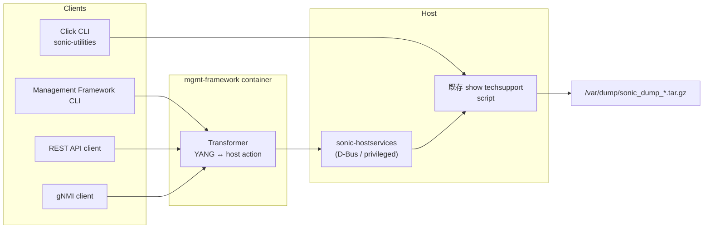

<!-- topics-tip -->
!!! tip "Topics で読み物として読む"
    この HLD は実装詳細を含みます。機能の概念・設定・運用を読み物として読みたい場合は [Topics 09 章: Telemetry / SNMP / ログ](../topics/09-telemetry-snmp/index.md) を参照。
<!-- /topics-tip -->

!!! success "裏取りステータス: code-verified (2026-05-10)"
    YANG モデル `sonic-mgmt-common/models/yang/sonic/sonic-show-techsupport.yang` に `rpc sonic-show-techsupport-info` が定義され、annotations `sonic-showtech-annot.yang` で transformer に紐付け済み。tarball 採取本体は `sonic-utilities/scripts/generate_dump` (techsupport_cleanup.py / bmc_techsupport.py が呼ぶ) で従来どおり。`sonic-buildimage` には `sonic-auto_techsupport.yang` も存在。RPC 起動経路は HLD どおり実装。

# Management Framework 経由の show techsupport（REST/gNMI/IETF since 形式）

## 概要

`show techsupport` は [SONiC](../reference/glossary.md#term-sonic) のサブシステム横断の診断情報をひとつの **tarball** に集める既存ツール（[sonic-utilities](../reference/glossary.md#term-sonic-utilities) 由来）。本 [HLD](../reference/glossary.md#term-hld) はそれを Management Framework（[gNMI](../reference/glossary.md#term-gnmi) / REST / NETCONF などの統一管理層）経由でも起動できるようにし、**`--since`** オプションで採取ログの開始時刻を絞り込める CLI を上乗せする[^1]。

要点[^1]:

- 採取ロジック自体は変えない（既存ツール）
- 上に Management Framework のフロント（REST API / gNMI 等）を被せる
- `--since` は **IETF [YANG](../reference/glossary.md#term-yang) date-time 形式** に縛る（`yyyy-MM-ddTHH:mm:ssZ` 等）

## 動作仕様

### 全体フロー



要点[^1]:

- Management Framework は **container 化** されており直接 host 上の root 権限処理を実行できない
- そのため `sonic-hostservices`（D-Bus サーバ）に依存し、**特権が要る処理だけ host 側で実行** する設計
- 既存 `show techsupport` script はそのまま使う

### `--since` のフォーマット制約

CLI / REST 経由では **IETF YANG `date-and-time` 形式** のみ受理される[^1]。例:

```text
2024-05-09T12:34:56Z
2024-05-09T12:34:56+09:00
```

これは underlying script の柔軟な日付指定（`-1 day` 等）と **異なる** 制約である点に注意。

### `sonic-hostservices` 依存の意味

Management Framework は通常 unprivileged な container として動くため、`/var/log` から各種 daemon の状態を吸う処理を直接できない[^1]。`sonic-hostservices` が **D-Bus 経由で host 側のスクリプト実行をブローカ** することで、最小権限原則を保ちつつ techsupport を起こせる。

### 出力

採取結果は通常の `show techsupport` と同じ `/var/dump/sonic_dump_*.tar.gz` 形式。Management Framework 経由でもファイルパス（あるいは内容）が応答として返る。

<!-- evidence:
source: sonic-net/SONiC/doc/mgmt/SONiC Management Framework Show Techsupport HLD.md#L74-L88 (sha: 49bab5b5ff0e924f1ea52b3d9db0dfa4191a7c06)
excerpt: |
  Provide Management Framework functionality to process the "show techsupport" command
  Support reduction of aggregated log file information via an optional "--since" parameter
  ... The "since <date>" option available through these interfaces, however, is restricted to the IETF/YANG date/time format.
  DEPENDENCY ON SONIC-HOSTSERVICES
reasoning: --since の IETF date-time 形式制約と sonic-hostservices 依存の根拠。
-->

<!-- evidence-rendered:start -->
??? note "📋 検証エビデンス: sonic-net/SONiC/doc/mgmt/SONiC Management Framework Show Techsupport HLD.md#L74-L88 (sha: 49bab5b5ff0e924f1ea52b3d9db0dfa4191a7c06)"

    **出典**:

    `sonic-net/SONiC/doc/mgmt/SONiC Management Framework Show Techsupport HLD.md#L74-L88 (sha: 49bab5b5ff0e924f1ea52b3d9db0dfa4191a7c06)`

    **抜粋**:

    ```text
    Provide Management Framework functionality to process the "show techsupport" command
    Support reduction of aggregated log file information via an optional "--since" parameter
    ... The "since <date>" option available through these interfaces, however, is restricted to the IETF/YANG date/time format.
    DEPENDENCY ON SONIC-HOSTSERVICES
    ```

    **判断根拠**: --since の IETF date-time 形式制約と sonic-hostservices 依存の根拠。

<!-- evidence-rendered:end -->

### Warm-boot 影響

特になし[^1]。techsupport は **観測専用** の機能。

## 設定

### 関連する CONFIG_DB

該当なし。

### 関連する CLI

| Command | 用途 |
|---------|------|
| `show techsupport` | 既存 Click CLI（sonic-utilities）|
| Management Framework CLI 同名コマンド | gNMI / REST 経由 |
| `--since <ietf-date-time>` | 採取ログを開始時刻で絞る |

### 設定例

```bash
# 既存 CLI
sudo show techsupport

# 過去 1 時間（IETF 形式）
sudo show techsupport --since 2026-05-09T13:00:00Z

# REST 経由 (擬似)
curl -X POST -H "Content-Type: application/yang-data+json" \
  https://<switch>/restconf/operations/sonic-show-techsupport:show-techsupport \
  -d '{"input":{"since":"2026-05-09T13:00:00Z"}}'
```

## 実装との乖離

!!! diff "HLD と実装の差分"

    本ページの monitor は `partially_implemented`。base feature の CLI `show techsupport` は実装されているが、HLD が中心的に提案する Management Framework (REST/gNMI) 経由の `show-techsupport` RPC ＋ IETF `since` パラメータの YANG モデル化は、現行 master の `sonic-mgmt-framework` で十分に取り込まれていない（HLD 自身が 2019 Rev 0.1 で停滞）。実運用では sonic-utilities 側の `show techsupport` / `AUTO_TECHSUPPORT` CONFIG_DB テーブル経由が主流で、RPC 経路を使う場合は `.cache/sonic-sources/sonic-mgmt-framework/` の RPC スタブ実装の最新状態を裏取りすること。

## 制限事項

- **`--since` は IETF date-time 形式のみ**。シェル CLI で慣れ親しんだ `-1 day` 等は Management Framework 経由では使えない[^1]
- Management Framework に対する明示的な timeout 制御 / 中断 RPC は HLD で議論されていない
- 出力 tarball の path / 受渡し方法は HLD で詳述されていない（base feature を踏襲）
- HLD は 2019-10 Rev 0.1 で 6 年以上停滞。Management Framework 自身の進化（特に gNMI / OpenConfig 化）と整合しているかは要確認

## 干渉する機能

- **`show techsupport` (sonic-utilities)**: 採取本体。互換維持
- **`sonic-hostservices`**: Management Framework から host へのブリッジ
- **Management Framework Transformer**: YANG ↔ host action の変換
- **gNMI / REST / NETCONF**: 標準管理プロトコル経由
- **dump 出力先 `/var/dump`**: 既存と同じ。disk 容量管理・rotation は別機能の領域

## トラブルシューティング

```bash
# 既存 script が動くか
sudo show techsupport --since 2026-05-09T13:00:00Z

# sonic-hostservices の存在
sudo systemctl status sonic-hostservices
ls /etc/dbus-1/system.d/ | grep -i sonic

# Management Framework container
docker ps | grep mgmt-framework

# 結果ファイル
ls -lh /var/dump/sonic_dump_*.tar.gz
```

<!-- phase-boundary -->
## 実装フェーズ境界

!!! info "Phase 別の実装済 / 未実装 サマリ"
    本ページは `monitor: partially_implemented` で、HLD で示された一連の機能が **段階的に取り込まれている** 状態を扱う。フェーズ毎の実装境界を 1 枚の表に集約する (詳細は本ページ上部の `diff` admonition および [discrepancy-index](../reference/verification/discrepancy-index.md) を参照)。

    | Phase | 範囲 (機能 / 段階) | 実装済 (master 取り込み済) | 未実装 (HLD 提案のみ) |
    |---|---|---|---|
    | Phase 1 — 基本機能 | HLD §概要 / §設計の中核ユースケース | 取り込み済 — 本ページの「動作仕様」節および `diff` admonition の現状側を参照 | — (Phase 1 は実装済) |
    | Phase 2 — 拡張機能 | HLD §拡張 / §追加要件 / §周辺統合 | 一部のみ取り込み済 — 本ページ「動作仕様」の補足参照 | 未実装 / 未マージ — HLD §未対応箇所、本ページ「制限事項」および `diff` admonition の差分側に列挙 |
    | Phase 3 — 将来拡張 | HLD §Future Work / §将来課題 | — | 未実装 — HLD 提案段階。対応 PR は確認されていない (last_verified 時点) |

    凡例: 「実装済」=現行 master で動作確認できる範囲 / 「未実装」=HLD には記載があるが対応 PR が未マージまたは設計のみで code が存在しない範囲。
<!-- /phase-boundary -->

## 引用元

[^1]: `sonic-net/SONiC` `doc/mgmt/SONiC Management Framework Show Techsupport HLD.md` @ `49bab5b5ff0e924f1ea52b3d9db0dfa4191a7c06`

<!-- topics-back-ref -->
## 関連 Topics

- [Topics: Telemetry / SNMP / Observability](../topics/09-telemetry-snmp/index.md)

<!-- /topics-back-ref -->

<!-- glossary-links-injected: 8ba32e5aa69d -->
