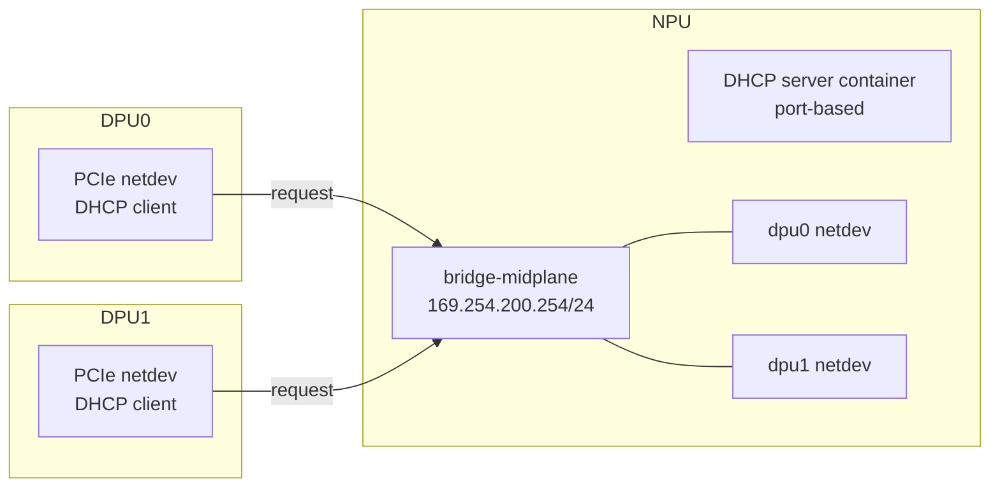

<!-- topics-tip -->
!!! tip "Topics で読み物として読む"
    この HLD は実装詳細を含む。機能の概念・設定・運用を読み物として読みたい場合は [Topics 13 章: DASH / SmartSwitch](../topics/13-dash-smartswitch/index.md) を参照。
<!-- /topics-tip -->

!!! info "裏取りステータス: code-verified"
    `sonic-buildimage/files/image_config/midplane-network/` 配下に `bridge-midplane.netdev` / `bridge-midplane.network` / `dummy-midplane.network` / `define-npu-specific-netdevs.sh` を確認。`DHCP_SERVER_IPV4` / `DHCP_SERVER_IPV4_PORT` テーブルは `src/sonic-yang-models/doc/Configuration.md`、`src/sonic-config-engine/config_samples.py`、`src/sonic-dhcp-utilities/` で参照されている。Smart Switch midplane bridge / DHCP server 経路は master 取り込み済み。

# Smart Switch DPU IP アドレス割当（midplane bridge / DHCP server）

## 概要

[DASH](../reference/glossary.md#term-dash) [SmartSwitch](../reference/glossary.md#term-smartswitch) では [NPU](../reference/glossary.md#term-npu) と各 [DPU](../reference/glossary.md#term-dpu) が **PCIe ベースの control plane interface (netdev)** で繋がる[^1]。本 [HLD](../reference/glossary.md#term-hld) は DPU 側の IP アドレス割当を **NPU 側の DHCP server + midplane bridge** で行い、DPU は**ステートレスに DHCP client として起動するだけ**にする設計を提案する。割当 deterministic（DPU id ベース）、port-based（同 DPU はいつも同 IP）、PXE boot 互換、を満たす。`169.254.0.0/16` 系 link-local subnet を使うことで他ネットワークとの衝突を回避する。

## 動作仕様

### Topology



NPU 側に **`bridge-midplane`** を作って各 DPU の PCIe netdev を bridge member にする。bridge には **固定 IP** を持たせる（`169.254.200.254/24`）。各 DPU は bridge 経由で DHCP request を送り、port-based の lease で IP を受ける。

### 割当ルール

- DPU id N の IP = `<bridge_network>` + (N + 1)
- 例: bridge `169.254.200.254/24` で DPU0 → `169.254.200.1`、DPU1 → `169.254.200.2`[^1]
- リース期間は HLD では `infinite`（state を持たない）を意図しているが、現行の `src/sonic-config-engine/config_samples.py` 実装では `3600`（1 時間）がハードコードされている（`smart-switch-dpu.md` の Phase E 定数表で確認済み）

### `platform.json` 拡張

NPU 側:

```json
{
  "DPUS": {
    "dpu0": { "midplane_interface": "dpu0" },
    "dpu1": { "midplane_interface": "dpu1" }
  },
  "midplane_network": {
    "bridge_name": "bridge-midplane",
    "bridge_address": "169.254.200.254/24"
  }
}
```

DPU 側:

```json
{
  "DPU": {},
  "midplane_network": { "bridge_address": "169.254.200.254/24" }
}
```

DPU の PCIe netdev 名は **`dpu0`, `dpu1`, ...** prefix で始める命名規約[^1]。Vendor は init 時にこの名前で expose する。

### CONFIG_DB（sonic-cfggen 生成）

```text
DEVICE_METADATA|localhost:
  switch_type = switch
  type        = LeafRouter
  subtype     = SmartSwitch

MID_PLANE_BRIDGE|GLOBAL:
  bridge = bridge-midplane

DHCP_SERVER_IPV4|bridge-midplane:
  gateway    = 169.254.200.254
  lease_time = 3600   # HLD は infinite を意図するが、現行実装では 3600 秒固定
  mode       = PORT
  netmask    = 255.255.255.0
  state      = enabled

DHCP_SERVER_IPV4_PORT|bridge-midplane|dpu0:
  ips = ["169.254.200.1"]
DHCP_SERVER_IPV4_PORT|bridge-midplane|dpu1:
  ips = ["169.254.200.2"]
```

### NPU 側の起動

1. `systemd-sonic-generator` が `platform.json` から:
   - `bridge-midplane.netdev` (Kind=bridge)
   - `bridge-midplane.network` (Address=169.254.200.254/24)
   - `midplane-network-npu.network` (Match Name=dpu*, Bridge=bridge-midplane)

   を生成
2. `systemd-networkd` が bridge を作成し、PCIe `dpu*` netdev が出現するたび bridge に加える
3. `midplane-network-npu.service`（oneshot）が `systemd-networkd-wait-online -i bridge-midplane` で UP 待ち、`database.service` の `Before=` で先行完了を保証[^1]
4. DHCP server container がデフォルト enable で起動し、`DHCP_SERVER_IPV4*` を読んで lease 払出

### DPU 側の起動

DPU では DHCP client (`midplane-network-dpu.service` 経由) を **PCIe netdev で起動**するだけ。state を持たないので reboot 後も同じ IP が再払出される（NPU 側の port-based 設定で deterministic）[^1]。

### 構成生成タイミング

- 初回起動で [CONFIG_DB](../reference/glossary.md#term-config_db) が空の場合
- `config-setup.service` 再起動による recovery
- いずれも [sonic-cfggen](../reference/glossary.md#term-sonic-cfggen) が `t1-smartswitch` テンプレートと `platform.json` から生成

<!-- evidence:
source: sonic-net/SONiC/doc/smart-switch/ip-address-assigment/smart-switch-ip-address-assignment.md#L80-L104 (sha: 49bab5b5ff0e924f1ea52b3d9db0dfa4191a7c06)
excerpt: |
  DHCP server on the switch side shall be used. ... port-based which guarantees the deterministic behavior,
  the same DPU shall always receive the same IP address on request.
  ... bridge interface ("midplane bridge") shall be used. ... IPv4 link-local subnetwork is chosen.
reasoning: midplane bridge + DHCP port-based + link-local subnet 採用の根拠。
-->

<!-- evidence-rendered:start -->
??? note "📋 検証エビデンス: sonic-net/SONiC/doc/smart-switch/ip-address-assigment/smart-switch-ip-address-assignment.md#L80-L104 (sha: 49bab5b5ff0e924f1ea52b3d9db0dfa4191a7c06)"

    **出典**:

    `sonic-net/SONiC/doc/smart-switch/ip-address-assigment/smart-switch-ip-address-assignment.md#L80-L104 (sha: 49bab5b5ff0e924f1ea52b3d9db0dfa4191a7c06)`

    **抜粋**:

    ```text
    DHCP server on the switch side shall be used. ... port-based which guarantees the deterministic behavior,
    the same DPU shall always receive the same IP address on request.
    ... bridge interface ("midplane bridge") shall be used. ... IPv4 link-local subnetwork is chosen.
    ```

    **判断根拠**: midplane bridge + DHCP port-based + link-local subnet 採用の根拠。

<!-- evidence-rendered:end -->

## 制限事項

- DPU PCIe netdev 命名 `dpu<N>` を vendor が遵守する必要
- IP は `169.254.0.0/16` 内推奨だが platform で上書き可（衝突注意）
- DHCP server コンテナ取込み（[SONiC PR #1282](https://github.com/sonic-net/SONiC/pull/1282)）が前提
- DPU 側でも `midplane_network.bridge_address` を持つが、これは情報共有用で systemd-networkd 起動には不要

## 干渉する機能

- **DPU graceful shutdown / DPU upgrade**: midplane network が落ちると [gNOI](../reference/glossary.md#term-gnoi) 経路も使えない
- **DHCP server container**: 既存実装をそのまま再利用
- **systemd-networkd**: bridge / network 設定の生成基盤
- **`config-setup` / sonic-cfggen**: `t1-smartswitch` テンプレ
- **DASH HA / hamgrd**: midplane が NPU↔DPU の lifeline

## 確認コマンド

- `ip -d link show bridge-midplane` / `ip addr show bridge-midplane` — midplane bridge と IP 割り当て
- `systemctl status midplane-network-npu midplane-network-dpu` — bridge 立上げ用 oneshot サービス
- `sonic-db-cli CONFIG_DB hgetall "MID_PLANE_BRIDGE|GLOBAL"` — bridge IP/subnet の宣言
- `sonic-db-cli CONFIG_DB keys "DHCP_SERVER_IPV4_PORT|*"` — port-based static lease の DPU 割当

### コマンド例

DPU 向け IP assignment 状態を確認する。

```bash
show chassis modules midplane-status
redis-cli -n 4 keys 'MID_PLANE_BRIDGE|*'
redis-cli -n 4 keys 'DHCP_SERVER_IPV4|*'
ip -br addr show
```

## 引用元

[^1]: `sonic-net/SONiC` `doc/smart-switch/ip-address-assigment/smart-switch-ip-address-assignment.md` @ `49bab5b5ff0e924f1ea52b3d9db0dfa4191a7c06`

<!-- concerns hint:
- bridge-midplane の systemd-networkd 設定 (.netdev / .network) と systemd-sonic-generator 取り込み確認
- midplane-network-npu.service / dpu.service の oneshot 起動と database.service Before= 連携確認
- DHCP_SERVER_IPV4 / DHCP_SERVER_IPV4_PORT の sonic-yang-models 反映確認
- t1-smartswitch topology テンプレートの sonic-cfggen 取り込み確認
- DPU PCIe netdev 名 dpu<N> の vendor init での確立方法と整合確認
- DHCP server container (sonic-net/SONiC#1282) の master 取り込み確認
-->

<!-- topics-back-ref -->
## 関連 Topics

- [Topics: DASH と SmartSwitch](../topics/13-dash-smartswitch/index.md)

<!-- /topics-back-ref -->

<!-- glossary-links-injected: 5c254bd30f13 -->
