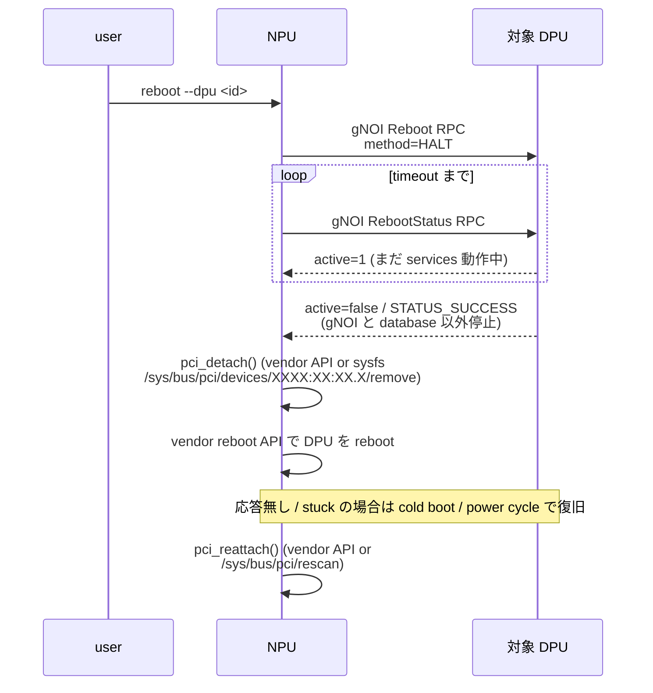
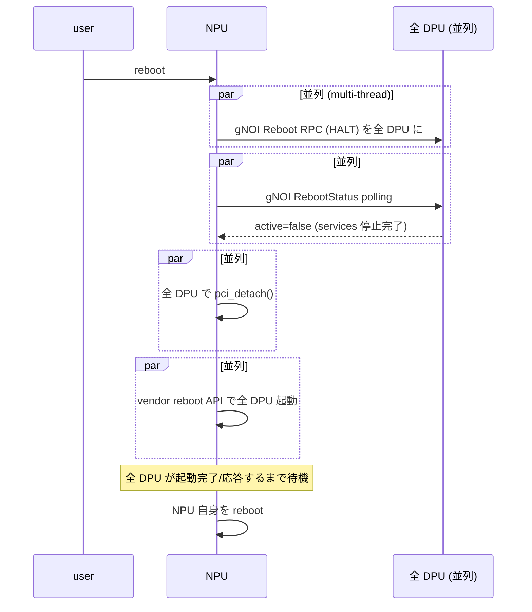

<!-- topics-tip -->
!!! tip "Topics で読み物として読む"
    この HLD は実装詳細を含みます。機能の概念・設定・運用を読み物として読みたい場合は [Topics 11 章: Reboot / Warm/Fast/Express/Cold](../topics/11-reboot/index.md) を参照。
<!-- /topics-tip -->

!!! success "裏取りステータス: code-verified"
    実装裏取り済み（下記コード位置）。ModuleBase: sonic-platform-common/sonic_platform_base/module_base.py:411 (pci_detach), 420 (pci_reattach), 504 (dpu_reboot_timeout) / reboot script: sonic-utilities/scripts/reboot:55-56 (DPU_MODULE_NAME, REBOOT_DPU), :153 (-d オプション), :223-224, :290 (handle_smart_switch), :298 (smartswitch + REBOOT_DPU=yes), reboot_smartswitch_helper で確認。

# SmartSwitch reboot 順序（NPU → 各 DPU の gNOI HALT → PCI detach → 個別 reboot）

## 概要

[SmartSwitch](../reference/glossary.md#term-smartswitch) は [NPU](../reference/glossary.md#term-npu) 1 個 + 複数 [DPU](../reference/glossary.md#term-dpu) から成り、DPU は **PCIe** で NPU 側 CPU に接続される（front panel は NPU のみ）。各 DPU は内部管理 IP を持ち [Redis](../reference/glossary.md#term-redis) / ZMQ / [gNMI](../reference/glossary.md#term-gnmi) を提供する。本 [HLD](../reference/glossary.md#term-hld) は次の 3 通りの **cold-reboot** 順序を定める[^1]:

1. **DPU 単独 reboot**（特定の DPU だけ再起動）
2. **SmartSwitch 全体 reboot**（NPU + 全 DPU）
3. (失敗・パニック等の) **異常 reboot**

> SmartSwitch は warm-reboot を **未サポート**[^1]。すべて cold-reboot ベース。

## 動作仕様

### 前提

- NPU 上で **[gNOI](../reference/glossary.md#term-gnoi) client**、各 DPU 上で **gNOI server**[^1]
- NPU と DPU 間は内部管理 IP（midplane bridge）で通信
- NPU / DPU の [SONiC](../reference/glossary.md#term-sonic) host service は graceful shutdown を行う

### DPU 単独 reboot のシーケンス



要点[^1]:

- `RebootMethod=HALT` で **gNOI と database 以外** の service を停止
- `RebootStatus.active` フラグで終了確認（1=まだ動いている、false=完了）
- PCI detach **しないで** reboot すると NPU 側 kernel が DPU の PCIe を握ったままになって不整合
- 復帰後 `pci_reattach()` または `/sys/bus/pci/rescan` で再認識

### SmartSwitch 全体 reboot のシーケンス



要点[^1]:

- DPU は **並列** に再起動（multi-thread）。1 台ずつ直列にやる設計ではない
- DPU 全部の reboot 完了を待ってから **NPU 自身を reboot**
- 各 DPU は再起動完了後 `DPU_READY` state へ遷移
- vendor API は failure handling と全 failure log 出力が責務

<!-- evidence:
source: sonic-net/SONiC/doc/smart-switch/reboot/reboot-hld.md#L86-L99 (sha: 49bab5b5ff0e924f1ea52b3d9db0dfa4191a7c06)
excerpt: |
  the NPU transmits a gNOI Reboot RPC signal with RebootMethod set to 'HALT'
  ... gNOI RebootStatus RPC ... STATUS_SUCCESS and 'active' will be set to false
  ... NPU detaches the DPU PCI device via the pci_detach() vendor API, or ... echo 1 > /sys/bus/pci/devices/XXXX:XX:XX.X/remove
  ... pci_reattach() vendor API or ... echoing '1' to /sys/bus/pci/rescan
reasoning: gNOI HALT/RebootStatus フローと PCI detach/reattach の vendor API / sysfs フォールバック経路の根拠。
-->

<!-- evidence-rendered:start -->
??? note "📋 検証エビデンス: sonic-net/SONiC/doc/smart-switch/reboot/reboot-hld.md#L86-L99 (sha: 49bab5b5ff0e924f1ea52b3d9db0dfa4191a7c06)"

    **出典**:

    `sonic-net/SONiC/doc/smart-switch/reboot/reboot-hld.md#L86-L99 (sha: 49bab5b5ff0e924f1ea52b3d9db0dfa4191a7c06)`

    **抜粋**:

    ```text
    the NPU transmits a gNOI Reboot RPC signal with RebootMethod set to 'HALT'
    ... gNOI RebootStatus RPC ... STATUS_SUCCESS and 'active' will be set to false
    ... NPU detaches the DPU PCI device via the pci_detach() vendor API, or ... echo 1 > /sys/bus/pci/devices/XXXX:XX:XX.X/remove
    ... pci_reattach() vendor API or ... echoing '1' to /sys/bus/pci/rescan
    ```

    **判断根拠**: gNOI HALT/RebootStatus フローと PCI detach/reattach の vendor API / sysfs フォールバック経路の根拠。

<!-- evidence-rendered:end -->

### `ModuleBase` の新 API

`ModuleBase`（platform_api 内）に DPU を扱う新メソッドが追加される[^1]:

- `pci_detach()`: vendor が PCIe バス上から DPU を外す
- `pci_reattach()`: 起動完了後に再認識
- DPU 単独再起動 API（vendor 提供）
- DPU 状態確認系（`DPU_READY` 等）

### NPU 側 `platform.json`

各 DPU の slot / PCIe BDF / 内部 IP / module 名等を `platform.json` で表現[^1]。NPU が DPU を識別するためのメタデータ。

### `reboot` script / CLI

既存 `reboot` script[^1] にサブコマンドを追加:

- `reboot` （SmartSwitch 全体）
- `reboot --dpu <id>` 等（特定 DPU。具体的な flag 名は HLD で確定的に書かれていない）

### PCIe daemon の対応

`pcied`（PCIe device daemon）は DPU の脱着を検出して `STATE_DB` に反映する。reboot 時の PCI detach / reattach も状態遷移として正しく扱う必要がある[^1]。

### 異常時のハンドリング

DPU stuck の場合、vendor reboot API が **cold boot / power cycle** にフォールバックして強制復旧[^1]。失敗は全件 log 出力が義務。

## 設定

### 関連する CONFIG_DB

該当なし。本機能はランタイムの reboot 制御で、[CONFIG_DB](../reference/glossary.md#term-config_db) は持たない。

### 関連する CLI

`reboot` コマンドの拡張。具体形は実装側で確認。

### 設定例

```bash
# SmartSwitch 全体
sudo reboot

# 特定 DPU
sudo reboot --dpu 0    # 例。実際の flag 名は確認のこと
```

## 制限事項

- **warm-reboot は scope 外 / 非対応**[^1]
- vendor API（`pci_detach` / `pci_reattach` / `dpu_reboot`）が無いと sysfs フォールバックが必須
- DPU stuck からの復旧は vendor の power cycle 機構に依存（実装差あり）
- DPU の reboot 中は対応 [ENI](../reference/glossary.md#term-eni) への traffic は止まる（HA を組んでいなければ）
- HLD は 2024-05 〜 11 で改訂中。詳細フローは HLD `doc/smart-switch/reboot/reboot-hld.md` を参照

## 干渉する機能

- **SmartSwitch HA**: HA 設定がある DPU を reboot するとき、HA shutdown フローと整合させる必要
- **SmartSwitch DB design**: per-DPU の database container は DPU reboot 中も NPU 側で生きている
- **gNOI / gNMI**: HALT を出す経路。gNOI server が DPU 側で常時動作している前提
- **PCIe daemon (`pcied`)**: PCI detach/reattach の状態を監視・記録
- **fastboot**: SmartSwitch では未対応

## トラブルシューティング

```bash
# DPU が PCI 上に居るか
ls /sys/bus/pci/devices/

# pcied のログ
docker logs pmon 2>&1 | grep -i pcie
journalctl | grep -i pci

# gNOI Reboot 経路
docker exec gnmi sh -c 'ls /etc/sonic/gnmi*'

# vendor API の存在
python3 -c "from sonic_platform.module import Module; m = Module(0); print(m.pci_detach)"
```

## 引用元

[^1]: `sonic-net/SONiC` `doc/smart-switch/reboot/reboot-hld.md` @ `49bab5b5ff0e924f1ea52b3d9db0dfa4191a7c06`

<!-- topics-back-ref -->
## 関連 Topics

- [Topics: DASH と SmartSwitch](../topics/13-dash-smartswitch/index.md)

<!-- /topics-back-ref -->

<!-- glossary-links-injected: 8ba32e5aa69d -->
