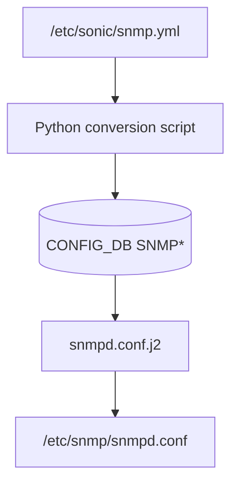

<!-- topics-tip -->
!!! tip "Topics で読み物として読む"
    この HLD は実装詳細を含みます。機能の概念・設定・運用を読み物として読みたい場合は [Topics 09 章: Telemetry / SNMP / ログ](../topics/09-telemetry-snmp/index.md) を参照。
<!-- /topics-tip -->

!!! success "裏取りステータス: code-verified（基本構成のみ）"
    現行 master で `config snmp` グループ (`sonic-utilities/config/main.py:4261`)、`docker-snmp/snmpd.conf.j2` の CONFIG_DB ベース設定、`sonic-yang-models` の `sonic-snmp.yang` を確認。SNMP / SNMP_COMMUNITY / SNMP_USER テーブルは現行 yang に取り込まれている。`snmp.yml` → CONFIG_DB ワンタイム変換スクリプトの場所は明示できなかったが、CONFIG_DB ベース運用は標準化済み（verified at: 2026-05-09）。

# SNMP 設定の snmp.yml → CONFIG_DB 移行

## 概要

`/etc/sonic/snmp.yml` には community / location が、[CONFIG_DB](../reference/glossary.md#term-config_db) には [ACL](../reference/glossary.md#term-acl) のみが入る、という分散した [SNMP](../reference/glossary.md#term-snmp) 設定状態を解消し、**全 SNMP 設定を CONFIG_DB に集約** するための移行設計。コンテナ起動時に従来の yaml を読み込んで CONFIG_DB に流し込むコンバータを併走させ、後方互換性を保ったまま乗り換える計画[^1]。

3 つの新規 CONFIG_DB テーブル `SNMP` / `SNMP_COMMUNITY` / `SNMP_USER` が `doc/snmp/snmp-schema-addition.md` で定義されており、本ページはそれを使う側の運用と CLI を扱う。

## 動作仕様

### CONFIG_DB スキーマ

```text
SNMP|LOCATION       Location → "<location string>"
SNMP|CONTACT        <contact_name> → "<email>"

SNMP_COMMUNITY|<community>
    TYPE = "RO" | "RW"

SNMP_USER|<user>
    SNMP_USER_TYPE              = "noAuthNoPriv" | "AuthNoPriv" | "Priv"
    SNMP_USER_PERMISSION        = "RO" | "RW"
    SNMP_USER_AUTH_TYPE         = "MD5" | "SHA" | "HMAC-SHA-2"
    SNMP_USER_AUTH_PASSWORD     = "<auth password>"
    SNMP_USER_ENCRYPTION_TYPE   = "DES" | "AES"
    SNMP_USER_ENCRYPTION_PASSWORD = "<enc password>"
```

### 移行プラン



1. `docker-snmp` 起動時に Python コンバータが `snmp.yml` を読み、上記 3 テーブルに書き込む（毎回実行で冪等）。
2. `Dockerfile.j2` でコンバータを `/usr/bin/` に配置。
3. `snmpd.conf.j2` を CONFIG_DB のみから生成するよう改修。
4. `start.sh` で `sonic-cfggen` の `-y /etc/sonic/snmp.yml` 引数を撤去（代わりにコンバータが先に走る）[^1]。

これにより既存の snmp.yml ベースのデバイスは挙動を変えずに新 docker に乗り換えられ、新規導入では CLI から CONFIG_DB に直接書ける。

## 設定

### 関連する CONFIG_DB

| Table | Key | 説明 |
|-------|-----|------|
| `SNMP` | `LOCATION` / `CONTACT` | ロケーション / コンタクト |
| `SNMP_COMMUNITY` | `<community>` | RO/RW community 定義 |
| `SNMP_USER` | `<user>` | SNMPv3 ユーザ（auth/priv 含む） |

### 関連する CLI

```text
config snmp community add <community> <RO|RW>
config snmp community del <community>
config snmp community replace <old> <new>

config snmp contact add <name> <email>
config snmp contact del <name>
config snmp contact modify <name> <email>

config snmp location add|del|modify <location>

config snmp user add <user> <noAuthNoPriv|AuthNoPriv|Priv> <RO|RW> \
    <MD5|SHA|HMAC-SHA-2> <auth_password> <DES|AES> <encrypt_password>
config snmp user del <user>

show run snmp [community|contact|location|user] [--json]
```

### 関連する YANG

[HLD](../reference/glossary.md#term-hld) に [YANG](../reference/glossary.md#term-yang) 追加の記述は無い（`snmp-schema-addition.md` 側で示唆されるのみ）。

### 設定例

```bash
sudo config snmp location add "Emerald City"
sudo config snmp contact add joe joe@contoso.com
sudo config snmp community add Jack RW
sudo config snmp user add Travis Priv RO SHA TravisAuthPass AES TravisEncryptPass
show run snmp community
```

## 制限事項

- HLD は移行用コンバータの最終形式（snmp.yml 削除タイミング）を明示していない。「将来的に snmp.yml を撤去する」とする方針のみ[^1]。
- `SNMP_COMMUNITY.TYPE` の `RW` は将来用で、当時は実装側で `RO` のみが有効と他 HLD で言及されている。
- パスワードは平文で CONFIG_DB に入る点に注意（既存の [sonic-utilities](../reference/glossary.md#term-sonic-utilities) の慣例どおり）。

## 干渉する機能

- **既存 ACL の `SNMP_ACL`**: 本機能とは独立に CONFIG_DB に存在する。SNMP デーモンの ACL 部分は本機能の対象外。
- **`docker-snmp` 起動順**: CONFIG_DB が先に上がっていることが前提。`hostcfgd` の起動依存は変更されない。
- **Watchdog / SNMP trap**: trap は別途 `SNMP_TRAP_CONFIG` テーブル等で管理（本 HLD のスコープ外）。

## トラブルシューティング

- 移行後にコミュニティが効かない → コンバータ実行ログ（`docker logs snmp`）で yaml→DB 変換が成功しているか確認。
- `show run snmp community` が空 → `redis-cli -n 4 keys 'SNMP_COMMUNITY|*'` で実体を確認。
- snmpd.conf に古い情報が残る → `snmpd.conf.j2` が CONFIG_DB のみ参照する版に更新されているか確認。


### コマンド例

SNMP CONFIG_DB と従来 snmp.yml の整合を確認する。

```bash
show runningconfiguration snmp
redis-cli -n 4 keys 'SNMP*'
diff /etc/sonic/snmp.yml.bak <(show runningconfiguration snmp)
snmpwalk -v2c -c public localhost system
```

## 引用元

[^1]: `sonic-net/SONiC` `doc/snmp/snmp-configdb-migration-hld.md` @ `49bab5b5ff0e924f1ea52b3d9db0dfa4191a7c06`

<!-- topics-back-ref -->
## 関連 Topics

- [Topics: Telemetry / SNMP / Observability](../topics/09-telemetry-snmp/index.md)

<!-- /topics-back-ref -->

<!-- glossary-links-injected: a44572fede5f -->
