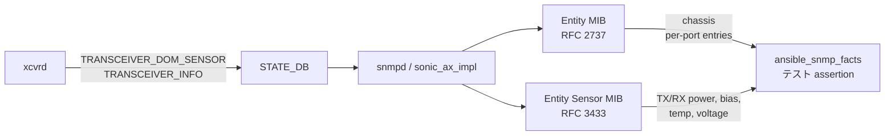

<!-- topics-tip -->
!!! tip "Topics で読み物として読む"
    この HLD は実装詳細を含みます。機能の概念・設定・運用を読み物として読みたい場合は [Topics 09 章: Telemetry / SNMP / ログ](../topics/09-telemetry-snmp/index.md) を参照。
<!-- /topics-tip -->

!!! info "裏取りステータス: code-verified（test plan）"
    検査対象 MIB の sonic-snmpagent 実装（`src/sonic_ax_impl/mibs/ietf/rfc2737.py` Entity MIB、`rfc3433.py` Entity Sensor MIB、`physical_entity_sub_oid_generator.py`、`sensor_data.py`）の存在を確認。sonic-mgmt 側のテストコードは本サイト裏取り対象外（test plan の網羅性のみ確認）。down/未挿入 port の MIB 出力やセンサ単位（dBm vs uW）は実装/ベンダ依存。

# SNMP Transceiver Monitoring テストプラン（Entity MIB / Entity Sensor MIB）

## 概要

光トランシーバの DOM（Digital Optical Monitoring）情報—TX power / RX power / TX bias / temperature / voltage—を [SONiC](../reference/glossary.md#term-sonic) は [SNMP](../reference/glossary.md#term-snmp) 経由で外部に公開する。MIB は IETF 標準の[^1]:

- **RFC 2737 Entity MIB**（chassis / port / sensor 等の物理エンティティのインベントリ）
- **RFC 3433 Entity Sensor MIB**（sensor の数値・単位・タイムスタンプ）

このドキュメントは関連の [sonic-mgmt](../reference/glossary.md#term-sonic-mgmt) 側 SNMP テスト拡張の **test plan** をまとめたもの。本ページではテストの構造から、何を満たせば SONiC 側実装が「testbed として正しく動く」と言えるかを抽出する。

## 動作仕様（テスト観点）

### Test Case 1: CHASSIS OID

| 項目 | 期待 |
|------|------|
| `$CHASSIS_OID` が `snmp_facts` の Entity Table に存在 | 存在する |

最低限「シャーシ自体が Entity MIB の root として現れる」ことを確認。

### Test Case 2: Port ごとの Entity MIB エントリ

`minigraph_ports`（minigraph 由来の被テスト port 集合）について[^1]:

1. 各 "UP" port が Entity MIB にエントリを持つこと
2. 各 port が **5 種の sensor**（TX power / RX power / TX bias / Temperature / Voltage）の MIB エントリを持つこと

### Test Case 3: Entity Sensor MIB との整合

Entity MIB に存在する sensor は **すべて** Entity Sensor MIB にも対応エントリがあること（センサ値が無効値でも、エントリ自体は存在しなければならない）[^1]。



### "UP" port 限定の理由

光モジュールが未挿入 / port が admin down の場合は DOM が読めず、Entity Sensor MIB に有効値が出ない可能性がある。テストは **UP port だけ** を母集合にすることで偽陽性を避けている[^1]。

## 設定

### 関連する CONFIG_DB

該当なし。本テスト計画はテスト側の動作確認であり、[CONFIG_DB](../reference/glossary.md#term-config_db) は使わない。

### 関連する CLI

該当なし。`snmpwalk` や ansible の `snmp_facts` モジュールがテストの主体。

### 設定例

```bash
# テスト的に確認する場合
snmpwalk -v2c -c <community> <DUT> entPhysicalTable | head
snmpwalk -v2c -c <community> <DUT> entitySensorValue
```

`entityMib` (.1.3.6.1.2.1.47) と `entitySensorMib` (.1.3.6.1.2.1.99) を walk して、port ごとに 5 sensor のエントリが揃うことを確認する。

## 制限事項

- テスト対象は **UP port のみ**[^1]。down port や未挿入 port の MIB エントリ仕様は本 test plan の対象外
- ベンダ実装が Entity Sensor MIB の `entitySensorValue` を返さない場合、test case 3 の「エントリ存在」判定は通っても値が無効値になる
- [HLD](../reference/glossary.md#term-hld) は Rev 0.2、日付欄空欄。テスト範囲は最低限の存在確認に留まり、値の妥当性検証（正常値 vs 警告値）は別テストプランの管轄

## 干渉する機能

- **xcvrd**: [STATE_DB](../reference/glossary.md#term-state_db) の `TRANSCEIVER_DOM_SENSOR` / `TRANSCEIVER_INFO` を埋めないと SNMP 側に何も出ない
- **`extension-to-physical-entity-mib`** HLD: SONiC は Entity MIB を独自拡張しており、その仕様と整合する必要
- **sonic-snmpagent / sonic_ax_impl**: SONiC の SNMP 実装。Python ベースで、STATE_DB を見て MIB を作る
- **sonic-mgmt**: 実際にこのテストを動かす testbed フレームワーク

## トラブルシューティング

```bash
# DOM が STATE_DB に来ているか
redis-cli -n 6 KEYS "TRANSCEIVER_DOM_SENSOR|*" | head
redis-cli -n 6 HGETALL "TRANSCEIVER_DOM_SENSOR|Ethernet0"

# snmpd が動いているか
sudo systemctl status snmpd
docker exec snmp ps -ef | grep snmpd

# Entity MIB walk
snmpwalk -v2c -c public localhost 1.3.6.1.2.1.47.1.1.1.1.2 | head

# 期待される sensor が出ているか
snmpwalk -v2c -c public localhost 1.3.6.1.2.1.99.1.1.1.4 | head    # entPhySensorValue
```

## 引用元

[^1]: `sonic-net/SONiC` `doc/xrcvd/xcvrd-snmp-testbed-test-plan.md` @ `49bab5b5ff0e924f1ea52b3d9db0dfa4191a7c06`

<!-- topics-back-ref -->
## 関連 Topics

- [Topics: Telemetry / SNMP / Observability](../topics/09-telemetry-snmp/index.md)

<!-- /topics-back-ref -->

<!-- glossary-links-injected: 8ba32e5aa69d -->
