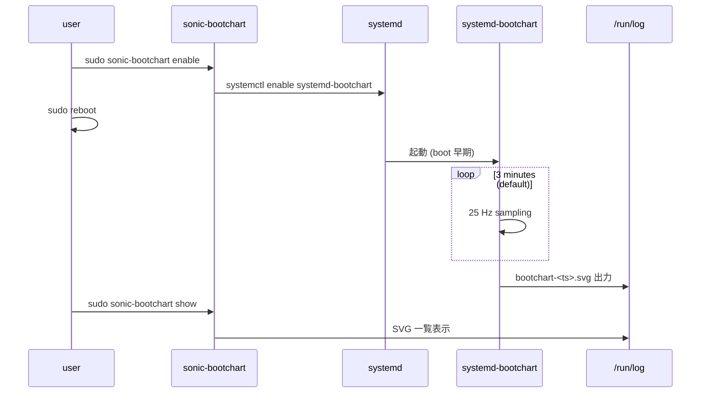

<!-- topics-tip -->
!!! tip "Topics で読み物として読む"
    この HLD は実装詳細を含みます。機能の概念・設定・運用を読み物として読みたい場合は [Topics 11 章: Reboot / Warm/Fast/Express/Cold](../topics/11-reboot/index.md) を参照。
<!-- /topics-tip -->

!!! note "裏取りステータス: code-verified"
    verifier-batch-18 で確認:

    - `sonic-buildimage/rules/config` に `INCLUDE_BOOTCHART = y`（systemd-bootchart のインストール有効）と `ENABLE_BOOTCHART = n`（boot 時自動起動は default off）を確認
    - `sonic-utilities/scripts/sonic-bootchart` に CLI 実装、`tests/sonic_bootchart_test.py` に単体テストを確認
    - `/etc/systemd/bootchart.conf` の Samples=4500 / Frequency=25 のデフォルト値、`/run/log` への SVG 出力パス、sonic-installer の migration 詳細は本リポでは追跡していない（HLD 記述準拠）

# SONiC Boot Chart（`systemd-bootchart` 統合）

## 概要

[SONiC](../reference/glossary.md#term-sonic) は **モジュール構成** で、各機能はスクリプト・ユーティリティ・daemon・docker container として実装される。多くの起動スクリプトが Jinja2 テンプレート展開や Python / Bash の短命プロセスを起動するため、boot 時間の劣化を引き起こしやすい[^1]。

本 [HLD](../reference/glossary.md#term-hld) は `systemd-bootchart` を SONiC に統合し、**boot プロセスの sampling profiling** を行う仕組みを定義する。出力は SVG で可視化される。

要件[^1]:

- `systemd-bootchart` を SONiC OS に統合し、**default install / default disable**
- ユーザは CLI で enable / disable
- sample 数 / 頻度を CLI で設定可能
- 設定 / 生成 SVG を表示

## 動作仕様

### ビルド時オプション

`INCLUDE_BOOTCHART=y/n` で SONiC build に含めるかを制御する[^1]:

```bash
make INCLUDE_BOOTCHART=y target/sonic-mellanox.bin   # 含める
make INCLUDE_BOOTCHART=n target/sonic-mellanox.bin   # 含めない
```

`y` の場合、Debian upstream から `systemd-bootchart` パッケージ（128 KB）を SONiC host に install する。

`ENABLE_BOOTCHART=y` で **default 状態の有効化** を制御するフラグも追加される。

### 既定設定

`/etc/systemd/bootchart.conf` に SONiC 既定値を提供[^1]:

```ini
[Bootchart]
Samples=4500
Frequency=25
```

これは **3 分間 × 25 sample/sec = 4500 sample** を収集する設定。

### `sonic-bootchart` CLI

`sonic-utilities` の `scripts/` に新ユーティリティ `sonic-bootchart` を追加する。位置付けは `sonic-kdump-config` や `sonic-installer` に近いスタンドアロン CLI[^1]:

```text
admin@sonic:~$ sudo sonic-bootchart
Usage: sonic-bootchart [OPTIONS] COMMAND [ARGS]...

Commands:
  config   Configure bootchart  (要 root)
  disable  Disable bootchart    (要 root)
  enable   Enable bootchart     (要 root)
  show     Display bootchart configuration
```

#### enable / disable

```bash
admin@sonic:~$ sudo sonic-bootchart enable
Running command: systemctl enable systemd-bootchart
admin@sonic:~$ sudo sonic-bootchart disable
Running command: systemctl disable systemd-bootchart
```

`INCLUDE_BOOTCHART=n` でビルドした image でこれを叩くとエラー[^1]:

```text
admin@sonic:~$ sudo sonic-bootchart enable
systemd-bootchart is not installed
```

enable は **永続的**。`config save` / `config reload` の影響を受けず、`disable` するまで boot 毎に走る[^1]。

#### config

```bash
admin@sonic:~$ sudo sonic-bootchart config --time 50 --frequency 10
```

このコマンドが `/etc/systemd/bootchart.conf` を直接更新する。**次回 boot から** 新値が使われる。

`Samples = frequency × time` で換算される。

!!! warning "HLD と master 実装の option 名差"
    HLD 原文は `--time-span` と記すが、master 実装（`sonic-utilities` `scripts/sonic-bootchart` の `config` サブコマンド）の option は **`--time`**（`@click.option('--time', ...)`）。`show` の出力ヘッダも HLD の `Time Span (sec)` に対し実装は **`Time (sec)`**（`field_values` の key が `"Time (sec)"`）。本ページは master 実装に合わせて記述している。

#### show

```text
admin@sonic:~$ sudo sonic-bootchart show
Status     Operational Status   Frequency  Time (sec)  Output
enabled    inactive            10         50          /run/log/bootchart-20220504-1325.svg
```

| フィールド | 意味 |
|-----------|------|
| `Status` | `systemctl is-enabled systemd-bootchart` 出力（boot 時に走るか） |
| `Operational Status` | `systemctl is-active systemd-bootchart` 出力（現在 sample 収集中か） |
| `Frequency` | sample/sec |
| `Time (sec)` | 起動後何秒間 sampling するか（`Samples ÷ Frequency` で算出） |
| `Output` | 完了している場合に SVG パスを表示。未完了なら空 |

### 出力先

`systemd-bootchart` は SVG を **`/run/log/`** に保存する。`/run` は tmpfs のため **reboot で消える**[^1]。永続化したければ `/var/log/` 等にコピーする運用が必要。

### フロー



## 設定

### CLI / YANG / CONFIG_DB

本機能は **[YANG](../reference/glossary.md#term-yang) / [CONFIG_DB](../reference/glossary.md#term-config_db) に変更なし**[^1]。`/etc/systemd/bootchart.conf` の直接書き換えで設定する独立ユーティリティ。

| Command | 用途 |
|---------|------|
| `sudo sonic-bootchart enable` | 次回起動以降の sampling を有効化 |
| `sudo sonic-bootchart disable` | 無効化 |
| `sudo sonic-bootchart config --time <s> --frequency <hz>` | 収集パラメータ更新 |
| `sudo sonic-bootchart show` | 状態 / 出力 SVG を表示 |

### 設定例

```bash
# Image が INCLUDE_BOOTCHART=y でビルドされていることが前提
sudo sonic-bootchart enable

# 50 秒 × 10 Hz = 500 samples に縮小
sudo sonic-bootchart config --time 50 --frequency 10

# reboot して計測
sudo reboot

# 戻ってきたら SVG を確認
sudo sonic-bootchart show
```

## 制限事項

- **build flag が必要**。`INCLUDE_BOOTCHART=y` でビルドされていない image では使えない[^1]
- 出力先 `/run/log` は **tmpfs** のため reboot で消失する。永続化が必要なら別途コピー
- 設定変更は **次回 boot から** 適用。現在 boot 中の sampling は変えられない
- HLD の Open Items[^1]:
    - SONiC installer での bootchart 設定マイグレーション（S2S アップグレード時の引き継ぎ）
    - boot 後 runtime に sampling を実行するモードの要望
- `enable` / `disable` 状態は **`config save` / `config reload` の影響を受けない**[^1]。`config_db.json` には載らないため

## 干渉する機能

- **`systemd`**: `systemd-bootchart` をサービスとして管理
- **`sonic-installer`**: `INCLUDE_BOOTCHART` フラグの引き継ぎ（HLD 上は Open Item）
- **boot シーケンス全体**: 早期に走る daemon のため、`hostcfgd` / `database.service` 起動前から sample 開始
- **既存 `systemd-bootchart`**: パッケージ自体の挙動（output / config パス）に従う

## トラブルシューティング

- `sonic-bootchart enable` で `not installed` → image を `INCLUDE_BOOTCHART=y` で再ビルド
- reboot 後 SVG が無い → `Operational Status` が `inactive` か（= 完了済み）、`Time Span` が経過しているかを確認
- SVG が生成されているのに古いまま → `/run/log/bootchart-*.svg` の timestamp、最新 boot の SVG が tmpfs に存在するか
- 設定を変えても反映されない → `config` 後に **必ず reboot** が必要、`/etc/systemd/bootchart.conf` の現在値を直接確認


### 補足: `systemd-analyze`（別ツール）

`systemd-analyze` は `sonic-bootchart` とは別の **systemd 標準ツール**で、本 HLD のスコープ外。SVG sampling profile（`sonic-bootchart`）を取る前段で、boot 全体の所要時間や unit 単位の遅延を素早く把握したい場合に併用できる。

```bash
systemd-analyze                       # 全体の起動所要時間
systemd-analyze blame | head -20      # unit ごとの起動時間 (降順)
systemd-analyze critical-chain        # critical path
ls /run/log/bootchart-*.svg           # sonic-bootchart の出力 SVG 一覧
```

## 関連リファレンス

- CLI: [show version](../reference/cli/show-version.md) / [show uptime](../reference/cli/show-uptime.md) / [show services](../reference/cli/show-services.md) / [reboot-fast-warm](../reference/cli/reboot-fast-warm.md)
- 関連 HLD: [kdump](kdump.md) / [Debian upgrade cadence](sonic-debian-upgrade-cadence.md) / [analysis of disk writers](analysis-of-disk-writers-in-sonic-devices.md)
- Topic: [Reboot / Upgrade](../topics/11-reboot/index.md)

## 引用元

[^1]: `sonic-net/SONiC` `doc/profiling/sonic_bootchart.md` @ `49bab5b5ff0e924f1ea52b3d9db0dfa4191a7c06`

<!-- concerns hint:
- INCLUDE_BOOTCHART / ENABLE_BOOTCHART build flag の sonic-buildimage への取り込み確認
- sonic-bootchart CLI の sonic-utilities scripts/ への取り込み確認
- /etc/systemd/bootchart.conf の SONiC default 値（Samples=4500, Frequency=25）の現行確認
- /run/log への SVG 出力パスが現行 systemd-bootchart 仕様と一致するか未確認
- sonic-installer に bootchart 設定 migration が取り込まれたか（HLD Open Item）の現状確認
-->

<!-- glossary-links-injected: 8ba32e5aa69d -->
