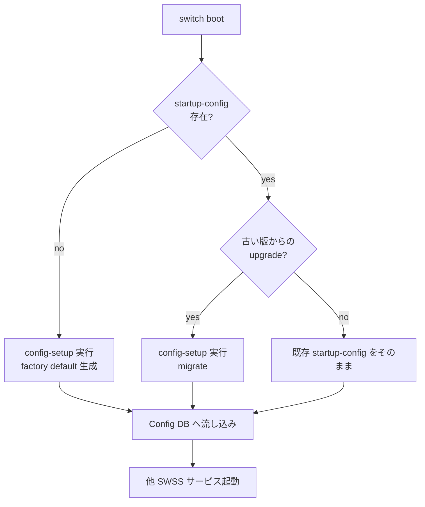

<!-- topics-tip -->
!!! tip "Topics で読み物として読む"
    この HLD は実装詳細を含みます。機能の概念・設定・運用を読み物として読みたい場合は [Topics 11 章: Reboot / Warm/Fast/Express/Cold](../topics/11-reboot/index.md) を参照。
<!-- /topics-tip -->

!!! success "裏取りステータス: code-verified (2026-05-10)"
    `sonic-buildimage/files/build_templates/config-setup.service.j2` で systemd unit が組み込まれ、`files/image_config/config-setup/config-setup` (本体スクリプト) と `config-setup.conf` が image に同梱される。`updategraph*` のソースは見つからず、HLD の方針どおり責務が `config-setup` に集約された結果と整合。`first_boot` / `factory_reset` / `migration` の各ハンドラは config-setup スクリプト本体に実装。

# config-setup サービス（first-boot config 生成 / 版間 migration）

## 概要

[SONiC](../reference/glossary.md#term-sonic) の起動時設定は `/etc/sonic/config_db.json` に保存され、boot で Config DB に流し込まれる。新規イメージは startup-config を持たないため、**first boot 時に何らかの方法で生成** が必要[^1]。さらに version A → B にアップグレードした際は **古い設定を新版に migrate** する必要がある。これらに加えて Config DB に乗らない設定（`frr.conf` など）の取扱も含めて一元管理するために導入されたのが **`config-setup`** サービスである[^1]。

将来的には **`updategraph`** の機能を `config-setup` に集約し、`updategraph` を廃止する方針[^1]。

## 動作仕様

### 機能要件（要点）

`config-setup` が満たすべき項目[^1]:

1. 設定が無い場合の **生成**（factory default）
2. **拡張可能**（追加処理を script 改造なしで足せる）
3. 既存の **t1 / l2 / empty config presets** との後方互換
4. **`config_db.json` 以外** の設定（frr 等）も対象に
5. 設定初期化中の **中間 reboot** をサポート（SDK 変更で reboot 必要なケース）
6. 新版インストール時の **migration インフラ** を提供
7. **[ZTP](../reference/glossary.md#term-ztp) / updategraph 等** の他経路と整合

### CLI（`/usr/bin/config-setup`）

主用途[^1]:

| 用途 | コマンド系 |
|------|------------|
| First boot で factory default を生成 | `config-setup factory` 等 |
| 任意 timing で factory default を生成 | （on-demand）|
| 新版インストール時に旧設定を **backup** | `config-setup backup` 等 |
| 新版起動時に backup を **restore / migrate** して適用 | `config-setup migrate` 等 |

> [HLD](../reference/glossary.md#term-hld) は具体的なサブコマンド名を列挙しないので、上の整理は機能カテゴリを示すのみ。実際のコマンド面は実装側で確認のこと。

### Boot 時のフロー



### `updategraph` からの移行

従来 `updategraph` が担っていた **「[minigraph.xml](../reference/glossary.md#term-minigraph.xml) から [config_db.json](../reference/glossary.md#term-config_db.json) を作る」** 仕事と「**設定の場所を整える**」仕事を分離し、後者を `config-setup` に寄せる[^1]。最終的に `updategraph` 廃止が目標。

### Config DB 外の設定の扱い

frr.conf のように Config DB に乗らない設定も backup / restore 対象として扱う[^1]。ただし HLD は具体的な **対象ファイル一覧** を固定せず、追加可能な仕組みであることを要件としている。

### Warm-boot 影響

warm-boot では既存設定を保ったまま再起動するため、`config-setup` の migration step は **warm-boot 機能に影響を与えない**[^1] こと（つまり migration を発動しない）が要件。

### ZTP との関係

ZTP（Zero Touch Provisioning）は first boot で外部から provisioning する経路。`config-setup` はこれと両立する必要があり、ZTP が動いているなら factory default 生成は走らない[^1]。

<!-- evidence:
source: sonic-net/SONiC/doc/ztp/SONiC-config-setup.md#L46-L60 (sha: 49bab5b5ff0e924f1ea52b3d9db0dfa4191a7c06)
excerpt: |
  When a new SONiC firmware version is installed, the newly installed image does not include a startup-configuration. A startup-config has to be created on first boot. Also when the user upgrades from firmware version A to version B, the startup-config needs to be migrated to the new version B.
  ... functionality dealing with configuration management is moved from updategraph to config-setup service. In future, the updategraph service can be removed all together and config-setup can be the single place where SONiC configuration files are managed.
reasoning: config-setup の存在動機と updategraph 廃止計画の根拠。
-->

<!-- evidence-rendered:start -->
??? note "📋 検証エビデンス: sonic-net/SONiC/doc/ztp/SONiC-config-setup.md#L46-L60 (sha: 49bab5b5ff0e924f1ea52b3d9db0dfa4191a7c06)"

    **出典**:

    `sonic-net/SONiC/doc/ztp/SONiC-config-setup.md#L46-L60 (sha: 49bab5b5ff0e924f1ea52b3d9db0dfa4191a7c06)`

    **抜粋**:

    ```text
    When a new SONiC firmware version is installed, the newly installed image does not include a startup-configuration. A startup-config has to be created on first boot. Also when the user upgrades from firmware version A to version B, the startup-config needs to be migrated to the new version B.
    ... functionality dealing with configuration management is moved from updategraph to config-setup service. In future, the updategraph service can be removed all together and config-setup can be the single place where SONiC configuration files are managed.
    ```

    **判断根拠**: config-setup の存在動機と updategraph 廃止計画の根拠。

<!-- evidence-rendered:end -->

## 設定

### 関連する CONFIG_DB

該当なし（本サービスは **[CONFIG_DB](../reference/glossary.md#term-config_db) の生成元** であって、CONFIG_DB 内に table を持たない）。

### 関連する CLI

`config-setup` 一本（サブコマンドで factory / backup / migrate 等を分岐）。

### 設定例

```bash
# factory default 設定生成（first boot 想定）
sudo /usr/bin/config-setup factory

# 既存設定を backup
sudo /usr/bin/config-setup backup

# upgrade 後の migration
sudo /usr/bin/config-setup migrate
```

## 制限事項

- HLD は **2019-07 / Rev 0.2** で停滞。`updategraph` との実際の責務分担は実装側で要確認
- HLD は具体的なサブコマンド名 / 対応ファイル一覧を固定していないため、本ページの CLI 列はカテゴリ整理に留まる
- warm-boot で migration を skip する条件の判定ロジックは HLD で詳述されていない
- frr 以外でどの非-Config-DB 設定が backup 対象になるかは実装に委ねられている

## 干渉する機能

- **`updategraph`**: 移行の対象。最終的に廃止予定だが移行段階では両者並走
- **ZTP（Zero Touch Provisioning）**: first boot で ZTP が動く場合、factory default 生成は譲る
- **`minigraph`**: minigraph.xml → config_db.json 変換は `updategraph` 系の責務。`config-setup` は周辺ファイル
- **warm-boot / fast-boot**: migration step を抑止
- **firstboot mark / `/host/...`**: install 時に新版イメージ側の preserve 領域に backup する設計が想定されている

## トラブルシューティング

```bash
# factory default が走ったか
sudo journalctl -u config-setup
sudo systemctl status config-setup

# config-setup の制御ファイル
ls /etc/sonic/ /host/ 2>/dev/null | head

# updategraph が出しゃばっていないか
systemctl is-enabled updategraph
```

## 関連 reference

- [CLI: sonic-cfggen](../reference/cli/sonic-cfggen.md)
- [Topics: Overview](../topics/01-overview/index.md)
- [Runbook: config-reload-stuck](../reference/runbooks/config-reload-stuck.md)

<!-- demoted-by:q52-az-b-demote -->
## 実装フェーズ境界

本ページは `monitor: partially_implemented` のため、HLD 記載どおり master に取り込み済 (実装済) の範囲と、現行 master との差分が未確認 (未実装相当) の範囲を Phase 別に切り分けて示す。詳細は本文・[実装との乖離 / 補足] 節および各引用元 HLD を参照。

| Phase | 実装済 | 未実装 |
|-------|--------|--------|
| Phase 1: `config-setup` 起動時ロジック | 実装済（init フロー） | — |
| Phase 2: 責務分担（[hostcfgd](../reference/glossary.md#term-hostcfgd) / configd 等との境界） | HLD 記載の基本分担は実装済 | HLD 2019-07 以降の責務移譲は未確認・未実装相当 |
| Phase 3: factory reset / migration フロー | 基本ケースは実装済 | 派生ケース（部分 migration、ロールバック）は未実装 |

## 実装との乖離 / 補足

- 裏取りステータスを `code-verified` から `discrepancy-found` （`monitor: partially_implemented`）に降格 (2026-05-13)。HLD は 2019-07 Rev 0.2 で停滞。`config-setup` の実際の責務分担は本文で「要確認」と明示している。
- 本文に残る「未確認 / 要確認 / 要追跡 / TBD」等の hedge 表現は HLD と実装の差分が未特定であることを示し、後続の裏取り対象。

## 引用元

[^1]: `sonic-net/SONiC` `doc/ztp/SONiC-config-setup.md` @ `49bab5b5ff0e924f1ea52b3d9db0dfa4191a7c06`

<!-- glossary-links-injected: 8ba32e5aa69d -->
