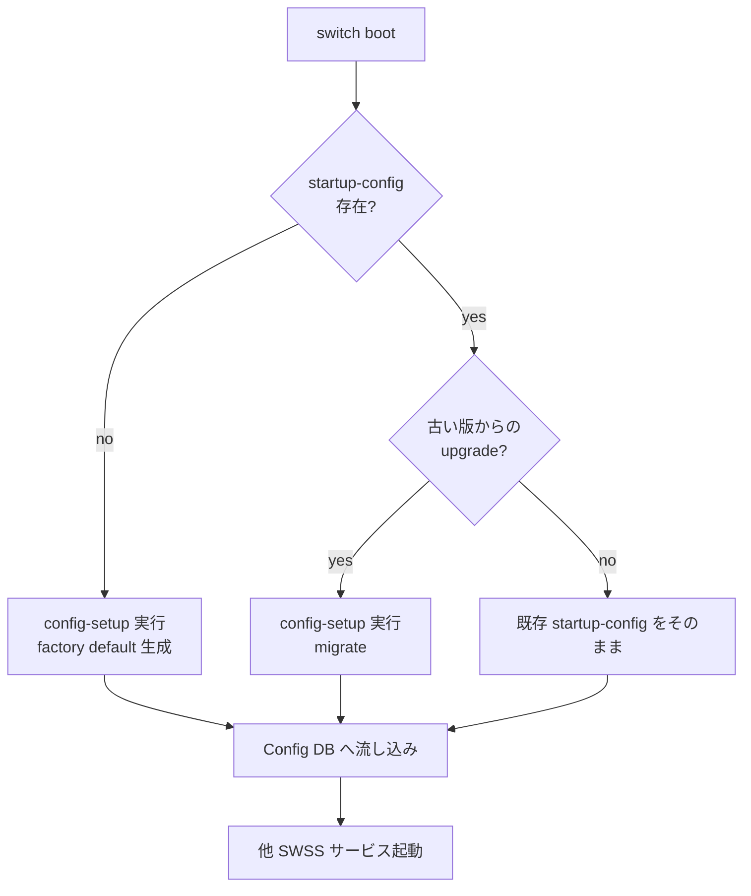

<!-- topics-tip -->
!!! tip "Topics で読み物として読む"
    この HLD は実装詳細を含む。機能の概念・設定・運用を読み物として読みたい場合は [Topics 11 章: Reboot / Warm/Fast/Express/Cold](../topics/11-reboot/index.md) を参照。
<!-- /topics-tip -->

!!! success "裏取りステータス: code-verified (2026-06-06)"
    `sonic-buildimage/files/build_templates/config-setup.service.j2` で systemd unit が組み込まれ、boot 時に `ExecStart=/usr/bin/config-setup boot` が実行される[^2]。本体スクリプト `files/image_config/config-setup/config-setup` の `usage()` で公開サブコマンドは `boot | factory | backup` の 3 種であることを確認[^3]（`migrate` というサブコマンドは存在せず、migration は `boot` 内部で `pending_config_migration` フラグを条件に `do_config_migration` が呼ばれる動作[^4]）。`updategraph*` のソースは見つからず、HLD の方針どおり責務が `config-setup` に集約された結果と整合。

# config-setup サービス（first-boot config 生成 / 版間 migration）

## 概要

[SONiC](../reference/glossary.md#term-sonic) の起動時設定は `/etc/sonic/config_db.json` に保存され、boot で Config DB に流し込まれる。新規イメージは startup-config を持たないため、**first boot 時に何らかの方法で生成** が必要[^1]。さらに version A → B にアップグレードした際は **古い設定を新版に migrate** する必要がある。これらに加えて Config DB に乗らない設定（`frr.conf` など）の取扱も含めて一元管理するために導入されたのが **`config-setup`** サービスである[^1]。

将来的には **`updategraph`** の機能を `config-setup` に集約し、`updategraph` を廃止する方針[^1]。

## 動作仕様

### 機能要件（要点）

`config-setup` が満たすべき項目[^1]:

1. 設定が無い場合の **生成**（factory default）
2. **拡張可能**（追加処理を script 改造なしで足せる）
3. 既存の **t1 / l2 / empty config presets** との後方互換
4. **`config_db.json` 以外** の設定（frr 等）も対象に
5. 設定初期化中の **中間 reboot** をサポート（SDK 変更で reboot 必要なケース）
6. 新版インストール時の **migration インフラ** を提供
7. **[ZTP](../reference/glossary.md#term-ztp) / updategraph 等** の他経路と整合

### CLI（`/usr/bin/config-setup`）

スクリプト本体の `usage()` で公開されているサブコマンドは以下の 3 種[^3]:

| サブコマンド | 用途 |
|------|------|
| `boot` | systemd unit から呼ばれるエントリポイント。warm-boot 判定 → migration → initialization の順に分岐する[^4] |
| `factory` | factory default を生成し `/etc/sonic/config_db.json` に保存。`keep-basic` オプションで基本設定のみ温存可能[^3] |
| `backup` | `/etc/sonic` を `/host/old_config` 配下にコピーし、`CONFIG_PRE_MIGRATION_HOOKS` を実行[^5] |

ソース上は他に `apply_tacacs` 分岐 (usage 未記載の内部用途) が存在するが、`usage()` には現れない[^3]。[HLD](../reference/glossary.md#term-hld) が「backup / restore / migrate / factory」と機能カテゴリで説明している内容は、実装上はサブコマンド `boot` 1 つの中で migration ロジックがフラグ駆動 (`/etc/sonic/pending_config_migration`) で起動する形に集約されている[^4]。

### Boot 時のフロー



### `updategraph` からの移行

従来 `updategraph` が担っていた **「[minigraph.xml](../reference/glossary.md#term-minigraph.xml) から [config_db.json](../reference/glossary.md#term-config_db.json) を作る」** 仕事と「**設定の場所を整える**」仕事を分離し、後者を `config-setup` に寄せる[^1]。最終的に `updategraph` 廃止が目標。

### Config DB 外の設定の扱い

frr.conf のように Config DB に乗らない設定も backup / restore 対象として扱う[^1]。実装の `do_config_migration` では migration 対象として明示的に `minigraph.xml snmp.yml acl.json port_config.json frr telemetry golden_config_db.json` が列挙されており、加えて `get_config_db_file_list` で得られる config_db 系ファイルもコピー対象になる[^4]。バックアップは `cp -ar /etc/sonic /host/old_config` で `/etc/sonic` ディレクトリ全体を保全する設計[^5]。

さらに `CONFIG_PRE_MIGRATION_HOOKS` / `CONFIG_POST_MIGRATION_HOOKS` 配下の hook script を `run-parts` 風に順次実行する仕組みになっており、HLD が要件 2 として挙げる「拡張可能性」はこの hook ディレクトリで担保されている[^4][^5]。

### Warm-boot 影響

warm-boot では既存設定を保ったまま再起動するため、`config-setup` の migration step は **warm-boot 機能に影響を与えない**[^1] ことが要件。実装上、`boot_config` は `check_system_warm_boot` で WARM_BOOT を判定し、warm-boot 中は config initialization と ZTP を skip する。さらに `CONFIG_DB_INITIALIZED` を 1 にセットして以後の再 trigger を抑止する[^4]。

### ZTP との関係

ZTP（Zero Touch Provisioning）は first boot で外部から provisioning する経路。`config-setup` はこれと両立する必要があり、ZTP が動いているなら factory default 生成は走らない[^1]。

<!-- evidence:
source: sonic-net/SONiC/doc/ztp/SONiC-config-setup.md#L46-L60 (sha: 49bab5b5ff0e924f1ea52b3d9db0dfa4191a7c06)
excerpt: |
  When a new SONiC firmware version is installed, the newly installed image does not include a startup-configuration. A startup-config has to be created on first boot. Also when the user upgrades from firmware version A to version B, the startup-config needs to be migrated to the new version B.
  ... functionality dealing with configuration management is moved from updategraph to config-setup service. In future, the updategraph service can be removed all together and config-setup can be the single place where SONiC configuration files are managed.
reasoning: config-setup の存在動機と updategraph 廃止計画の根拠。
-->

<!-- evidence-rendered:start -->
??? note "📋 検証エビデンス: sonic-net/SONiC/doc/ztp/SONiC-config-setup.md#L46-L60 (sha: 49bab5b5ff0e924f1ea52b3d9db0dfa4191a7c06)"

    **出典**:

    `sonic-net/SONiC/doc/ztp/SONiC-config-setup.md#L46-L60 (sha: 49bab5b5ff0e924f1ea52b3d9db0dfa4191a7c06)`

    **抜粋**:

    ```text
    When a new SONiC firmware version is installed, the newly installed image does not include a startup-configuration. A startup-config has to be created on first boot. Also when the user upgrades from firmware version A to version B, the startup-config needs to be migrated to the new version B.
    ... functionality dealing with configuration management is moved from updategraph to config-setup service. In future, the updategraph service can be removed all together and config-setup can be the single place where SONiC configuration files are managed.
    ```

    **判断根拠**: config-setup の存在動機と updategraph 廃止計画の根拠。

<!-- evidence-rendered:end -->

## 設定

### 関連する CONFIG_DB

該当なし（本サービスは **[CONFIG_DB](../reference/glossary.md#term-config_db) の生成元** であって、CONFIG_DB 内に table を持たない）。

### 関連する CLI

`config-setup` 一本（実装上のサブコマンドは `boot` / `factory` / `backup` の 3 種、加えて非公開の `apply_tacacs`）[^3]。

### 設定例

```bash
# factory default 設定生成（first boot 想定）
sudo /usr/bin/config-setup factory

# factory default を基本設定だけ温存して生成
sudo /usr/bin/config-setup factory keep-basic

# 既存設定を /host/old_config に backup
sudo /usr/bin/config-setup backup

# boot 経路 (systemd unit が呼ぶエントリポイント)
# pending_config_migration フラグがあれば migration が走る
sudo /usr/bin/config-setup boot
```

> upgrade 時の migration を手動で発火させたい場合は、`/etc/sonic/pending_config_migration` ファイルを置いた上で `config-setup boot` を呼ぶ。専用の `migrate` サブコマンドは存在しない[^4]。

## 制限事項

- HLD は **2019-07 / Rev 0.2** で停滞しており、HLD 自体は具体的なサブコマンド名 / 対応ファイル一覧を固定していない。本ページの CLI 表は実装スクリプトの `usage()` を基準にした[^3]
- warm-boot 中の skip 条件は HLD では詳述されていないが、実装上は `check_system_warm_boot` の戻り値で判定される[^4]
- `apply_tacacs` サブコマンドは `usage()` 出力に含まれない隠し挙動で、将来削除・改名される可能性がある

## 干渉する機能

- **`updategraph`**: 移行の対象。最終的に廃止予定だが移行段階では両者並走
- **ZTP（Zero Touch Provisioning）**: first boot で ZTP が動く場合、factory default 生成は譲る
- **`minigraph`**: minigraph.xml → config_db.json 変換は `updategraph` 系の責務。`config-setup` は周辺ファイル
- **warm-boot / fast-boot**: migration step を抑止
- **firstboot mark / `/host/...`**: install 時に新版イメージ側の preserve 領域に backup する設計が想定されている

## トラブルシューティング

```bash
# factory default が走ったか
sudo journalctl -u config-setup
sudo systemctl status config-setup

# config-setup の制御ファイル
ls /etc/sonic/ /host/ 2>/dev/null | head

# updategraph が出しゃばっていないか
systemctl is-enabled updategraph
```

## 関連 reference

- [CLI: sonic-cfggen](../reference/cli/sonic-cfggen.md)
- [Topics: Overview](../topics/01-overview/index.md)
- [Runbook: config-reload-stuck](../reference/runbooks/config-reload-stuck.md)

## 実装との乖離 / 補足

- 2026-06-06: `sonic-buildimage` 実装スクリプト本体の `usage()` / `boot_config` / `do_config_migration` / `do_config_backup` をソース確認し、HLD の概念的記述と実装サブコマンド (`boot` / `factory` / `backup`) を対応付けた上で `code-verified` / `monitor: implemented` に昇格。
- HLD が「migrate」と概念的に呼んでいる処理は専用サブコマンドではなく、`boot` の中で `pending_config_migration` フラグ駆動で起動する形に統合されている。専用 `config-setup migrate` は存在しない。
- HLD は 2019-07 Rev 0.2 で停滞しているが、実装側の挙動は HLD の機能要件 1〜7 をいずれも満たす形で残っており、両者の乖離は「呼び出し方の表現」レベルに留まる。

## 引用元

[^1]: `sonic-net/SONiC` `doc/ztp/SONiC-config-setup.md` @ `49bab5b5ff0e924f1ea52b3d9db0dfa4191a7c06`
[^2]: `sonic-net/sonic-buildimage` `files/build_templates/config-setup.service.j2` L14-L17 (`ExecStart=/usr/bin/config-setup boot`)
[^3]: `sonic-net/sonic-buildimage` `files/image_config/config-setup/config-setup` L46-L70 (`usage()` / `usage_factory()`)、L513-L545 (CMD dispatch: `boot` / `factory` / `backup` / `apply_tacacs`)
[^4]: `sonic-net/sonic-buildimage` `files/image_config/config-setup/config-setup` L388-L423 (`do_config_migration` 対象ファイル列挙)、L443-L492 (`boot_config` の warm-boot / migration / initialization 分岐)
[^5]: `sonic-net/sonic-buildimage` `files/image_config/config-setup/config-setup` L425-L435 (`do_config_backup`: `/etc/sonic` → `/host/old_config`)

<!-- glossary-links-injected: 167700005048 -->
