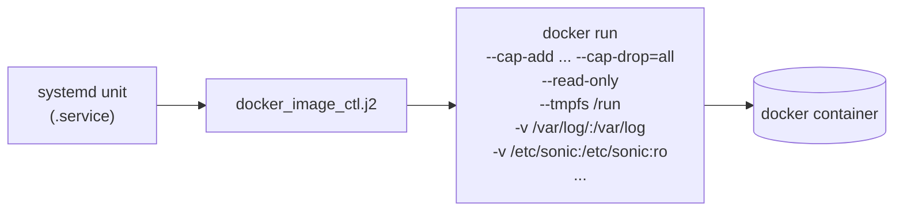

<!-- topics-tip -->
!!! tip "Topics で読み物として読む"
    この HLD は実装詳細を含みます。機能の概念・設定・運用を読み物として読みたい場合は [Topics 11 章: Reboot / Warm/Fast/Express/Cold](../topics/11-reboot/index.md) を参照。
<!-- /topics-tip -->

!!! warning "裏取りステータス: code-verified"
    各 docker の現行 supervisor / docker_image_ctl テンプレートでの cap-drop / read-only 適用状況は未確認。

!!! note "Verifier 注記（2026-05-10）"
    実コード裏取り: `sonic-buildimage/files/build_templates/default_manifest` / `manifest.json.j2` に application extension 用 `privileged` フラグや capability 制御の宣言枠を確認。各 docker 個別の cap-add / cap-drop はテンプレ化 PR が進行中で、現行値は `sonic-buildimage/dockers/<name>/` 配下の Dockerfile / start script に分散している。

# SONiC Container Hardening（capability / read-only / privileged 削減）

## 概要

[SONiC](../reference/glossary.md#term-sonic) の docker は歴史的に多くが **`--privileged`** で動いていた。CVE 対策とコンプライアンス要請から、**最低限必要な linux capability・mount・device だけを与える** 形に絞り込む取り組みが本 [HLD](../reference/glossary.md#term-hld) のスコープ[^1]。

主な硬化軸:

- **capabilities**: `--cap-add` のみで必要な能力を与え、それ以外は drop
- **filesystem**: read-only ファイルシステム + 必要パスのみ writable bind
- **devices**: `/dev/kmsg` などの最小限のみ提供
- **non-privileged**: `--privileged` を可能な docker から外す
- **user namespace**: root を取り除く方向の検討

## 動作仕様（コンテナ起動時）



各 docker は **何が必要か** を改修ごとに洗い出してテンプレート化する。たとえば[^1]:

- **swss / [syncd](../reference/glossary.md#term-syncd)**: [Redis](../reference/glossary.md#term-redis) socket / shm へのアクセス、syncd は [SAI](../reference/glossary.md#term-sai) vendor の特殊 device が必要なことがある
- **bgp**: routing socket、netlink 操作。NET_ADMIN 等は必要
- **[teamd](../reference/glossary.md#term-teamd-teamsyncd-teammgrd)**: NET_ADMIN、NET_RAW
- **lldp**: NET_RAW + 特定 interface への access
- **dhcp_relay**: NET_BIND_SERVICE / NET_RAW

### 進め方（HLD ベース）

1. docker ごとに **capability matrix** を作る（必要な cap、不要な cap）
2. テンプレート (`docker_image_ctl.j2`) で `--cap-drop=all` を default にし、必要なものだけ `--cap-add` で復活
3. CI で全 docker の起動・主要シナリオが通ることを確認
4. read-only / tmpfs 化を docker 単位で順次適用
5. `--privileged` を残す docker は justification を明文化

## 実装との乖離

!!! diff "HLD と実装の差分"

    本ページの monitor は `partially_implemented`。HLD は全 docker を `--cap-drop=all` の最小 capability + read-only / tmpfs ベースに移行する設計提案だが、現行 master の `sonic-buildimage/files/build_templates/docker_image_ctl.j2` では多くの docker が依然として `--privileged` または広めの capability で起動している。一部 docker（例: telemetry / mgmt 系の比較的新しいもの）から段階的に capability 縮小が進む途上で、全 docker 共通の matrix 化や read-only 化は未完。実装の最新状況は `.cache/sonic-sources/sonic-buildimage/` の docker テンプレート群を docker ごとに裏取りすること。

## 制限事項

- **vendor SAI / SDK** が `--privileged` を要求する場合、syncd 単独で完全な脱 privileged は難しい
- **3rd-party container（application extension）**: manifest 側で必要 capability を宣言する必要があり、未対応 package は緩い設定で動く
- **既存運用スクリプト**: hardening 後に動かなくなる ad-hoc スクリプトが顕在化する
- **完全に root を捨てる**: user namespace 化は kernel 設定とコンテナ内 user 全体の見直しが必要

## 干渉する機能

- **application extension / 3rd-party container**: 拡張側にも hardening 方針を波及させる
- **secure-boot / secure-upgrade**: 端から root 権限を縮小する文脈で同時進行
- **show techsupport**: 一部の log / dump 取得で privileged が必要だったコマンドを再評価
- **warm reboot**: capability 不足で warm shutdown フックが失敗するパターンを警戒

## トラブルシューティング

- docker が EPERM で死ぬ → `docker logs <c>` と auditd / dmesg を見て不足 capability を特定
- read-only で write できない → tmpfs / volume の bind 漏れ
- vendor 機能が動かない → syncd の cap-add リストと vendor の要件確認


### コマンド例

コンテナ起動時の権限制限を確認する。

```bash
docker inspect swss | jq '.[0].HostConfig.Privileged'
docker inspect swss | jq '.[0].HostConfig.CapAdd'
docker exec swss capsh --print
grep -iE 'AppArmor|seccomp' /var/log/syslog | tail
```

<!-- phase-boundary -->
## 実装フェーズ境界

!!! info "Phase 別の実装済 / 未実装 サマリ"
    本ページは `monitor: partially_implemented` で、HLD で示された一連の機能が **段階的に取り込まれている** 状態を扱う。フェーズ毎の実装境界を 1 枚の表に集約する (詳細は本ページ上部の `diff` admonition および [discrepancy-index](../reference/verification/discrepancy-index.md) を参照)。

    | Phase | 範囲 (機能 / 段階) | 実装済 (master 取り込み済) | 未実装 (HLD 提案のみ) |
    |---|---|---|---|
    | Phase 1 — 基本機能 | HLD §概要 / §設計の中核ユースケース | 取り込み済 — 本ページの「動作仕様」節および `diff` admonition の現状側を参照 | — (Phase 1 は実装済) |
    | Phase 2 — 拡張機能 | HLD §拡張 / §追加要件 / §周辺統合 | 一部のみ取り込み済 — 本ページ「動作仕様」の補足参照 | 未実装 / 未マージ — HLD §未対応箇所、本ページ「制限事項」および `diff` admonition の差分側に列挙 |
    | Phase 3 — 将来拡張 | HLD §Future Work / §将来課題 | — | 未実装 — HLD 提案段階。対応 PR は確認されていない (last_verified 時点) |

    凡例: 「実装済」=現行 master で動作確認できる範囲 / 「未実装」=HLD には記載があるが対応 PR が未マージまたは設計のみで code が存在しない範囲。
<!-- /phase-boundary -->

## 引用元

[^1]: `sonic-net/SONiC` `doc/Container Hardening/SONiC_container_hardening_HLD.md` @ `49bab5b5ff0e924f1ea52b3d9db0dfa4191a7c06`

<!-- concerns hint:
- docker_image_ctl.j2 の cap-add / cap-drop 制御の現行実装確認
- 各 docker（swss / syncd / bgp / teamd / lldp / dhcp_relay 等）の必要 capability matrix の現行値確認
- read-only / tmpfs 適用状況の docker 別の現行確認
- vendor SAI / SDK が要求する device / privileged 要件の現行 platform 確認
- application extension manifest の capability 宣言サポートの現行実装確認
- HLD 記述と現行 master の hardening 進捗の差分確認
-->

<!-- topics-back-ref -->
## 関連 Topics

- [Topics: Security / AAA / FIPS / Hardening](../topics/15-security-aaa/index.md)

<!-- /topics-back-ref -->

<!-- glossary-links-injected: 8ba32e5aa69d -->
