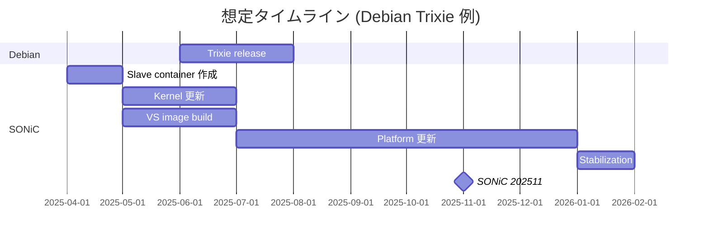

<!-- topics-tip -->
!!! tip "Topics で読み物として読む"
    この HLD は実装詳細を含む。機能の概念・設定・運用を読み物として読みたい場合は [Topics 19 章: Build / Packaging / Debian](../topics/19-build-packaging/index.md) を参照。
<!-- /topics-tip -->

!!! info "裏取りステータス: code-verified（プロセス文書 / ビルド変数で確認）"
    `sonic-buildimage/Makefile` で `NOSTRETCH ?= 1` / `NOBUSTER ?= 1` / `NOBULLSEYE ?= 1` / `NOBOOKWORM ?= 0` / `NOTRIXIE ?= 0`、それに対応する `BUILD_STRETCH=1` / `BUILD_BUSTER=1` / `BUILD_BULLSEYE` 等の分岐を確認（HLD のリリース cadence 通り Bookworm/Trixie が活きていて Stretch/Buster/Bullseye が deprecated default）。`sonic-buildimage/dockers/` 配下に `docker-config-engine-stretch` / `-buster` / `-bullseye` / `-bookworm` / `-trixie` の 5 系列の Dockerfile.j2 が並列維持されている。プロセス文書だが、ビルド変数定義が HLD 通りに実装されていることを直接確認した。

# SONiC Debian アップグレード方針（base / container / 廃止 cadence）

## 概要

[SONiC](../reference/glossary.md#term-sonic) は Debian-based Linux の上に立つため、**新 Debian release を取り込む cadence** を明文化することが本ドキュメントの目的[^1]。範囲は (1) **base image の Debian アップグレード**、(2) **各 container の Debian アップグレード**、(3) **複数 Debian バージョンのサポート期間**、(4) **古い Debian の deprecation**。Debian は公式の release schedule を持たないが Stretch 以降は **約 2 年周期で 6〜8 月に release** されている経験則を踏まえ、SONiC の 11 月 release で base 取り込みを目標とする。

## 動作仕様

### Base image アップグレード



- ターゲット: **5 月 / 11 月** の SONiC release のうち、Debian release から **3 ヶ月以上空く** 方[^1]
- 不足する場合は **次 SONiC release に push back**
- 全工程の見積りは **約 10.5〜11 週**（並列前提）

### 主要タスク（estimate 表抜粋）

| Task | 見積 |
|------|------|
| Slave container 作成 | 1 週 |
| Makefile / Makefile.work 改修 | 2 日 |
| 新 Azure pipeline 設定 | 2 日 |
| Kernel 更新 (`sonic-linux-kernel`) | 1.5 週 |
| `slave.mk` 改修 | 1 日 |
| [VS](../reference/glossary.md#term-vs) image build (module disable 込み) | 2.5 週 |
| 各 platform module / Python の更新 | 6 週 |
| VS の TODO 解消 | 2-3 週（並列）|
| Kernel 安定化と全 image 動作確認 | 1 週 |

### Submodule 戦略

- **`src/sonic-linux-kernel`**: base image にのみ入るため、Debian 固有 dev branch を切って breaking 変更可
- **`platform/broadcom/saibcm-modules-dnx`**: 同上
- **`src/sonic-host-services`**: `docker-sonic-vs` で使われるため両 Debian 互換を維持。やむを得ず breaking 変更を入れる場合は debian 特化 branch を立てる
- 上記以外: master を壊さず変更し、master merge 後に `sonic-buildimage` 側を submodule update で拾う

### Container アップグレード

```text
[release N]   base = Debian X
[release N+1] container を順次 X 化
```

- base が先行し、**翌 SONiC release から container を順次** 更新
- 例: Bookworm base = 202311 なら **container 更新は 202405 から**[^1]
- Phase 1 = `rules/config` で default enable なもの、Phase 2 = use-case 特化系
- 全 container を 1 release で更新するのではなく、phase 化して負荷分散

### Multi-Debian サポート / Deprecation

- 1 SONiC release は **複数 Debian バージョン**を抱えることを許容（base + 旧 container 等）
- 古い Debian は upstream LTS が終わる頃合いで **deprecate**
- 廃止スケジュールは個別 release で明示

<!-- evidence:
source: sonic-net/SONiC/doc/debian_upgrade/SONiC_Debian_Upgrade_Cadence.md#L37-L43 (sha: 49bab5b5ff0e924f1ea52b3d9db0dfa4191a7c06)
excerpt: |
  Given Debian release info, and the fact that the current SONiC release trend is to have a release in May and November,
  the goal should be to target the base image upgrade to the new Debian version for the November release.
reasoning: 11 月 release で base 取り込み目標の根拠。
-->

<!-- evidence-rendered:start -->
??? note "📋 検証エビデンス: sonic-net/SONiC/doc/debian_upgrade/SONiC_Debian_Upgrade_Cadence.md#L37-L43 (sha: 49bab5b5ff0e924f1ea52b3d9db0dfa4191a7c06)"

    **出典**:

    `sonic-net/SONiC/doc/debian_upgrade/SONiC_Debian_Upgrade_Cadence.md#L37-L43 (sha: 49bab5b5ff0e924f1ea52b3d9db0dfa4191a7c06)`

    **抜粋**:

    ```text
    Given Debian release info, and the fact that the current SONiC release trend is to have a release in May and November,
    the goal should be to target the base image upgrade to the new Debian version for the November release.
    ```

    **判断根拠**: 11 月 release で base 取り込み目標の根拠。

<!-- evidence-rendered:end -->

## 既知の問題

### Celestica DX010: 202511 + kernel 6.12 でブートループ

**症状**: Celestica DX010 に 202511 イメージをロードすると `dx010_cpld` カーネルモジュールのロード時に kernel panic が発生しブートループする。

```
kernel BUG at lib/string_helpers.c:1040!
__fortify_panic: dx010_cpld ...
```

**原因**: 202511 で採用した kernel 6.12 が `CONFIG_FORTIFY_SOURCE` を有効化しており、`dx010_cpld.c` 内の `strcpy` に off-by-one バグ（VLA サイズが `\0` 分不足）があると判定されパニックする。

**回避策**: community の PR（DontBreakAlex 作）で VLA サイズを +1 することで修正済み。コンパイル済みイメージ待ちの場合は 202405 を継続使用する。

**参照**: sonic-net/[sonic-buildimage](../reference/glossary.md#term-sonic-buildimage)#26885（Bug, Triaged, Critical severity）

---

### sonic-installer: --dockerd-socket オプション位置変更（202511+）

**症状**: `sonic-installer install` 内部で `sonic-package-manager --dockerd-socket /tmp/docker.sock migrate` を実行する際に `No such option: --dockerd-socket` エラーが発生しインストールが失敗する。

**原因**: `sonic-package-manager` の CLI が変更され、グローバルオプションであった `--dockerd-socket` がサブコマンド固有オプションに移動した。古い `sonic-installer` スクリプトが `sonic-package-manager --dockerd-socket ... migrate` の順で呼ぶが、新 CLI では `sonic-package-manager migrate --dockerd-socket ...` が正しい。

**影響バージョン**: 202511.22 以前のイメージから 202511.23 以降へのアップグレード。

**参照**: sonic-net/sonic-buildimage#27047（Bug, High severity）

## 制限事項

- Debian の公式 release schedule が無いため最終的にはタイムラインが流動的
- 約 11 週見積は理想ケース。`docker-sonic-vs` 等の cross-compat が崩れると伸びる
- vendor 側 platform module の更新負荷（6 週分）が律速になりやすい
- security patch のみの urgent 更新は本 cadence の対象外

## 干渉する機能

- **`sonic-buildimage`**: slave container / Makefile / Azure pipeline
- **`sonic-linux-kernel`**: kernel patch / config の Debian 別管理
- **vendor [SAI](../reference/glossary.md#term-sai) / platform module**: 各 vendor の Debian 対応
- **`docker-sonic-vs` / VS test**: cross-compat の見張り
- **release schedule (5月/11月)**: 取り込みターゲット

## 関連 reference

- [Topics: Build / Packaging](../topics/19-build-packaging/index.md)
- [Topics: Reboot / Upgrade](../topics/11-reboot/index.md)
- [CLI: sonic-installer](../reference/cli/sonic-installer.md)
- [HLD: build-system-improvements](../architecture/build-system-improvements.md)
- [HLD: rfs-split-build-improvements](../architecture/rfs-split-build-improvements-hld.md)
- [HLD: sonic-package-manager (Application Extension)](../architecture/sonic-application-extension-infrastructure.md)
- [CLI: sonic-package-manager](../reference/cli/sonic-package-manager.md)

## 確認コマンド

- `cat /etc/os-release` / `lsb_release -a` — image の Debian バージョン
- `dpkg -l | grep linux-image` — kernel パッケージとバージョン
- `show version` — SONiC build / Debian version / kernel を一括表示
- `apt-cache policy <pkg>` — slave container 構築時の参照 suite を確認

### コマンド例

Debian ベース版数とパッケージ脆弱性を確認する。

```bash
cat /etc/os-release
cat /etc/debian_version
apt list --upgradable 2>/dev/null | head
show version
```

## 引用元

[^1]: `sonic-net/SONiC` `doc/debian_upgrade/SONiC_Debian_Upgrade_Cadence.md` @ `49bab5b5ff0e924f1ea52b3d9db0dfa4191a7c06`

<!-- concerns hint:
- 直近の Debian Bookworm / Trixie 取り込みコミットの sonic-buildimage / sonic-linux-kernel 確認
- slave container の Azure pipeline 定義状況確認
- platform/broadcom/saibcm-modules-dnx の Debian 別 branch 運用確認
- src/sonic-host-services の docker-sonic-vs 互換維持の現状確認
- 廃止された Debian バージョンと release ノート整合確認
-->

<!-- glossary-links-injected: 9fb3fca99a59 -->
