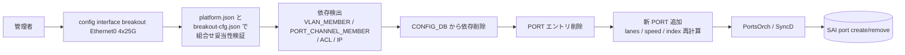

<!-- topics-tip -->
!!! tip "Topics で読み物として読む"
    この HLD は実装詳細を含む。機能の概念・設定・運用を読み物として読みたい場合は [Topics 14 章: Platform / Port / Optics](../topics/14-platform-port-optics/index.md) を参照。
<!-- /topics-tip -->

!!! success "裏取りステータス: code-verified"
    `sonic-utilities/config/main.py` の `breakout` コマンド (L5454-) / `_validate_interface_mode` (L199-) と `config/config_mgmt.py` の `breakOutPort` / `_deletePorts` (L414-L531)、`sonic-buildimage/.../sonic-breakout_cfg.yang` の `BREAKOUT_CFG` スキーマで動的 breakout 実装と `-f` フラグの正確な挙動を確認。

# 動的ポートブレイクアウト（dynamic port breakout・lanes / interface再構成）

## 読み手が知りたいこと

1. **breakout を変えると [CONFIG_DB](../reference/glossary.md#term-config_db) / [SAI](../reference/glossary.md#term-sai) で何が起きるか**
2. **どの CLI で変更し、関連設定（[VLAN](../reference/glossary.md#term-vlan) / [LAG](../reference/glossary.md#term-lag) / [ACL](../reference/glossary.md#term-acl) / IP）はどうなるか**
3. **`platform.json` で何を制約しているか**
4. **拒否される / 一部 port が up しないときに何を見るか**
5. **`--force` は何に使うか**

## 1. 何をする機能か

1 つの物理 cage（QSFP-DD 等）を **複数の論理 port に切り分ける / 1 つに戻す** 操作を、**reload 不要・稼働中の [SONiC](../reference/glossary.md#term-sonic) で** 行えるようにする[^1]。

例: `100Gx1`（`Ethernet0`）→ `25Gx4`（`Ethernet0/1/2/3`）

達成目標:

- breakout 変更を `config interface breakout` 1 コマンドで完結
- 関連設定（PORT_CHANNEL / VLAN_MEMBER / ACL / IP / neighbor）を **依存解決** して整合的に削除
- platform 物理制約（lane / supported modes）を `platform.json` で照合

## 2. 変更フロー



主要要素[^1]:

- **`platform.json`**: 各 cage の supported breakout modes（`1x100G`/`2x50G`/`4x25G`/`4x10G` 等）
- **`hwsku.json`**: 既定 breakout
- **`BREAKOUT_CFG` テーブル**: 現状の breakout 構成
- **依存解決**: 削除対象 port を参照する設定は CLI 側 / `db_migrator` が事前削除

### `-f` / `--force-remove-dependencies`

`config interface breakout` の `-f` フラグ（正式名は `--force-remove-dependencies`）は、削除対象 port を参照している周辺設定（VLAN_MEMBER / PORT_CHANNEL_MEMBER / ACL / IP / neighbor 等）を **YANG dependency tree から自動削除した上で** port 削除・追加を続行するためのもの[^2]。

挙動の境界:

- **bypass しないもの**:
    - `_validate_interface_mode`（target mode が `platform.json` の `breakout_modes` に存在するかの照合）は `-f` の有無に依らず常に実行される[^3]
    - 削除対象 port 名の `interface_name_is_valid` 検査
    - 依存削除と port 削除後の `validateConfigData()`（YANG schema による最終整合性検証）
- **`-f` で変わる挙動 (`ConfigMgmt._deletePorts`)**:
    - `-f` なし + deps あり → `Dependencies Exist. No further action will be taken` を出力して dep を列挙し `sys.exit(1)`
    - `-f` あり + deps あり → 各 dep に対して `sy.deleteNode(xpath)` を順次実行し、その後 port 本体を削除して新 PORT を投入
- **依存検出ロジック**: `sonic_yang.find_data_dependencies(xpathPortLeaf)` が YANG leafref を辿って参照中ノードを列挙する。topological sort はせず単純な順次削除[^2]

つまり `-f` は「YANG 依存ノードを自動 prune するスイッチ」であって、mode 妥当性や YANG schema validation を skip するものではない。整合性確認後の運用変更で利用する。

## 3. CONFIG_DB / CLI

| Table | 説明 |
|-------|------|
| `PORT` | `lanes` / `speed` / `index` / `alias` |
| `BREAKOUT_CFG` | 現行 breakout モード |

| Command | 用途 |
|---------|------|
| `show interfaces breakout` | 利用可能 mode と現在設定 |
| `config interface breakout <port> <mode>` | breakout 変更（deps があれば中断） |
| `config interface breakout <port> <mode> -f` | YANG 依存ノードを auto-prune して続行 |
| `config interface breakout <port> <mode> -l` | `load_predefined_config`: alias/lanes/speed 等を `hwsku.json` から再投入 |

## 4. 干渉・連携する機能

breakout 操作と整合を取る必要がある周辺機能・サブシステム。

- **port-profile-init / fast-link-up**: port 起動シーケンスと整合が要る
- **media-based-port-settings**: SI 設定と連携
- **multi-asic / single-json**: per-asic で breakout を扱う場合の整合
- **CMIS / ZR**: ZR は固定 application-select で breakout 自由度低
- **fabric port** など特殊 port には適用しない

## 5. トラブルシューティング

- **変更が拒否される** → `platform.json` の supported modes、依存設定の有無
- **一部 port だけ up しない** → 物理 lane mapping、SI 設定、[ASIC](../reference/glossary.md#term-asic) 側 lane 割当
- **関連設定が消えた** → 依存解決で削除済み。再投入が必要

### コマンド例

dynamic port breakout の状態を確認する。

```bash
show interfaces breakout current-mode
config interface breakout Ethernet0 '4x25G'
redis-cli -n 4 hgetall 'BREAKOUT_CFG|Ethernet0'
show platform summary
```

## 6. 運用上の注意 / 既知の制約

機能としての適用範囲・実機運用上の留意点。

- **対応 platform のみ**: `platform.json` に modes 記載が必要。breakout 可能なポート組合せは `interfaces` キーに定義された範囲に限られ、[HLD](../reference/glossary.md#term-hld) 記述よりも実機サポート範囲が狭い場合がある
- **依存設定の自動再生は無し**: 削除はするが再構築はユーザ責任
- **link 一時断**: SAI port create/remove のため link が切れ、隣接機器の [LLDP](../reference/glossary.md#term-lldp) / LAG メンバーシップが flap する
- **中間状態での config save 禁止**: 動的 breakout 中に CONFIG_DB が中間状態となるため、並行して `config save` を実行すると不整合な config が保存される

## 引用元

[^1]: `sonic-net/SONiC` `doc/dynamic-port-breakout/sonic-dynamic-port-breakout-HLD.md` @ `49bab5b5ff0e924f1ea52b3d9db0dfa4191a7c06`
[^2]: `sonic-net/sonic-utilities` `config/config_mgmt.py` の `breakOutPort` / `_deletePorts`（L414-L531）— `force` が False の場合は `find_data_dependencies` で deps を列挙して `(deps, False)` を返し、True の場合のみ `sy.deleteNode(xpath)` で順次削除して継続。最終 `validateConfigData()` は force 有無に関わらず走る
[^3]: `sonic-net/sonic-utilities` `config/main.py` の `breakout` コマンド（L5454-L5546）と `_validate_interface_mode`（L199-L208）— `-f`/`--force-remove-dependencies` フラグは `breakout_Ports(..., force=force_remove_dependencies, ...)` にのみ伝播し、mode validation や port 名検査の手前に置かれている

<!-- topics-back-ref -->
## 関連 Topics

- [Topics: Platform / Port / Optics / PHY](../topics/14-platform-port-optics/index.md)

<!-- /topics-back-ref -->

<!-- glossary-links-injected: ec18b66e3507 -->
