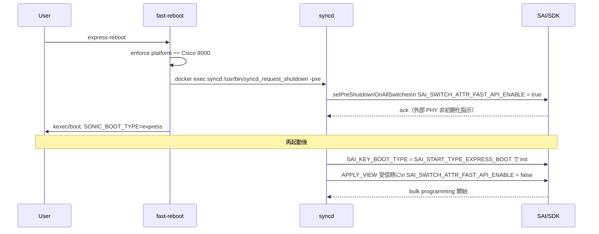

!!! warning "裏取りステータス: HLD-only / プラットフォーム固有"
    本機能は **Cisco 8000 限定** とスクリプト側で強制される設計。`syncd_request_shutdown -pxe` / `SAI_START_TYPE_EXPRESS_BOOT` / `SYNCD_RESTART_TYPE_EXPRESS` 列挙値、`SONIC_BOOT_TYPE=express` フラグの扱いが現行 master の sonic-utilities / sonic-sairedis / sonic-host-services に取り込まれているかは未確認。

# Express Reboot（Cisco 8000 向けサブ秒データプレーン断のリブート）

## 概要

Express Reboot は SONiC の再起動シーケンスを拡張し、**サブ秒のデータプレーン断** で SW アップグレードを行うためのモード。Warm Reboot と異なり、外部 PHY を再初期化せず、NPU は **設定再投入が完了してから** 初期化する点が要点[^1]。実装は SAI 側の既存 fastfast boot 用属性 `SAI_SWITCH_ATTR_FAST_API_ENABLE` を拡張流用する。

## 動作仕様

### 全体フロー



### fast-reboot スクリプトの拡張

- 新エントリポイント `express-reboot` は `fast-reboot` への symlink として追加[^1]。
- 起動時に **Cisco 8000 プラットフォームかどうかを強制チェック**（他プラットフォームでは即座に拒否）。
- shutdown フェーズで `docker exec syncd /usr/bin/syncd_request_shutdown -pxe` を呼ぶ。
- `kexec` の cmdline に `SONIC_BOOT_TYPE=express` を追加。

### syncd の拡張

新規 enum 値が追加される[^1]：

```c
typedef enum _syncd_restart_type_t {
    SYNCD_RESTART_TYPE_COLD,
    SYNCD_RESTART_TYPE_WARM,
    SYNCD_RESTART_TYPE_FAST,
    SYNCD_RESTART_TYPE_PRE_SHUTDOWN,
    SYNCD_RESTART_TYPE_EXPRESS,
    SYNCD_RESTART_TYPE_EXPRESS_PRE_SHUTDOWN,
} syncd_restart_type_t;

#define STRING_SAI_START_TYPE_EXPRESS_BOOT "express"
typedef enum _sai_start_type_t {
    SAI_START_TYPE_COLD_BOOT     = 0,
    SAI_START_TYPE_WARM_BOOT     = 1,
    SAI_START_TYPE_FAST_BOOT     = 2,
    SAI_START_TYPE_FASTFAST_BOOT = 3,  /* Mellanox */
    SAI_START_TYPE_EXPRESS_BOOT  = 4,  /* Cisco */
    SAI_START_TYPE_UNKNOWN
} sai_start_type_t;
```

#### Pre-shutdown

`Syncd::setPreShutdownOnAllSwitches()` で `shutdownType == SYNCD_RESTART_TYPE_EXPRESS` のとき `SAI_SWITCH_ATTR_FAST_API_ENABLE = true` をセットする。これは「reboot 時に外部 PHY を再初期化しないこと」「NPU を設定完了通知が来てから初期化すること」を SDK に伝える信号として扱われる[^1]。

#### 起動後

`vendorSai` 初期化時に `SAI_KEY_BOOT_TYPE = SAI_START_TYPE_EXPRESS_BOOT` を渡す。これに応じて OCP SAI の `SAI_KEY_BOOT_TYPE` が express をサポートするよう更新される必要がある[^1]。

#### Config Done 通知

設定再投入が終わった合図として、`Syncd::processNotifySyncd()` が `SAI_REDIS_NOTIFY_SYNCD_APPLY_VIEW` を受けた際に **express boot ならば fastfast boot と同じパスで** `onApplyViewInFastFastBoot()` を呼ぶ。これで `SAI_SWITCH_ATTR_FAST_API_ENABLE = false` がセットされ、bulk programming が始まる[^1]。

### `SAI_SWITCH_ATTR_FAST_API_ENABLE` の意味の使い分け

| 値 | Express boot | Fastfast boot | 意味 |
|----|--------------|---------------|------|
| TRUE | Pre-shutdown | 未使用 | Express 用の pre-shutdown シグナル |
| FALSE | 起動後 | 起動後 | bulk programming 開始 |

### Build infra / host-services 影響

- `docker_image_ctl.j2` を更新して `{service}.sh` で express boot タイプを扱えるようにする[^1]。
- `sonic-host-services` の `show reboot-reason` を拡張して `express` を表示する。

## 設定

### 関連する CONFIG_DB

HLD には CONFIG_DB エントリの記述は無い（コマンドラインからの起動シーケンスのみ）。

### 関連する CLI

| Command | 用途 |
|---------|------|
| `express-reboot` | Cisco 8000 で express モードでリブート |
| `show reboot-cause` | 直近 reboot の原因として `express` が表示される |

### 関連する YANG

HLD に YANG モデルの記述は無い。

### 設定例

```bash
# Cisco 8000 上でのみ動作
sudo express-reboot
```

## 制限事項

- **Cisco 8000 専用**。他のプラットフォームでは fast-reboot スクリプトが拒否する[^1]。
- punt-header / inject-header の V1↔V2 互換性が SDK 内で保証される必要があり、構造変更が起きると上位互換が壊れる。HLD では「punt/inject ヘッダの後方互換維持が express boot 成功の前提」と明記し、ジェネリックな解決は phase-2 で別途共有予定とする[^1]。
- 外部 PHY を再初期化しないため、PHY 状態の変化（リンクフラップ等）が起きていると挙動が読めない。
- HLD 自体の改訂日は記載されていない（`Initial Proposal` 相当）。

## 干渉する機能

- **Warm Reboot / Fast Reboot**: 同じ `fast-reboot` スクリプトを共有する。`SONIC_BOOT_TYPE` で識別。
- **fastfast boot (Mellanox)**: `SAI_SWITCH_ATTR_FAST_API_ENABLE` の起動後セマンティクスを共有する（pre-shutdown のみ express 固有）。
- **`show reboot-cause`**: `cause` に `express` が出る拡張を `sonic-host-services` 側で行う。

## トラブルシューティング

- 他プラットフォームで `express-reboot` を叩いた場合、即座に拒否される（プラットフォームチェック）。
- ブート後にデータプレーン断が長い場合、`SAI_SWITCH_ATTR_FAST_API_ENABLE = true` が pre-shutdown でセットされていたか syslog で確認する。
- `show reboot-cause` で `unknown` になる場合、`sonic-host-services` 側の express ハンドリングが入っていない可能性。

## 引用元

[^1]: `sonic-net/SONiC` `doc/express-reboot/Cisco_8000_Express_Reboot_HLD.md` @ `49bab5b5ff0e924f1ea52b3d9db0dfa4191a7c06`
