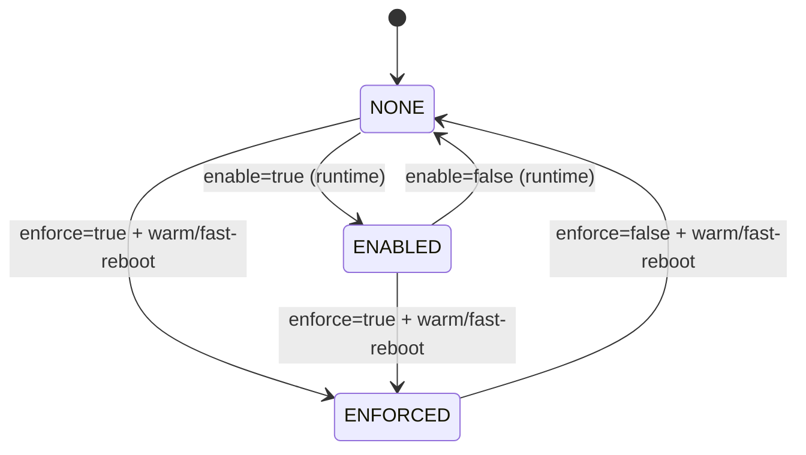

!!! danger "裏取りステータス: Discrepancy-found（実装名と HLD 記載に差異あり）"
    `sonic-host-services/scripts/hostcfgd` L100-103 / L1756-1809 で `FipsCfg` ハンドラを確認。HLD と現行 master の差異: (1) HLD の `/etc/fips/fips_enabled` は実装上 `/etc/fips/fips_enable`（語尾 `d` なし）。(2) HLD の `STATE_DB.FIPS_STAT|state` は実装上 `STATE_DB.FIPS_STATS|state`（複数形）。参照時は実装側名を使うこと。

# SONiC FIPS 140-3 デプロイ

## なぜこの設計なのか

データセンタ用途で **FIPS 140-3 適合** が要求される場合の、SONiC 上での有効化設計を規定する[^1]。設計の中核:

- **runtime で有効化** 可能（再起動なしで control/management plane = sshd / telemetry / restapi を切替）
- **enforce mode** は **kernel cmdline** に依存するため、切替に warm/fast-reboot が必須
- 状態フラグは **`/etc/fips/fips_enabled`**（HLD 表記）/ 実装は `/etc/fips/fips_enable` という単純なファイル（`1`/`0`）

スコープは SONiC OS v11+ / 202205 / 202211 / master[^1]。

## 2 つのモード



- **None Enforce**: `/etc/fips/fips_enabled` を runtime で 1/0 にし、SymCrypt engine を有効/無効化。対応サービス（sshd / telemetry / restapi）の **再起動が必要**[^1]
- **Enforce**: kernel cmdline に依存。切替は **warm/fast-reboot 必須**[^1]
- `enforce=true` なら `enable` は無視される。`enable` は enforce 前の中間モード兼ロールバック弁[^1]

## CONFIG_DB / STATE_DB

```json
{
  "FIPS": {
    "global": {"enable": "true", "enforce": "true"}
  }
}
```

| Table | Key | フィールド |
|-------|-----|------------|
| `CONFIG_DB.FIPS` | `global` | `enable: true/false`, `enforce: true/false` |
| `STATE_DB.FIPS_STAT`（HLD）/ **`FIPS_STATS`**（実装）| `state` | `enabled: 1/other`, `enforced: 1/other` |

## アップグレード/再起動時の挙動

| 操作 | 影響 |
|------|------|
| warm/fast-reboot | enforce flag が変わった場合のみ反映 |
| enforce 変更 | warm/fast-reboot 必須 |
| SONiC upgrade（enforce 設定済） | 次 boot image にも enforce 引継ぎ |
| SONiC upgrade（enforce 未設定） | 次 image の default に従う |
| runtime `enable` 変更 | upgrade 完了後 CONFIG_DB 再読み込みで反映 |

ビルド既定は `ENABLE_FIPS=n`（disabled）。データセンタ全機 enforce 運用なら `ENABLE_FIPS=y` でビルド + `enforce=true` 配布[^1]。

## 設定例

```bash
# runtime で FIPS を ON（sshd/telemetry/restapi は hostcfgd 経由で自動再起動）
sonic-db-cli CONFIG_DB hset 'FIPS|global' enable true

# enforce mode（要 warm/fast-reboot）
sonic-db-cli CONFIG_DB hset 'FIPS|global' enforce true
warm-reboot

# 状態確認（実装側のキー名を使う）
cat /etc/fips/fips_enable
sonic-db-cli STATE_DB hgetall 'FIPS_STATS|state'
```

## 制限事項

- SONiC OS v11+ 前提[^1]
- `enable` 切替でも sshd/telemetry/restapi が再起動されるため瞬断あり
- enforce 切替は warm/fast-reboot 必須
- 古い image では `/etc/fips/fips_enable` を各 container に手動配布する必要あり
- 制御/管理プレーンが対象、データプレーンは触らない
- OpenSSL SymCrypt engine と kernel option の取り込みに依存

## 干渉する機能

`hostcfgd`（FIPS table handler）/ sshd / telemetry / restapi / OpenSSL SymCrypt engine / kernel cmdline / warm-reboot / fast-reboot / `ENABLE_FIPS` ビルドオプション。

## トラブルシューティング

- `enable=true` でも sshd が FIPS 化していない → `cat /etc/fips/fips_enable` が `1` か host と各 container で確認
- STATE_DB が更新されない → `hostcfgd` ログ確認
- enforce が反映されない → `cat /proc/cmdline` で kernel cmdline 確認
- upgrade 後に enforce が外れた → 新 image の default を確認

## 実装との乖離

| 項目 | HLD 表記 | 実装（hostcfgd） |
|---|---|---|
| flag file | `/etc/fips/fips_enabled` | `/etc/fips/fips_enable`（L102）|
| STATE_DB key | `FIPS_STAT\|state` | `FIPS_STATS\|state`（L1792）|
| 再起動サービス | sshd / telemetry / restapi | `['ssh', 'telemetry.service', 'restapi']`（L103）|

CONFIG_DB の `FIPS|global` 表記は HLD どおりで問題なし。

#### 関連 GitHub Issue / PR

- [sonic-buildimage #11494: \[TestOnly\] Support openssl fips disable openssl fips mod (open)](https://github.com/sonic-net/sonic-buildimage/pull/11494) — FIPS 有効/無効切替の長期 open PR。本 HLD の `/etc/fips/fips_enabled` 制御と直接関連。
- [sonic-buildimage #11205: \[sonic-fips\] Makefile bugfix (open)](https://github.com/sonic-net/sonic-buildimage/pull/11205) — FIPS ビルド系の修正 PR。長期 open で取り込み停滞を示唆。
- FIPS 140-3 全体（140-2 → 140-3 移行）を束ねるトラッキング Issue は確認できず。

## 関連 Topics

- [15-security-aaa](../topics/15-security-aaa/index.md): セキュリティ機能全般

## 引用元

[^1]: `sonic-net/SONiC` `doc/fips/SONiC-OpenSSL-FIPS-140-3-deployment.md` @ `49bab5b5ff0e924f1ea52b3d9db0dfa4191a7c06`

<!-- topics-back-ref -->
## 関連 Topics

- [Topics: Security / AAA / FIPS / Hardening](../topics/15-security-aaa/index.md)

<!-- /topics-back-ref -->
