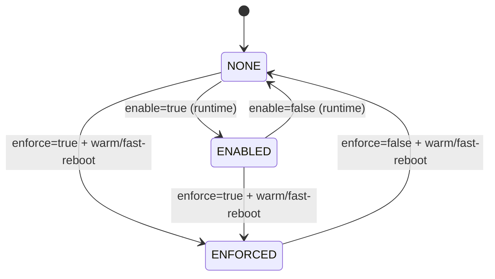
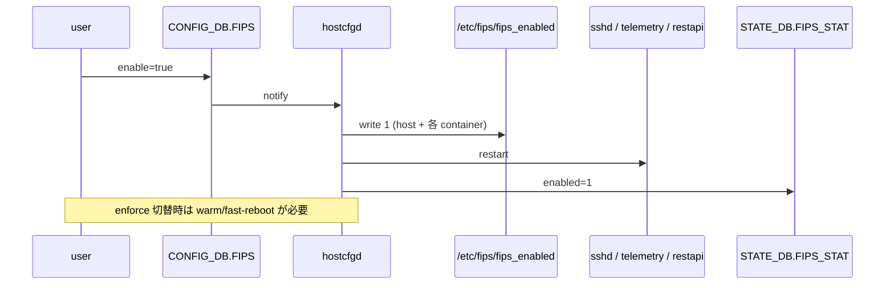

!!! danger "裏取りステータス: Discrepancy-found（実装名と HLD 記載に差異あり）"
    `sonic-host-services/scripts/hostcfgd` L100-103 / L1756-1809 で `FipsCfg` クラスが `FIPS` テーブルハンドラを実装、`DEFAULT_FIPS_RESTART_SERVICES = ['ssh', 'telemetry.service', 'restapi']` の再起動連動を確認。`sonic-buildimage/slave.mk` L425 `export ENABLE_FIPS` でビルドオプション、`sonic-buildimage/rules/sonic-fips.mk` でパッケージビルド、`sonic-buildimage/src/sonic-yang-models/yang-models/sonic-fips.yang` で YANG を確認（verified at: 2026-05-09）。**HLD と現行 master の差異**: (1) HLD の `/etc/fips/fips_enabled` は実装上 `/etc/fips/fips_enable`（`OPENSSL_FIPS_CONFIG_FILE = '/etc/fips/fips_enable'`, hostcfgd L102）。(2) HLD の `STATE_DB.FIPS_STAT|state` は実装上 `STATE_DB.FIPS_STATS|state`（hostcfgd L1792 `state_db_conn.hset('FIPS_STATS|state', ...)`）。本ページのキー名は HLD 表記のままなので参照時は実装側名を使うこと。

# SONiC FIPS 140-3 デプロイ（`FIPS` table と `/etc/fips/fips_enabled`）

## 概要

データセンタ用途で **FIPS 140-3 適合** が要求される場合の、SONiC 上での有効化設計を規定する[^1]。設計の特徴は[^1]:

- **runtime で有効化可能**（再起動なしで control / management plane = sshd / telemetry / restapi 等を切替）
- **enforce mode** は別軸で扱い、こちらは **kernel cmdline** に依存するため切替に warm/fast-reboot が必要
- 切替フラグは **`/etc/fips/fips_enabled`** という単純なファイル（`1` / `0`）で表現

スコープ[^1]:

- FIPS 140-3 は **SONiC OS Version 11 以降** のみで提供
- ブランチは **202205 / 202211 / master** に対応

## 動作仕様

### CONFIG_DB スキーマ

```json
{
  "FIPS": {
    "global": {
      "enable":  "true",
      "enforce": "true"
    }
  }
}
```

| キー | 意味 |
|------|------|
| `enable` | true で FIPS 機能を **runtime 有効化**。default `false` |
| `enforce` | true で **enforce mode** を要求（`enable` を無視）。default `false` |

`enforce=true` 設定後は **`enable` の値が無視** され、enforce 設定。`enforce` を未設定にしておけば、runtime で `enable` を切り替えるだけで FIPS を on/off できる[^1]。

`enable` は **none-enforce → enforce 移行時の中間モード**。データセンタで問題が出た場合に **再起動なしでロールバック** できる安全弁の役割を持つ[^1]。

### モード比較



### FIPS None Enforce mode

`/etc/fips/fips_enabled` の値で OpenSSL の SymCrypt engine を runtime で切り替える。値 `1` で FIPS 有効、`0` で無効。runtime 切替には対応サービスの **再起動が必要**[^1]:

```bash
# 有効化（要 sshd / telemetry / restapi 再起動）
echo 1 > /etc/fips/fips_enabled

# 無効化
echo 0 > /etc/fips/fips_enabled
```

各 docker container 内でも flag file が見えなければならないため、新 image では **全 container に bind mount** される[^1]。古い image は手動で各 container に同じファイルを作る必要があり、HLD には移行用スクリプト例が示されている:

```bash
mkdir -p /etc/fips
echo 1 > /etc/fips/fips_enabled
docker exec telemetry bash -c 'mkdir -p /etc/fips; echo 1 > /etc/fips/fips_enabled'
docker exec restapi   bash -c 'mkdir -p /etc/fips; echo 1 > /etc/fips/fips_enabled'
docker restart telemetry restapi
systemctl restart sshd
```

新 image では `hostcfgd` が **CONFIG_DB.FIPS の変更を検知して自動的にこのスクリプト相当を実行** する[^1]。

### FIPS Enforce mode

enforce mode 切替は **kernel cmdline オプション** に依存する。none-enforce ↔ enforce の遷移には **warm-reboot または fast-reboot が必須**[^1]。

新規インストール / アップグレード時の挙動[^1]:

- ビルド既定 `ENABLE_FIPS=n`。よって新規インストール直後は **disabled**
- ビルド時に `ENABLE_FIPS=y` を指定すれば、インストール直後から FIPS 利用可能（再起動不要）
- データセンタ全機を enforce にする運用では **`ENABLE_FIPS=y` でビルド + 全機 `enforce=true` 設定** が望ましい

### `STATE_DB.FIPS_STAT`

現在の FIPS 状態は STATE_DB に書き込まれる[^1]:

```text
FIPS_STAT|state
    enabled  : "1" | other      # FIPS 有効か
    enforced : "1" | other      # enforce mode か
```

参考 PR: `sonic-net/sonic-host-services` PR #69。

### reboot / upgrade 時の挙動

| 操作 | 影響 |
|------|------|
| **warm-reboot / fast-reboot** | kernel cmdline を初期化するため、enforce flag が変わった場合のみ反映される |
| **enforce 設定変更** | warm/fast-reboot が必須 |
| **SONiC upgrade**（FIPS enforced 機の場合） | 次回 boot image にも自動的に enforce が引き継がれる |
| **SONiC upgrade**（enforce 未設定の場合） | 次 image の default に従う（ビルド時に変更されていなければ disabled） |
| **runtime FIPS option** | upgrade 完了後 CONFIG_DB を再読みして反映。upgrade 中は変化しない |



## 設定

### 関連する CONFIG_DB

| Table | Key | フィールド | 説明 |
|-------|-----|-----------|------|
| `FIPS` | `global` | `enable: true/false`, `enforce: true/false` | FIPS 設定 |

### 関連する STATE_DB

| Table | Key | フィールド | 説明 |
|-------|-----|-----------|------|
| `FIPS_STAT` | `state` | `enabled: 1/other`, `enforced: 1/other` | 現在の FIPS 状態 |

### CLI

本 HLD は **専用 CLI を新設しない**[^1]。CONFIG_DB を直接更新する運用前提。

### 設定例

```bash
# runtime で FIPS を ON
sonic-db-cli CONFIG_DB hset 'FIPS|global' enable true
# 再起動不要で sshd/telemetry/restapi が hostcfgd 経由で再起動される

# enforce mode 切替（要 warm/fast-reboot）
sonic-db-cli CONFIG_DB hset 'FIPS|global' enforce true
warm-reboot

# 状態確認
sonic-db-cli STATE_DB hgetall 'FIPS_STAT|state'
```

## 制限事項

- FIPS 140-3 は **SONiC OS v11+** が前提[^1]
- runtime で `enable` を切り替えても **対象サービス（sshd / telemetry / restapi 等）の再起動が必要**[^1]。瞬断あり
- **enforce mode の切替には warm/fast-reboot が必須**
- 古い image では `/etc/fips/fips_enabled` を **各 container に手動配布する必要** があり、移行スクリプトに依存[^1]
- 制御プレーン / 管理プレーンが対象で、**データプレーンは触らない**（再起動なしを謳う根拠）
- HLD は **OpenSSL SymCrypt engine** に依存する。kernel option / OpenSSL patch の取り込み次第で挙動が変わる

## 干渉する機能

- **`hostcfgd` (sonic-host-services)**: `FIPS` table の handler。runtime ではこれが flag file 配布 + サービス再起動を駆動
- **`sshd` / `telemetry` / `restapi`**: 再起動対象
- **OpenSSL + SymCrypt-OpenSSL engine**: 暗号モジュール本体
- **kernel cmdline**: enforce mode の根拠
- **warm-reboot / fast-reboot**: enforce 切替時に必須
- **`ENABLE_FIPS` ビルドオプション**: image レベルの default を決定

## トラブルシューティング

- `enable=true` にしても sshd が FIPS 化していない → `cat /etc/fips/fips_enabled` が `1` になっているか、host と各 container 双方で確認
- `STATE_DB.FIPS_STAT|state` が更新されない → `hostcfgd` のログ確認
- enforce mode 切替が反映されない → warm/fast-reboot を実施したか、kernel cmdline を `cat /proc/cmdline` で確認
- upgrade 後に enforce が外れた → 旧 image で `enforce=true` だったか、新 image の default が `disabled` だったかを確認

## 引用元

[^1]: `sonic-net/SONiC` `doc/fips/SONiC-OpenSSL-FIPS-140-3-deployment.md` @ `49bab5b5ff0e924f1ea52b3d9db0dfa4191a7c06`

<!-- concerns hint:
- hostcfgd の FIPS table handler 実装存在確認 (sonic-host-services / PR #69)
- 各 docker container への /etc/fips/fips_enabled bind mount の取り込み確認
- ENABLE_FIPS ビルドオプションが現行 sonic-buildimage rules/config にあるか未確認
- STATE_DB.FIPS_STAT|state の書き込み実装確認
- SymCrypt-OpenSSL engine の openssl.patch 適用と src/sonic-fips の現行状況確認
- enforce mode の kernel cmdline 設定（/etc/fips/fips_enabled の挙動と warm/fast-reboot 連動）の実装確認
-->
