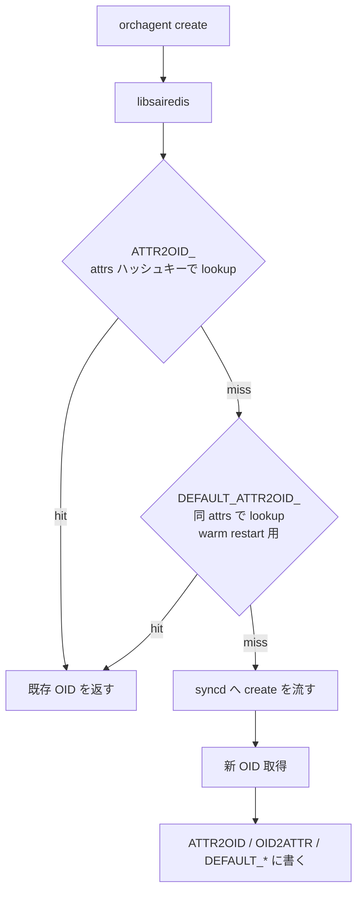

!!! danger "裏取りステータス: discrepancy-found"
    Verifier 2026-05-09: 本 HLD で提案された **`ATTR2OID_*` / `OID2ATTR_*` / `DEFAULT_ATTR2OID_*` / `DEFAULT_OID2ATTR_*` / `DEFAULT_OBJ_*` キープレフィックス、および RESTORE_DB (DB 7)** は現行 `sonic-sairedis` master に存在しない（`grep -rn 'RESTORE_DB\|ATTR2OID_\|DEFAULT_ATTR2OID' .cache/sonic-sources/sonic-sairedis/` で 0 件）。`g_objectOwner` / `UNDERLAY_INTERFACE_` / `OVERLAY_INTERFACE_` も `sonic-swss/orchagent/` に存在しない。一方、競合案であった **syncd 側 view comparison** は `sonic-sairedis/syncd/ComparisonLogic.{cpp,h}` および `Syncd.{cpp,h}` の `applyView` 経路として採用済み。よって本ページの提案設計は **採用されておらず**、現行 warm restart の同等機能は syncd の view comparison が担う。本ページは歴史的設計案として保持。

# libsairedis API idempotence（warm restart 用 OID キャッシュと duplicate 抑止）

## 概要

[orchagent](../reference/glossary.md#term-orchagent) と [syncd](../reference/glossary.md#term-syncd) の間にある **libsairedis API** の `create` / `set` / `remove` / `get` を **idempotent** にし、orchagent が warm restart 後に同じ呼出を繰り返しても data plane に影響を与えない設計[^1]。`get` は無害なので重複可、それ以外は libsairedis 内のキャッシュで重複を吸収して syncd まで降ろさない。

## 動作仕様

### 5 種のキャッシュ

すべて redis の `RESTORE_DB`（DB 7）に置く[^1]:

| プレフィックス | 用途 |
|--------------|------|
| `ATTR2OID_<owner>_...` | 同一 attributes セット → 同 OID を返すための逆引き |
| `DEFAULT_ATTR2OID_<owner>_...` | 作成時の **元の attributes** から OID への逆引き（後の SET 変更後でも復元できる） |
| `DEFAULT_OID2ATTR_<oid>` | OID → 元 attributes（`DEFAULT_ATTR2OID_*` の存在チェック用） |
| `OID2ATTR_<oid>` | 現在の OID → attributes（SET / REMOVE の duplicate 検出） |
| `DEFAULT_OBJ_<owner>_<obj_key>` | libsai/SDK が作る default object に orchagent が後で attribute SET した場合の最新 attributes |

`g_objectOwner` はアプリ識別子。同一 attributes だが意味が異なるケース（例: underlay loopback [RIF](../reference/glossary.md#term-rif) と overlay loopback RIF が同 VR を参照）を別 OID にする[^1]。

### create フロー



例（loopback RIF が underlay/overlay で同 attributes だが owner で別 OID）[^1]:

```text
ATTR2OID_OVERLAY_INTERFACE_SAI_ROUTER_INTERFACE_ATTR_TYPE=...|...VIRTUAL_ROUTER_ID=oid:0x300000000003a
  -> SAI_OBJECT_TYPE_ROUTER_INTERFACE:oid:0x6000000000996
ATTR2OID_UNDERLAY_INTERFACE_SAI_ROUTER_INTERFACE_ATTR_TYPE=...|...VIRTUAL_ROUTER_ID=oid:0x300000000003a
  -> SAI_OBJECT_TYPE_ROUTER_INTERFACE:oid:0x6000000000939
```

### default attributes 保持

object 作成後に attributes が変わると `ATTR2OID_*` も更新されるが、warm restart 直後 orchagent は **元の attributes** で create を再発行することがある。これを救うため、初回の SET 直前に **`DEFAULT_ATTR2OID_*` と `DEFAULT_OID2ATTR_*` を 1 度だけ作成**して保存し続ける[^1]:

```text
DEFAULT_ATTR2OID_SAI_HOSTIF_ATTR_NAME=Ethernet18|...|SAI_HOSTIF_ATTR_TYPE=SAI_HOSTIF_TYPE_NETDEV
  -> SAI_OBJECT_TYPE_HOSTIF:oid:0xd000000000952

DEFAULT_OID2ATTR_SAI_OBJECT_TYPE_HOSTIF:oid:0xd000000000952
  -> {SAI_HOSTIF_ATTR_NAME: Ethernet18, SAI_HOSTIF_ATTR_OBJ_ID: ..., SAI_HOSTIF_ATTR_TYPE: ...}

ATTR2OID_SAI_HOSTIF_ATTR_NAME=Ethernet18|...|SAI_HOSTIF_ATTR_TYPE=...|SAI_HOSTIF_ATTR_VLAN_TAG=KEEP
  -> SAI_OBJECT_TYPE_HOSTIF:oid:0xd000000000952
```

`DEFAULT_OID2ATTR_*` の存在チェックで「default 既保存？」を判定する[^1]。

### SET / REMOVE の重複抑止

`OID2ATTR_<oid>` を引き、現在値と差分が無ければ何もせず success を返す。route entry / neighbor / fdb など `sai_object_id_t` でない objects は `OID2ATTR_*` のみ持つ[^1]。

### Default object 上書き保存

libsai / SDK 起動時に作る default object（例: default switch）に orchagent が attribute set した場合、`DEFAULT_OBJ_<owner>_<obj_key>` に最新 attributes を保存。warm restart 後に同じ SET が再発行されても直接 return できる[^1]。

### Performance チューニング案[^1]

- **In memory cache**: redis hget を都度叩かないよう libsairedis 内でメモリキャッシュ
- **Producer/Consumer 圧縮**: 現在 key/op/value の 3 LPUSH/LRANGE/LTRIM を 1 つに統合可能。redis bench では `LPUSH ~9.4K req/s`、`LRANGE 100 ~4.5K req/s` 程度のオーバーヘッド[^1]
- **Multiple redis instances**: route flapping 等の極端ケースには 1 インスタンスでは厳しい。`COUNTERS_DB` 等を別 instance に分け、idempotence 用 `RESTORE_DB`（7）も分離して書き込み async 化を検討
- **Serialization 最適化**: serialize/deserialize に CPU を食う

参考の redis benchmark は Atom C2558 4core / 2.4GHz 上の実測[^1]。

## 制限事項

- 設計は **draft レベル**。同じ目的の別実装案（syncd view comparison）と競合
- `ATTR2OID_*` のキー長が長くなる（attributes 全列挙）
- [Redis](../reference/glossary.md#term-redis) 単一インスタンスでは route flapping 等で律速の可能性

## 干渉する機能

- **syncd view comparison**: 同じ問題を syncd 側で解く別案。どちらかを採用する設計選択
- **warm reboot**: 本機能の主目的
- **counter 系**: 別 redis instance 化の議論で [COUNTERS_DB](../reference/glossary.md#term-counters_db) が引合に出る

<!-- diff-admonition -->
!!! diff "HLD と実装の差分"
    2026-05-11 時点の現行 master を裏取り。

    ### 1. ファイル + 行番号

    - **未取り込み**: `sonic-net/sonic-sairedis` の lib/ 配下（`ClientSai.cpp`, `RedisChannel.cpp`, `Recorder.cpp` 等）と syncd 配下を grep しても `ATTR2OID_`, `OID2ATTR_`, `DEFAULT_OID2ATTR_`, `DEFAULT_OBJ_`, `RESTORE_DB`（DB 番号 7）に対応するキー定義は **見当たらない**。`idempoten` の文字列ヒットも 0。
    - 現行 master の warm restart 経路は **syncd 側の view comparison**（`syncd/AsicView.cpp` / `syncd/BestCandidateFinder.cpp` / `syncd/HardReiniter.cpp`）で重複 OID 発行を抑止しており、[HLD](../reference/glossary.md#term-hld) が示す「libsairedis 内 prefix scheme」ではない。

    ### 2. 差分の中身

    HLD は libsairedis 内に以下のキー空間を用意して redis に保存し、warm restart 後の重複 [SAI](../reference/glossary.md#term-sai) 呼び出しを libsairedis 層で握りつぶす設計を提案している:

    ```text
    DEFAULT_ATTR2OID_<serialized attrs>  → <oid>
    DEFAULT_OID2ATTR_<oid>               → {attr: value, ...}
    ATTR2OID_<serialized attrs>          → <oid>
    OID2ATTR_<oid>                       → {attr: value, ...}
    DEFAULT_OBJ_<owner>_<obj_key>        → {attr: value, ...}
    ```

    現行 master は同等の目的を **syncd の view diff 機構** で達成しており、libsairedis 側に prefix キーは作られない。すなわち HLD は **draft / 未採用案** である。

    ### 3. 読者への影響

    `redis-cli -n 1 keys 'OID2ATTR_*'` 等で HLD どおりのキー出現を期待する読者は何も見えず、設計を誤解する。warm restart 時の挙動を deep dive するときは libsairedis ではなく **`sonic-sairedis/syncd/` 配下の view comparison 実装**（`AsicView` / `HardReiniter` / `WarmBoot`）を読む必要がある。

    ### 4. 回避策

    - warm restart 時の重複抑止メカニズムを追うときは `sonic-sairedis/syncd/` の view comparison ファイル群を起点にする。
    - redis 上の warm restart 状態は `STATE_WARM_RESTART_TABLE` / `WARM_RESTART_TABLE` を読む。
    - 本 HLD は「採用されなかった代替案」として読み、現行の挙動は別 HLD `doc/warm-reboot/code_implementation.md` および syncd ソース、`doc/warm-reboot/sai_warmboot.md` を参照する。

    #### 関連 GitHub Issue / PR

    - [GitHub Issue / PR の関連リンクは未確認] — warm restart 用 OID キャッシュ / duplicate 抑止は [sonic-sairedis](../reference/glossary.md#term-sonic-sairedis) 内部リファクタとして散発的に取り込まれており、HLD と直接紐づくトラッキング Issue / PR は確認できず。
<!-- /diff-admonition -->

## 実装との乖離

`monitor: deprecated` の HLD と実装の差分。 本ページ末尾近くの `!!! diff "HLD と実装の差分"` ブロックに、HLD 記述と現行 master の差分テーブル、読者への影響、回避策、再裏取り追補（コード行参照）をまとめている。本セクションはその概要見出しであり、詳細はそのブロックを参照のこと。

## 引用元

[^1]: [sonic-net/SONiC doc/warm-reboot/sai_redis_api_idempotence.md @ 49bab5b](https://github.com/sonic-net/SONiC/blob/49bab5b5ff0e924f1ea52b3d9db0dfa4191a7c06/doc/warm-reboot/sai_redis_api_idempotence.md)

<!-- next-action -->
## このページを読んだ後の次アクション

!!! tip "読み手向け"
    - **本機能を実運用で使う場合**: 本 HLD は採用見送り。後継機能 (下記リンク) を参照
    - **upstream 動向を追う場合**: 関連 issue / PR を [sonic-net/SONiC](https://github.com/sonic-net/SONiC) で検索（HLD タイトル / CONFIG_DB テーブル名 / Orch クラス名で grep するのが速い）
    - **代替手段 / 関連 reference**: 本ページの frontmatter `related` が空のため、[Reference 索引](../reference/index.md) から関連テーブル / CLI / YANG を辿る

!!! note "本ドキュメントの追跡"
    - monitor: `deprecated` / last_verified: `2026-05-11`
    - 次回再裏取りトリガ: biannual。一覧は [discrepancy-index](../reference/verification/discrepancy-index.md) を参照（運用詳細は repo の `meta/discrepancy-operations.md`）

<!-- /next-action -->

<!-- glossary-links-injected: 32f24cf9f75a -->
