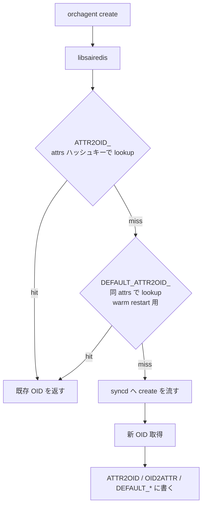

!!! warning "裏取りステータス: HLD-only"
    HLD は warm-reboot 議事系。`ATTR2OID_*` / `OID2ATTR_*` / `DEFAULT_*` 各キープレフィックスを RESTORE_DB (DB 7) に置く設計が現行 sairedis の master ブランチに採用されているかは未裏取り（`syncd view comparison` 案との競合あり）。

# libsairedis API idempotence（warm restart 用 OID キャッシュと duplicate 抑止）

## 概要

orchagent と syncd の間にある **libsairedis API** の `create` / `set` / `remove` / `get` を **idempotent** にし、orchagent が warm restart 後に同じ呼出を繰り返しても data plane に影響を与えない設計[^1]。`get` は無害なので重複可、それ以外は libsairedis 内のキャッシュで重複を吸収して syncd まで降ろさない。

## 動作仕様

### 5 種のキャッシュ

すべて redis の `RESTORE_DB`（DB 7）に置く[^1]:

| プレフィックス | 用途 |
|--------------|------|
| `ATTR2OID_<owner>_...` | 同一 attributes セット → 同 OID を返すための逆引き |
| `DEFAULT_ATTR2OID_<owner>_...` | 作成時の **元の attributes** から OID への逆引き（後の SET 変更後でも復元できる） |
| `DEFAULT_OID2ATTR_<oid>` | OID → 元 attributes（`DEFAULT_ATTR2OID_*` の存在チェック用） |
| `OID2ATTR_<oid>` | 現在の OID → attributes（SET / REMOVE の duplicate 検出） |
| `DEFAULT_OBJ_<owner>_<obj_key>` | libsai/SDK が作る default object に orchagent が後で attribute SET した場合の最新 attributes |

`g_objectOwner` はアプリ識別子。同一 attributes だが意味が異なるケース（例: underlay loopback RIF と overlay loopback RIF が同 VR を参照）を別 OID にする[^1]。

### create フロー



例（loopback RIF が underlay/overlay で同 attributes だが owner で別 OID）[^1]:

```text
ATTR2OID_OVERLAY_INTERFACE_SAI_ROUTER_INTERFACE_ATTR_TYPE=...|...VIRTUAL_ROUTER_ID=oid:0x300000000003a
  -> SAI_OBJECT_TYPE_ROUTER_INTERFACE:oid:0x6000000000996
ATTR2OID_UNDERLAY_INTERFACE_SAI_ROUTER_INTERFACE_ATTR_TYPE=...|...VIRTUAL_ROUTER_ID=oid:0x300000000003a
  -> SAI_OBJECT_TYPE_ROUTER_INTERFACE:oid:0x6000000000939
```

### default attributes 保持

object 作成後に attributes が変わると `ATTR2OID_*` も更新されるが、warm restart 直後 orchagent は **元の attributes** で create を再発行することがある。これを救うため、初回の SET 直前に **`DEFAULT_ATTR2OID_*` と `DEFAULT_OID2ATTR_*` を 1 度だけ作成**して保存し続ける[^1]:

```text
DEFAULT_ATTR2OID_SAI_HOSTIF_ATTR_NAME=Ethernet18|...|SAI_HOSTIF_ATTR_TYPE=SAI_HOSTIF_TYPE_NETDEV
  -> SAI_OBJECT_TYPE_HOSTIF:oid:0xd000000000952

DEFAULT_OID2ATTR_SAI_OBJECT_TYPE_HOSTIF:oid:0xd000000000952
  -> {SAI_HOSTIF_ATTR_NAME: Ethernet18, SAI_HOSTIF_ATTR_OBJ_ID: ..., SAI_HOSTIF_ATTR_TYPE: ...}

ATTR2OID_SAI_HOSTIF_ATTR_NAME=Ethernet18|...|SAI_HOSTIF_ATTR_TYPE=...|SAI_HOSTIF_ATTR_VLAN_TAG=KEEP
  -> SAI_OBJECT_TYPE_HOSTIF:oid:0xd000000000952
```

`DEFAULT_OID2ATTR_*` の存在チェックで「default 既保存？」を判定する[^1]。

### SET / REMOVE の重複抑止

`OID2ATTR_<oid>` を引き、現在値と差分が無ければ何もせず success を返す。route entry / neighbor / fdb など `sai_object_id_t` でない objects は `OID2ATTR_*` のみ持つ[^1]。

### Default object 上書き保存

libsai / SDK 起動時に作る default object（例: default switch）に orchagent が attribute set した場合、`DEFAULT_OBJ_<owner>_<obj_key>` に最新 attributes を保存。warm restart 後に同じ SET が再発行されても直接 return できる[^1]。

### Performance チューニング案[^1]

- **In memory cache**: redis hget を都度叩かないよう libsairedis 内でメモリキャッシュ
- **Producer/Consumer 圧縮**: 現在 key/op/value の 3 LPUSH/LRANGE/LTRIM を 1 つに統合可能。redis bench では `LPUSH ~9.4K req/s`、`LRANGE 100 ~4.5K req/s` 程度のオーバーヘッド[^1]
- **Multiple redis instances**: route flapping 等の極端ケースには 1 インスタンスでは厳しい。`COUNTERS_DB` 等を別 instance に分け、idempotence 用 `RESTORE_DB`（7）も分離して書き込み async 化を検討
- **Serialization 最適化**: serialize/deserialize に CPU を食う

参考の redis benchmark は Atom C2558 4core / 2.4GHz 上の実測[^1]。

## 制限事項

- 設計は **draft レベル**。同じ目的の別実装案（syncd view comparison）と競合
- `ATTR2OID_*` のキー長が長くなる（attributes 全列挙）
- Redis 単一インスタンスでは route flapping 等で律速の可能性

## 干渉する機能

- **syncd view comparison**: 同じ問題を syncd 側で解く別案。どちらかを採用する設計選択
- **warm reboot**: 本機能の主目的
- **counter 系**: 別 redis instance 化の議論で COUNTERS_DB が引合に出る

## 引用元

[^1]: [sonic-net/SONiC doc/warm-reboot/sai_redis_api_idempotence.md @ 49bab5b](https://github.com/sonic-net/SONiC/blob/49bab5b5ff0e924f1ea52b3d9db0dfa4191a7c06/doc/warm-reboot/sai_redis_api_idempotence.md)
