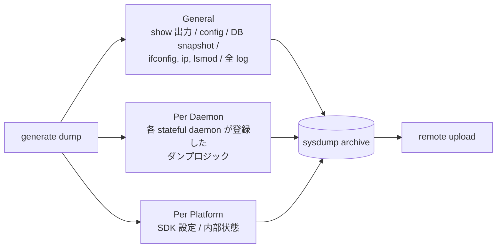

!!! info "裏取りステータス: code-verified（要件レベル仕様）"
    HLD は要件記述ペーパ。実装側は `sonic-utilities/scripts/generate_dump`（103KB の bash で General/Per daemon/Per platform ダンプを統合、`PLUGINS_DIR=/usr/local/bin/debug-dump` で plugin 機構実装）、`scripts/coredump_gen_handler.py`（クラッシュ → sysdump 連動）、`utilities_common/auto_techsupport_helper.py`、`scripts/techsupport_cleanup.py` を確認。要件で挙げられた sysdump 3 区分 / クラッシュ自動生成パスは master 取り込み済み。

# SONiC Logging & System Dumps（要件レベル仕様）

## 概要

このドキュメントは [SONiC](../reference/glossary.md#term-sonic) におけるロギングとシステムダンプの **要件と概念設計** を記述する。実装ファイル名・関数名は与えられず、各機能要件のチェックリスト的な体裁になっている[^1]。

主要要件のサマリ:

- ログ操作: upload / rotate / delete
- 設定可能な severity（全体・コンポーネント別）
- Docker コンテナ内ログも一般メカニズムで透過取得
- console 出力（デバッグ目的）と log monitor mirror
- デーモンクラッシュ検知 + クラッシュ時 sysdump
- 3 種類のダンプ（General / Per daemon / Per platform）
- ダンプの remote upload インタフェース

## 動作仕様

### ログ要件

| カテゴリ | 内容 |
|---------|------|
| ファイル操作 | 現在または特定 ID のログを upload / rotate / delete |
| Severity | 全体 / 個別デーモン / コンテナ |
| Docker 透過 | コンテナ内ログも一般 logging から見える |
| Console 出力 | アプリ指定 severity をコンソールに出す + log monitor で mirror |
| クラッシュ検知 | クラッシュ時に sysdump 生成 + 通知 |

### System Dump 3 区分



要点[^1]:

- **General**: 非プラットフォーム情報。`show` 系出力、設定ファイル、DB スナップショット、`ifconfig` / `ip` / `lsmod` 等の標準 Linux コマンド出力、ログ
- **Per daemon**: 各 stateful daemon が **登録**して呼ばれる方式。dump trigger を受けると個別ロジックで状態を吐く
- **Per platform**: 各プラットフォームが SDK 設定や内部状態を吐けるよう登録機構を持つ

ゴールは「採取したダンプから開発環境で同じ構成を再現できる」レベル。

### スケール / 性能要件

- ログファイルは **自動 rotation** し、サイズに上限を設ける
- ログ全体のサイズに上限を設ける
- スパムログは **頻度制限**
- sysdump アーカイブも **サイズ上限**

### モジュール間 API

- 全モジュールは **`libswss-common` が提供する共通 API** を使う[^1]

### 設定可能パラメータ

| 項目 | 説明 |
|------|------|
| 最大 rotation ファイル数 | rotation で保持する古いログ数 |
| Rotation 周期 | 時間ベース |
| 最大ログファイルサイズ | サイズベース rotation |
| 圧縮タイプ | rotation 後の圧縮形式 |
| Post rotation actions | rotation 完了時のフック |

これらは `sonic-mgmt` のデプロイ段階で配布される設定ファイルで決める想定[^1]。

### UI

- 設定変更 → `sonic-mgmt` 経由
- sysdump 取得 → `sonic-mgmt` 経由

CLI 直接の規定は本 [HLD](../reference/glossary.md#term-hld) には無い[^1]。

<!-- evidence:
source: sonic-net/SONiC/doc/logging/Logging_and_sysdump_arch_spec.md#L40-L58 (sha: 49bab5b5ff0e924f1ea52b3d9db0dfa4191a7c06)
excerpt: |
  All modules should use the same common API for logging and dumps (provided by libswss-common).
  ... User can change logging configuration via sonic-mgmt, which takes care of deploying configs.
  Sysdump should be available through sonic-mgmt.
reasoning: 共通 API と sonic-mgmt 経由運用の根拠。
-->

<!-- evidence-rendered:start -->
??? note "📋 検証エビデンス: sonic-net/SONiC/doc/logging/Logging_and_sysdump_arch_spec.md#L40-L58 (sha: 49bab5b5ff0e924f1ea52b3d9db0dfa4191a7c06)"

    **出典**:

    `sonic-net/SONiC/doc/logging/Logging_and_sysdump_arch_spec.md#L40-L58 (sha: 49bab5b5ff0e924f1ea52b3d9db0dfa4191a7c06)`

    **抜粋**:

    ```text
    All modules should use the same common API for logging and dumps (provided by libswss-common).
    ... User can change logging configuration via sonic-mgmt, which takes care of deploying configs.
    Sysdump should be available through sonic-mgmt.
    ```

    **判断根拠**: 共通 API と sonic-mgmt 経由運用の根拠。

<!-- evidence-rendered:end -->

## 設定

### 関連する CONFIG_DB / CLI / YANG

本 HLD では具体的な [CONFIG_DB](../reference/glossary.md#term-config_db) / CLI / [YANG](../reference/glossary.md#term-yang) スキーマを規定していない。実装側で別途決まる前提。実機の SONiC では `show techsupport` / `generate_dump` 系コマンドが Per daemon / Per platform フックを呼ぶ実装が存在するが、本 HLD はそのレイヤを定義するだけ[^1]。

## 制限事項

- **要件仕様レベル**: 具体実装は本 HLD では決まらない。`libswss-common` ベースの共通 API、`sonic-mgmt` 経由のデプロイ前提だけが固い[^1]。
- **クラッシュ検知の具体機構が未規定**: 「監視して報告」とだけ書かれており、systemd / logrotate / 独自監視などの選択肢は実装側に委ねられる[^1]。
- **登録機構（Per daemon / Per platform）の API が未規定**: 各実装が独自に hook を提供しているのが現状。

## 干渉する機能

- **`libswss-common`**: ログ・ダンプの共通 API 提供元。本 HLD はこのライブラリへの統合を要件として置く[^1]。
- **`sonic-mgmt` テストベッド**: 設定デプロイと sysdump 取得の経路。テストインフラと運用インフラがここで結合する[^1]。
- **既存 logrotate / rsyslog / systemd-journald**: 実装上は Linux 標準スタックを利用。本 HLD はその上にどう SONiC 共通 API を被せるかの要件を述べる。

## トラブルシューティング

- ログが意図せず溢れる: rotation 設定（周期・最大ファイル数・サイズ上限）を確認。
- 特定 daemon のログが取れない: その daemon が `libswss-common` の共通 API を使っているか確認。直接 syslog 等を叩いていると統合先が分散する。
- sysdump が容量超過: アーカイブの上限とプラットフォーム側 hook の出力量を確認。

### コマンド例

logging / dumps の保管状況を確認する。

```bash
show logging
ls -lh /var/log/syslog*
ls /var/dump/ | tail
df -h /var/log
```

## 関連 reference

- [CLI: show techsupport](../reference/cli/show-techsupport.md)
- [Runbook: techsupport size bloat](../reference/runbooks/techsupport-size-bloat.md)
- [Runbook: techsupport timeout](../reference/runbooks/techsupport-timeout.md)
- [HLD: event-driven-techsupport-invocation](event-driven-techsupport-invocation-coredump-mgmt.md)

## 引用元

[^1]: `sonic-net/SONiC` `doc/logging/Logging_and_sysdump_arch_spec.md` @ `49bab5b5ff0e924f1ea52b3d9db0dfa4191a7c06`

<!-- topics-back-ref -->
## 関連 Topics

- [Topics: Telemetry / SNMP / Observability](../topics/09-telemetry-snmp/index.md)

<!-- /topics-back-ref -->

<!-- glossary-links-injected: 8ba32e5aa69d -->
