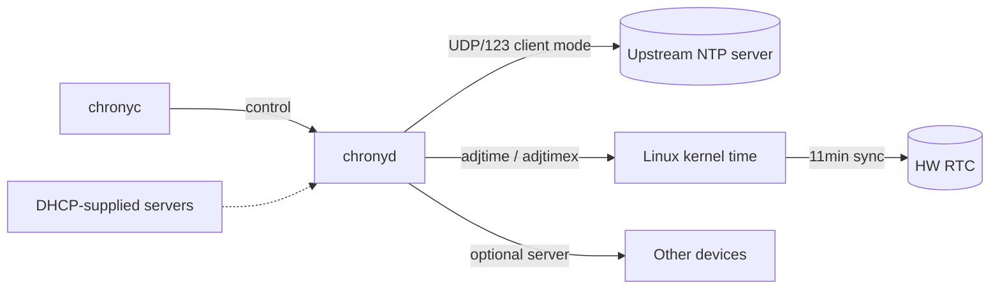

!!! info "裏取りステータス: code-verified"
    `sonic-buildimage` master に `files/image_config/chrony/chrony-config.sh` と `src/sonic-config-engine/tests/chrony.conf.j2`、`build_debian.sh` / `files/build_templates/sonic_debian_extension.j2` の chrony 取り込み処理を確認。NTP_SERVER CONFIG_DB → `chrony.conf` 生成パスと chrony パッケージ同梱は master 取り込み済み。

# ntpd → chrony 移行（slew 専念 / kernel time discipline 維持）

## 概要

[SONiC](../reference/glossary.md#term-sonic) 既存の `ntpd`（202405 以降は **NTPsec**、ntpd の security-hardened fork）には次の問題があった[^1]:

1. `ntpd` は **long jump を完全には抑止できず**、1 時間ずれていれば 12 分以内に step する（`test_ntp_long_jump_disabled` が逆説的に通る）。データプレーン副作用の懸念から step は完全に避けたい
2. slew 中は **kernel time discipline を disable** するため、kernel が "synced" を認識できず **HW RTC の自動更新が走らない**。reboot で巻き戻る
3. **port 123 を listen** する必要があり、interface 追加削除に追従させるのが面倒
4. たまに **NTP packet を送らなくなる** 不安定動作

この [HLD](../reference/glossary.md#term-hld) は `ntpd` を **chrony** に置き換え、上記をすべて解消する移行を定める。systemd-timesyncd は SNTP のみで step する仕様のため不採用。

## 動作仕様

### chrony の優位点

| 観点 | ntpd | chrony |
|------|------|--------|
| 大幅ズレ時の step | **設定に反して実施されることがある** | 設定で禁止すれば**完全に slew のみ** |
| kernel time discipline | slew 中は disable | **常に有効** → kernel が 11 分毎に HW RTC 更新 |
| Listen port | 各 interface の :123 必須 | system routing から自動選択（client mode は listen 不要）|
| Interface 動的増減 | 設定追従が複雑 | routing 変更に追従 |
| 同期速度 | ふつう | **より速い** |
| サーバ機能 | あり | あり |
| DHCP 配布 NTP server | 可 | 可 |

### Chrony の動作モデル



### SONiC が要求する仕様 (再掲)

- 複数 NTP server を front panel / portchannel 経由で扱える、unreachable で retry
- 大幅 step は **要求があったときのみ**（normal 運用は slew 専念）
- HW RTC を system clock と同期保持
- 任意で NTP server として動作
- DHCP 経由で server 配布可

これら全てを chrony は満たす[^1]。

### 既存 SONiC ntpd → chrony への変更点

- **packaging**: `chrony` を host に install。`ntp` / `ntpsec` を削除
- **設定**: `/etc/chrony/chrony.conf`（テンプレ）+ `chrony.keys`。[CONFIG_DB](../reference/glossary.md#term-config_db) の `NTP` / `NTP_SERVER` から生成
- **CLI**: 旧 `ntpq -p` / `ntpdate` 等は **`chronyc sources`, `chronyc tracking`, `chronyc makestep`** に置換
- **HW RTC**: 従来明示的に `hwclock` を呼んでいた reboot 経路は、kernel 11min auto-sync があるため **手動 sync 不要**（リーガル枠として残す可能性は別途整理）
- **port 123 listen**: 不要（client mode）。NTP server として動かす場合のみ listen 設定

### Step / Slew の使い分け

```bash
通常: slew のみ
明示要求 (chronyc makestep / config maxchange) のときのみ step
```

- 起動直後の **初期同期** で大きくズレている場合のみ step を許可するのが現実的（HLD には初期 step の取扱いが明示的議論される）
- ユーザは `config ntp ...` 系 CLI（既存 NTP CLI）を chrony 用に翻訳する裏側処理に意識せず使える

### Hardware Clock 連携

- kernel が time discipline を維持しているとき、kernel は **11 分ごとに `system time → RTC` を書き戻す**[^1]
- ntpd では slew 中 disable されていたためここが落ちていた
- chrony はこれを常に有効にできるので **電源喪失時にも RTC が概ね正しい時刻** を保つ

<!-- evidence:
source: sonic-net/SONiC/doc/ntp/migration-to-chrony.md#L34-L75 (sha: 49bab5b5ff0e924f1ea52b3d9db0dfa4191a7c06)
excerpt: |
  When slewing the time, ntpd disables the kernel time discipline. ... thus will not update the hardware clock/RTC on the board with the correct time.
  When the kernel knows that the system time is synchronized, every 11 minutes, it will write the current system time to the hardware clock/RTC.
reasoning: ntpd の kernel time discipline 無効化と RTC 同期欠落の根拠。
-->

<!-- evidence-rendered:start -->
??? note "📋 検証エビデンス: sonic-net/SONiC/doc/ntp/migration-to-chrony.md#L34-L75 (sha: 49bab5b5ff0e924f1ea52b3d9db0dfa4191a7c06)"

    **出典**:

    `sonic-net/SONiC/doc/ntp/migration-to-chrony.md#L34-L75 (sha: 49bab5b5ff0e924f1ea52b3d9db0dfa4191a7c06)`

    **抜粋**:

    ```text
    When slewing the time, ntpd disables the kernel time discipline. ... thus will not update the hardware clock/RTC on the board with the correct time.
    When the kernel knows that the system time is synchronized, every 11 minutes, it will write the current system time to the hardware clock/RTC.
    ```

    **判断根拠**: ntpd の kernel time discipline 無効化と RTC 同期欠落の根拠。

<!-- evidence-rendered:end -->

## 既知の問題・制限事項

### DHCP 管理インタフェースで chrony sources が offline のまま固まる（202505+）

**症状**: `eth0` が DHCP で IP を取得する環境（`CONFIG_DB` の `MGMT_INTERFACE` に static IP を設定していない場合）、reboot 後に chrony sources が `offline` のまま NTP 同期しない。

**原因**: `chrony-config.sh` は `MGMT_INTERFACE` に IP が存在するときのみ `bindacqdevice` を設定する。DHCP により IP が付与される前に chronyd が起動すると、source が offline になり自動復帰しない race condition が発生する。

**回避策**:
```bash
sudo chronyc online   # 手動で online に切替
chronyc sources       # 同期確認
```

恒久的な修正は `chrony-config.sh` に DHCP 取得後に再設定するフックを追加するか、`networkd`/`dhclient` の post-up hook で `chronyc online` を呼ぶこと。

**参照**: sonic-net/[sonic-buildimage](../reference/glossary.md#term-sonic-buildimage)#25863（Triaged、202511 で再現確認）

---

- 既存 ntpd 互換 CLI を完全には保証できないため、運用スクリプトの書換が必要になる場合あり
- chrony の `chrony.keys` 形式は ntpd の key 形式と互換でない（migration time に key 再生成）
- 一部 vendor の `hwclock` 連携前提を持つ起動 hook は要見直し
- DHCP 経路で配布される NTP server を chrony が動的に拾うフローは distro / dhclient hook 依存

## 干渉する機能

- **既存 NTP CLI / CONFIG_DB `NTP` / `NTP_SERVER`**: テンプレ移行で互換維持
- **`config-setup` / DHCP**: NTP server 配布経路
- **HW RTC / `hwclock`**: 起動 / 再起動時の sync 経路
- **secure-boot / kdump**: 起動 timing 上の依存

## 関連 reference

- [CLI: config ntp](../reference/cli/config-ntp.md)
- [YANG: sonic-ntp](../reference/yang/sonic-ntp.md)
- [Reference index](../reference/index.md)
- [Glossary](../reference/glossary.md)
- [Topics: Overview](../topics/01-overview/index.md)

## 確認コマンド

- `chronyc tracking` — 現在の参照サーバと stratum、最終 sync からの経過時間を確認
- `chronyc sources -v` — 候補 NTP サーバ一覧と reach ビットマップ
- `show ntp` — [sonic-utilities](../reference/glossary.md#term-sonic-utilities) 経由でユーザ向け要約を取得
- `systemctl status chrony` — chrony デーモンの起動状態と直近ログ

### コマンド例

ntpd → chrony 移行後の同期状態を確認する。

```bash
show ntp
chronyc tracking
chronyc sources -v
systemctl status chrony
```

## 引用元

[^1]: `sonic-net/SONiC` `doc/ntp/migration-to-chrony.md` @ `49bab5b5ff0e924f1ea52b3d9db0dfa4191a7c06`

<!-- concerns hint:
- chrony パッケージの sonic-buildimage 同梱と ntpd / ntpsec の削除確認
- /etc/chrony/chrony.conf テンプレートの sonic-buildimage / sonic-host-services 取り込み確認
- NTP / NTP_SERVER CONFIG_DB → chrony.conf 生成パスの確認
- DHCP 経由 NTP server 取得 (chrony-helper / dhclient hook) の確認
- HW RTC 自動 sync が kernel time discipline 経由で動いていることの確認
- config ntp 系 CLI の chronyc 経由実装への切替確認
-->

<!-- topics-back-ref -->
## 関連 Topics

- [Topics: NAT / DHCP Relay / Time-DNS Services](../topics/16-nat-dhcp-dns/index.md)

<!-- /topics-back-ref -->

<!-- glossary-links-injected: 8ba32e5aa69d -->
