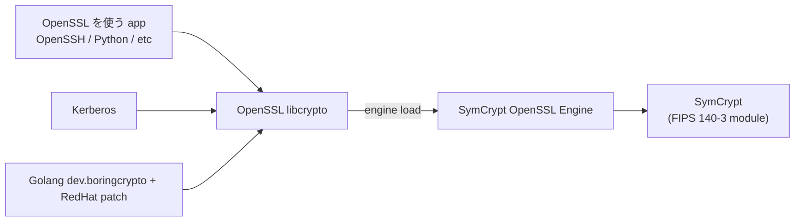

!!! info "裏取りステータス: code-verified"
    `sonic-buildimage/rules/config` L370-373 で `INCLUDE_FIPS ?= y` / `ENABLE_FIPS ?= n` (amd64/arm64 のみ) を確認。`rules/sonic-fips.mk` で `FIPS_VERSION` / `FIPS_OPENSSL_VERSION` / `FIPS_OPENSSH_VERSION` / `FIPS_PYTHON_VERSION` / `FIPS_GOLANG_VERSION` / `FIPS_KRB5_VERSION` を BLDENV (trixie / bookworm) ごとに定義（trixie 例: `openssl 3.5.4-1+fips`、`openssh 10.0p1-7+fips`、`golang 1.24.4-1+fips`）。`src/sonic-fips/Makefile` で Azure/sonic-fips リポを `git clone -b $(FIPS_VERSION)` する SymCrypt-OpenSSL ビルド経路を確認、`files/build/versions-public/host-image/versions-deb-trixie` に `symcrypt-openssl==0.1` を pin。`sonic-utilities/sonic_installer/main.py` L688-721 で `@sonic_installer.command('set-fips')` / `'get-fips'` および `bootloader.set_fips/get_fips` の呼び出しを確認。`src/openssh/`（patch 同梱）も存在。

# OpenSSL FIPS 140-3（SymCrypt engine + sonic_fips=1）

## 概要

FIPS 140-3 認定済みの cryptographic module だけを使うよう [SONiC](../reference/glossary.md#term-sonic) を組み立てるための [HLD](../reference/glossary.md#term-hld)[^1]。SONiC が依存する暗号モジュールは **OpenSSL / Kerberos / Golang / Libgcrypt / Linux Kernel crypto** だが、本 HLD で扱うのは **OpenSSL / Kerberos / Golang** の 3 つ（Kernel と Libgcrypt は scope 外）。OpenSSL 1.1.1 自体には FIPS 認定 module が無いため、Microsoft が提供する **SymCrypt OpenSSL Engine (SCOSSL)** を engine として読み込ませ、Microsoft が CMVP に出している **SymCrypt** を実体として使う構成。Kerberos は内蔵 crypto をやめ OpenSSL 経由、Golang は RedHat の `dev.boringcrypto` ベースの patch で OpenSSL に流すパスを利用する。

## 動作仕様

### コンポーネント関係



OpenSSL の **engine 機構** を使い、`/usr/lib/ssl/openssl-fips.cnf` で `engine_id = symcrypt` / `dynamic_path = /usr/lib/x86_64-linux-gnu/libsymcryptengine.so` を指定する[^1]。

### Kernel cmdline と config 切替

- `sonic_fips=1` を `/proc/cmdline` に入れると、SONiC は **default OpenSSL config を `/usr/lib/ssl/openssl-fips.cnf`** に切替える[^1]
- 別途 `fips=1` は **Linux kernel FIPS モード** を要求するパラメタで、SONiC kernel が FIPS をサポートしないため scope 外
- 設定方法は bootloader で異なる:
  - **GRUB**: `/etc/grub.d/99-fips.cfg` で `GRUB_CMDLINE_LINUX_DEFAULT` に追記
  - **uboot**: `fw_setenv linuxargs ...`
  - **Aboot**: `/host/image-<ver>/kernel-cmdline` に追記

### Application 単位 enable

```text
export ENABLE_FIPS=1
# Golang only:
export GOLANG_FIPS=1
# OpenSSL only:
export OPENSSL_CONFIG=/usr/lib/ssl/openssl-fips.cnf
```

`ENABLE_FIPS=1` はビルド時 enable に対応する runtime envvar の役割。

### SymCrypt OpenSSL Debian パッケージ

```text
パッケージ名: symcrypt-openssl (例: symcrypt-openssl_0.1_amd64.deb)
収録ファイル:
  /usr/lib/ssl/openssl.cnf       (デフォルト)
  /usr/lib/ssl/openssl-fips.cnf  (FIPS 用)
  /usr/lib/x86_64-linux-gnu/libsymcrypt.so
  /usr/lib/x86_64-linux-gnu/libsymcryptengine.so
```

[^1]

### Kerberos

ビルドオプションを **builtin crypto から OpenSSL 経由** に切り替える。OpenSSL を使う場合、Kerberos の builtin に戻す runtime オプションは **無い**[^1]。

### Golang

Golang stdlib `crypto/*` は FIPS に未対応。Google の `dev.boringcrypto` branch は **BoringSSL に切り替えるが BoringSSL は Google 内利用前提** で一般公開されない。RedHat が **`dev.boringcrypto` ベースで OpenSSL に向ける patch** を公開しているため、SONiC ではこれを再利用し、OpenSSL 経由で SymCrypt engine が effective になるようにする[^1]。FIPS enable 時は **BoringSSL Enable + SymCrypt Enable の両 build option** が立つ。

### Build flag

```text
rules/config:
  INCLUDE_FIPS ?= y     # FIPS 機構を image に同梱（default ON）
  ENABLE_FIPS  ?= n     # default で FIPS を有効化（default OFF）
```

- `INCLUDE_FIPS=n` だと `ENABLE_FIPS` は無視される

### CLI

```text
sonic-installer set-fips <image> [--enable-fips | --disable-fips]
sonic-installer get-fips <image>     # FIPS is enabled / disabled
```

`<image>` 省略時は **next boot image** が対象[^1]。

### Application Impact

非 FIPS algorithm を使っている部分は壊れる可能性がある。OpenSSH は **CentOS の FIPS 140-2 patch** を流用して FIPS テストを通す方針[^1]。app ごとに test で確認するという立て付け。

<!-- evidence:
source: sonic-net/SONiC/doc/fips/SONiC-OpenSSL-FIPS-140-3.md#L93-L108 (sha: 49bab5b5ff0e924f1ea52b3d9db0dfa4191a7c06)
excerpt: |
  When fips=1 is set in /proc/cmdline, the OpenSSL default config file is changed to "/usr/lib/ssl/openssl-fips.cnf",
  otherwise, the config file "/usr/lib/ssl/openssl.cnf" is used.
  ... Provide SymCrypt OpenSSL debian package. Package name: symcrypt-openssl
reasoning: kernel cmdline 切替と debian 同梱パッケージの根拠。
-->

<!-- evidence-rendered:start -->
??? note "📋 検証エビデンス: sonic-net/SONiC/doc/fips/SONiC-OpenSSL-FIPS-140-3.md#L93-L108 (sha: 49bab5b5ff0e924f1ea52b3d9db0dfa4191a7c06)"

    **出典**:

    `sonic-net/SONiC/doc/fips/SONiC-OpenSSL-FIPS-140-3.md#L93-L108 (sha: 49bab5b5ff0e924f1ea52b3d9db0dfa4191a7c06)`

    **抜粋**:

    ```text
    When fips=1 is set in /proc/cmdline, the OpenSSL default config file is changed to "/usr/lib/ssl/openssl-fips.cnf",
    otherwise, the config file "/usr/lib/ssl/openssl.cnf" is used.
    ... Provide SymCrypt OpenSSL debian package. Package name: symcrypt-openssl
    ```

    **判断根拠**: kernel cmdline 切替と debian 同梱パッケージの根拠。

    !!! note "パラメタ名の注意"
        上記引用の `fips=1` は HLD 原文の表記。現行 SONiC 実装では SONiC 固有パラメタとして **`sonic_fips=1`** を用いる（本文 L49 参照）。`fips=1` は Linux kernel FIPS モードのフラグであり、本 HLD のスコープ外。

<!-- evidence-rendered:end -->

## 制限事項

- Linux Kernel crypto / Libgcrypt は scope 外（FIPS 140-3 認定対象外）
- BoringSSL は一般用途想定外のため使えない（RedHat patch + OpenSSL 経由を採用）
- 各 application の non-FIPS algorithm 利用箇所はテストで掘り出して個別対応
- Kerberos が OpenSSL 経由になるため build オプションが固定化される

## 干渉する機能

- **OpenSSH / Python / sonic-restapi**: 大半の TLS / SSH を扱う app が影響
- **secure-boot / secure-upgrade**: 証明書検証経路を共有
- **container hardening**: 暗号方針の整合
- **build system (`INCLUDE_FIPS` / `ENABLE_FIPS`)**: image 構成全体に波及

## 関連 reference

- [YANG: sonic-fips](../reference/yang/sonic-fips.md)
- [Topics: Security / AAA](../topics/15-security-aaa/index.md)
- [Topics: Build / Packaging](../topics/19-build-packaging/index.md)
- [CONFIG_DB: FIPS](../reference/config-db/fips.md)
- [CLI: sonic-installer](../reference/cli/sonic-installer.md)
- [Topics: Reboot / Warm / Fast](../topics/11-reboot/index.md)
- [Glossary](../reference/glossary.md)
- [Reference 索引](../reference/index.md)

## 確認コマンド

- `sonic-installer get-fips` — 現在の FIPS モード（enabled/disabled）を確認
- `openssl version -a` / `openssl list -providers` — FIPS provider が active かを確認
- `cat /proc/sys/crypto/fips_enabled` — kernel 側の FIPS モード（参考値）
- `ssh -vvv ...` で SSH の crypto algorithm を観測し、disabled algo が出ていないか確認

### コマンド例

OpenSSL FIPS 140-3 provider の有効化を確認する。

```bash
openssl list -providers
openssl fipsinstall -in /etc/ssl/fipsmodule.cnf -module /usr/lib/ssl/fips.so
cat /proc/sys/crypto/fips_enabled
show fips status
```

## 引用元

[^1]: `sonic-net/SONiC` `doc/fips/SONiC-OpenSSL-FIPS-140-3.md` @ `49bab5b5ff0e924f1ea52b3d9db0dfa4191a7c06`

<!-- concerns hint:
- symcrypt-openssl deb の sonic-buildimage 同梱と version 指定確認
- /usr/lib/ssl/openssl-fips.cnf テンプレートの install 経路確認
- sonic-installer set-fips / get-fips の sonic-utilities 取り込み確認
- INCLUDE_FIPS / ENABLE_FIPS rules/config 取り込み確認
- Golang BoringSSL + RedHat patch の sonic-buildimage 同梱確認
- OpenSSH FIPS patch (CentOS 由来) の取り込み確認
-->

<!-- topics-back-ref -->
## 関連 Topics

- [Topics: Security / AAA / FIPS / Hardening](../topics/15-security-aaa/index.md)

<!-- /topics-back-ref -->

<!-- glossary-links-injected: 8ba32e5aa69d -->
