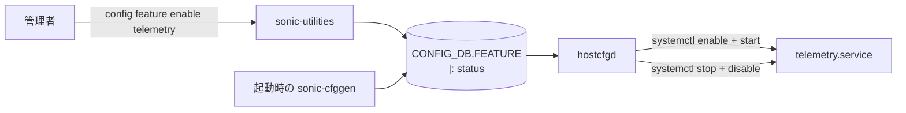
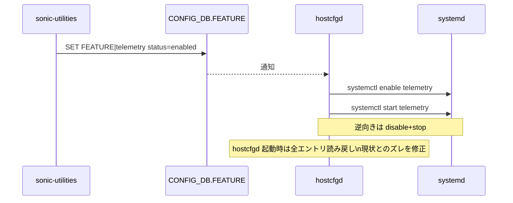

!!! info "裏取りステータス: code-verified / 古い HLD（2019 年）の現行拡張版"
    `sonic-buildimage/src/sonic-yang-models/yang-models/sonic-feature.yang` で FEATURE container と `feature-state` / `feature-owner` (kube|local) / `feature-scope-status` / `feature-delay-status` 型を確認。`sonic-host-services/scripts/featured` に `class FeatureHandler` (FEATURE table 購読) と `class FeatureDaemon`、`state` / `auto_restart` / `delayed` / `has_global_scope` / `has_per_asic_scope` 各フィールドの mod_entry 経路を確認。`sonic-utilities/show/feature.py` と `config/feature.py`、`sonic_package_manager/service_creator/feature.py` も実装済み。`sonic-buildimage/files/build_templates/init_cfg.json.j2` に FEATURE / AUTO_TECHSUPPORT_FEATURE / SYSLOG_CONFIG_FEATURE のデフォルト生成。本ページは Rev 0.1 (2019) ベースだが、現行実装は HLD 設計の方向に拡張されており実体と整合。

# FEATURE テーブルによるオプショナル機能の有効/無効制御

## 概要

[SONiC](../reference/glossary.md#term-sonic) には telemetry agent 等、デバイスによっては不要な **オプショナルなコンテナ/サービス** がある。本 [HLD](../reference/glossary.md#term-hld)（2019 年の初期提案）はこれらを `CONFIG_DB.FEATURE` テーブルで一括制御する仕組みを定義した[^1]。後続の各種拡張（auto_restart, delayed, mgmt-framework 連携など）の **基盤となる初版設計** である。

本提案の要点は次の 3 つ:

1. [CONFIG_DB](../reference/glossary.md#term-config_db) に **`FEATURE`** テーブルを追加し、機能名 → `status: enabled/disabled` を持つ
2. CLI `config feature enable|disable <feature_name>` および対応 `show` を追加
3. `hostcfgd` が FEATURE テーブルを購読し、対応 service を **systemd で start+enable または stop+disable** する

## 動作仕様

### コンポーネントとフロー



### CONFIG_DB スキーマ（初版）

```text
FEATURE|<feature_name>
    status : "enabled" | "disabled"
```

| キー | 例 | 説明 |
|-----|----|------|
| `<feature_name>` | `telemetry`, `lldp`, `bgp`, ... | サービス名と概ね一致 |
| `status` | `enabled` / `disabled` | 機能の有効性 |

`sonic-cfggen` は **デフォルトで `telemetry` を enabled にする** よう拡張される[^1]。

### `hostcfgd` の責務

- FEATURE テーブルを subscribe し、変更があれば対応 service を `systemctl` で操作
- **起動時**: FEATURE 全体を読み、現在の service 状態と突合。差分があれば合わせる（`enable+start` または `stop+disable`）



<!-- evidence:
source: sonic-net/SONiC/doc/optional-feature-control/Optional-Feature-Control.md#L13-L19 (sha: 49bab5b5ff0e924f1ea52b3d9db0dfa4191a7c06)
excerpt: |
  Add feature in hostcfgd to listen for Config DB FEATURE table entry changes, and enable & start or stop & disable the respective service as appropriate.
  When hostcfgd first starts, it reads all entries in the FEATURE table and compares with current status of each service. If there is mismatch, hostcfgd will enable & start or stop & disable as appropriate.
reasoning: hostcfgd が「変更購読」と「起動時の現状突合」の両方を担うという責務の根拠。
-->

<!-- evidence-rendered:start -->
??? note "📋 検証エビデンス: sonic-net/SONiC/doc/optional-feature-control/Optional-Feature-Control.md#L13-L19 (sha: 49bab5b5ff0e924f1ea52b3d9db0dfa4191a7c06)"

    **出典**:

    `sonic-net/SONiC/doc/optional-feature-control/Optional-Feature-Control.md#L13-L19 (sha: 49bab5b5ff0e924f1ea52b3d9db0dfa4191a7c06)`

    **抜粋**:

    ```text
    Add feature in hostcfgd to listen for Config DB FEATURE table entry changes, and enable & start or stop & disable the respective service as appropriate.
    When hostcfgd first starts, it reads all entries in the FEATURE table and compares with current status of each service. If there is mismatch, hostcfgd will enable & start or stop & disable as appropriate.
    ```

    **判断根拠**: hostcfgd が「変更購読」と「起動時の現状突合」の両方を担うという責務の根拠。

<!-- evidence-rendered:end -->

### CLI

| Command | 用途 |
|---------|------|
| `config feature enable <feature_name>` | 機能を有効化（FEATURE.status=enabled） |
| `config feature disable <feature_name>` | 機能を無効化 |
| `show feature` | FEATURE テーブルの一覧表示 |

`sonic-utilities` 側に `config feature` / `show feature` を追加[^1]。

## 設定

### 関連する CONFIG_DB

`FEATURE|<name>` に `status` のみを持つ最小スキーマ（初版）。後発で `auto_restart`・`delayed`・`set_owner` など多数フィールドが追加されているが、本 HLD のスコープには含まれない。

### 関連する CLI

`config feature enable/disable` と `show feature`。

### 関連する YANG

該当 [YANG](../reference/glossary.md#term-yang) モジュールは初版 HLD で言及されていない（後発の拡張で `sonic-feature.yang` 等が追加されている）。

### 設定例

```bash
# 機能を有効化
config feature enable telemetry

# 確認
show feature

# 機能を無効化
config feature disable telemetry
```

## 制限事項

- **本 HLD は 2019 年の初版**。現行 master の FEATURE テーブルは `auto_restart` / `delayed` / `has_global_scope` / `set_owner` 等の追加フィールドを持ち、`hostcfgd` の挙動も拡張されている
- 初版は **systemd 操作 (`enable` / `start` / `disable` / `stop`) のみ**。後続の HLD（[Config Reload Enhancement](../management/config-reload-enhancement.md) 等）と組み合わさって event-driven 起動が実装されている
- 「機能名」と「systemd unit 名」の対応は規約。例外（`teamd`, `swss` 等の必須サービス）の取り扱いは初版では未明示

## 干渉する機能

- **`hostcfgd`**: FEATURE 購読の主担当。[AAA](../reference/glossary.md#term-aaa) / TACACS / Banner など他の [hostcfgd](../reference/glossary.md#term-hostcfgd) 機能と並列に動く
- **`sonic-cfggen`**: デフォルト FEATURE エントリ生成
- **後発の HLD（auto_restart / delayed / FEATURE.event-driven 起動）**: 本 HLD の上に積み重なっている
- **`config save` / `config reload`**: FEATURE 変更が永続化されるか・reload で reapply されるかは hostcfgd の処理に依存

## トラブルシューティング

- `config feature enable` 後に service が上がらない場合、`hostcfgd` ログで systemctl 操作のエラーを確認
- 起動時に状態が再現しない場合、`hostcfgd` の起動時 reconcile が動いているかを確認
- 現行 master の `show feature` 出力は本 HLD より列が多いので、フィールド差分を意識する

### コマンド例

optional feature の enable/disable 状態を確認する。

```bash
show feature status
redis-cli -n 4 keys 'FEATURE|*'
config feature state bgp enabled
docker ps -a --format '{{.Names}}\t{{.Status}}'
```

## 引用元

[^1]: `sonic-net/SONiC` `doc/optional-feature-control/Optional-Feature-Control.md` @ `49bab5b5ff0e924f1ea52b3d9db0dfa4191a7c06`

<!-- concerns hint:
- 現行 master の FEATURE テーブル拡張フィールド (auto_restart / delayed / has_global_scope / set_owner) との関係
- hostcfgd の FEATURE 購読パスの最終形
- sonic-cfggen のデフォルト FEATURE エントリ生成
- sonic-feature.yang 等 YANG モジュールの追加状況
- 後発 HLD (event-driven config reload, delayed services) との重なり
-->

<!-- glossary-links-injected: 8ba32e5aa69d -->
