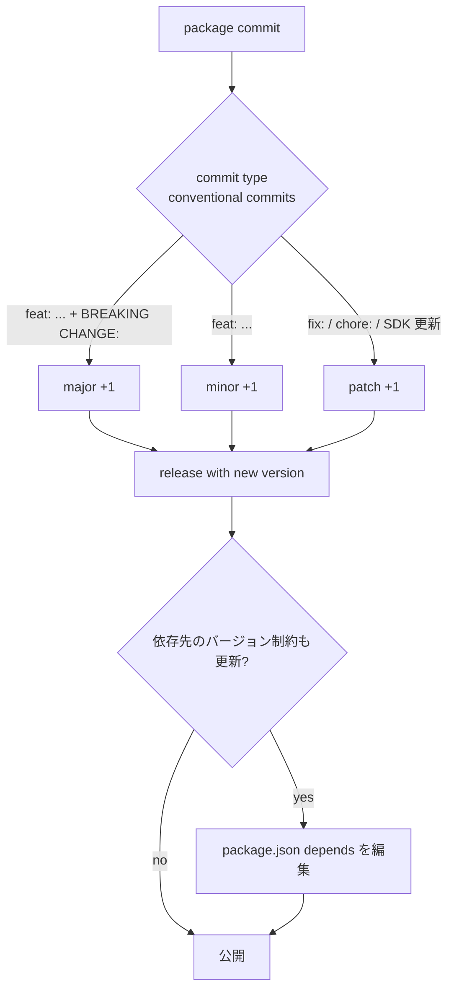

!!! success "裏取りステータス: Code-verified（一部例は未採用）"
    Application Extension Infrastructure は `sonic-utilities/sonic_package_manager/` 配下に実装済み。`manifest.py:179-185` で `version` / `depends` フィールド、`constraint.py:80-99` で `ComponentConstraints` と `VersionConstraint.parse`、`constraint.py:120-181` で `PackageConstraint` の `components` フィールドのパースを確認。`version.py:5-26` で `semantic_version` ライブラリを利用。HLD 例 4 の `components` 制約は実装済み。一方、HLD 例 1 の `"^1.0.0,^2.0.0"` のような並列 OR 表記は semantic_version 標準ではカンマが AND なので採用されておらず、HLD 例 3 の `SWSS_VERSION` 環境変数注入も grep で見つからない（採用見送り）。基本枠組みは存在することを確認（verified at: 2026-05-09）。

# SONiC OS と Docker イメージのセマンティックバージョニング

## 概要

SONiC Application Extension Infrastructure は **SONiC docker (= SONiC Package) と Base OS の独立配布** を可能にする[^1]。これにより docker と OS / docker 同士の **互換性** をどう担保するかが課題となり、Semantic Versioning ([semver.org](https://semver.org)) を SONiC docker 群に適用するためのガイドラインが本 HLD である[^1]。

主旨[^1]:

- 各 SONiC Package は独自の `major.minor.patch` を持つ
- API 互換性の判定基準を **Redis DB スキーマ** に置く
- 依存先パッケージのバージョン制約を `package.json` の `depends` で表現

## 動作仕様

### SONiC Package API の定義

「Package API」は本 HLD では **Redis DB インタフェース** と定義される[^1]:

- `CONFIG_DB` / `APPL_DB` / `STATE_DB` の **当該パッケージが提供するテーブル schema**
- それ以外に何か API を露出するならそれも含む

ASIC SDK / SAI / カーネルレベルの API は別カテゴリ（後述）。

### バージョン番号の繰り上げ規則

| 変更種別 | 影響箇所 | 増分する部分 |
|----------|--------|-------------|
| 後方互換を破る変更 | API（Redis schema 等） | **major** |
| 新機能（後方互換あり） | 新 API 追加 | **minor** |
| バグ修正 / 改善 | 既存 API 不変 | **patch** |

例[^1]:

```text
1.2.3 → 2.0.0   # API 互換破壊（任意の追加変更を含んでよい）
1.2.3 → 1.3.0   # 新 API 追加 + 任意の改善
1.2.3 → 1.2.4   # 改善 / バグ修正 / SDK 更新 / manifest 更新
```

### Conventional Commits

メンテナの変更検知を助けるため、各 SONiC リポは **Conventional Commits** 形式 (https://www.conventionalcommits.org/) を採用してもよい[^1]:

```text
feat: Introduce new methods in ConsumerTable

BREAKING CHANGE: this feature breaks the Consumer/Producer based IPC
```

`feat:` / `fix:` などのプレフィクスと `BREAKING CHANGE:` フッタにより、commit から minor / major / patch の判定が機械的に可能になる。

### Package のリリースフロー

1. メンテナが任意のタイミングでバグ修正 / 機能追加をリリース
2. **手動でバージョン更新が必須** （自動増分しない）
3. リリース時に **前リリースとの API 互換性をチェック**
4. 前リリースから API が変わる場合 **major** を増やす
5. 互換変更のみなら **minor** を増やす
6. API 不変の改善 / 修正なら **patch** を増やす
7. 必要なら依存先のバージョン制約も更新

注意点[^1]:

- **SONiC package version と SONiC release バージョンは独立**。依存 API が互換である限り 1 つの package が複数 release を跨いで動作可能
- メンテナは **「単一リポでマルチリリース対応」** か **「リリースごとにリポを分ける」** かを選べる
- `package.json` の `default-reference` を更新すると、ユーザの新規インストール時に既定で参照されるバージョンが変わる

### Base OS API への依存

パッケージが SONiC Base OS の API に依存する場合の責務[^1]:

| 依存先 | 責務 |
|--------|------|
| `sonic-utilities` | sonic-utilities contributor が API 互換性を維持 |
| 新カーネル機能（例: 3-tuple conntrack） | パッケージ側が **minor 版で記録**（例: NAT docker） |
| SONiC host service (D-Bus) | host service 側 / パッケージ側双方の合意 |

### `package.json` の依存表記例

#### 例 1: 互換 API 内のバージョン更新

`foo` が `swss ^1.0.0` に依存:

```json
{
  "package": {
    "name": "foo", "version": "1.2.3",
    "depends": [{ "name": "swss", "version": "^1.0.0" }]
  }
}
```

`swss` が 2.0.0 へ上がったが `foo` が使う APPL_DB テーブルは未変更 → `foo` は **patch** を上げて両 swss を許容[^1]:

```json
{
  "name": "foo", "version": "1.2.4",
  "depends": [{ "name": "swss", "version": "^1.0.0,^2.0.0" }]
}
```

#### 例 2: swss API が変わり foo も追従

```json
{
  "name": "foo", "version": "1.2.4",
  "depends": [{ "name": "swss", "version": "^2.0.0" }]
}
```

#### 例 3: 環境変数で複数 API に並行対応

infrastructure が container 起動時に依存バージョンを env として注入する。`foo` は `SWSS_VERSION` を読んで使う API を選ぶ。これにより `foo` 1 バージョンで `^1.0.0` / `^2.0.0` 両方をサポートできる[^1]。

#### 例 4: SDK component 単位の制約

`swss` の本体 API は ^1.0.0 互換だが `swss::ProducerStateTable` だけ破壊的変更。`foo` は libswsscommon の major を **components** で指定[^1]:

```json
{
  "name": "foo", "version": "1.2.4",
  "depends": [{
    "name": "swss",
    "version": "^1.0.0",
    "components": { "libswsscommon": "^1.0.0,^2.0.0" }
  }]
}
```

infrastructure 側で **依存 component の major と foo が指定する major を自動チェック** できる。明示的な `components` 指定は粒度の細かい制御用。

### バージョン関係まとめ



## 設定

### 関連する CLI / CONFIG_DB / YANG

本 HLD は **CLI / CONFIG_DB / YANG への変更を伴わない**。`package.json` の manifest と Conventional Commits の運用ガイドラインのみ規定する。

### Manifest 例（インストール）

`sonic-package-manager` (sonic-utilities) を経由して docker package を install する想定。本 HLD は manifest 内の **`version` と `depends` 表記** を主に定義する。

```bash
# 想定 (HLD 上の例ではなく一般運用)
sudo sonic-package-manager install foo
sudo sonic-package-manager show foo
```

## 制限事項

- **手動でのバージョン更新が必須**[^1]。自動 bump は CI スクリプト次第（規定なし）
- **Open Questions** が HLD 末尾に残っている[^1]（Base OS のバージョニング、Base OS API の責務分担の細部など）
- API 互換判定の根拠を Redis DB スキーマに依拠するため、**コード内 enum / クラス API の互換性** は別途意識が必要
- HLD は 2021-02 の Initial Proposal。SONiC Application Extension Infrastructure 自体の現行採用状況も裏取り対象
- `package.json` の `version` フィールド書式（`^1.0.0,^2.0.0` のような並列 OR）は HLD の表記であり、現行 sonic-package-manager のパーサが解釈する書式かは要確認

## 干渉する機能

- **`sonic-package-manager` (sonic-utilities)**: manifest 解釈と version 制約検証
- **SONiC Application Extension Infrastructure**: docker 独立配布の前提
- **`swss` / `syncd` / `bgp` 等 SONiC default docker**: 依存先となる主要パッケージ
- **CI / リリース自動化**: Conventional Commits 採用時に commit ログから version 増分を計算するパイプライン
- **`config_db.json` schema migration**: API 破壊変更（major bump）時にユーザ設定の移行が必要

## トラブルシューティング

- パッケージインストールで version 制約エラー → `depends` の version 制約と現在 install 済み swss / syncd の version を比較
- `sonic-package-manager show` で `depends` が複雑 → manifest の `^X.Y.Z,^A.B.C` 形式が想定通り解釈されているか CLI ログを確認
- 新 swss にしたら docker が動かない → API 破壊（major bump）が起きている可能性。docker 側 manifest を更新

## 実装との乖離

2026-05-09 時点の `sonic-utilities/sonic_package_manager` を裏取り。

- **採用済み**: `manifest.py:179-185` の `version` / `depends`、`constraint.py:120-181` の `PackageConstraint(name, version, components)` 構造、`components` ごとの `VersionConstraint`、`semantic_version` (https://pypi.org/project/semantic-version/) 経由の SemVer パース。
- **採用されていない例（HLD 提案のうち）**:
  - **HLD 例 1 の `"^1.0.0,^2.0.0"` のような並列 OR 表記**: `semantic_version` の `SimpleSpec` ではカンマは AND を意味する（例: `>=1.0.0,<2.0.0`）。OR を表す `||` は SimpleSpec 拡張で別途扱われる。HLD の意図する「複数 major を許容」表記は標準ライブラリでは expression パーサ次第になるため、現状の `sonic-package-manager` は OR 並列表記をそのまま受け付ける作りではない。
  - **HLD 例 3 の `SWSS_VERSION` 等の環境変数注入で複数 API 並行対応**: `sonic_package_manager` で `SWSS_VERSION` の grep ヒットは 0。container 起動時の version 注入は採用されていない。

枠組み（package manifest + components + semantic_version）は HLD 通りに実装されているが、HLD で例示した一部運用パターンは別形（`||` や `components`）に置き換わっている。

## 引用元

[^1]: `sonic-net/SONiC` `doc/sonic-application-extension/sonic-versioning-strategy.md` @ `49bab5b5ff0e924f1ea52b3d9db0dfa4191a7c06`

<!-- concerns hint:
- SONiC Application Extension Infrastructure 自体の現行採用状況確認（Proposal が採択されたか）
- sonic-package-manager の package.json depends 形式（"^1.0.0,^2.0.0" 並列 OR）対応状況確認
- components フィールドによる SDK 単位の制約パースが現行 sonic-utilities にあるか未確認
- SWSS_VERSION 等の環境変数注入による複数 API 並行サポートの現行実装確認
- HLD は 2021 年の Initial Proposal のため現行運用と乖離している可能性が高い
-->
