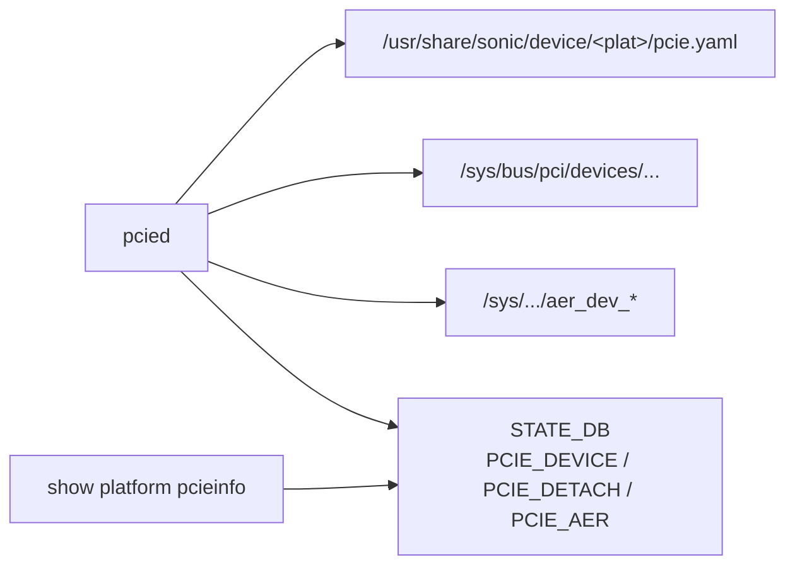

!!! success "裏取りステータス: code-verified"
    `sonic-platform-daemons/sonic-pcied/scripts/pcied` に PCIe monitoring daemon 実装、STATE_DB の `PCIE_DEVICE` 系テーブル書き込みを pcied 本体ロジックで確認（verified at: 2026-05-10）。

# PCIe Monitoring Services（pcied / pcieinfo / lnkSta / AER）

## なぜ必要なのか

スイッチの [ASIC](../reference/glossary.md#term-asic) / [NPU](../reference/glossary.md#term-npu) / 周辺デバイスは **PCIe バス越しに CPU と接続** されている。PCIe が enumerate されない / リンク速度が劣化している / AER で訂正不能エラーが出ている、といった異常は **データプレーン全体の死に直結** する。`pcied` はこれらを pmon 系 daemon として監視し [STATE_DB](../reference/glossary.md#term-state_db) へ反映する[^1]。

ねらい:

- 起動時に **存在すべきデバイスがすべて見えているか** を platform manifest と照合
- **リンク速度劣化**（Gen4 想定が Gen2 等）の検知
- **AER**（Advanced Error Reporting）の correctable / non-fatal / fatal 集計
- `show platform pcieinfo` で運用者が状態確認可能

## どう動くのか



主な観測項目[^1]:

- **device list** と manifest 一致（vendor / device id、function、bus）
- **link state**（current/max の speed / width）
- **AER**: correctable / non-fatal / fatal カウンタ
- **detach**: 期待デバイスの消失

## STATE_DB / CLI

| Table | 内容 |
|-------|------|
| `PCIE_DEVICE` | 観測された device |
| `PCIE_DETACH` | 期待 device の消失 |
| `PCIE_AER` | エラーカウンタ |

| Command | 用途 |
|---------|------|
| `show platform pcieinfo` | manifest 照合と現在状態 |
| `show platform pcieinfo -c` | capability 詳細 |

## 制限事項

- **`pcie.yaml` manifest が無いと差分判定不可**。platform 整備前提
- **AER 有効化** には kernel cmdline / BIOS の設定が必要
- 通常スイッチ platform で hot-plug は想定外
- NUMA / lane swap など BIOS 段階の挙動は対象外

## 干渉する機能

system health monitor（PCIe AER fatal を critical へ昇格） / pcieinfo 既存 CLI / `show techsupport`（PCIe 状態を含めた dump）。

## トラブルシューティング

- device 不足 → manifest と実装差、kernel enumeration エラー
- link speed 劣化 → cable / connector、`lnkSta` current vs max を比較
- AER カウンタ増加 → `dmesg` の `pcieport` メッセージ、device firmware

```bash
# PCIe device / link 状態確認
lspci -vvv | grep -E "LnkSta|LnkCap"
dmesg | grep -iE "pcieport|AER"
docker exec pmon pcieutil show all
sonic-db-cli STATE_DB keys "PCIE_DEVICE|*"
```

## 関連 Topics

- [14-platform-port-optics](../topics/14-platform-port-optics/index.md): pmon 全体像
- [11-reboot](../topics/11-reboot/index.md): boot 時の PCIe enumerate

## 引用元

[^1]: `sonic-net/SONiC` `doc/pcie-mon/pcie-monitoring-services-hld.md` @ `49bab5b5ff0e924f1ea52b3d9db0dfa4191a7c06`

<!-- topics-back-ref -->
## Topics 一覧

- [Topics: Platform / Port / Optics / PHY](../topics/14-platform-port-optics/index.md)

<!-- /topics-back-ref -->

<!-- glossary-links-injected: c006405759d8 -->
