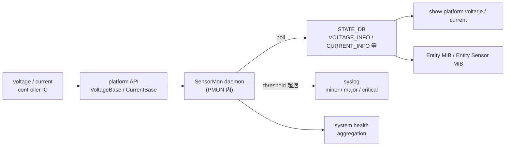

!!! info "裏取りステータス: code-verified"
    `sonic-platform-daemons/sonic-sensormond/scripts/sensormond` で `VOLTAGE_INFO` / `CURRENT_INFO` テーブル更新と `VoltageSensorFs` / `CurrentSensorFs` の使用を確認。base API は `sonic-platform-common/sonic_platform_base/sensor_base.py` / `sensor_fs.py` / `chassis_base.py`（`get_all_voltage_sensors` / `get_all_current_sensors`）、Module も `module_base.py` 経由で公開。SNMP Entity Sensor MIB 拡張は `rfc3433.py` 側で対応するセンサ種別を確認。

# SensorMon（PMON 内の voltage / current センサ監視）

## 概要

ボード上には電圧コントローラ / 電流センサ / 高度センサ等、温度以外の **環境センサ** が多数ある。Linux の `lm-sensors` / `hwmon` でも一部読めるが、[HLD](../reference/glossary.md#term-hld) は次の限界を指摘[^1]:

- hwmon が対応していないデバイスは見えない
- 内蔵 monitoring が無い simple device の **alarm** が上がらない
- 機種ごとの **platform specific threshold** を扱えない

そこで PMON コンテナに新 daemon **`SensorMon`** を追加し、platform API を通じて汎用にセンサ群を発見・周期 poll・しきい値判定・アラーム生成する[^1]。温度センサは `thermalctld` の管轄なので **対象外**[^1]。

## 動作仕様

### スコープ

対象[^1]:

- **voltage sensor**（電圧）
- **current sensor**（電流）
- **altitude sensor** など、将来追加されうる sensor 系

非対象[^1]:

- **温度センサ**（既存 `thermalctld` 管轄）
- voltage 障害時の **自動復旧**（NMS 側に委ねる）

### コンポーネント関係



### platform API

ベンダ提供 API は次を満たす[^1]:

- 指定型のセンサ全列挙（list）
- 個別センサの読取（測定値・しきい値）

これにより HW 違いを `SensorMon` 共通コードから抽象化する。

### 周期 poll とアラーム判定

`SensorMon` は周期 poll で各 sensor を読み、**minor / major / critical** の 3 段階しきい値で判定[^1]:

- しきい値突破時 → syslog `xxx voltage <minor|major|critical> alarm raised`
- 戻った時 → syslog `xxx voltage alarm cleared`

判定はベンダが platform API 経由で渡してくる threshold を信用する。

### system health との統合

`SensorMon` のアラームは **system health** 集約に乗る[^1]。複数センサの状態が aggregator で 1 つの「ヘルス」として表示できる。

### Entity MIB 連携

新規センサ群は **Entity MIB / Entity Sensor MIB** にも晒される[^1]。これにより [SNMP](../reference/glossary.md#term-snmp) 経由のモニタリングシステムから、温度と同じインタフェースで電圧・電流が見える。

<!-- evidence:
source: sonic-net/SONiC/doc/pmon/pmon-sensormon.md#L34-L48 (sha: 49bab5b5ff0e924f1ea52b3d9db0dfa4191a7c06)
excerpt: |
  Linux does provide some support of voltage and current sensor monitoring using lmsensors/hwmon infrastructure. However there are a few limitations:
  - Devices not supported with Hwmon are not covered
  - Simple devices which donot have an inbuilt monitoring functions do not generate any alarms
  - Platform specific thresholds for monitoring are not available
reasoning: SensorMon を新設する根本動機の根拠。
-->

<!-- evidence-rendered:start -->
??? note "📋 検証エビデンス: sonic-net/SONiC/doc/pmon/pmon-sensormon.md#L34-L48 (sha: 49bab5b5ff0e924f1ea52b3d9db0dfa4191a7c06)"

    **出典**:

    `sonic-net/SONiC/doc/pmon/pmon-sensormon.md#L34-L48 (sha: 49bab5b5ff0e924f1ea52b3d9db0dfa4191a7c06)`

    **抜粋**:

    ```text
    Linux does provide some support of voltage and current sensor monitoring using lmsensors/hwmon infrastructure. However there are a few limitations:
    - Devices not supported with Hwmon are not covered
    - Simple devices which donot have an inbuilt monitoring functions do not generate any alarms
    - Platform specific thresholds for monitoring are not available
    ```

    **判断根拠**: SensorMon を新設する根本動機の根拠。

<!-- evidence-rendered:end -->

### 拡張性

「将来 sensor 種別を増やす framework」を提供することが要件[^1]。voltage / current は最初の対象。altitude などはこの枠組みに同種で乗せる前提。

## 設定

### 関連する CONFIG_DB

該当なし（HLD では明示的な [CONFIG_DB](../reference/glossary.md#term-config_db) 利用無し）。しきい値は platform API 提供。

### 関連する CLI

CLI は HLD で「provided to display the sensor devices, their measurements, threshold values and if they are reporting an alarm」と書かれるのみ[^1]。具体名（`show platform voltage` 等）は HLD では確定していないので列挙しない。

### 設定例

```bash
# STATE_DB の確認
redis-cli -n 6 KEYS "VOLTAGE_INFO|*"
redis-cli -n 6 HGETALL "VOLTAGE_INFO|board_3v3"

# 警告ログ
journalctl | grep -iE "voltage.*alarm|current.*alarm"
```

## 制限事項

- 自動復旧アクションは **scope 外**（NMS 側で実施）[^1]
- 温度は対象外（`thermalctld` を使う）
- ベンダの platform API が voltage / current セット を実装していないと検出できない
- HLD は Rev 1.0 のみで日付欄空欄。改訂時期不明
- minor / major / critical の閾値定義は platform API に丸投げで、[SONiC](../reference/glossary.md#term-sonic) レベルでの統一フォーマットは規定されていない

## 干渉する機能

- **`thermalctld`**: 温度センサのみ。voltage / current には触れない
- **PMON enhancement design**: PSU 全体の表現と部分的に重複。voltage センサが PSU 配下にある場合は両 daemon が同一 HW を別観点で見る
- **system health**: SensorMon のアラームを集約
- **Entity MIB / Entity Sensor MIB**: SNMP 経由で値が見える
- **lm-sensors / hwmon**: HLD は明確に「hwmon の限界を埋める」と位置付け、hwmon と並走する

## トラブルシューティング

```bash
# SensorMon の動作確認
docker exec pmon supervisorctl status sensormond  # 名称はベンダ次第の可能性

# voltage 値
redis-cli -n 6 KEYS "VOLTAGE_INFO|*"
redis-cli -n 6 HGETALL "VOLTAGE_INFO|<key>"

# しきい値チェック
redis-cli -n 6 HGETALL "VOLTAGE_INFO|<key>" | grep -E "high_threshold|warning_status"

# 直近の alarm
journalctl --since "1 hour ago" | grep -iE "voltage|current.*alarm"
```

## 関連 reference

- [HLD: transceiver-and-sensor-monitoring](transceiver-and-sensor-monitoring-hld.md)
- [HLD: platform-monitor-enhancement-design](platform-monitor-enhancement-design.md)
- [Topics: Platform / Port / Optics](../topics/14-platform-port-optics/index.md)
- [CLI: show platform](../reference/cli/show-platform.md)

## 引用元

[^1]: `sonic-net/SONiC` `doc/pmon/pmon-sensormon.md` @ `49bab5b5ff0e924f1ea52b3d9db0dfa4191a7c06`

<!-- glossary-links-injected: 8ba32e5aa69d -->
