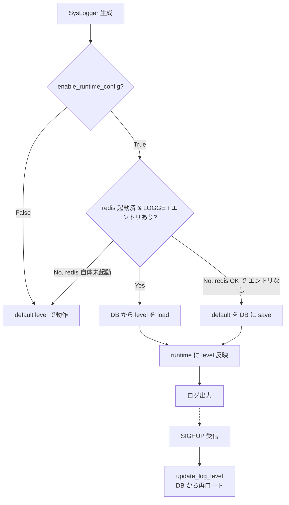
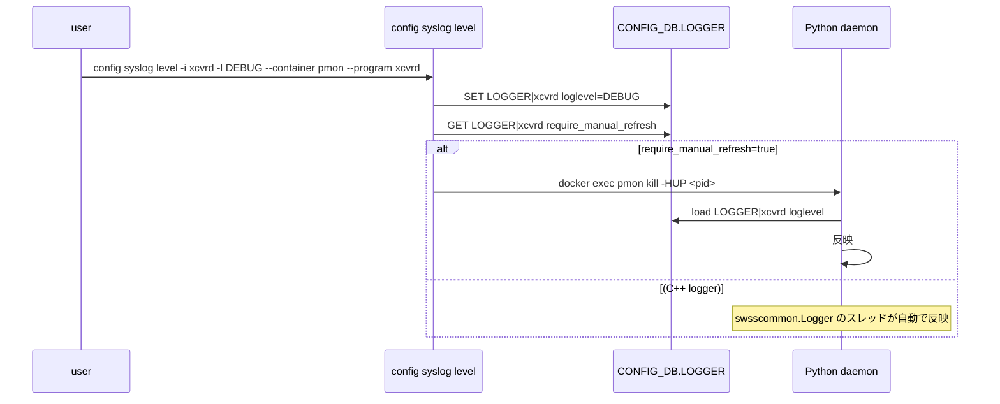

!!! danger "裏取りステータス: Discrepancy-found（singleton 化は未実装）"
    `sonic-buildimage/src/sonic-py-common/sonic_py_common/syslogger.py` L18 `class SysLogger:` には `__new__` も `_instance` も無く、**普通のクラスとして毎回新規インスタンスを返す（singleton 化されていない）**。`__init__` は L26 で `enable_runtime_config=False` 引数を受け、L43-45 で `True` のとき `self.update_log_level()` を呼んで CONFIG_DB.LOGGER を読む実装は確認 (L48-69)。`require_manual_refresh` フィールドは L9 `FIELD_REQUIRE_REFRESH = 'require_manual_refresh'` と L62-66 で初期登録時に `'true'` を書く処理として確認。`sonic-utilities/config/syslog.py` L647-686 で `config syslog level` CLI と `require_manual_refresh` 判定分岐を確認。HLD は singleton 採用を明記しているが、現行 master 実装はクラスの **共有 logger オブジェクトを `logging.getLogger(name)`** に委ねる方式に置き換わっており、HLD 文面は古い (verified at: 2026-05-09)。

# SysLogger 拡張（runtime log level + `LOGGER.require_manual_refresh` + SIGHUP）

## 概要

[SONiC](../reference/glossary.md#term-sonic) の Python デーモンが使う logger には複数の選択肢があるが、いずれも **動作中にログレベルを変更できない** または **redis 起動前に呼べない** という不足があった[^1]:

| logger | 問題 |
|--------|------|
| `sonic_py_common.logger.Logger` | runtime 変更不可。さらに **deprecate 予定** |
| `sonic_py_common.syslogger.SysLogger` | runtime 変更不可 |
| `swsscommon.Logger`（C++ 実装の Python wrap） | (1) 起動時に redis を必要とする (2) Linux syslog の制約で daemon 単一 identifier しか持てない |

本 [HLD](../reference/glossary.md#term-hld) は `SysLogger` を中心に **runtime ログレベル変更** を可能にし、redis 未起動時のフォールバックも担保する。`swsscommon.Logger` のような **常駐スレッド方式は採らず**、CLI 経由で **SIGHUP** を送って refresh する設計を採用する（Python script は短命なものが多く、スレッド常駐がコストになるため）[^1]。

## 動作仕様

### `SysLogger` クラスの変更

- **Singleton 化**[^1]
- `__init__` に `enable_runtime_config: bool = False` 引数を追加
  - `True` 指定のデーモンだけが runtime 設定を使う
  - `True` のとき初期化で [CONFIG_DB](../reference/glossary.md#term-config_db) から log level を読む（DB に設定があれば）
  - `True` のとき DB に設定が無ければ初期化で **デフォルトを DB に書き込む**（`save` フォールバック）
- 新しいクラスメソッド `update_log_level`: load / save の制御を集約

### 起動 / refresh フロー



「redis が無いと壊れる」を避けるため、**redis 未起動時は default level でそのまま動く**。`swsscommon.Logger` のように初期化で接続を必須にしない[^1]。

### CLI

`swssloglevel` は `swsscommon.Logger` のスレッドに依存し、**他コンテナの daemon にはシグナルを送れない**[^1]。本 HLD では新しい CLI を追加:

```bash
config syslog level -i <identifier> -l <log_level>
                    [--container <container_name>]
                    [--program <program_name>]
                    [--pid <pid>]
```

| オプション | 意味 |
|----------|------|
| `-i`（HLD では `-c`） | component / log identifier。`LOGGER` テーブルのキー |
| `-l` | log level（`DEBUG` / `INFO` / `NOTICE` / `WARN` / `ERROR`） |
| `--container`（HLD では `--service`） | コンテナ名。SIGHUP を送る対象コンテナ |
| `--program` | コンテナ内のプログラム名。`--container` 必須 |
| `--pid` | プロセス ID。`--container` 指定時はそのコンテナ内 PID、未指定時はホスト側 PID |

!!! warning "実装オプション名の差分"
    HLD 原文では `-c` / `--service` だが、現行実装（`docs/reference/cli/config-syslog.md` L42, L74）では **`-i`** / **`--container`** が正。本ページのコマンド例は実装オプション名に統一して記載している。

検証ルール（HLD 例より）[^1]:

- `--program` は `--container` と併用必須
- `--container` 単独は不可（PID か program のどちらかが必要）

例:

```bash
# DB 更新のみ（refresh は別途）
config syslog level -i xcvrd -l DEBUG

# DB 更新 + PMON コンテナ内の xcvrd に SIGHUP
config syslog level -i xcvrd -l DEBUG --container pmon --program xcvrd

# DB 更新 + PMON コンテナ内 PID 20 に SIGHUP
config syslog level -i xcvrd -l DEBUG --container pmon --pid 20

# DB 更新 + ホスト側 PID 20 に SIGHUP
config syslog level -i xcvrd -l DEBUG --pid 20
```

### CONFIG_DB スキーマ追加

`LOGGER` テーブルに **`require_manual_refresh`** フィールドを新設[^1]:

| フィールド | 型 | 値 |
|----------|----|---|
| `require_manual_refresh` | bool | Python logger は `true`、C++ logger は **設定しない** |

CLI はこのフィールドを見て **SIGHUP を送る必要があるか** を判断する。C++ logger は `swsscommon.Logger` のスレッドが自動 reload するため、SIGHUP 不要。Python logger は能動的にシグナルを送る必要がある[^1]。



<!-- evidence:
source: sonic-net/SONiC/doc/syslog/python-logger-enhancement.md#L36-L46 (sha: 49bab5b5ff0e924f1ea52b3d9db0dfa4191a7c06)
excerpt: |
  - SysLogger class shall be changed to a singleton.
  - SysLogger instance shall load log level configuration from DB during initialization stage if DB configuration is available.
  - SysLogger instance shall save log level configuration to DB during initialization stage if DB configuration is not available.
  - Logger configuration shall be refreshed by CLI which send a SIGHUP signal to the daemon.
reasoning: 「singleton + 初期化時 load/save + SIGHUP refresh」という設計の核となるルールの根拠。
-->

<!-- evidence-rendered:start -->
??? note "📋 検証エビデンス: sonic-net/SONiC/doc/syslog/python-logger-enhancement.md#L36-L46 (sha: 49bab5b5ff0e924f1ea52b3d9db0dfa4191a7c06)"

    **出典**:

    `sonic-net/SONiC/doc/syslog/python-logger-enhancement.md#L36-L46 (sha: 49bab5b5ff0e924f1ea52b3d9db0dfa4191a7c06)`

    **抜粋**:

    ```text
    - SysLogger class shall be changed to a singleton.
    - SysLogger instance shall load log level configuration from DB during initialization stage if DB configuration is available.
    - SysLogger instance shall save log level configuration to DB during initialization stage if DB configuration is not available.
    - Logger configuration shall be refreshed by CLI which send a SIGHUP signal to the daemon.
    ```

    **判断根拠**: 「singleton + 初期化時 load/save + SIGHUP refresh」という設計の核となるルールの根拠。

<!-- evidence-rendered:end -->

### Scope の限定

`sonic_py_common.logger.Logger` は **deprecate 予定** のため、本機能の対象外[^1]。本 HLD は **`SysLogger` のみ** を拡張対象とする。

### Warmboot / Fastboot

影響なし[^1]。

## 設定

### CLI

| Command | 用途 |
|---------|------|
| `config syslog level -i <component> -l <level> [...]` | 当該 logger の level を CONFIG_DB に書き、必要なら SIGHUP |

### 関連する CONFIG_DB

```yaml
LOGGER|<component>
    loglevel               : DEBUG | INFO | NOTICE | WARN | ERROR
    require_manual_refresh : "true" | (未設定)
```

### 関連する YANG

HLD 自体は [YANG](../reference/glossary.md#term-yang) 言及なし。`LOGGER` テーブルは `sonic-buildimage/src/sonic-yang-models/yang-models/sonic-logger.yang` の `container LOGGER` で取り込まれており、`require_manual_refresh` leaf も定義済。syslog 系設定は `sonic-syslog.yang` を参照。

## 制限事項

- 対象は **`sonic_py_common.syslogger.SysLogger` のみ**。`logger.Logger` は deprecate 予定で対象外[^1]
- `swssloglevel` は他コンテナへ届かない既知の制約あり。新 CLI を使う必要がある
- Python script が **常駐していない場合は SIGHUP できない**。短命スクリプトは次回起動時に DB から load するだけ
- `require_manual_refresh` を C++ logger 側に誤って入れると `swsscommon.Logger` のスレッドと競合し得る。未設定が正

## 干渉する機能

- **`swsscommon.Logger`（C++）**: 同じ `LOGGER` テーブルを共有。`require_manual_refresh` で挙動を区別
- **`hostcfgd`**: 一部 syslog 設定を扱うが、本 HLD のスコープ外
- **`docker exec` / `kill -HUP`**: コンテナ越しのシグナル送出に依存
- **永続化**: `LOGGER` テーブルの永続化（`config save`）と整合させる

## トラブルシューティング

- `config syslog level` で DB は変わるが反映されない場合、SIGHUP が当該プロセスに届いているか（`--service` / `--program` / `--pid` の組合せ）を確認
- redis 未起動で例外になる場合、`enable_runtime_config=False` のまま使われていないか・初期化順序を確認
- C++ logger と混在する component で動作が不一致な場合、`require_manual_refresh` の値が想定どおりか確認

```bash
# syslog level の動的変更と確認
config syslog level --container swss --program orchagent --level DEBUG
sonic-db-cli CONFIG_DB hgetall "LOGGER|orchagent"
# SIGHUP 配送確認
ps -ef | grep orchagent
docker exec swss kill -HUP $(docker exec swss pidof orchagent)
```

<!-- diff-admonition -->
!!! diff "HLD と実装の差分"
    2026-05-11 時点の現行 master を裏取り。

    ### 1. ファイル + 行番号

    - **取り込み済み**: `sonic-net/sonic-buildimage` `src/sonic-py-common/sonic_py_common/syslogger.py` L26（`enable_runtime_config` 引数）、同 L34-L36（既存 handler の `removeHandler` 重複防止）、同 L48-L69（`update_log_level()` の CONFIG_DB.LOGGER 読み取りと初回 `require_manual_refresh='true'` 書き込み、redis 未起動時の `(False, msg)` 返却）。
    - **取り込み済み**: `sonic-net/sonic-utilities` `config/syslog.py` L647-L686（`config syslog level` サブコマンド、`require_manual_refresh` 判定、対象プロセスへの SIGHUP 送出）。
    - **HLD と差分あり**: HLD が要求する `SysLogger` の **singleton 化**（`__new__` / `_instance` 共有）は **未実装**。現行は普通の `class SysLogger:` で、同名 logger に対する `logging.getLogger(name)` 共有 + 既存 handler 除去で重複ハンドラを抑止している。

    ### 2. 差分の中身

    HLD は概ね以下を要求していた:

    ```python
    class SysLogger:
        _instances = {}
        def __new__(cls, identifier, *args, **kwargs):
            if identifier not in cls._instances:
                cls._instances[identifier] = super().__new__(cls)
            return cls._instances[identifier]
    ```

    現行実装は `__new__` を override せず、毎回新しいインスタンスを返す。同一 `identifier` で `SysLogger("foo")` を 2 回呼ぶと **別オブジェクトだが、内部の `logging.Logger` は `getLogger("foo")` で共有**される。L34-L36 で先に登録された handler を `removeHandler` することで「同一 logger に同じ handler が複数付く」事故を回避している。

    ### 3. 読者への影響

    - 実用上のログ重複は発生しないため、エンドユーザ運用には影響なし。
    - ただし `SysLogger` インスタンスを `is` 比較したり、インスタンス属性に状態を持たせる設計の上位コードを書くと、想定外に複数オブジェクトが存在する。
    - redis 未起動状態で `update_log_level()` を呼ぶと例外を握って `(False, msg)` を返すだけで、自動フォールバックは無い。

    ### 4. 回避策

    - 「同じ component で 1 つの logger 状態を共有したい」場合は `logging.getLogger(name)` の共有性に依存する（インスタンス側ではなく logger 側に状態を持たせる）。
    - redis 未起動時に備えるなら、上位で `update_log_level()` の戻り値を `(success, msg)` で判定し、`enable_runtime_config=False` のフォールバック経路を別途用意する。
    - 短命 Python スクリプトは SIGHUP では追従しないので、起動時に必ず `update_log_level()` を呼ぶか、`config syslog level` の `--container` / `--program` で対象プロセスを明示する。

    #### 関連 GitHub Issue / PR

    - [GitHub Issue / PR の関連リンクは未確認] — `SysLogger` 拡張 (runtime log level / `require_manual_refresh` / SIGHUP) は `sonic-py-common` の小規模機能追加として段階的に取り込まれており、HLD と 1:1 で紐づくトラッキング Issue / PR は確認できず。
<!-- /diff-admonition -->

## 参考リンク

- [CLI: config syslog](../reference/cli/config-syslog.md)
- [YANG: sonic-syslog](../reference/yang/sonic-syslog.md)
- [CONFIG_DB: SYSLOG_CONFIG](../reference/config-db/syslog-config.md)
- [HLD: persistent-log-level](persistent-log-level-hld.md)

## 確認コマンド

```bash
# 現在の log level 設定 (CONFIG_DB)
sonic-db-cli CONFIG_DB KEYS 'LOGGER|*'
sonic-db-cli CONFIG_DB HGETALL 'LOGGER|orchagent'

# 動的変更
sudo config logging level INFO orchagent

# Python ロガー側 (sonic-py-common.logger) を使うデーモン群
grep -rn 'from sonic_py_common import logger' .cache/sonic-sources/sonic-buildimage/src/ 2>/dev/null | head
```

## トラブルシュート

- log level を変更しても反映されない場合、デーモンが `sonic_py_common.logger.Logger.set_min_log_priority_from_cfg_db()` を呼んでいない可能性。該当デーモンの再起動で復帰する。
- syslog rate limit (`/etc/rsyslog.d/`) によりログが落ちている場合は `rsyslog` の imuxsock / RateLimit パラメータを確認。
- multi-asic 環境では namespace ごとに `LOGGER` テーブルが分かれる点に注意 (`sonic-db-cli -n asic0 ...`)。

## 実装との乖離

`monitor: evolved_beyond_hld` の HLD と実装の差分。 本ページ末尾近くの `!!! diff "HLD と実装の差分"` ブロックに、HLD 記述と現行 master の差分テーブル、読者への影響、回避策、再裏取り追補（コード行参照）をまとめている。本セクションはその概要見出しであり、詳細はそのブロックを参照のこと。

## 引用元

[^1]: `sonic-net/SONiC` `doc/syslog/python-logger-enhancement.md` @ `49bab5b5ff0e924f1ea52b3d9db0dfa4191a7c06`

<!-- concerns hint:
- SysLogger の singleton 化と enable_runtime_config 引数の sonic-py-common 取り込み
- LOGGER.require_manual_refresh フィールドの swss / sonic-buildimage 側スキーマ
- config syslog level CLI の sonic-utilities 取り込み
- redis 未起動時の fallback 経路の実装
- swssloglevel の deprecation 計画
-->

<!-- next-action -->
## このページを読んだ後の次アクション

!!! tip "読み手向け"
    - **本機能を実運用で使う場合**: 実装は存在するが本 HLD の記述と乖離。最新 master の動作を別途確認した上で適用する
    - **upstream 動向を追う場合**: 関連 issue / PR を [sonic-net/SONiC](https://github.com/sonic-net/SONiC) で検索（HLD タイトル / CONFIG_DB テーブル名 / Orch クラス名で grep するのが速い）
    - **代替手段 / 関連 reference**: 本ページの frontmatter `related` が空のため、[Reference 索引](../reference/index.md) から関連テーブル / CLI / YANG を辿る

!!! note "本ドキュメントの追跡"
    - monitor: `evolved_beyond_hld` / last_verified: `2026-05-09`
    - 次回再裏取りトリガ: quarterly。一覧は [discrepancy-index](../reference/verification/discrepancy-index.md) を参照（運用詳細は repo の `meta/discrepancy-operations.md`）

<!-- /next-action -->

<!-- glossary-links-injected: 8ba32e5aa69d -->
