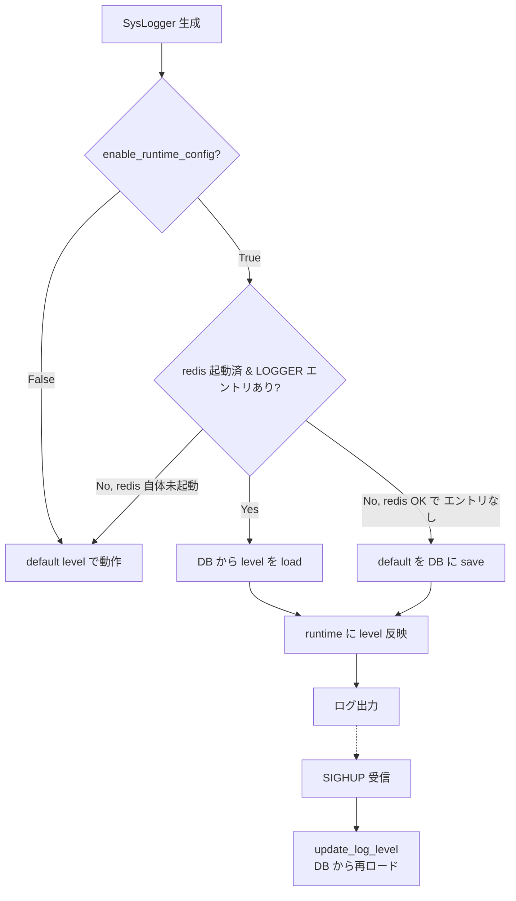

!!! danger "裏取りステータス: Discrepancy-found（singleton 化は未実装）"
    `sonic-buildimage/src/sonic-py-common/sonic_py_common/syslogger.py` L18 `class SysLogger:` には `__new__` も `_instance` も無く、**普通のクラスとして毎回新規インスタンスを返す（singleton 化されていない）**。`__init__` は L26 で `enable_runtime_config=False` 引数を受け、L43-45 で `True` のとき `self.update_log_level()` を呼んで CONFIG_DB.LOGGER を読む実装は確認 (L48-69)。`require_manual_refresh` フィールドは L9 `FIELD_REQUIRE_REFRESH = 'require_manual_refresh'` と L62-66 で初期登録時に `'true'` を書く処理として確認。`sonic-utilities/config/syslog.py` L647-686 で `config syslog level` CLI と `require_manual_refresh` 判定分岐を確認。HLD は singleton 採用を明記しているが、現行 master 実装はクラスの **共有 logger オブジェクトを `logging.getLogger(name)`** に委ねる方式に置き換わっており、HLD 文面は古い (verified at: 2026-05-09)。

# SysLogger 拡張（runtime log level + `LOGGER.require_manual_refresh` + SIGHUP）

## 概要

SONiC の Python デーモンが使う logger には複数の選択肢があるが、いずれも **動作中にログレベルを変更できない** または **redis 起動前に呼べない** という不足があった[^1]:

| logger | 問題 |
|--------|------|
| `sonic_py_common.logger.Logger` | runtime 変更不可。さらに **deprecate 予定** |
| `sonic_py_common.syslogger.SysLogger` | runtime 変更不可 |
| `swsscommon.Logger`（C++ 実装の Python wrap） | (1) 起動時に redis を必要とする (2) Linux syslog の制約で daemon 単一 identifier しか持てない |

本 HLD は `SysLogger` を中心に **runtime ログレベル変更** を可能にし、redis 未起動時のフォールバックも担保する。`swsscommon.Logger` のような **常駐スレッド方式は採らず**、CLI 経由で **SIGHUP** を送って refresh する設計を採用する（Python script は短命なものが多く、スレッド常駐がコストになるため）[^1]。

## 動作仕様

### `SysLogger` クラスの変更

- **Singleton 化**[^1]
- `__init__` に `enable_runtime_config: bool = False` 引数を追加
  - `True` 指定のデーモンだけが runtime 設定を使う
  - `True` のとき初期化で CONFIG_DB から log level を読む（DB に設定があれば）
  - `True` のとき DB に設定が無ければ初期化で **デフォルトを DB に書き込む**（`save` フォールバック）
- 新しいクラスメソッド `update_log_level`: load / save の制御を集約

### 起動 / refresh フロー



「redis が無いと壊れる」を避けるため、**redis 未起動時は default level でそのまま動く**。`swsscommon.Logger` のように初期化で接続を必須にしない[^1]。

### CLI

`swssloglevel` は `swsscommon.Logger` のスレッドに依存し、**他コンテナの daemon にはシグナルを送れない**[^1]。本 HLD では新しい CLI を追加:

```
config syslog level -c <component> -l <log_level>
                    [--service <service_name>]
                    [--program <program_name>]
                    [--pid <pid>]
```

| オプション | 意味 |
|----------|------|
| `-c` | component / log identifier。`LOGGER` テーブルのキー |
| `-l` | log level（`DEBUG` / `INFO` / `NOTICE` / `WARN` / `ERROR`） |
| `--service` | コンテナ名。SIGHUP を送る対象コンテナ |
| `--program` | コンテナ内のプログラム名。`--service` 必須 |
| `--pid` | プロセス ID。`--service` 指定時はそのコンテナ内 PID、未指定時はホスト側 PID |

検証ルール（HLD 例より）[^1]:

- `--program` は `--service` と併用必須
- `--service` 単独は不可（PID か program のどちらかが必要）

例:

```bash
# DB 更新のみ（refresh は別途）
config syslog level -c xcvrd -l DEBUG

# DB 更新 + PMON コンテナ内の xcvrd に SIGHUP
config syslog level -c xcvrd -l DEBUG --service pmon --program xcvrd

# DB 更新 + PMON コンテナ内 PID 20 に SIGHUP
config syslog level -c xcvrd -l DEBUG --service pmon --pid 20

# DB 更新 + ホスト側 PID 20 に SIGHUP
config syslog level -c xcvrd -l DEBUG --pid 20
```

### CONFIG_DB スキーマ追加

`LOGGER` テーブルに **`require_manual_refresh`** フィールドを新設[^1]:

| フィールド | 型 | 値 |
|----------|----|---|
| `require_manual_refresh` | bool | Python logger は `true`、C++ logger は **設定しない** |

CLI はこのフィールドを見て **SIGHUP を送る必要があるか** を判断する。C++ logger は `swsscommon.Logger` のスレッドが自動 reload するため、SIGHUP 不要。Python logger は能動的にシグナルを送る必要がある[^1]。


<!-- evidence:
source: sonic-net/SONiC/doc/syslog/python-logger-enhancement.md#L36-L46 (sha: 49bab5b5ff0e924f1ea52b3d9db0dfa4191a7c06)
excerpt: |
  - SysLogger class shall be changed to a singleton.
  - SysLogger instance shall load log level configuration from DB during initialization stage if DB configuration is available.
  - SysLogger instance shall save log level configuration to DB during initialization stage if DB configuration is not available.
  - Logger configuration shall be refreshed by CLI which send a SIGHUP signal to the daemon.
reasoning: 「singleton + 初期化時 load/save + SIGHUP refresh」という設計の核となるルールの根拠。
-->

### Scope の限定

`sonic_py_common.logger.Logger` は **deprecate 予定** のため、本機能の対象外[^1]。本 HLD は **`SysLogger` のみ** を拡張対象とする。

### Warmboot / Fastboot

影響なし[^1]。

## 設定

### CLI

| Command | 用途 |
|---------|------|
| `config syslog level -c <component> -l <level> [...]` | 当該 logger の level を CONFIG_DB に書き、必要なら SIGHUP |

### 関連する CONFIG_DB

```
LOGGER|<component>
    loglevel               : DEBUG | INFO | NOTICE | WARN | ERROR
    require_manual_refresh : "true" | (未設定)
```

### 関連する YANG

該当 YANG モジュールは HLD で言及されていない。

## 制限事項

- 対象は **`sonic_py_common.syslogger.SysLogger` のみ**。`logger.Logger` は deprecate 予定で対象外[^1]
- `swssloglevel` は他コンテナへ届かない既知の制約あり。新 CLI を使う必要がある
- Python script が **常駐していない場合は SIGHUP できない**。短命スクリプトは次回起動時に DB から load するだけ
- `require_manual_refresh` を C++ logger 側に誤って入れると `swsscommon.Logger` のスレッドと競合し得る。未設定が正

## 干渉する機能

- **`swsscommon.Logger`（C++）**: 同じ `LOGGER` テーブルを共有。`require_manual_refresh` で挙動を区別
- **`hostcfgd`**: 一部 syslog 設定を扱うが、本 HLD のスコープ外
- **`docker exec` / `kill -HUP`**: コンテナ越しのシグナル送出に依存
- **永続化**: `LOGGER` テーブルの永続化（`config save`）と整合させる

## トラブルシューティング

- `config syslog level` で DB は変わるが反映されない場合、SIGHUP が当該プロセスに届いているか（`--service` / `--program` / `--pid` の組合せ）を確認
- redis 未起動で例外になる場合、`enable_runtime_config=False` のまま使われていないか・初期化順序を確認
- C++ logger と混在する component で動作が不一致な場合、`require_manual_refresh` の値が想定どおりか確認

## 実装との乖離

2026-05-09 時点の現行 master を裏取り。

- **取り込み済み**: `sonic-py-common/syslogger.py` の `enable_runtime_config` 引数 (L26)、`update_log_level()` の CONFIG_DB.LOGGER 読み取り＋初回登録時の `require_manual_refresh = 'true'` 書き込み (L48-69)、`config syslog level` CLI と `require_manual_refresh` 判定 (`sonic-utilities/config/syslog.py` L647-686)。
- **HLD と差分あり**: HLD が要求する `SysLogger` の singleton 化（`__new__` / `_instance` 共有）は **未実装**。現行クラスは普通の `class SysLogger:` で、識別子が同じ場合は `logging.getLogger(name)` 経由でハンドラ重複登録の対策（L34-36 で既存 handler を removeHandler）に留まる。複数のコード箇所で `SysLogger("foo")` を呼ぶと別インスタンスが返るが、内部 logger 自体は同じ name を共有するため **実害は限定的**。設計意図（singleton による状態統一）と実装手段が異なる点に留意。
- 残未確認: redis 未起動時の `update_log_level()` の例外処理は L67-69 で `(False, msg)` を返すのみ。フォールバックの上位ハンドリングは呼び出し側依存（HLD 記述と同等）。

## 引用元

[^1]: `sonic-net/SONiC` `doc/syslog/python-logger-enhancement.md` @ `49bab5b5ff0e924f1ea52b3d9db0dfa4191a7c06`

<!-- concerns hint:
- SysLogger の singleton 化と enable_runtime_config 引数の sonic-py-common 取り込み
- LOGGER.require_manual_refresh フィールドの swss / sonic-buildimage 側スキーマ
- config syslog level CLI の sonic-utilities 取り込み
- redis 未起動時の fallback 経路の実装
- swssloglevel の deprecation 計画
-->
