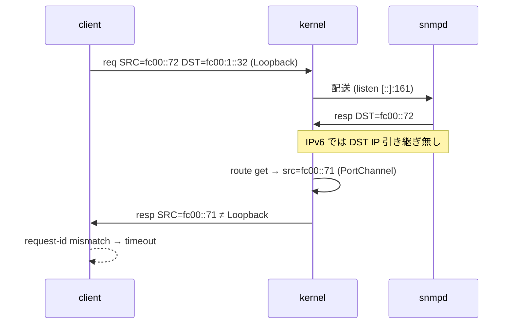
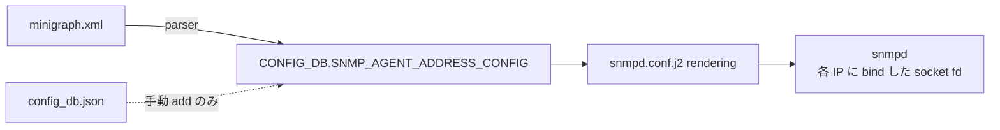

<!-- topics-tip -->
!!! tip "Topics で読み物として読む"
    この HLD は実装詳細を含みます。機能の概念・設定・運用を読み物として読みたい場合は [Topics 09 章: Telemetry / SNMP / ログ](../topics/09-telemetry-snmp/index.md) を参照。
<!-- /topics-tip -->

!!! success "裏取りステータス: code-verified"
    `sonic-buildimage/dockers/docker-snmp/snmpd.conf.j2:27-33` で `SNMP_AGENT_ADDRESS_CONFIG` をループ → `agentAddress` 出力、未設定時は `:32-33` で `udp:161` / `udp6:161` フォールバック。`sonic-config-engine/minigraph.py:2310-2324` で minigraph 解析時に Management IP / Loopback IP から `SNMP_AGENT_ADDRESS_CONFIG` を自動生成（verified at: 2026-05-09）。

# SNMP IPv6 応答の SRC IP 不整合と `SNMP_AGENT_ADDRESS_CONFIG` による回避

## どんな問題か

[SONiC](../reference/glossary.md#term-sonic) 単一 [ASIC](../reference/glossary.md#term-asic) 機の **[SNMP](../reference/glossary.md#term-snmp) over IPv6 がタイムアウトする** バグの設計修正[^1]。

1. SNMP request が `SRC=fc00::72`、`DST=Loopback IPv6 fc00:1::32` で到着
2. `snmpd` (IPv6 socket `[::]:161`) が受理 → response 生成
3. kernel が `ip -6 route get fc00::72` で best path を探し、**`src=fc00::71`（[PortChannel](../reference/glossary.md#term-portchannel) IP）** を選ぶ
4. クライアントは「DST と異なる SRC」で受信し、request-id がマッチせず timeout



### なぜ IPv4 では出ないか / multi-ASIC では出ないか

- **IPv4**: net-snmp が `ipi_spec_dst` で **request の DST を SRC として強制**する
- **multi-ASIC**: snmpd は host namespace、Loopback0 は asic namespace で **分離**。受信 namespace の routing table 内で完結するため、SRC が混じらない[^1]

IPv6 にはこの仕組みが無く、kernel route lookup 任せになるのが根本原因[^1]。

## 修正方針

**`agentAddress` を `0.0.0.0/::0` でなく Loopback / Management の具体 IP に bind** する[^1]。socket fd を IP 別に分離すれば、応答送信時もその fd（= 対応 IP）から出ていく。

### bind 状態の変化

```text
# 修正前
socket 7 UDP    [0.0.0.0]:161
socket 8 UDP/v6 [::]:161

# 修正後（SNMP_AGENT_ADDRESS_CONFIG に Loopback0 + Management を投入）
socket 7  UDP    10.250.0.101:161     # Management v4
socket 8  UDP    10.1.0.32:161        # Loopback0 v4
socket 9  UDP/v6 fc00:2::32:161       # Management v6
socket 10 UDP/v6 fc00:1::32:161       # Loopback0 v6
```

Loopback IPv6 への request は fd=10 で受信 → 同じ fd で送出 → SRC は Loopback v6 で固定。

### 自動投入される条件

| 起動経路 | `SNMP_AGENT_ADDRESS_CONFIG` |
|----------|------------------------------|
| `config load_minigraph` | **自動**: parser が Loopback0 / Management IP を登録[^1] |
| `config_db.json` 直ロード | **無し**。`0.0.0.0/::0` のまま IPv6 問題が再発。回避には `config snmpagentaddress add <ip>` |
| multi-ASIC 機 | 対象外（namespace 分離で発症しない）[^1] |



関連 PR: `sonic-buildimage#15487`（修正本体）/ `#16013`（link-local IPv6 対応）/ `#17045`（minigraph parser 拡張）[^1]。

## CLI / 設定例

```bash
config snmpagentaddress add 10.1.0.32
config snmpagentaddress add fc00:1::32
config snmpagentaddress add fe80::abcd          # link-local (PR #16013)
show snmpagentaddress
```

## 制限事項

- **単一 ASIC 機向け修正**（multi-ASIC は元から発症しない）[^1]
- `config_db.json` 直ロード時は `SNMP_AGENT_ADDRESS_CONFIG` 自動投入なし[^1]
- Loopback / Management の **どちらを bind するかはオペレータ責任**
- 本質的修正は net-snmp 側で `IPV6_PKTINFO` を使う対応だが、本 [HLD](../reference/glossary.md#term-hld) は **回避策**

## 干渉する機能

- **`snmpd` (SNMP docker)**: 起動時に `snmpd.conf` の `agentAddress` を読む
- **`minigraph parser`**: `SNMP_AGENT_ADDRESS_CONFIG` 自動生成
- **kernel routing**: `0.0.0.0/::0` bind の場合のみ介入

## トラブルシューティング

```bash
sonic-db-cli CONFIG_DB keys 'SNMP_AGENT_ADDRESS_CONFIG*'
docker exec snmp cat /etc/snmp/snmpd.conf | grep agentAddress
docker exec snmp ss -ulnp | grep snmpd
tcpdump -ni any port 161                              # req DST vs resp SRC 比較
ip netns list                                         # multi-ASIC は分離されているはず
```

## 関連 Topics

- [09-telemetry-snmp](../topics/09-telemetry-snmp/index.md): SNMP / telemetry 全般

## 引用元

[^1]: `sonic-net/SONiC` `doc/snmp/snmp-changes-to-support-ipv6.md` @ `49bab5b5ff0e924f1ea52b3d9db0dfa4191a7c06`

<!-- glossary-links-injected: ec18b66e3507 -->
